無党派層とソーシャル・ネットワーク環境
================
Gento Kato
April 15, 2021

# Preparation

``` r
## Clean Up Space
rm(list=ls())

## Set Working Directory (Automatically) ##
require(rstudioapi)
setwd(dirname(rstudioapi::getActiveDocumentContext()$path)); 

## All Parties
jimin="自民"; minshu="民主"; komei="公明"; shamin="社民"; kyosan="共産"
hoshushin="保守新"; jiyu="自由"; kokuminshin="国民新"; shakai="社会"; shinsei="新生"
minsha="民社"; sakigake="さきがけ"; shaminren="社民連"; nihonshin="日本新"; shinshin="新進"
sonota="その他"
allps <- c(jimin,shakai,komei,shinsei,kyosan,
           minsha,sakigake,shaminren,nihonshin,shinshin,
           minshu,shamin,hoshushin,jiyu,kokuminshin,
           sonota)
mutoha <- "無党派"
mikettei <- "未決定"
kiken="棄権"
shiranai <- "知らない"
mushozoku="無所属"

## Packages
require(MASS)
require(lmtest)
require(multiwayvcov)
require(texreg)
require(ggplot2)
require(haven)

## Import Data

do1 <- readRDS("cnep93.rds")
do2 <- readRDS("jes2_s.rds")
do3 <- readRDS("jes3_s.rds")
d <- rbind(do1,do2,do3)
#d <- subset(d, answered==1)

donet1 <- readRDS("cnep93_net.rds")
donet2 <- readRDS("jes2_net_s.rds")
donet3 <- readRDS("jes3_net_s.rds")
dnet <- rbind(donet1,donet2,donet3)
```

# Recode variables

``` r
## Gender
table(d[d$answered==1,]$fem, d[d$answered==1,]$year, useNA="always")
```

    ##       
    ##        1993 1995 1996 2001 2003 2004 2005 <NA>
    ##   0     651 1097 1107  995 1116 1049  736    0
    ##   1     682  979 1042 1066 1046 1066  768    0
    ##   <NA>    0    0    0    0    0    0    0    0

``` r
## Age Cohort
table(d[d$answered==1,]$age, d[d$answered==1,]$year, useNA="always")
```

    ##       
    ##        1993 1995 1996 2001 2003 2004 2005 <NA>
    ##   20     29    1    0   11   14    4    0    0
    ##   21     25    3    3   17   12   21    3    0
    ##   22     20    8   10   21    9   17   14    0
    ##   23     17   21   11   16   12   15    7    0
    ##   24     19   16   14   20    9   25    7    0
    ##   25     19   13   13   20   11   20   10    0
    ##   26     21   20   14   19    9   20   11    0
    ##   27     25   20   12   25   14   19    9    0
    ##   28     19   21   18   29   18   27    5    0
    ##   29     37   22   16   27   23   27   15    0
    ##   30     25   20   18   23   22   35   14    0
    ##   31     21   30   24   40   21   38   18    0
    ##   32     17   21   27   23   18   32   20    0
    ##   33     28   21   23   20   31   30   18    0
    ##   34     27   35   14   30   22   45   18    0
    ##   35     26   26   27   25   27   49   28    0
    ##   36     17   20   29   33   19   38   29    0
    ##   37     14   38   36   23   22   38   31    0
    ##   38     31   22   32   30   26   33   30    0
    ##   39     42   31   35   23   28   55   23    0
    ##   40     27   32   30   33   20   39   32    0
    ##   41     25   47   30   35   32   21   25    0
    ##   42     41   38   35   33   29   27   14    0
    ##   43     27   46   38   43   36   28   22    0
    ##   44     24   50   42   29   34   29   18    0
    ##   45     46   54   52   25   31   37   19    0
    ##   46     26   59   57   38   31   29   31    0
    ##   47     21   51   60   32   32   30   27    0
    ##   48     20   56   46   41   30   26   24    0
    ##   49     30   38   62   36   37   29   18    0
    ##   50     28   47   38   35   41   32   17    0
    ##   51     19   47   52   49   39   37   22    0
    ##   52     29   56   54   58   46   38   23    0
    ##   53     20   43   61   50   50   26   29    0
    ##   54     25   55   38   51   50   38   19    0
    ##   55     35   46   61   39   53   58   32    0
    ##   56     25   45   53   26   68   42   41    0
    ##   57     20   58   48   47   45   54   34    0
    ##   58     16   37   54   43   29   39   43    0
    ##   59     22   50   51   47   54   28   28    0
    ##   60     25   51   46   53   59   47   23    0
    ##   61     17   60   54   50   58   38   35    0
    ##   62     15   50   59   42   52   47   34    0
    ##   63     20   40   52   50   54   48   35    0
    ##   64     22   53   40   43   61   37   38    0
    ##   65     26   53   55   50   49   50   29    0
    ##   66     11   47   54   47   58   36   39    0
    ##   67     12   43   61   43   68   38   31    0
    ##   68     19   39   49   43   64   50   36    0
    ##   69     21   39   37   32   45   47   36    0
    ##   70     30   42   54   34   45   38   36    0
    ##   71     11   23   38   46   37   33   34    0
    ##   72     17   28   33   30   39   32   27    0
    ##   73     19   16   31   33   42   32   22    0
    ##   74      9   29   24   29   32   36   23    0
    ##   75      8   22   25   26   35   29   28    0
    ##   76     10   16   26   38   37   30   17    0
    ##   77      8    9   19   15   34   29   28    0
    ##   78      8   11    7   13   33   28   26    0
    ##   79      3    8    9   16   19   30   21    0
    ##   80      2    7    5   11   12   14   19    0
    ##   81      2   10    7   12   16    9    8    0
    ##   82      5    6   11   12   13   16    8    0
    ##   83      1    4    4    4   14   11   13    0
    ##   84      1    3    6    5    9   12    8    0
    ##   85      0    3    2    4    5    8    7    0
    ##   86      2    0    3    2    5    4    4    0
    ##   87      2    0    0    2    2    4    4    0
    ##   88      0    0    0    3    0    3    2    0
    ##   89      2    0    0    4    3    0    2    0
    ##   90      0    0    0    0    1    1    0    0
    ##   91      0    0    0    2    2    0    1    0
    ##   92      0    0    0    1    0    1    0    0
    ##   93      0    0    0    0    3    0    1    0
    ##   94      0    0    0    1    1    1    0    0
    ##   99      0    0    0    0    1    0    0    0
    ##   100     0    0    0    0    0    1    0    0
    ##   101     0    0    0    0    0    0    1    0
    ##   <NA>    0    0    0    0    0    0    0    0

``` r
d$age2030 <- ifelse(d$age<30,1,0)
d$age4050 <- ifelse(d$age>=30&d$age<60,1,0)
d$age60plus <- ifelse(d$age>=60,1,0)
dnet$age2030 <- ifelse(dnet$age<30,1,0)
dnet$age4050 <- ifelse(dnet$age>=30&dnet$age<60,1,0)
dnet$age60plus <- ifelse(dnet$age>=60,1,0)

## Education Factor
table(d[d$answered==1,]$edu, d[d$answered==1,]$year, useNA="always")
```

    ##                    
    ##                     1993 1995 1996 2001 2003 2004 2005 <NA>
    ##   0                  327  506  537  482  493  396  275    0
    ##   0.333333333333333  646  964 1021  938  982  984  646    0
    ##   0.666666666666667  172  270  267  306  297  332  228    0
    ##   1                  179  299  306  322  360  368  241    0
    ##   <NA>                 9   37   18   13   30   35  114    0

``` r
# Fix Some Cases (Borrowing from nearby panel response)
tmp1 <- subset(d, year==1995)
tmp2 <- subset(d, year==1996)
d$edu[d$year==1995][which(is.na(tmp1$edu)&!is.na(tmp2$edu))] <-
  d$edu[d$year==1996][which(is.na(tmp1$edu)&!is.na(tmp2$edu))]
d$edu[d$year==1996][which(!is.na(tmp1$edu)&is.na(tmp2$edu))] <-
  d$edu[d$year==1995][which(!is.na(tmp1$edu)&is.na(tmp2$edu))]
tmp1 <- subset(d, year==2001)
tmp2 <- subset(d, year==2003)
d$edu[d$year==2001][which(is.na(tmp1$edu)&!is.na(tmp2$edu))] <-
  d$edu[d$year==2003][which(is.na(tmp1$edu)&!is.na(tmp2$edu))]
d$edu[d$year==2003][which(!is.na(tmp1$edu)&is.na(tmp2$edu))] <-
  d$edu[d$year==2001][which(!is.na(tmp1$edu)&is.na(tmp2$edu))]
tmp1 <- subset(d, year==2003)
tmp2 <- subset(d, year==2004)
d$edu[d$year==2003][which(is.na(tmp1$edu)&!is.na(tmp2$edu))] <-
  d$edu[d$year==2004][which(is.na(tmp1$edu)&!is.na(tmp2$edu))]
d$edu[d$year==2004][which(!is.na(tmp1$edu)&is.na(tmp2$edu))] <-
  d$edu[d$year==2003][which(!is.na(tmp1$edu)&is.na(tmp2$edu))]
tmp1 <- subset(d, year==2004)
tmp2 <- subset(d, year==2005)
d$edu[d$year==2004][which(is.na(tmp1$edu)&!is.na(tmp2$edu))] <-
  d$edu[d$year==2005][which(is.na(tmp1$edu)&!is.na(tmp2$edu))]
d$edu[d$year==2005][which(!is.na(tmp1$edu)&is.na(tmp2$edu))] <-
  d$edu[d$year==2004][which(!is.na(tmp1$edu)&is.na(tmp2$edu))]
d$edu[d$answered==0] <- NA
## Check Again
table(d[d$answered==1,]$edu, d[d$answered==1,]$year, useNA="always")
```

    ##                    
    ##                     1993 1995 1996 2001 2003 2004 2005 <NA>
    ##   0                  327  516  540  482  500  401  293    0
    ##   0.333333333333333  646  974 1025  938  996 1002  693    0
    ##   0.666666666666667  172  273  269  306  298  336  249    0
    ##   1                  179  300  310  323  361  369  265    0
    ##   <NA>                 9   13    5   12    7    7    4    0

``` r
## Move values to dnet
dnet$edu <- d$edu[match(paste(dnet$id,dnet$year),paste(d$id,d$year))]
table(dnet[dnet$answered==1,]$edu, 
      dnet[dnet$answered==1,]$year, useNA="always")
```

    ##                    
    ##                     1993 1995 1996 2001 2003 2004 2005 <NA>
    ##   0                  223  577  494  471  553  832  321    0
    ##   0.333333333333333  673 1356 1108 1357 1471 2524 1073    0
    ##   0.666666666666667  198  446  369  503  512  934  435    0
    ##   1                  261  552  438  618  736 1023  502    0
    ##   <NA>                12    3    8   13   13   20   12    0

``` r
d$edu_c1 <- ifelse(d$edu*3==1, 1, 0)
d$edu_c2 <- ifelse(d$edu*3==2, 1, 0)
d$edu_c3 <- ifelse(d$edu*3==3, 1, 0)
dnet$edu_c1 <- ifelse(dnet$edu*3==1, 1, 0)
dnet$edu_c2 <- ifelse(dnet$edu*3==2, 1, 0)
dnet$edu_c3 <- ifelse(dnet$edu*3==3, 1, 0)

## Income Factor
table(d$income, d$year, useNA="always")
```

    ##                     
    ##                      1993 1995 1996 2001 2003 2004 2005 <NA>
    ##   0                    10  101  122  137  187  130   98    0
    ##   0.0909090909090909   58    0    0    0    0  198    0    0
    ##   0.125                 0    0    0  399  522    0  286    0
    ##   0.142857142857143     0  286  340    0    0    0    0    0
    ##   0.181818181818182    87    0    0    0    0  231    0    0
    ##   0.25                  0    0    0  344  396    0  241    0
    ##   0.272727272727273   114    0    0    0    0  165    0    0
    ##   0.285714285714286     0  358  415    0    0    0    0    0
    ##   0.363636363636364   104    0    0    0    0  163    0    0
    ##   0.375                 0    0    0  324  291    0  183    0
    ##   0.428571428571429     0  270  380    0    0    0    0    0
    ##   0.454545454545455   113    0    0    0    0  126    0    0
    ##   0.5                   0    0    0  194  228    0  103    0
    ##   0.545454545454545   117    0    0    0    0  115    0    0
    ##   0.571428571428571     0  246  256    0    0    0    0    0
    ##   0.625                 0    0    0  104   98    0   60    0
    ##   0.636363636363636    76    0    0    0    0  112    0    0
    ##   0.714285714285714     0  140  169    0    0    0    0    0
    ##   0.727272727272727    56    0    0    0    0   80    0    0
    ##   0.75                  0    0    0   59   49    0   21    0
    ##   0.818181818181818    50    0    0    0    0   24    0    0
    ##   0.857142857142857     0   61   71    0    0    0    0    0
    ##   0.875                 0    0    0   55   37    0   20    0
    ##   0.909090909090909    93    0    0    0    0   34    0    0
    ##   1                    36  100  139   39   36   25   16    0
    ##   <NA>                419 2423 2093 2527 2338 2779 3154    0

``` r
## Binning Function https://stackoverflow.com/questions/61605295/r-equal-frequency-binning-functions
bin_equal = function(x, nbin = 3) {
  breaks = quantile(x, probs = seq(0, 1, length.out = nbin + 1), na.rm = TRUE)
  return(cut(x, breaks = breaks, labels = 1:nbin, include.lowest = TRUE))
}
d$income3 <- NA
d$income3[d$year==1993] <- bin_equal(d$income[d$year==1993])
d$income3[d$year==1995] <- bin_equal(d$income[d$year==1995])
d$income3[d$year==1996] <- bin_equal(d$income[d$year==1996])
d$income3[d$year==2001] <- bin_equal(d$income[d$year==2001])
d$income3[d$year==2003] <- bin_equal(d$income[d$year==2003])
d$income3[d$year==2004] <- bin_equal(d$income[d$year==2004])
d$income3[d$year==2005] <- bin_equal(d$income[d$year==2005])
table(d[d$answered==1,]$income3, d[d$answered==1,]$year, useNA="always")
```

    ##       
    ##        1993 1995 1996 2001 2003 2004 2005 <NA>
    ##   1     373  745  721  745  580  559  369    0
    ##   2     306  516  539  276  583  454  412    0
    ##   3     235  301  320  369  365  390  205    0
    ##   <NA>  419  514  569  671  634  712  518    0

``` r
d$income_low <- ifelse(d$answered==0, NA, 
                       ifelse(d$income3%in%1, 1, 0))
d$income_mid <- ifelse(d$answered==0, NA, 
                       ifelse(d$income3%in%2, 1, 0))
d$income_high <- ifelse(d$answered==0, NA, 
                        ifelse(d$income3%in%3, 1, 0))
d$income_dk <- ifelse(d$answered==0, NA, 
                      ifelse(is.na(d$income3), 1, 0))
table(d[d$answered==1,]$income_low, d[d$answered==1,]$year, useNA="always")
```

    ##       
    ##        1993 1995 1996 2001 2003 2004 2005 <NA>
    ##   0     960 1331 1428 1316 1582 1556 1135    0
    ##   1     373  745  721  745  580  559  369    0
    ##   <NA>    0    0    0    0    0    0    0    0

``` r
table(d[d$answered==1,]$income_mid, d[d$answered==1,]$year, useNA="always")
```

    ##       
    ##        1993 1995 1996 2001 2003 2004 2005 <NA>
    ##   0    1027 1560 1610 1785 1579 1661 1092    0
    ##   1     306  516  539  276  583  454  412    0
    ##   <NA>    0    0    0    0    0    0    0    0

``` r
table(d[d$answered==1,]$income_high, d[d$answered==1,]$year, useNA="always")
```

    ##       
    ##        1993 1995 1996 2001 2003 2004 2005 <NA>
    ##   0    1098 1775 1829 1692 1797 1725 1299    0
    ##   1     235  301  320  369  365  390  205    0
    ##   <NA>    0    0    0    0    0    0    0    0

``` r
table(d[d$answered==1,]$income_dk, d[d$answered==1,]$year, useNA="always")
```

    ##       
    ##        1993 1995 1996 2001 2003 2004 2005 <NA>
    ##   0     914 1562 1580 1390 1528 1403  986    0
    ##   1     419  514  569  671  634  712  518    0
    ##   <NA>    0    0    0    0    0    0    0    0

``` r
# Move values to dnet
dnet$income3 <- d$income3[match(paste(dnet$id,dnet$year),paste(d$id,d$year))]
dnet$income_low <- d$income_low[match(paste(dnet$id,dnet$year),paste(d$id,d$year))]
dnet$income_mid <- d$income_mid[match(paste(dnet$id,dnet$year),paste(d$id,d$year))]
dnet$income_high <- d$income_high[match(paste(dnet$id,dnet$year),paste(d$id,d$year))]
dnet$income_dk <- d$income_dk[match(paste(dnet$id,dnet$year),paste(d$id,d$year))]
table(dnet[dnet$answered==1,]$income3, 
      dnet[dnet$answered==1,]$year, useNA="always")
```

    ##       
    ##        1993 1995 1996 2001 2003 2004 2005 <NA>
    ##   1     360  908  762  977  778 1299  512    0
    ##   2     398  889  664  500  977 1165  675    0
    ##   3     299  575  443  723  692 1119  373    0
    ##   <NA>  310  562  548  762  838 1750  783    0

``` r
table(dnet[dnet$answered==1,]$income_low, 
      dnet[dnet$answered==1,]$year, useNA="always")
```

    ##       
    ##        1993 1995 1996 2001 2003 2004 2005 <NA>
    ##   0    1007 2026 1655 1985 2507 4034 1831    0
    ##   1     360  908  762  977  778 1299  512    0
    ##   <NA>    0    0    0    0    0    0    0    0

``` r
table(dnet[dnet$answered==1,]$income_mid, 
      dnet[dnet$answered==1,]$year, useNA="always")
```

    ##       
    ##        1993 1995 1996 2001 2003 2004 2005 <NA>
    ##   0     969 2045 1753 2462 2308 4168 1668    0
    ##   1     398  889  664  500  977 1165  675    0
    ##   <NA>    0    0    0    0    0    0    0    0

``` r
table(dnet[dnet$answered==1,]$income_high, 
      dnet[dnet$answered==1,]$year, useNA="always")
```

    ##       
    ##        1993 1995 1996 2001 2003 2004 2005 <NA>
    ##   0    1068 2359 1974 2239 2593 4214 1970    0
    ##   1     299  575  443  723  692 1119  373    0
    ##   <NA>    0    0    0    0    0    0    0    0

``` r
table(dnet[dnet$answered==1,]$income_dk, 
      dnet[dnet$answered==1,]$year, useNA="always")
```

    ##       
    ##        1993 1995 1996 2001 2003 2004 2005 <NA>
    ##   0    1057 2372 1869 2200 2447 3583 1560    0
    ##   1     310  562  548  762  838 1750  783    0
    ##   <NA>    0    0    0    0    0    0    0    0

``` r
## Employed
table(d[d$answered==1,]$employed, d[d$answered==1,]$year, useNA="always")
```

    ##       
    ##        1993 1995 1996 2001 2003 2004 2005 <NA>
    ##   0     469  709  815  798  941  854  597    0
    ##   1     863 1354 1326 1241 1218 1254  812    0
    ##   <NA>    1   13    8   22    3    7   95    0

``` r
# Fix Some Cases (Borrowing from nearby panel response)
tmp1 <- subset(d, year==1995)
tmp2 <- subset(d, year==1996)
d$employed[d$year==1995][which(is.na(tmp1$employed)&!is.na(tmp2$employed))] <-
  d$employed[d$year==1996][which(is.na(tmp1$employed)&!is.na(tmp2$employed))]
d$employed[d$year==1996][which(!is.na(tmp1$employed)&is.na(tmp2$employed))] <-
  d$employed[d$year==1995][which(!is.na(tmp1$employed)&is.na(tmp2$employed))]
tmp1 <- subset(d, year==2001)
tmp2 <- subset(d, year==2003)
d$employed[d$year==2001][which(is.na(tmp1$employed)&!is.na(tmp2$employed))] <-
  d$employed[d$year==2003][which(is.na(tmp1$employed)&!is.na(tmp2$employed))]
d$employed[d$year==2003][which(!is.na(tmp1$employed)&is.na(tmp2$employed))] <-
  d$employed[d$year==2001][which(!is.na(tmp1$employed)&is.na(tmp2$employed))]
tmp1 <- subset(d, year==2003)
tmp2 <- subset(d, year==2004)
d$employed[d$year==2003][which(is.na(tmp1$employed)&!is.na(tmp2$employed))] <-
  d$employed[d$year==2004][which(is.na(tmp1$employed)&!is.na(tmp2$employed))]
d$employed[d$year==2004][which(!is.na(tmp1$employed)&is.na(tmp2$employed))] <-
  d$employed[d$year==2003][which(!is.na(tmp1$employed)&is.na(tmp2$employed))]
tmp1 <- subset(d, year==2004)
tmp2 <- subset(d, year==2005)
d$employed[d$year==2004][which(is.na(tmp1$employed)&!is.na(tmp2$employed))] <-
  d$employed[d$year==2005][which(is.na(tmp1$employed)&!is.na(tmp2$employed))]
d$employed[d$year==2005][which(!is.na(tmp1$employed)&is.na(tmp2$employed))] <-
  d$employed[d$year==2004][which(!is.na(tmp1$employed)&is.na(tmp2$employed))]
d$employed[d$answered==0] <- NA
## Check Again
table(d[d$answered==1,]$employed, d[d$answered==1,]$year, useNA="always")
```

    ##       
    ##        1993 1995 1996 2001 2003 2004 2005 <NA>
    ##   0     469  709  815  799  941  855  622    0
    ##   1     863 1359 1329 1251 1219 1257  877    0
    ##   <NA>    1    8    5   11    2    3    5    0

``` r
## Move values to dnet
dnet$employed <- d$employed[match(paste(dnet$id,dnet$year),paste(d$id,d$year))]
table(dnet[dnet$answered==1,]$employed, 
      dnet[dnet$answered==1,]$year, useNA="always")
```

    ##       
    ##        1993 1995 1996 2001 2003 2004 2005 <NA>
    ##   0     454  870  874 1025 1303 2027  892    0
    ##   1     911 2054 1540 1918 1981 3303 1449    0
    ##   <NA>    2   10    3   19    1    3    2    0

``` r
## Private Home 
table(d[d$answered==1,]$privatehome, d[d$answered==1,]$year, useNA="always")
```

    ##       
    ##        1993 1995 1996 2001 2003 2004 2005 <NA>
    ##   0     265  371  345  436  361  372  205    0
    ##   1    1068 1696 1788 1608 1791 1737 1196    0
    ##   <NA>    0    9   16   17   10    6  103    0

``` r
# Fix Some Cases (Borrowing from nearby panel response)
tmp1 <- subset(d, year==1995)
tmp2 <- subset(d, year==1996)
d$privatehome[d$year==1995][which(is.na(tmp1$privatehome)&!is.na(tmp2$privatehome))] <-
  d$privatehome[d$year==1996][which(is.na(tmp1$privatehome)&!is.na(tmp2$privatehome))]
d$privatehome[d$year==1996][which(!is.na(tmp1$privatehome)&is.na(tmp2$privatehome))] <-
  d$privatehome[d$year==1995][which(!is.na(tmp1$privatehome)&is.na(tmp2$privatehome))]
tmp1 <- subset(d, year==2001)
tmp2 <- subset(d, year==2003)
d$privatehome[d$year==2001][which(is.na(tmp1$privatehome)&!is.na(tmp2$privatehome))] <-
  d$privatehome[d$year==2003][which(is.na(tmp1$privatehome)&!is.na(tmp2$privatehome))]
d$privatehome[d$year==2003][which(!is.na(tmp1$privatehome)&is.na(tmp2$privatehome))] <-
  d$privatehome[d$year==2001][which(!is.na(tmp1$privatehome)&is.na(tmp2$privatehome))]
tmp1 <- subset(d, year==2003)
tmp2 <- subset(d, year==2004)
d$privatehome[d$year==2003][which(is.na(tmp1$privatehome)&!is.na(tmp2$privatehome))] <-
  d$privatehome[d$year==2004][which(is.na(tmp1$privatehome)&!is.na(tmp2$privatehome))]
d$privatehome[d$year==2004][which(!is.na(tmp1$privatehome)&is.na(tmp2$privatehome))] <-
  d$privatehome[d$year==2003][which(!is.na(tmp1$privatehome)&is.na(tmp2$privatehome))]
tmp1 <- subset(d, year==2004)
tmp2 <- subset(d, year==2005)
d$privatehome[d$year==2004][which(is.na(tmp1$privatehome)&!is.na(tmp2$privatehome))] <-
  d$privatehome[d$year==2005][which(is.na(tmp1$privatehome)&!is.na(tmp2$privatehome))]
d$privatehome[d$year==2005][which(!is.na(tmp1$privatehome)&is.na(tmp2$privatehome))] <-
  d$privatehome[d$year==2004][which(!is.na(tmp1$privatehome)&is.na(tmp2$privatehome))]
d$privatehome[d$answered==0] <- NA
## Check Again
table(d[d$answered==1,]$privatehome, d[d$answered==1,]$year, useNA="always")
```

    ##       
    ##        1993 1995 1996 2001 2003 2004 2005 <NA>
    ##   0     265  372  346  436  363  373  225    0
    ##   1    1068 1700 1799 1617 1798 1741 1273    0
    ##   <NA>    0    4    4    8    1    1    6    0

``` r
## Move values to dnet
dnet$privatehome <- d$privatehome[match(paste(dnet$id,dnet$year),paste(d$id,d$year))]
table(dnet[dnet$answered==1,]$privatehome, 
      dnet[dnet$answered==1,]$year, useNA="always")
```

    ##       
    ##        1993 1995 1996 2001 2003 2004 2005 <NA>
    ##   0     292  629  358  647  561  970  370    0
    ##   1    1075 2303 2052 2310 2724 4361 1971    0
    ##   <NA>    0    2    7    5    0    2    2    0

``` r
## 3 categories networksize variable 
table(d$sumnet,d$year)
```

    ##    
    ##     1993 1995 1996 2001 2003 2004 2005
    ##   0  578 2495 2449 2739 2581 2177 3030
    ##   1  387  560  592  583  662  367  448
    ##   2  196  416  455  419  444  574  360
    ##   3  100  514  489  223  245  438  201
    ##   4   72    0    0  218  250  626  143

``` r
d$sumnet3 <- as.ordered(ifelse(d$sumnet>=3,3,d$sumnet))
table(d$sumnet3)
```

    ## 
    ##     0     1     2     3 
    ## 16049  3599  2864  3519

``` r
## Mutoha Dummies (excl. Leaners)
d$mutoha <- ifelse(d$psup==mutoha,1,0)
dnet$mutoha <- ifelse(dnet$psup==mutoha,1,0)
table(d$mutoha, d$year)
```

    ##    
    ##     1993 1995 1996 2001 2003 2004 2005
    ##   0  868 1397 1662 1354 1475 1437 1177
    ##   1  405  631  571  625  591  617  307

``` r
table(dnet$mutoha, dnet$year)
```

    ##    
    ##     1993 1995 1996 2001 2003 2004 2005
    ##   0  954 2030 2252 2102 2422 3688 1918
    ##   1  371  857  653  769  770 1518  403

``` r
## Political Interest Dummy
table(d$polint, d$year, useNA="always")
```

    ##                    
    ##                     1993 1995 1996 2001 2003 2004 2005 <NA>
    ##   0                   63  174  195  190  155  200  116    0
    ##   0.333333333333333  421  604  828  700  572  645  429    0
    ##   0.666666666666667  515  763  857  745 1036  953  690    0
    ##   1                  327  504  397  379  367  294  255    0
    ##   <NA>                 7 1940 1708 2168 2052 2090 2692    0

``` r
d$polint2 <- ifelse(d$polint>0.5,1,0)
dnet$polint2 <- ifelse(dnet$polint>0.5,1,0)

## Mutoha Dummies (incl. Leaners)
d$mutohaL <- ifelse(d$psuplean==mutoha,1,0)
dnet$mutohaL <- ifelse(dnet$psuplean==mutoha,1,0)
table(d$mutohaL, d$year)
```

    ##    
    ##     1993 1995 1996 2001 2003 2004 2005
    ##   0 1030 1597 1882 1657 1769 1709 1344
    ##   1  243  450  385  350  328  371  147

``` r
table(dnet$mutohaL, dnet$year)
```

    ##    
    ##     1993 1995 1996 2001 2003 2004 2005
    ##   0 1142 2309 2511 2535 2871 4400 2150
    ##   1  183  594  425  378  361  858  180

``` r
## Net Partner ID Factor
dnet$netfac <- as.factor(dnet$net)

## Political Discussion Frequency with Partner
table(dnet$netpoldis, dnet$year)
```

    ##                    
    ##                     1993 1995 1996 2001 2003 2004 2005
    ##   0                  232  347  466  516  747 3025  484
    ##   0.333333333333333  468 1225 1364    0    0    0    0
    ##   0.5                  0    0    0 1787 1876 1681 1334
    ##   0.666666666666667  490 1089  915    0    0    0    0
    ##   1                  138  225  176  609  635  523  509

``` r
dnet$netpoldis2 <- ifelse(dnet$netpoldis>0.5,1,0)

## Perceived Knowledge of Partner
dnet$netknow2 <- ifelse(dnet$netknow>=0.5,1,0)
table(dnet$netknow2, dnet$year)
```

    ##    
    ##     1993 1995 1996 2001 2003 2004 2005
    ##   0    0    0    0  785 1013 2378  655
    ##   1    0    0    0 2053 2203 2316 1627

``` r
## Knowledge of Net Vote Choice Dummy
dnet$knnetpvote <- ifelse(dnet$netpvote==shiranai,0,1)

## For Patterns of Disagreement (Party Choice)
table(dnet$netpvote, dnet$year)
```

    ##           
    ##            1993 1995 1996 2001 2003 2004 2005
    ##   自民      315  592  715  918 1095 1197  854
    ##   社会       94  193    0    0    0    0    0
    ##   公明       59    0    0  184  204  238  149
    ##   新生       48    0    0    0    0    0    0
    ##   共産       27   87   90   51   52   72   53
    ##   民社       14    0    0    0    0    0    0
    ##   さきがけ   20   29   17    0    0    0    0
    ##   社民連      1    0    0    0    0    0    0
    ##   日本新     41    0    0    0    0    0    0
    ##   新進        0  437  378    0    0    0    0
    ##   民主        0    0  144  138  322  464  330
    ##   社民        0    0   57   49   47   48   14
    ##   保守新      0    0    0    2    3    0    0
    ##   自由        0    0    0   18    0    0    0
    ##   国民新      0    0    0    0    0    0    0
    ##   その他      8   31   30   16   16    3    3
    ##   棄権       31  210  118    0    0    0    0
    ##   知らない  632 1293 1358 1586 1546 3311  940

``` r
table(dnet$pvoteintMD, dnet$year)
```

    ##           
    ##            1993 1995 1996 2001 2003 2004 2005
    ##   自民      331    0  695  962 1150 1514 1019
    ##   社会      116    0    0    0    0    0    0
    ##   公明       91    0    0  123   94  148   53
    ##   新生       93    0    0    0    0    0    0
    ##   共産       49    0  121   92  114  188   80
    ##   民社       15    0    0    0    0    0    0
    ##   さきがけ   31    0   27    0    0    0    0
    ##   社民連      2    0    0    0    0    0    0
    ##   日本新     73    0    0    0    0    0    0
    ##   新進        0    0  306    0    0    0    0
    ##   民主        0    0  168  267  668 1031  529
    ##   社民        0    0   54   46   61   45    7
    ##   保守新      0    0    0    0   24    0    0
    ##   自由        0    0    0   46    0    0    0
    ##   国民新      0    0    0    0    0    0    8
    ##   その他     16    0   18   23   15    5    0
    ##   無所属      0    0   85  103   72  215   60
    ##   棄権       77    0   99    0    0    0    0
    ##   未決定    376    0  778  896  718 1441  450

``` r
table(dnet$pvotedMD, dnet$year)
```

    ##           
    ##            1993 1995 1996 2001 2003 2004 2005
    ##   自民        0  673 1090  758 1187 1522 1069
    ##   社会        0  351    0    0    0    0    0
    ##   公明        0    0    0   87   71  131   61
    ##   新生        0    0    0    0    0    0    0
    ##   共産        0  196  284  106  139  240  111
    ##   民社        0    0    0    0    0    0    0
    ##   さきがけ    0   65   26    0    0    0    0
    ##   社民連      0    0    0    0    0    0    0
    ##   日本新      0    0    0    0    0    0    0
    ##   新進        0  626  599    0    0    0    0
    ##   民主        0    0  334  285  789 1428  691
    ##   社民        0    0   78   37   69   67   11
    ##   保守新      0    0    0    0   20    0    0
    ##   自由        0    0    0   63    0    0    0
    ##   国民新      0    0    0    0    0    0    7
    ##   その他      0   81   26   82   17    4    0
    ##   無所属      0  106   87  146   88  362   87
    ##   棄権        0  734  271    0    0    0    0

``` r
dnet$netpvotedif <- 
  ifelse(dnet$netpvote%in%c(kiken,shiranai)|dnet$pvoteintMD%in%c(kiken,mikettei,mushozoku),NA,
         ifelse(as.character(dnet$netpvote)==as.character(dnet$pvoteintMD),
                0,1))
dnet$netpvotedif[which(dnet$year%in%c(1995,1996))] <-
  ifelse(dnet$netpvote[which(dnet$year%in%c(1995,1996))]%in%c(kiken,shiranai)|dnet$pvotedMD[which(dnet$year%in%c(1995,1996))]%in%c(kiken),NA,
         ifelse(as.character(dnet[which(dnet$year%in%c(1995,1996)),]$netpvote)==as.character(dnet$pvotedMD[which(dnet$year%in%c(1995,1996))]),
                0,1))
table(dnet$netpvotedif, dnet$year, useNA="always")
```

    ##       
    ##        1993 1995 1996 2001 2003 2004 2005 <NA>
    ##   0     371  844 1032  768  959 1143  873    0
    ##   1     123  317  322  192  395  371  315    0
    ##   <NA>  873 1773 1615 2002 1931 3819 1155    0

``` r
## For Patterns of Disagreement (Party Choice)
table(dnet$netpvote, dnet$year)
```

    ##           
    ##            1993 1995 1996 2001 2003 2004 2005
    ##   自民      315  592  715  918 1095 1197  854
    ##   社会       94  193    0    0    0    0    0
    ##   公明       59    0    0  184  204  238  149
    ##   新生       48    0    0    0    0    0    0
    ##   共産       27   87   90   51   52   72   53
    ##   民社       14    0    0    0    0    0    0
    ##   さきがけ   20   29   17    0    0    0    0
    ##   社民連      1    0    0    0    0    0    0
    ##   日本新     41    0    0    0    0    0    0
    ##   新進        0  437  378    0    0    0    0
    ##   民主        0    0  144  138  322  464  330
    ##   社民        0    0   57   49   47   48   14
    ##   保守新      0    0    0    2    3    0    0
    ##   自由        0    0    0   18    0    0    0
    ##   国民新      0    0    0    0    0    0    0
    ##   その他      8   31   30   16   16    3    3
    ##   棄権       31  210  118    0    0    0    0
    ##   知らない  632 1293 1358 1586 1546 3311  940

``` r
table(dnet$pvoteintPR, dnet$year)
```

    ##           
    ##            1993 1995 1996 2001 2003 2004 2005
    ##   自民        0    0  676  740 1156 1291  923
    ##   社会        0    0    0    0    0    0    0
    ##   公明        0    0    0  207  298  405  209
    ##   新生        0    0    0    0    0    0    0
    ##   共産        0    0  137   94  133  125  101
    ##   民社        0    0    0    0    0    0    0
    ##   さきがけ    0    0   25    0    0    0    0
    ##   社民連      0    0    0    0    0    0    0
    ##   日本新      0    0    0    0    0    0    0
    ##   新進        0    0  346    0    0    0    0
    ##   民主        0    0  274  215  805  990  491
    ##   社民        0    0  129   77   71  109   65
    ##   保守新      0    0    0    4    2    0    0
    ##   自由        0    0    0   56    0    0    0
    ##   国民新      0    0    0    0    0    0   15
    ##   その他      0    0   10   45    4   24    5
    ##   棄権        0    0   99    0    0    0    0
    ##   未決定      0    0  667 1170  553 1674  400

``` r
table(dnet$pvotedPR, dnet$year)
```

    ##           
    ##            1993 1995 1996 2001 2003 2004 2005
    ##   自民        0  635  996  737 1052  256  923
    ##   社会        0  644    0    0    0    0    0
    ##   公明        0    0    0  165  276  278  261
    ##   新生        0    0    0    0    0    0    0
    ##   共産        0   10  303   92  136   17  109
    ##   民社        0    0    0    0    0    0    0
    ##   さきがけ    0  171   19    0    0    0    0
    ##   社民連      0    0    0    0    0    0    0
    ##   日本新      0    0    0    0    0    0    0
    ##   新進        0  359  597    0    0    0    0
    ##   民主        0    0  404  280  931  156  612
    ##   社民        0    0  153   94   80   31   95
    ##   保守新      0    0    0   24    0    0    0
    ##   自由        0    0    0  101    0    0    0
    ##   国民新      0    0    0    0    0    0   29
    ##   その他      0  269   32   70    2   10   16
    ##   棄権        0  734  271    0    0    0    0

``` r
dnet$netpvotedifPR <- 
  ifelse(dnet$netpvote%in%shiranai|dnet$pvoteintPR%in%c(kiken,mikettei),NA,
         ifelse(as.character(dnet$netpvote)==as.character(dnet$pvoteintPR),
                0,1))
dnet$netpvotedifPR[which(dnet$year%in%c(1995,1996))] <-
  ifelse(dnet$netpvote[which(dnet$year%in%c(1995,1996))]%in%shiranai,NA,
         ifelse(as.character(dnet[which(dnet$year%in%c(1995,1996)),]$netpvote)==as.character(dnet$pvotedPR[which(dnet$year%in%c(1995,1996))]),
                0,1))
table(dnet$netpvotedifPR, dnet$year, useNA="always")
```

    ##       
    ##        1993 1995 1996 2001 2003 2004 2005 <NA>
    ##   0       0  526  988  708 1143 1185  915    0
    ##   1       0 1029  536  185  379  356  315    0
    ##   <NA> 1367 1379 1445 2069 1763 3792 1113    0

``` r
## For Network Variables to be numeric
dnet$netfem <- as.numeric(dnet$netfem)
dnet$netfa <- as.numeric(dnet$netfa)
dnet$netwk <- as.numeric(dnet$netwk)
dnet$netfr <- as.numeric(dnet$netfr)

## Subset Data
d <- d[d$answered==1,]
d93 <- d[d$year==1993,]
d95 <- d[d$year==1995,]
d96 <- d[d$year==1996,]
d1 <- d[d$year==2001,]
d3 <- d[d$year==2003,]
d4 <- d[d$year==2004,]
d5 <- d[d$year==2005,]
dnet93 <- dnet[dnet$year==1993,]
dnet95 <- dnet[dnet$year==1995,]
dnet96 <- dnet[dnet$year==1996,]
dnet1 <- dnet[dnet$year==2001,]
dnet3 <- dnet[dnet$year==2003,]
dnet4 <- dnet[dnet$year==2004,]
dnet5 <- dnet[dnet$year==2005,]
```

# Model

``` r
# For Main Data
f1 <- formula(. ~ mutoha*polint2)
f2 <- formula(. ~ mutoha*polint2 + 
                fem + age4050 + age60plus + edu_c1 + edu_c2 + edu_c3 + 
                employed + privatehome + 
                income_mid + income_high + income_dk +   
                citysize_big + citysize_mid + citysize_sml)
f21 <- formula(. ~ mutoha*polint2 + 
                fem + age4050 + age60plus + edu_c1 + edu_c2 + edu_c3 + 
                employed + privatehome + 
                income_mid + income_high + income_dk)

# For Network Data
f1net <- formula(. ~ mutoha*polint2 + netfac)
f2net <- formula(. ~ mutoha*polint2 + 
                   fem + age4050 + age60plus + edu_c1 + edu_c2 + edu_c3 + 
                   employed + privatehome +  
                   income_mid + income_high + income_dk +   
                   citysize_big + citysize_mid + citysize_sml + 
                   netfem + netfa + netwk + netfac)
f2net1 <- formula(. ~ mutoha*polint2 + 
                    fem + age4050 + age60plus + edu_c1 + edu_c2 + edu_c3 + 
                    employed + privatehome + 
                    income_mid + income_high + income_dk +   
                    netfem + 
                    netfa + netwk + netfac)
f2net2 <- formula(. ~ mutoha*polint2 + 
                   fem + age4050 + age60plus + edu_c1 + edu_c2 + edu_c3 + 
                   employed + privatehome + 
                   income_mid + income_high + income_dk +   
                   citysize_big + citysize_mid + citysize_sml + 
                   netfa + netwk + netfac)

# For Network Data (For netpvote models)
f1pnet <- formula(. ~ mutoha*polint2 + netfac + netpoldis2)
f2pnet <- formula(. ~ mutoha*polint2 + 
                   fem + age4050 + age60plus + edu_c1 + edu_c2 + edu_c3 + 
                   employed + privatehome + 
                   income_mid + income_high + income_dk +   
                   citysize_big + citysize_mid + citysize_sml + 
                   netfem + netfa + netwk + netfac + netpoldis2)
f2pnet1 <- formula(. ~ mutoha*polint2 + 
                    fem + age4050 + age60plus + edu_c1 + edu_c2 + edu_c3 + 
                    employed + privatehome + 
                    income_mid + income_high + income_dk +   
                    netfem + 
                    netfa + netwk + netfac + netpoldis2)
f2pnet2 <- formula(. ~ mutoha*polint2 + 
                    fem + age4050 + age60plus + edu_c1 + edu_c2 + edu_c3 + 
                    employed + privatehome + 
                    income_mid + income_high + income_dk +   
                    citysize_big + citysize_mid + citysize_sml + 
                    netfa + netwk + netfac + netpoldis2)
```

# Estimation

``` r
## Network Size

m1_1_93 <- polr(update(as.ordered(sumnet) ~ ., f1), data=d93, Hess=TRUE)
m1_1_95 <- polr(update(as.ordered(sumnet) ~ ., f1), data=d95, Hess=TRUE)
m1_1_96 <- polr(update(as.ordered(sumnet) ~ ., f1), data=d96, Hess=TRUE)
m1_1_01 <- polr(update(as.ordered(sumnet) ~ ., f1), data=d1, Hess=TRUE)
m1_1_03 <- polr(update(as.ordered(sumnet) ~ ., f1), data=d3, Hess=TRUE)
m1_1_04 <- polr(update(as.ordered(sumnet) ~ ., f1), data=d4, Hess=TRUE)
m1_1_05 <- polr(update(as.ordered(sumnet) ~ ., f1), data=d5, Hess=TRUE)

screenreg(list(m1_1_93,m1_1_95,m1_1_96),
          stars = c(0.001, 0.01, 0.05, 0.1), symbol = "+")
```

    ## 
    ## ========================================================
    ##                 Model 1       Model 2       Model 3     
    ## --------------------------------------------------------
    ## mutoha              0.05         -0.15         -0.12    
    ##                    (0.18)        (0.13)        (0.14)   
    ## polint2             0.97 ***      0.71 ***      0.76 ***
    ##                    (0.14)        (0.11)        (0.10)   
    ## mutoha:polint2     -0.37          0.34 +       -0.10    
    ##                    (0.24)        (0.18)        (0.20)   
    ## 0|1                 0.27 *       -0.56 ***     -0.38 ***
    ##                    (0.12)        (0.09)        (0.08)   
    ## 1|2                 1.56 ***      0.64 ***      0.73 ***
    ##                    (0.13)        (0.09)        (0.08)   
    ## 2|3                 2.56 ***      1.58 ***      1.69 ***
    ##                    (0.14)        (0.10)        (0.09)   
    ## 3|4                 3.50 ***                            
    ##                    (0.17)                               
    ## --------------------------------------------------------
    ## AIC              3408.96       5430.48       4870.58    
    ## BIC              3444.98       5464.08       4903.57    
    ## Log Likelihood  -1697.48      -2709.24      -2429.29    
    ## Deviance         3394.96       5418.48       4858.58    
    ## Num. obs.        1269          1999          1804       
    ## ========================================================
    ## *** p < 0.001; ** p < 0.01; * p < 0.05; + p < 0.1

``` r
screenreg(list(m1_1_01,m1_1_03,m1_1_04,m1_1_05),
          stars = c(0.001, 0.01, 0.05, 0.1), symbol = "+")
```

    ## 
    ## ======================================================================
    ##                 Model 1       Model 2       Model 3       Model 4     
    ## ----------------------------------------------------------------------
    ## mutoha             -0.33 *       -0.47 **      -0.11         -0.39 *  
    ##                    (0.13)        (0.14)        (0.13)        (0.18)   
    ## polint2             0.95 ***      0.98 ***      0.35 ***      1.01 ***
    ##                    (0.10)        (0.11)        (0.10)        (0.11)   
    ## mutoha:polint2      0.06          0.29          0.05          0.14    
    ##                    (0.18)        (0.18)        (0.18)        (0.24)   
    ## 0|1                -0.51 ***     -0.64 ***     -2.88 ***     -0.71 ***
    ##                    (0.08)        (0.09)        (0.13)        (0.10)   
    ## 1|2                 0.76 ***      0.79 ***     -1.09 ***      0.71 ***
    ##                    (0.09)        (0.09)        (0.09)        (0.10)   
    ## 2|3                 1.78 ***      1.81 ***      0.17 *        1.86 ***
    ##                    (0.09)        (0.10)        (0.08)        (0.11)   
    ## 3|4                 2.64 ***      2.67 ***      1.06 ***      2.91 ***
    ##                    (0.11)        (0.11)        (0.09)        (0.13)   
    ## ----------------------------------------------------------------------
    ## AIC              5789.60       6117.56       6050.36       4410.70    
    ## BIC              5828.60       6156.90       6089.69       4447.76    
    ## Log Likelihood  -2887.80      -3051.78      -3018.18      -2198.35    
    ## Deviance         5775.60       6103.56       6036.36       4396.70    
    ## Num. obs.        1942          2039          2037          1471       
    ## ======================================================================
    ## *** p < 0.001; ** p < 0.01; * p < 0.05; + p < 0.1

``` r
m1_2_93 <- polr(update(as.ordered(sumnet) ~ ., f21), data=d93, Hess=TRUE)
m1_2_95 <- polr(update(as.ordered(sumnet) ~ ., f2), data=d95, Hess=TRUE)
m1_2_96 <- polr(update(as.ordered(sumnet) ~ ., f2), data=d96, Hess=TRUE)
m1_2_01 <- polr(update(as.ordered(sumnet) ~ ., f2), data=d1, Hess=TRUE)
m1_2_03 <- polr(update(as.ordered(sumnet) ~ ., f2), data=d3, Hess=TRUE)
m1_2_04 <- polr(update(as.ordered(sumnet) ~ ., f2), data=d4, Hess=TRUE)
m1_2_05 <- polr(update(as.ordered(sumnet) ~ ., f2), data=d5, Hess=TRUE)

screenreg(list(m1_2_93,m1_2_95,m1_2_96),
          stars = c(0.001, 0.01, 0.05, 0.1), symbol = "+")
```

    ## 
    ## ========================================================
    ##                 Model 1       Model 2       Model 3     
    ## --------------------------------------------------------
    ## mutoha              0.13         -0.16         -0.24 +  
    ##                    (0.19)        (0.14)        (0.14)   
    ## polint2             0.93 ***      0.66 ***      0.75 ***
    ##                    (0.15)        (0.11)        (0.11)   
    ## fem                 0.05          0.23 *        0.35 ***
    ##                    (0.12)        (0.10)        (0.10)   
    ## age4050             0.34 *        0.22          0.20    
    ##                    (0.16)        (0.17)        (0.22)   
    ## age60plus           0.40 *        0.02         -0.03    
    ##                    (0.20)        (0.19)        (0.23)   
    ## edu_c1              0.74 ***      0.23 *        0.29 *  
    ##                    (0.15)        (0.11)        (0.12)   
    ## edu_c2              0.93 ***      0.52 ***      0.74 ***
    ##                    (0.20)        (0.15)        (0.16)   
    ## edu_c3              1.29 ***      0.66 ***      0.84 ***
    ##                    (0.21)        (0.15)        (0.16)   
    ## employed           -0.12          0.28 **       0.16    
    ##                    (0.13)        (0.10)        (0.10)   
    ## privatehome        -0.13         -0.35 **       0.17    
    ##                    (0.14)        (0.11)        (0.13)   
    ## income_mid          0.25 +        0.60 ***      0.07    
    ##                    (0.15)        (0.11)        (0.12)   
    ## income_high         0.28 +        0.81 ***      0.19    
    ##                    (0.16)        (0.13)        (0.14)   
    ## income_dk          -0.35 *       -0.13         -0.05    
    ##                    (0.14)        (0.11)        (0.12)   
    ## mutoha:polint2     -0.54 *        0.17         -0.10    
    ##                    (0.24)        (0.18)        (0.21)   
    ## 0|1                 1.02 ***      0.03          0.68 *  
    ##                    (0.27)        (0.25)        (0.29)   
    ## 1|2                 2.37 ***      1.32 ***      1.84 ***
    ##                    (0.28)        (0.26)        (0.30)   
    ## 2|3                 3.41 ***      2.34 ***      2.84 ***
    ##                    (0.29)        (0.26)        (0.30)   
    ## 3|4                 4.37 ***                            
    ##                    (0.30)                               
    ## citysize_big                      0.31 *        0.21    
    ##                                  (0.13)        (0.13)   
    ## citysize_mid                     -0.07          0.27 *  
    ##                                  (0.11)        (0.12)   
    ## citysize_sml                      0.10          0.36 ** 
    ##                                  (0.13)        (0.13)   
    ## --------------------------------------------------------
    ## AIC              3322.33       5206.16       4765.28    
    ## BIC              3414.84       5317.98       4875.13    
    ## Log Likelihood  -1643.16      -2583.08      -2362.64    
    ## Deviance         3286.33       5166.16       4725.28    
    ## Num. obs.        1261          1980          1794       
    ## ========================================================
    ## *** p < 0.001; ** p < 0.01; * p < 0.05; + p < 0.1

``` r
screenreg(list(m1_2_01,m1_2_03,m1_2_04,m1_2_05),
          stars = c(0.001, 0.01, 0.05, 0.1), symbol = "+")
```

    ## 
    ## ======================================================================
    ##                 Model 1       Model 2       Model 3       Model 4     
    ## ----------------------------------------------------------------------
    ## mutoha             -0.38 **      -0.60 ***     -0.26 +       -0.45 *  
    ##                    (0.14)        (0.15)        (0.13)        (0.18)   
    ## polint2             0.93 ***      0.91 ***      0.36 ***      0.98 ***
    ##                    (0.11)        (0.11)        (0.10)        (0.12)   
    ## fem                 0.36 ***      0.09          0.37 ***      0.33 ** 
    ##                    (0.10)        (0.09)        (0.09)        (0.11)   
    ## age4050             0.34 *        0.29         -0.04          0.34    
    ##                    (0.15)        (0.18)        (0.15)        (0.23)   
    ## age60plus           0.07          0.04         -0.16          0.34    
    ##                    (0.17)        (0.19)        (0.17)        (0.24)   
    ## edu_c1              0.49 ***      0.37 ***      0.49 ***      0.61 ***
    ##                    (0.12)        (0.11)        (0.12)        (0.14)   
    ## edu_c2              0.75 ***      0.72 ***      0.69 ***      0.84 ***
    ##                    (0.16)        (0.15)        (0.15)        (0.18)   
    ## edu_c3              0.91 ***      1.05 ***      0.78 ***      1.04 ***
    ##                    (0.16)        (0.15)        (0.16)        (0.18)   
    ## employed            0.19 *        0.05          0.23 *        0.22 *  
    ##                    (0.10)        (0.10)        (0.10)        (0.11)   
    ## privatehome         0.20 +        0.11          0.06         -0.01    
    ##                    (0.11)        (0.12)        (0.11)        (0.14)   
    ## income_mid          0.32 *        0.20 +        0.15          0.17    
    ##                    (0.14)        (0.12)        (0.12)        (0.14)   
    ## income_high         0.49 ***      0.35 **       0.46 ***      0.31 +  
    ##                    (0.12)        (0.13)        (0.13)        (0.17)   
    ## income_dk          -0.35 ***     -0.13          0.03          0.03    
    ##                    (0.11)        (0.12)        (0.11)        (0.13)   
    ## citysize_big        0.58 ***      0.05          0.36 **       0.33 *  
    ##                    (0.14)        (0.14)        (0.13)        (0.16)   
    ## citysize_mid        0.63 ***     -0.12          0.14          0.00    
    ##                    (0.12)        (0.12)        (0.12)        (0.14)   
    ## citysize_sml        0.37 **      -0.21 +        0.01         -0.05    
    ##                    (0.12)        (0.12)        (0.11)        (0.13)   
    ## mutoha:polint2     -0.10          0.27          0.07         -0.01    
    ##                    (0.18)        (0.19)        (0.18)        (0.24)   
    ## 0|1                 0.92 ***     -0.02         -2.01 ***      0.55 +  
    ##                    (0.25)        (0.27)        (0.26)        (0.32)   
    ## 1|2                 2.31 ***      1.48 ***     -0.16          2.04 ***
    ##                    (0.25)        (0.27)        (0.24)        (0.33)   
    ## 2|3                 3.41 ***      2.56 ***      1.15 ***      3.24 ***
    ##                    (0.26)        (0.27)        (0.25)        (0.33)   
    ## 3|4                 4.32 ***      3.44 ***      2.09 ***      4.31 ***
    ##                    (0.27)        (0.28)        (0.25)        (0.34)   
    ## ----------------------------------------------------------------------
    ## AIC              5537.53       5981.92       5924.14       4320.40    
    ## BIC              5654.26       6099.87       6042.05       4431.44    
    ## Log Likelihood  -2747.76      -2969.96      -2941.07      -2139.20    
    ## Deviance         5495.53       5939.92       5882.14       4278.40    
    ## Num. obs.        1917          2032          2028          1462       
    ## ======================================================================
    ## *** p < 0.001; ** p < 0.01; * p < 0.05; + p < 0.1

``` r
## Political Discussion 

m2_1_93 <- glm(update(netpoldis2 ~ ., f1net), data=dnet93, family=binomial("logit"))
m2_1_95 <- glm(update(netpoldis2 ~ ., f1net), data=dnet95, family=binomial("logit"))
m2_1_96 <- glm(update(netpoldis2 ~ ., f1net), data=dnet96, family=binomial("logit"))
m2_1_01 <- glm(update(netpoldis2 ~ ., f1net), data=dnet1, family=binomial("logit"))
m2_1_03 <- glm(update(netpoldis2 ~ ., f1net), data=dnet3, family=binomial("logit"))
m2_1_04 <- glm(update(netpoldis2 ~ ., f1net), data=dnet4, family=binomial("logit"))
m2_1_05 <- glm(update(netpoldis2 ~ ., f1net), data=dnet5, family=binomial("logit"))

m2_1_93_vcov <- cluster.vcov(m2_1_93, cluster=dnet93$id)
m2_1_95_vcov <- cluster.vcov(m2_1_95, cluster=dnet95$id)
m2_1_96_vcov <- cluster.vcov(m2_1_96, cluster=dnet96$id)
m2_1_01_vcov <- cluster.vcov(m2_1_01, cluster=dnet1$id)
m2_1_03_vcov <- cluster.vcov(m2_1_03, cluster=dnet3$id)
m2_1_04_vcov <- cluster.vcov(m2_1_04, cluster=dnet4$id)
m2_1_05_vcov <- cluster.vcov(m2_1_05, cluster=dnet5$id)

screenreg(list(m2_1_93,m2_1_95,m2_1_96),
          override.se = list(coeftest(m2_1_93, vcov.=m2_1_93_vcov)[,2],
                             coeftest(m2_1_95, vcov.=m2_1_95_vcov)[,2],
                             coeftest(m2_1_96, vcov.=m2_1_96_vcov)[,2]),
          override.pvalues = list(coeftest(m2_1_93, vcov.=m2_1_93_vcov)[,4],
                                  coeftest(m2_1_95, vcov.=m2_1_95_vcov)[,4],
                                  coeftest(m2_1_96, vcov.=m2_1_96_vcov)[,4]),
          stars = c(0.001, 0.01, 0.05, 0.1), symbol = "+")
```

    ## 
    ## =======================================================
    ##                 Model 1      Model 2       Model 3     
    ## -------------------------------------------------------
    ## (Intercept)       -0.42 *       -0.44 ***     -0.73 ***
    ##                   (0.18)        (0.13)        (0.11)   
    ## mutoha             0.03         -0.32         -0.41 +  
    ##                   (0.31)        (0.20)        (0.22)   
    ## polint2            0.72 ***      0.91 ***      0.80 ***
    ##                   (0.20)        (0.14)        (0.13)   
    ## netfac2           -0.29 **      -0.62 ***     -0.58 ***
    ##                   (0.11)        (0.07)        (0.08)   
    ## netfac3           -0.45 **      -0.80 ***     -0.76 ***
    ##                   (0.16)        (0.10)        (0.11)   
    ## netfac4           -0.29                                
    ##                   (0.26)                               
    ## mutoha:polint2    -0.61          0.17          0.56 *  
    ##                   (0.37)        (0.24)        (0.28)   
    ## -------------------------------------------------------
    ## AIC             1760.30       3691.67       3600.79    
    ## BIC             1796.44       3727.33       3636.53    
    ## Log Likelihood  -873.15      -1839.83      -1794.39    
    ## Deviance        1746.30       3679.67       3588.79    
    ## Num. obs.       1291          2817          2856       
    ## =======================================================
    ## *** p < 0.001; ** p < 0.01; * p < 0.05; + p < 0.1

``` r
screenreg(list(m2_1_01,m2_1_03,m2_1_04,m2_1_05),
          override.se = list(coeftest(m2_1_01, vcov.=m2_1_01_vcov)[,2],
                             coeftest(m2_1_03, vcov.=m2_1_03_vcov)[,2],
                             coeftest(m2_1_04, vcov.=m2_1_04_vcov)[,2],
                             coeftest(m2_1_05, vcov.=m2_1_05_vcov)[,2]),
          override.pvalues = list(coeftest(m2_1_01, vcov.=m2_1_01_vcov)[,4],
                             coeftest(m2_1_03, vcov.=m2_1_03_vcov)[,4],
                             coeftest(m2_1_04, vcov.=m2_1_04_vcov)[,4],
                             coeftest(m2_1_05, vcov.=m2_1_05_vcov)[,4]),
          stars = c(0.001, 0.01, 0.05, 0.1), symbol = "+")
```

    ## 
    ## ======================================================================
    ##                 Model 1       Model 2       Model 3       Model 4     
    ## ----------------------------------------------------------------------
    ## (Intercept)        -2.00 ***     -2.64 ***     -2.94 ***     -2.36 ***
    ##                    (0.17)        (0.22)        (0.21)        (0.20)   
    ## mutoha             -0.55         -0.49         -1.06 **       0.12    
    ##                    (0.34)        (0.40)        (0.38)        (0.42)   
    ## polint2             1.15 ***      1.77 ***      1.56 ***      1.52 ***
    ##                    (0.19)        (0.23)        (0.22)        (0.21)   
    ## netfac2            -0.20 *       -0.34 ***     -0.48 ***     -0.17 +  
    ##                    (0.08)        (0.09)        (0.10)        (0.09)   
    ## netfac3            -0.25 *       -0.27 *       -0.66 ***     -0.06    
    ##                    (0.12)        (0.12)        (0.12)        (0.13)   
    ## netfac4            -0.03         -0.32 +       -0.59 ***      0.01    
    ##                    (0.16)        (0.17)        (0.15)        (0.20)   
    ## mutoha:polint2      0.17         -0.09          0.60         -1.10 *  
    ##                    (0.39)        (0.44)        (0.42)        (0.49)   
    ## ----------------------------------------------------------------------
    ## AIC              2757.63       2976.21       3070.49       2294.50    
    ## BIC              2799.20       3018.63       3116.21       2334.67    
    ## Log Likelihood  -1371.81      -1481.10      -1528.24      -1140.25    
    ## Deviance         2743.63       2962.21       3056.49       2280.50    
    ## Num. obs.        2804          3167          5074          2296       
    ## ======================================================================
    ## *** p < 0.001; ** p < 0.01; * p < 0.05; + p < 0.1

``` r
m2_2_93 <- glm(update(netpoldis2 ~ ., f2net1), data=dnet93, family=binomial("logit"))
m2_2_95 <- glm(update(netpoldis2 ~ ., f2net2), data=dnet95, family=binomial("logit"))
m2_2_96 <- glm(update(netpoldis2 ~ ., f2net2), data=dnet96, family=binomial("logit"))
m2_2_01 <- glm(update(netpoldis2 ~ ., f2net), data=dnet1, family=binomial("logit"))
m2_2_03 <- glm(update(netpoldis2 ~ ., f2net), data=dnet3, family=binomial("logit"))
m2_2_04 <- glm(update(netpoldis2 ~ ., f2net), data=dnet4, family=binomial("logit"))
m2_2_05 <- glm(update(netpoldis2 ~ ., f2net), data=dnet5, family=binomial("logit"))

m2_2_93_vcov <- cluster.vcov(m2_2_93, cluster=dnet93$id)
m2_2_95_vcov <- cluster.vcov(m2_2_95, cluster=dnet95$id)
m2_2_96_vcov <- cluster.vcov(m2_2_96, cluster=dnet96$id)
m2_2_01_vcov <- cluster.vcov(m2_2_01, cluster=dnet1$id)
m2_2_03_vcov <- cluster.vcov(m2_2_03, cluster=dnet3$id)
m2_2_04_vcov <- cluster.vcov(m2_2_04, cluster=dnet4$id)
m2_2_05_vcov <- cluster.vcov(m2_2_05, cluster=dnet5$id)

screenreg(list(m2_2_93,m2_2_95,m2_2_96),
          override.se = list(coeftest(m2_2_93, vcov.=m2_2_93_vcov)[,2],
                             coeftest(m2_2_95, vcov.=m2_2_95_vcov)[,2],
                             coeftest(m2_2_96, vcov.=m2_2_96_vcov)[,2]),
          override.pvalues = list(coeftest(m2_2_93, vcov.=m2_2_93_vcov)[,4],
                                  coeftest(m2_2_95, vcov.=m2_2_95_vcov)[,4],
                                  coeftest(m2_2_96, vcov.=m2_2_96_vcov)[,4]),
          stars = c(0.001, 0.01, 0.05, 0.1), symbol = "+")
```

    ## 
    ## =======================================================
    ##                 Model 1      Model 2       Model 3     
    ## -------------------------------------------------------
    ## (Intercept)       -0.21         -1.26 ***     -1.18 ** 
    ##                   (0.40)        (0.36)        (0.41)   
    ## mutoha             0.06         -0.26         -0.32    
    ##                   (0.31)        (0.20)        (0.25)   
    ## polint2            0.71 ***      0.78 ***      0.71 ***
    ##                   (0.21)        (0.15)        (0.15)   
    ## fem               -0.22          0.03         -0.05    
    ##                   (0.18)        (0.12)        (0.14)   
    ## age4050            0.50 *        0.31          0.18    
    ##                   (0.24)        (0.25)        (0.31)   
    ## age60plus          0.42          1.00 ***      0.55 +  
    ##                   (0.29)        (0.27)        (0.32)   
    ## edu_c1             0.03         -0.01         -0.15    
    ##                   (0.23)        (0.14)        (0.16)   
    ## edu_c2            -0.06          0.09         -0.06    
    ##                   (0.30)        (0.18)        (0.21)   
    ## edu_c3            -0.02          0.10         -0.06    
    ##                   (0.30)        (0.18)        (0.20)   
    ## employed          -0.45 *        0.10          0.17    
    ##                   (0.19)        (0.13)        (0.14)   
    ## privatehome       -0.34 +        0.11          0.17    
    ##                   (0.20)        (0.13)        (0.17)   
    ## income_mid        -0.12          0.01          0.03    
    ##                   (0.22)        (0.13)        (0.16)   
    ## income_high        0.14          0.22         -0.10    
    ##                   (0.23)        (0.15)        (0.18)   
    ## income_dk         -0.17          0.03          0.03    
    ##                   (0.22)        (0.15)        (0.17)   
    ## netfem            -0.29 *                              
    ##                   (0.12)                               
    ## netfa              0.25 +        0.06          0.06    
    ##                   (0.15)        (0.09)        (0.12)   
    ## netwk              0.41 +        0.00          0.17    
    ##                   (0.23)        (0.12)        (0.15)   
    ## netfac2           -0.26 *       -0.62 ***     -0.63 ***
    ##                   (0.11)        (0.08)        (0.09)   
    ## netfac3           -0.32 +       -0.79 ***     -0.69 ***
    ##                   (0.17)        (0.11)        (0.13)   
    ## netfac4           -0.15                                
    ##                   (0.27)                               
    ## mutoha:polint2    -0.64 +        0.26          0.65 *  
    ##                   (0.39)        (0.24)        (0.31)   
    ## citysize_big                     0.23         -0.01    
    ##                                 (0.16)        (0.18)   
    ## citysize_mid                     0.16         -0.06    
    ##                                 (0.14)        (0.16)   
    ## citysize_sml                     0.03         -0.08    
    ##                                 (0.16)        (0.18)   
    ## -------------------------------------------------------
    ## AIC             1731.23       3636.13       2924.80    
    ## BIC             1839.37       3766.79       3051.27    
    ## Log Likelihood  -844.62      -1796.06      -1440.40    
    ## Deviance        1689.23       3592.13       2880.80    
    ## Num. obs.       1273          2805          2319       
    ## =======================================================
    ## *** p < 0.001; ** p < 0.01; * p < 0.05; + p < 0.1

``` r
screenreg(list(m2_2_01,m2_2_03,m2_2_04,m2_2_05),
          override.se = list(coeftest(m2_2_01, vcov.=m2_2_01_vcov)[,2],
                             coeftest(m2_2_03, vcov.=m2_2_03_vcov)[,2],
                             coeftest(m2_2_04, vcov.=m2_2_04_vcov)[,2],
                             coeftest(m2_2_05, vcov.=m2_2_05_vcov)[,2]),
          override.pvalues = list(coeftest(m2_2_01, vcov.=m2_2_01_vcov)[,4],
                                  coeftest(m2_2_03, vcov.=m2_2_03_vcov)[,4],
                                  coeftest(m2_2_04, vcov.=m2_2_04_vcov)[,4],
                                  coeftest(m2_2_05, vcov.=m2_2_05_vcov)[,4]),
          stars = c(0.001, 0.01, 0.05, 0.1), symbol = "+")
```

    ## 
    ## ======================================================================
    ##                 Model 1       Model 2       Model 3       Model 4     
    ## ----------------------------------------------------------------------
    ## (Intercept)        -3.26 ***     -2.85 ***     -3.53 ***     -3.16 ***
    ##                    (0.47)        (0.50)        (0.51)        (0.59)   
    ## mutoha             -0.48         -0.38         -0.99 *        0.27    
    ##                    (0.36)        (0.41)        (0.39)        (0.43)   
    ## polint2             1.20 ***      1.67 ***      1.44 ***      1.52 ***
    ##                    (0.20)        (0.24)        (0.23)        (0.22)   
    ## fem                 0.40 *       -0.00          0.04          0.31 +  
    ##                    (0.16)        (0.14)        (0.15)        (0.17)   
    ## age4050             0.04          0.07         -0.04          0.40    
    ##                    (0.29)        (0.32)        (0.33)        (0.42)   
    ## age60plus           0.52 +        0.65 *        0.39          0.65    
    ##                    (0.31)        (0.33)        (0.33)        (0.43)   
    ## edu_c1              0.01          0.34 +        0.48 *       -0.28    
    ##                    (0.20)        (0.19)        (0.20)        (0.23)   
    ## edu_c2              0.27          0.25          0.43 +       -0.40    
    ##                    (0.25)        (0.25)        (0.24)        (0.30)   
    ## edu_c3             -0.10          0.13          0.56 *       -0.24    
    ##                    (0.25)        (0.24)        (0.25)        (0.28)   
    ## employed            0.35 *        0.02          0.00          0.21    
    ##                    (0.17)        (0.16)        (0.17)        (0.19)   
    ## privatehome         0.14         -0.15          0.27         -0.00    
    ##                    (0.18)        (0.19)        (0.20)        (0.22)   
    ## income_mid         -0.08          0.15         -0.13          0.13    
    ##                    (0.22)        (0.18)        (0.21)        (0.22)   
    ## income_high         0.13          0.05          0.11          0.52 *  
    ##                    (0.19)        (0.20)        (0.20)        (0.26)   
    ## income_dk          -0.03         -0.00         -0.20         -0.09    
    ##                    (0.19)        (0.19)        (0.18)        (0.22)   
    ## citysize_big        0.95 ***      0.22          0.49 *        0.54 *  
    ##                    (0.23)        (0.22)        (0.23)        (0.25)   
    ## citysize_mid        1.06 ***      0.24          0.23          0.45 +  
    ##                    (0.22)        (0.19)        (0.21)        (0.24)   
    ## citysize_sml        0.63 **       0.18          0.35 +        0.36    
    ##                    (0.22)        (0.19)        (0.20)        (0.23)   
    ## netfem             -0.43 ***     -0.59 ***     -0.79 ***     -0.43 ***
    ##                    (0.11)        (0.11)        (0.11)        (0.12)   
    ## netfa              -0.17         -0.27 *        0.06         -0.04    
    ##                    (0.13)        (0.12)        (0.13)        (0.14)   
    ## netwk              -0.38 *       -0.22         -0.36 +       -0.03    
    ##                    (0.19)        (0.18)        (0.19)        (0.21)   
    ## netfac2            -0.24 *       -0.42 ***     -0.47 ***     -0.16    
    ##                    (0.09)        (0.09)        (0.10)        (0.10)   
    ## netfac3            -0.31 *       -0.34 **      -0.69 ***     -0.05    
    ##                    (0.14)        (0.13)        (0.13)        (0.15)   
    ## netfac4            -0.07         -0.42 *       -0.61 ***      0.02    
    ##                    (0.17)        (0.17)        (0.15)        (0.21)   
    ## mutoha:polint2      0.23         -0.09          0.59         -1.18 *  
    ##                    (0.39)        (0.45)        (0.43)        (0.50)   
    ## ----------------------------------------------------------------------
    ## AIC              2623.57       2883.81       2977.59       2247.01    
    ## BIC              2765.48       3029.02       3134.14       2384.36    
    ## Log Likelihood  -1287.78      -1417.90      -1464.79      -1099.51    
    ## Deviance         2575.57       2835.81       2929.59       2199.01    
    ## Num. obs.        2733          3135          5030          2259       
    ## ======================================================================
    ## *** p < 0.001; ** p < 0.01; * p < 0.05; + p < 0.1

``` r
## Perceived Political Knowledge

m3_1_01 <- glm(update(netknow2 ~ ., f1net), data=dnet1, family=binomial("logit"))
m3_1_03 <- glm(update(netknow2 ~ ., f1net), data=dnet3, family=binomial("logit"))
m3_1_04 <- glm(update(netknow2 ~ ., f1net), data=dnet4, family=binomial("logit"))
m3_1_05 <- glm(update(netknow2 ~ ., f1net), data=dnet5, family=binomial("logit"))

m3_1_01_vcov <- cluster.vcov(m3_1_01, cluster=dnet1$id)
m3_1_03_vcov <- cluster.vcov(m3_1_03, cluster=dnet3$id)
m3_1_04_vcov <- cluster.vcov(m3_1_04, cluster=dnet4$id)
m3_1_05_vcov <- cluster.vcov(m3_1_05, cluster=dnet5$id)

screenreg(list(m3_1_01,m3_1_03,m3_1_04,m3_1_05),
          override.se = list(coeftest(m3_1_01, vcov.=m3_1_01_vcov)[,2],
                             coeftest(m3_1_03, vcov.=m3_1_03_vcov)[,2],
                             coeftest(m3_1_04, vcov.=m3_1_04_vcov)[,2],
                             coeftest(m3_1_05, vcov.=m3_1_05_vcov)[,2]),
          override.pvalues = list(coeftest(m3_1_01, vcov.=m3_1_01_vcov)[,4],
                                  coeftest(m3_1_03, vcov.=m3_1_03_vcov)[,4],
                                  coeftest(m3_1_04, vcov.=m3_1_04_vcov)[,4],
                                  coeftest(m3_1_05, vcov.=m3_1_05_vcov)[,4]),
          stars = c(0.001, 0.01, 0.05, 0.1), symbol = "+")
```

    ## 
    ## ======================================================================
    ##                 Model 1       Model 2       Model 3       Model 4     
    ## ----------------------------------------------------------------------
    ## (Intercept)         0.46 ***      0.29 *       -0.50 ***      0.48 ***
    ##                    (0.11)        (0.12)        (0.09)        (0.12)   
    ## mutoha              0.13         -0.10         -0.21         -0.25    
    ##                    (0.18)        (0.20)        (0.13)        (0.24)   
    ## polint2             0.84 ***      0.81 ***      0.92 ***      0.54 ***
    ##                    (0.13)        (0.13)        (0.10)        (0.14)   
    ## netfac2            -0.02         -0.10         -0.08          0.12    
    ##                    (0.09)        (0.08)        (0.06)        (0.10)   
    ## netfac3            -0.12         -0.10         -0.18 *        0.18    
    ##                    (0.12)        (0.11)        (0.08)        (0.13)   
    ## netfac4            -0.09         -0.16         -0.09          0.40 +  
    ##                    (0.17)        (0.15)        (0.10)        (0.21)   
    ## mutoha:polint2     -0.21         -0.24          0.11          0.01    
    ##                    (0.24)        (0.24)        (0.18)        (0.31)   
    ## ----------------------------------------------------------------------
    ## AIC              3150.35       3825.52       6104.28       2671.13    
    ## BIC              3191.75       3867.85       6149.28       2711.17    
    ## Log Likelihood  -1568.17      -1905.76      -3045.14      -1328.57    
    ## Deviance         3136.35       3811.52       6090.28       2657.13    
    ## Num. obs.        2736          3125          4573          2251       
    ## ======================================================================
    ## *** p < 0.001; ** p < 0.01; * p < 0.05; + p < 0.1

``` r
m3_2_01 <- glm(update(netknow2 ~ ., f2net), data=dnet1, family=binomial("logit"))
m3_2_03 <- glm(update(netknow2 ~ ., f2net), data=dnet3, family=binomial("logit"))
m3_2_04 <- glm(update(netknow2 ~ ., f2net), data=dnet4, family=binomial("logit"))
m3_2_05 <- glm(update(netknow2 ~ ., f2net), data=dnet5, family=binomial("logit"))

m3_2_01_vcov <- cluster.vcov(m3_2_01, cluster=dnet1$id)
m3_2_03_vcov <- cluster.vcov(m3_2_03, cluster=dnet3$id)
m3_2_04_vcov <- cluster.vcov(m3_2_04, cluster=dnet4$id)
m3_2_05_vcov <- cluster.vcov(m3_2_05, cluster=dnet5$id)

screenreg(list(m3_2_01,m3_2_03,m3_2_04,m3_2_05),
          override.se = list(coeftest(m3_2_01, vcov.=m3_2_01_vcov)[,2],
                             coeftest(m3_2_03, vcov.=m3_2_03_vcov)[,2],
                             coeftest(m3_2_04, vcov.=m3_2_04_vcov)[,2],
                             coeftest(m3_2_05, vcov.=m3_2_05_vcov)[,2]),
          override.pvalues = list(coeftest(m3_2_01, vcov.=m3_2_01_vcov)[,4],
                                  coeftest(m3_2_03, vcov.=m3_2_03_vcov)[,4],
                                  coeftest(m3_2_04, vcov.=m3_2_04_vcov)[,4],
                                  coeftest(m3_2_05, vcov.=m3_2_05_vcov)[,4]),
          stars = c(0.001, 0.01, 0.05, 0.1), symbol = "+")
```

    ## 
    ## ======================================================================
    ##                 Model 1       Model 2       Model 3       Model 4     
    ## ----------------------------------------------------------------------
    ## (Intercept)         0.18          0.19         -0.98 ***      1.21 *  
    ##                    (0.38)        (0.37)        (0.28)        (0.48)   
    ## mutoha              0.06         -0.14         -0.29 +       -0.20    
    ##                    (0.20)        (0.23)        (0.15)        (0.26)   
    ## polint2             0.87 ***      0.91 ***      0.97 ***      0.71 ***
    ##                    (0.16)        (0.16)        (0.11)        (0.16)   
    ## fem                 0.45 **       0.52 ***      0.51 ***      0.58 ***
    ##                    (0.14)        (0.13)        (0.10)        (0.16)   
    ## age4050            -0.06          0.09          0.17         -0.04    
    ##                    (0.22)        (0.26)        (0.17)        (0.30)   
    ## age60plus           0.18          0.16          0.25          0.00    
    ##                    (0.26)        (0.28)        (0.19)        (0.32)   
    ## edu_c1              0.16          0.22          0.33 *       -0.43 *  
    ##                    (0.18)        (0.15)        (0.13)        (0.21)   
    ## edu_c2              0.48 *        0.21          0.45 **      -0.46 +  
    ##                    (0.23)        (0.20)        (0.17)        (0.26)   
    ## edu_c3              0.29          0.65 ***      0.62 ***     -0.40    
    ##                    (0.22)        (0.19)        (0.17)        (0.26)   
    ## employed           -0.04         -0.34 *       -0.08         -0.03    
    ##                    (0.15)        (0.14)        (0.11)        (0.15)   
    ## privatehome         0.09          0.19          0.16          0.04    
    ##                    (0.16)        (0.16)        (0.12)        (0.18)   
    ## income_mid          0.37 *        0.25          0.00          0.27    
    ##                    (0.18)        (0.15)        (0.13)        (0.19)   
    ## income_high         0.21          0.26          0.21         -0.13    
    ##                    (0.17)        (0.17)        (0.14)        (0.21)   
    ## income_dk           0.12          0.12          0.00          0.12    
    ##                    (0.16)        (0.17)        (0.12)        (0.18)   
    ## citysize_big        0.99 ***      0.44 *        0.38 **       0.15    
    ##                    (0.19)        (0.18)        (0.15)        (0.21)   
    ## citysize_mid        0.68 ***      0.10          0.32 *        0.15    
    ##                    (0.17)        (0.17)        (0.13)        (0.19)   
    ## citysize_sml        0.73 ***      0.22          0.08          0.30 +  
    ##                    (0.18)        (0.15)        (0.12)        (0.18)   
    ## netfem             -1.39 ***     -1.39 ***     -1.39 ***     -1.22 ***
    ##                    (0.10)        (0.09)        (0.07)        (0.11)   
    ## netfa              -0.49 ***     -0.37 ***      0.10         -0.63 ***
    ##                    (0.13)        (0.11)        (0.08)        (0.14)   
    ## netwk              -0.46 **       0.29 +        0.07         -0.14    
    ##                    (0.17)        (0.17)        (0.12)        (0.19)   
    ## netfac2            -0.09         -0.23 *       -0.10          0.02    
    ##                    (0.10)        (0.09)        (0.07)        (0.11)   
    ## netfac3            -0.25 +       -0.28 *       -0.21 *        0.02    
    ##                    (0.13)        (0.13)        (0.09)        (0.15)   
    ## netfac4            -0.27         -0.41 *       -0.11          0.32    
    ##                    (0.18)        (0.16)        (0.11)        (0.23)   
    ## mutoha:polint2     -0.14         -0.27          0.13         -0.02    
    ##                    (0.27)        (0.27)        (0.19)        (0.34)   
    ## ----------------------------------------------------------------------
    ## AIC              2806.39       3424.71       5581.92       2429.98    
    ## BIC              2947.74       3569.62       5736.04       2566.87    
    ## Log Likelihood  -1379.19      -1688.35      -2766.96      -1190.99    
    ## Deviance         2758.39       3376.71       5533.92       2381.98    
    ## Num. obs.        2669          3097          4543          2217       
    ## ======================================================================
    ## *** p < 0.001; ** p < 0.01; * p < 0.05; + p < 0.1

``` r
## Knowledge of Partner's vote/party support

m4_1_93 <- glm(update(knnetpvote ~ ., f1pnet), data=dnet93, family=binomial("logit"))
m4_1_95 <- glm(update(knnetpvote ~ ., f1pnet), data=dnet95, family=binomial("logit"))
m4_1_96 <- glm(update(knnetpvote ~ ., f1pnet), data=dnet96, family=binomial("logit"))
m4_1_01 <- glm(update(knnetpvote ~ ., f1pnet), data=dnet1, family=binomial("logit"))
m4_1_03 <- glm(update(knnetpvote ~ ., f1pnet), data=dnet3, family=binomial("logit"))
m4_1_04 <- glm(update(knnetpvote ~ ., f1pnet), data=dnet4, family=binomial("logit"))
m4_1_05 <- glm(update(knnetpvote ~ ., f1pnet), data=dnet5, family=binomial("logit"))

m4_1_93_vcov <- cluster.vcov(m4_1_93, cluster=dnet93$id)
m4_1_95_vcov <- cluster.vcov(m4_1_95, cluster=dnet95$id)
m4_1_96_vcov <- cluster.vcov(m4_1_96, cluster=dnet96$id)
m4_1_01_vcov <- cluster.vcov(m4_1_01, cluster=dnet1$id)
m4_1_03_vcov <- cluster.vcov(m4_1_03, cluster=dnet3$id)
m4_1_04_vcov <- cluster.vcov(m4_1_04, cluster=dnet4$id)
m4_1_05_vcov <- cluster.vcov(m4_1_05, cluster=dnet5$id)

screenreg(list(m4_1_93,m4_1_95,m4_1_96),
          override.se = list(coeftest(m4_1_93, vcov.=m4_1_93_vcov)[,2],
                             coeftest(m4_1_95, vcov.=m4_1_95_vcov)[,2],
                             coeftest(m4_1_96, vcov.=m4_1_96_vcov)[,2]),
          override.pvalues = list(coeftest(m4_1_93, vcov.=m4_1_93_vcov)[,4],
                                  coeftest(m4_1_95, vcov.=m4_1_95_vcov)[,4],
                                  coeftest(m4_1_96, vcov.=m4_1_96_vcov)[,4]),
          stars = c(0.001, 0.01, 0.05, 0.1), symbol = "+")
```

    ## 
    ## =======================================================
    ##                 Model 1      Model 2       Model 3     
    ## -------------------------------------------------------
    ## (Intercept)        0.47 *        0.57 ***      0.31 ** 
    ##                   (0.20)        (0.13)        (0.10)   
    ## mutoha            -1.16 ***     -0.92 ***     -0.82 ***
    ##                   (0.32)        (0.18)        (0.18)   
    ## polint2           -0.33          0.11          0.17    
    ##                   (0.22)        (0.14)        (0.12)   
    ## netfac2           -0.21 +       -0.70 ***     -0.49 ***
    ##                   (0.11)        (0.07)        (0.07)   
    ## netfac3           -0.23         -0.99 ***     -0.67 ***
    ##                   (0.16)        (0.10)        (0.10)   
    ## netfac4           -0.07                                
    ##                   (0.26)                               
    ## netpoldis2         0.37 *        0.57 ***      0.70 ***
    ##                   (0.15)        (0.10)        (0.10)   
    ## mutoha:polint2     0.63          0.07         -0.15    
    ##                   (0.38)        (0.24)        (0.25)   
    ## -------------------------------------------------------
    ## AIC             1684.41       3532.36       3646.21    
    ## BIC             1725.41       3573.86       3687.80    
    ## Log Likelihood  -834.20      -1759.18      -1816.10    
    ## Deviance        1668.41       3518.36       3632.21    
    ## Num. obs.       1242          2776          2814       
    ## =======================================================
    ## *** p < 0.001; ** p < 0.01; * p < 0.05; + p < 0.1

``` r
screenreg(list(m4_1_01,m4_1_03,m4_1_04,m4_1_05),
          override.se = list(coeftest(m4_1_01, vcov.=m4_1_01_vcov)[,2],
                             coeftest(m4_1_03, vcov.=m4_1_03_vcov)[,2],
                             coeftest(m4_1_04, vcov.=m4_1_04_vcov)[,2],
                             coeftest(m4_1_05, vcov.=m4_1_05_vcov)[,2]),
          override.pvalues = list(coeftest(m4_1_01, vcov.=m4_1_01_vcov)[,4],
                                  coeftest(m4_1_03, vcov.=m4_1_03_vcov)[,4],
                                  coeftest(m4_1_04, vcov.=m4_1_04_vcov)[,4],
                                  coeftest(m4_1_05, vcov.=m4_1_05_vcov)[,4]),
          stars = c(0.001, 0.01, 0.05, 0.1), symbol = "+")
```

    ## 
    ## ======================================================================
    ##                 Model 1       Model 2       Model 3       Model 4     
    ## ----------------------------------------------------------------------
    ## (Intercept)         0.17          0.29 *       -0.17 *        0.54 ***
    ##                    (0.11)        (0.12)        (0.09)        (0.13)   
    ## mutoha             -1.29 ***     -1.04 ***     -1.50 ***     -1.27 ***
    ##                    (0.21)        (0.22)        (0.16)        (0.28)   
    ## polint2             0.20          0.31 *        0.49 ***      0.20    
    ##                    (0.14)        (0.14)        (0.11)        (0.15)   
    ## netfac2            -0.21 **      -0.39 ***     -0.50 ***     -0.35 ***
    ##                    (0.07)        (0.07)        (0.06)        (0.08)   
    ## netfac3            -0.35 ***     -0.49 ***     -0.72 ***     -0.30 *  
    ##                    (0.11)        (0.10)        (0.08)        (0.12)   
    ## netfac4            -0.38 **      -0.38 **      -0.81 ***     -0.31 +  
    ##                    (0.15)        (0.14)        (0.10)        (0.18)   
    ## netpoldis2          0.51 ***      0.81 ***      1.45 ***      0.77 ***
    ##                    (0.14)        (0.13)        (0.14)        (0.15)   
    ## mutoha:polint2     -0.19         -0.28          0.05         -0.15    
    ##                    (0.27)        (0.26)        (0.22)        (0.35)   
    ## ----------------------------------------------------------------------
    ## AIC              3602.79       4044.08       5946.85       2872.59    
    ## BIC              3650.30       4092.57       5999.11       2918.50    
    ## Log Likelihood  -1793.39      -2014.04      -2965.43      -1428.29    
    ## Deviance         3586.79       4028.08       5930.85       2856.59    
    ## Num. obs.        2804          3167          5074          2296       
    ## ======================================================================
    ## *** p < 0.001; ** p < 0.01; * p < 0.05; + p < 0.1

``` r
m4_2_93 <- glm(update(knnetpvote ~ ., f2pnet1), data=dnet93, family=binomial("logit"))
m4_2_95 <- glm(update(knnetpvote ~ ., f2pnet2), data=dnet95, family=binomial("logit"))
m4_2_96 <- glm(update(knnetpvote ~ ., f2pnet2), data=dnet96, family=binomial("logit"))
m4_2_01 <- glm(update(knnetpvote ~ ., f2pnet), data=dnet1, family=binomial("logit"))
m4_2_03 <- glm(update(knnetpvote ~ ., f2pnet), data=dnet3, family=binomial("logit"))
m4_2_04 <- glm(update(knnetpvote ~ ., f2pnet), data=dnet4, family=binomial("logit"))
m4_2_05 <- glm(update(knnetpvote ~ ., f2pnet), data=dnet5, family=binomial("logit"))

m4_2_93_vcov <- cluster.vcov(m4_2_93, cluster=dnet93$id)
m4_2_95_vcov <- cluster.vcov(m4_2_95, cluster=dnet95$id)
m4_2_96_vcov <- cluster.vcov(m4_2_96, cluster=dnet96$id)
m4_2_01_vcov <- cluster.vcov(m4_2_01, cluster=dnet1$id)
m4_2_03_vcov <- cluster.vcov(m4_2_03, cluster=dnet3$id)
m4_2_04_vcov <- cluster.vcov(m4_2_04, cluster=dnet4$id)
m4_2_05_vcov <- cluster.vcov(m4_2_05, cluster=dnet5$id)

screenreg(list(m4_2_93,m4_2_95,m4_2_96),
          override.se = list(coeftest(m4_2_93, vcov.=m4_2_93_vcov)[,2],
                             coeftest(m4_2_95, vcov.=m4_2_95_vcov)[,2],
                             coeftest(m4_2_96, vcov.=m4_2_96_vcov)[,2]),
          override.pvalues = list(coeftest(m4_2_93, vcov.=m4_2_93_vcov)[,4],
                                  coeftest(m4_2_95, vcov.=m4_2_95_vcov)[,4],
                                  coeftest(m4_2_96, vcov.=m4_2_96_vcov)[,4]),
          stars = c(0.001, 0.01, 0.05, 0.1), symbol = "+")
```

    ## 
    ## ======================================================
    ##                 Model 1     Model 2       Model 3     
    ## ------------------------------------------------------
    ## (Intercept)        0.36         0.70 *        1.02 *  
    ##                   (0.43)       (0.35)        (0.41)   
    ## mutoha            -1.03 **     -1.00 ***     -1.01 ***
    ##                   (0.32)       (0.19)        (0.22)   
    ## polint2           -0.31         0.04          0.19    
    ##                   (0.23)       (0.16)        (0.15)   
    ## fem               -0.15        -0.15         -0.20    
    ##                   (0.18)       (0.13)        (0.13)   
    ## age4050            0.31        -0.12         -0.05    
    ##                   (0.23)       (0.21)        (0.31)   
    ## age60plus          0.09         0.06         -0.21    
    ##                   (0.30)       (0.25)        (0.33)   
    ## edu_c1            -0.38        -0.05         -0.58 ***
    ##                   (0.25)       (0.15)        (0.16)   
    ## edu_c2            -0.64 *      -0.27         -0.56 ** 
    ##                   (0.32)       (0.20)        (0.22)   
    ## edu_c3            -0.95 **     -0.35 +       -0.83 ***
    ##                   (0.31)       (0.19)        (0.21)   
    ## employed           0.21         0.25 +        0.07    
    ##                   (0.20)       (0.14)        (0.15)   
    ## privatehome        0.41 *      -0.18         -0.12    
    ##                   (0.20)       (0.14)        (0.18)   
    ## income_mid        -0.17        -0.03          0.01    
    ##                   (0.22)       (0.14)        (0.16)   
    ## income_high       -0.07         0.11         -0.07    
    ##                   (0.24)       (0.16)        (0.19)   
    ## income_dk         -0.43 *      -0.56 ***     -0.29 +  
    ##                   (0.21)       (0.16)        (0.16)   
    ## netfem            -0.05                               
    ##                   (0.13)                              
    ## netfa              0.20         0.82 ***      0.61 ***
    ##                   (0.15)       (0.10)        (0.12)   
    ## netwk             -0.14         0.06         -0.24 +  
    ##                   (0.23)       (0.12)        (0.14)   
    ## netfac2           -0.16        -0.53 ***     -0.36 ***
    ##                   (0.12)       (0.08)        (0.09)   
    ## netfac3           -0.19        -0.73 ***     -0.52 ***
    ##                   (0.18)       (0.11)        (0.12)   
    ## netfac4            0.06                               
    ##                   (0.28)                              
    ## netpoldis2         0.38 *       0.57 ***      0.64 ***
    ##                   (0.15)       (0.10)        (0.12)   
    ## mutoha:polint2     0.61         0.20          0.17    
    ##                   (0.39)       (0.25)        (0.29)   
    ## citysize_big                   -0.35 *       -0.40 *  
    ##                                (0.16)        (0.18)   
    ## citysize_mid                   -0.45 **      -0.22    
    ##                                (0.15)        (0.17)   
    ## citysize_sml                   -0.28         -0.11    
    ##                                (0.18)        (0.18)   
    ## ------------------------------------------------------
    ## AIC             1632.14      3408.57       2877.48    
    ## BIC             1744.60      3544.86       3009.34    
    ## Log Likelihood  -794.07     -1681.29      -1415.74    
    ## Deviance        1588.14      3362.57       2831.48    
    ## Num. obs.       1226         2767          2282       
    ## ======================================================
    ## *** p < 0.001; ** p < 0.01; * p < 0.05; + p < 0.1

``` r
screenreg(list(m4_2_01,m4_2_03,m4_2_04,m4_2_05),
          override.se = list(coeftest(m4_2_01, vcov.=m4_2_01_vcov)[,2],
                             coeftest(m4_2_03, vcov.=m4_2_03_vcov)[,2],
                             coeftest(m4_2_04, vcov.=m4_2_04_vcov)[,2],
                             coeftest(m4_2_05, vcov.=m4_2_05_vcov)[,2]),
          override.pvalues = list(coeftest(m4_2_01, vcov.=m4_2_01_vcov)[,4],
                                  coeftest(m4_2_03, vcov.=m4_2_03_vcov)[,4],
                                  coeftest(m4_2_04, vcov.=m4_2_04_vcov)[,4],
                                  coeftest(m4_2_05, vcov.=m4_2_05_vcov)[,4]),
          stars = c(0.001, 0.01, 0.05, 0.1), symbol = "+")
```

    ## 
    ## ======================================================================
    ##                 Model 1       Model 2       Model 3       Model 4     
    ## ----------------------------------------------------------------------
    ## (Intercept)         0.40          0.66 +       -0.36          0.62    
    ##                    (0.38)        (0.35)        (0.28)        (0.46)   
    ## mutoha             -1.08 ***     -0.87 ***     -1.42 ***     -1.25 ***
    ##                    (0.22)        (0.22)        (0.17)        (0.29)   
    ## polint2             0.34 *        0.34 *        0.46 ***      0.20    
    ##                    (0.15)        (0.15)        (0.11)        (0.16)   
    ## fem                 0.14         -0.11          0.01          0.12    
    ##                    (0.14)        (0.12)        (0.10)        (0.15)   
    ## age4050             0.11         -0.26         -0.09         -0.24    
    ##                    (0.21)        (0.23)        (0.18)        (0.32)   
    ## age60plus           0.28         -0.05          0.19         -0.00    
    ##                    (0.25)        (0.25)        (0.19)        (0.34)   
    ## edu_c1             -0.10         -0.16         -0.07         -0.10    
    ##                    (0.18)        (0.16)        (0.14)        (0.20)   
    ## edu_c2             -0.15         -0.13          0.21         -0.01    
    ##                    (0.22)        (0.20)        (0.18)        (0.25)   
    ## edu_c3             -0.49 *       -0.32 +       -0.32 +       -0.35    
    ##                    (0.22)        (0.20)        (0.18)        (0.24)   
    ## employed            0.19         -0.06         -0.07         -0.06    
    ##                    (0.15)        (0.13)        (0.11)        (0.15)   
    ## privatehome         0.10          0.31 *        0.28 *        0.33 +  
    ##                    (0.16)        (0.15)        (0.13)        (0.17)   
    ## income_mid         -0.23          0.09         -0.12          0.31 +  
    ##                    (0.18)        (0.15)        (0.14)        (0.18)   
    ## income_high         0.09          0.32 +        0.14          0.34    
    ##                    (0.17)        (0.18)        (0.14)        (0.23)   
    ## income_dk          -0.69 ***     -0.66 ***     -0.61 ***     -0.28    
    ##                    (0.16)        (0.16)        (0.13)        (0.18)   
    ## citysize_big       -0.67 ***     -0.60 ***     -0.23         -0.19    
    ##                    (0.19)        (0.18)        (0.15)        (0.21)   
    ## citysize_mid       -0.29 +       -0.19         -0.07         -0.30    
    ##                    (0.17)        (0.16)        (0.14)        (0.20)   
    ## citysize_sml       -0.32 +       -0.20         -0.11         -0.16    
    ##                    (0.17)        (0.16)        (0.13)        (0.18)   
    ## netfem             -0.22 *       -0.05         -0.37 ***     -0.03    
    ##                    (0.09)        (0.08)        (0.07)        (0.10)   
    ## netfa               0.03          0.16          0.71 ***      0.06    
    ##                    (0.12)        (0.10)        (0.09)        (0.13)   
    ## netwk              -0.30 *       -0.38 *        0.07         -0.41 *  
    ##                    (0.15)        (0.15)        (0.12)        (0.16)   
    ## netfac2            -0.16 *       -0.33 ***     -0.33 ***     -0.27 ** 
    ##                    (0.08)        (0.08)        (0.06)        (0.09)   
    ## netfac3            -0.32 **      -0.39 ***     -0.44 ***     -0.21    
    ##                    (0.12)        (0.11)        (0.08)        (0.13)   
    ## netfac4            -0.37 *       -0.27 +       -0.50 ***     -0.20    
    ##                    (0.16)        (0.14)        (0.10)        (0.20)   
    ## netpoldis2          0.50 ***      0.80 ***      1.43 ***      0.74 ***
    ##                    (0.14)        (0.14)        (0.15)        (0.15)   
    ## mutoha:polint2     -0.24         -0.31          0.08         -0.03    
    ##                    (0.29)        (0.27)        (0.22)        (0.36)   
    ## ----------------------------------------------------------------------
    ## AIC              3431.77       3877.01       5673.02       2776.20    
    ## BIC              3579.60       4028.27       5836.10       2919.27    
    ## Log Likelihood  -1690.89      -1913.51      -2811.51      -1363.10    
    ## Deviance         3381.77       3827.01       5623.02       2726.20    
    ## Num. obs.        2733          3135          5030          2259       
    ## ======================================================================
    ## *** p < 0.001; ** p < 0.01; * p < 0.05; + p < 0.1

``` r
## Difference in the preferred vote choice (senkyoku)

m5_1_93 <- glm(update(netpvotedif ~ ., f1pnet), data=dnet93, family=binomial("logit"))
m5_1_95 <- glm(update(netpvotedif ~ ., f1pnet), data=dnet95, family=binomial("logit"))
m5_1_96 <- glm(update(netpvotedif ~ ., f1pnet), data=dnet96, family=binomial("logit"))
m5_1_01 <- glm(update(netpvotedif ~ ., f1pnet), data=dnet1, family=binomial("logit"))
m5_1_03 <- glm(update(netpvotedif ~ ., f1pnet), data=dnet3, family=binomial("logit"))
m5_1_04 <- glm(update(netpvotedif ~ ., f1pnet), data=dnet4, family=binomial("logit"))
m5_1_05 <- glm(update(netpvotedif ~ ., f1pnet), data=dnet5, family=binomial("logit"))

m5_1_93_vcov <- cluster.vcov(m5_1_93, cluster=dnet93$id)
m5_1_95_vcov <- cluster.vcov(m5_1_95, cluster=dnet95$id)
m5_1_96_vcov <- cluster.vcov(m5_1_96, cluster=dnet96$id)
m5_1_01_vcov <- cluster.vcov(m5_1_01, cluster=dnet1$id)
m5_1_03_vcov <- cluster.vcov(m5_1_03, cluster=dnet3$id)
m5_1_04_vcov <- cluster.vcov(m5_1_04, cluster=dnet4$id)
m5_1_05_vcov <- cluster.vcov(m5_1_05, cluster=dnet5$id)

screenreg(list(m5_1_93,m5_1_95,m5_1_96),
          override.se = list(coeftest(m5_1_93, vcov.=m5_1_93_vcov)[,2],
                             coeftest(m5_1_95, vcov.=m5_1_95_vcov)[,2],
                             coeftest(m5_1_96, vcov.=m5_1_96_vcov)[,2]),
          override.pvalues = list(coeftest(m5_1_93, vcov.=m5_1_93_vcov)[,4],
                                  coeftest(m5_1_95, vcov.=m5_1_95_vcov)[,4],
                                  coeftest(m5_1_96, vcov.=m5_1_96_vcov)[,4]),
          stars = c(0.001, 0.01, 0.05, 0.1), symbol = "+")
```

    ## 
    ## =====================================================
    ##                 Model 1      Model 2      Model 3    
    ## -----------------------------------------------------
    ## (Intercept)       -1.59 ***    -1.44 ***    -1.51 ***
    ##                   (0.34)       (0.23)       (0.18)   
    ## mutoha             1.24 *       0.40         0.69 +  
    ##                   (0.54)       (0.42)       (0.37)   
    ## polint2            0.01         0.23         0.26    
    ##                   (0.39)       (0.24)       (0.21)   
    ## netfac2            0.21         0.29 *       0.17    
    ##                   (0.23)       (0.13)       (0.12)   
    ## netfac3            0.73 *       0.41 *       0.12    
    ##                   (0.29)       (0.18)       (0.17)   
    ## netfac4            0.59                              
    ##                   (0.44)                             
    ## netpoldis2         0.22         0.10         0.02    
    ##                   (0.24)       (0.15)       (0.15)   
    ## mutoha:polint2    -0.46         0.08         0.01    
    ##                   (0.64)       (0.50)       (0.48)   
    ## -----------------------------------------------------
    ## AIC              547.11      1340.58      1480.28    
    ## BIC              580.68      1375.85      1516.74    
    ## Log Likelihood  -265.55      -663.29      -733.14    
    ## Deviance         531.11      1326.58      1466.28    
    ## Num. obs.        491         1140         1350       
    ## =====================================================
    ## *** p < 0.001; ** p < 0.01; * p < 0.05; + p < 0.1

``` r
screenreg(list(m5_1_01,m5_1_03,m5_1_04,m5_1_05),
          override.se = list(coeftest(m5_1_01, vcov.=m5_1_01_vcov)[,2],
                             coeftest(m5_1_03, vcov.=m5_1_03_vcov)[,2],
                             coeftest(m5_1_04, vcov.=m5_1_04_vcov)[,2],
                             coeftest(m5_1_05, vcov.=m5_1_05_vcov)[,2]),
          override.pvalues = list(coeftest(m5_1_01, vcov.=m5_1_01_vcov)[,4],
                                  coeftest(m5_1_03, vcov.=m5_1_03_vcov)[,4],
                                  coeftest(m5_1_04, vcov.=m5_1_04_vcov)[,4],
                                  coeftest(m5_1_05, vcov.=m5_1_05_vcov)[,4]),
          stars = c(0.001, 0.01, 0.05, 0.1), symbol = "+")
```

    ## 
    ## ==================================================================
    ##                 Model 1      Model 2      Model 3      Model 4    
    ## ------------------------------------------------------------------
    ## (Intercept)       -1.77 ***    -1.45 ***    -1.66 ***    -1.35 ***
    ##                   (0.27)       (0.21)       (0.18)       (0.20)   
    ## mutoha             1.76 *       0.94 *       0.97 *       0.55    
    ##                   (0.69)       (0.45)       (0.38)       (0.51)   
    ## polint2            0.32         0.38 +       0.18        -0.03    
    ##                   (0.30)       (0.23)       (0.20)       (0.23)   
    ## netfac2            0.04         0.29 *       0.40 **      0.43 ***
    ##                   (0.14)       (0.11)       (0.12)       (0.12)   
    ## netfac3           -0.14         0.38 **      0.58 ***     0.25    
    ##                   (0.22)       (0.14)       (0.15)       (0.18)   
    ## netfac4           -0.45         0.49 *       0.60 **      0.30    
    ##                   (0.35)       (0.20)       (0.19)       (0.25)   
    ## netpoldis2         0.23         0.18         0.08         0.43 *  
    ##                   (0.23)       (0.17)       (0.18)       (0.18)   
    ## mutoha:polint2    -1.23        -1.07 +      -0.46        -0.18    
    ##                   (0.82)       (0.54)       (0.50)       (0.60)   
    ## ------------------------------------------------------------------
    ## AIC              934.44      1618.06      1639.23      1363.19    
    ## BIC              973.23      1659.66      1681.72      1403.77    
    ## Log Likelihood  -459.22      -801.03      -811.61      -673.59    
    ## Deviance         918.44      1602.06      1623.23      1347.19    
    ## Num. obs.        943         1340         1498         1179       
    ## ==================================================================
    ## *** p < 0.001; ** p < 0.01; * p < 0.05; + p < 0.1

``` r
m5_2_93 <- glm(update(netpvotedif ~ ., f2pnet1), data=dnet93, family=binomial("logit"))
m5_2_95 <- glm(update(netpvotedif ~ ., f2pnet2), data=dnet95, family=binomial("logit"))
m5_2_96 <- glm(update(netpvotedif ~ ., f2pnet2), data=dnet96, family=binomial("logit"))
m5_2_01 <- glm(update(netpvotedif ~ ., f2pnet), data=dnet1, family=binomial("logit"))
m5_2_03 <- glm(update(netpvotedif ~ ., f2pnet), data=dnet3, family=binomial("logit"))
m5_2_04 <- glm(update(netpvotedif ~ ., f2pnet), data=dnet4, family=binomial("logit"))
m5_2_05 <- glm(update(netpvotedif ~ ., f2pnet), data=dnet5, family=binomial("logit"))

m5_2_93_vcov <- cluster.vcov(m5_2_93, cluster=dnet93$id)
m5_2_95_vcov <- cluster.vcov(m5_2_95, cluster=dnet95$id)
m5_2_96_vcov <- cluster.vcov(m5_2_96, cluster=dnet96$id)
m5_2_01_vcov <- cluster.vcov(m5_2_01, cluster=dnet1$id)
m5_2_03_vcov <- cluster.vcov(m5_2_03, cluster=dnet3$id)
m5_2_04_vcov <- cluster.vcov(m5_2_04, cluster=dnet4$id)
m5_2_05_vcov <- cluster.vcov(m5_2_05, cluster=dnet5$id)

screenreg(list(m5_2_93,m5_2_95,m5_2_96),
          override.se = list(coeftest(m5_2_93, vcov.=m5_2_93_vcov)[,2],
                             coeftest(m5_2_95, vcov.=m5_2_95_vcov)[,2],
                             coeftest(m5_2_96, vcov.=m5_2_96_vcov)[,2]),
          override.pvalues = list(coeftest(m5_2_93, vcov.=m5_2_93_vcov)[,4],
                                  coeftest(m5_2_95, vcov.=m5_2_95_vcov)[,4],
                                  coeftest(m5_2_96, vcov.=m5_2_96_vcov)[,4]),
          stars = c(0.001, 0.01, 0.05, 0.1), symbol = "+")
```

    ## 
    ## ===================================================
    ##                 Model 1     Model 2     Model 3    
    ## ---------------------------------------------------
    ## (Intercept)       -1.85 *     -1.16 +     -1.97 *  
    ##                   (0.78)      (0.60)      (0.78)   
    ## mutoha             1.02 +      0.37        1.10 ** 
    ##                   (0.58)      (0.43)      (0.41)   
    ## polint2           -0.03        0.06        0.12    
    ##                   (0.42)      (0.26)      (0.24)   
    ## fem                0.26       -0.20       -0.05    
    ##                   (0.33)      (0.21)      (0.23)   
    ## age4050            0.44        0.14       -0.36    
    ##                   (0.49)      (0.43)      (0.58)   
    ## age60plus          0.34       -0.02       -0.04    
    ##                   (0.60)      (0.47)      (0.60)   
    ## edu_c1             0.48        0.16        0.50 +  
    ##                   (0.36)      (0.25)      (0.26)   
    ## edu_c2             1.03 *      0.48        0.53    
    ##                   (0.46)      (0.34)      (0.33)   
    ## edu_c3             0.24        0.26        0.43    
    ##                   (0.49)      (0.30)      (0.33)   
    ## employed          -0.12        0.04        0.28    
    ##                   (0.34)      (0.22)      (0.24)   
    ## privatehome       -0.17        0.21       -0.24    
    ##                   (0.41)      (0.23)      (0.28)   
    ## income_mid        -0.09        0.02        0.49 *  
    ##                   (0.36)      (0.22)      (0.25)   
    ## income_high       -0.18        0.10        0.45    
    ##                   (0.39)      (0.23)      (0.30)   
    ## income_dk          0.03       -0.53 +      0.08    
    ##                   (0.41)      (0.31)      (0.28)   
    ## netfem            -0.10                            
    ##                   (0.22)                           
    ## netfa             -0.71 **    -0.52 **    -0.49 *  
    ##                   (0.26)      (0.17)      (0.20)   
    ## netwk              0.33       -0.22       -0.02    
    ##                   (0.37)      (0.20)      (0.25)   
    ## netfac2            0.04        0.12       -0.12    
    ##                   (0.25)      (0.13)      (0.15)   
    ## netfac3            0.62 +      0.22       -0.22    
    ##                   (0.34)      (0.18)      (0.21)   
    ## netfac4            0.47                            
    ##                   (0.46)                           
    ## netpoldis2         0.29        0.05       -0.06    
    ##                   (0.26)      (0.17)      (0.18)   
    ## mutoha:polint2    -0.22        0.14        0.18    
    ##                   (0.65)      (0.52)      (0.54)   
    ## citysize_big                   0.16        0.39    
    ##                               (0.24)      (0.31)   
    ## citysize_mid                  -0.10        0.89 ***
    ##                               (0.23)      (0.27)   
    ## citysize_sml                  -0.34        0.48    
    ##                               (0.28)      (0.30)   
    ## ---------------------------------------------------
    ## AIC              549.88     1329.23     1156.08    
    ## BIC              642.11     1444.98     1271.38    
    ## Log Likelihood  -252.94     -641.62     -555.04    
    ## Deviance         505.88     1283.23     1110.08    
    ## Num. obs.        489        1133        1111       
    ## ===================================================
    ## *** p < 0.001; ** p < 0.01; * p < 0.05; + p < 0.1

``` r
screenreg(list(m5_2_01,m5_2_03,m5_2_04,m5_2_05),
          override.se = list(coeftest(m5_2_01, vcov.=m5_2_01_vcov)[,2],
                             coeftest(m5_2_03, vcov.=m5_2_03_vcov)[,2],
                             coeftest(m5_2_04, vcov.=m5_2_04_vcov)[,2],
                             coeftest(m5_2_05, vcov.=m5_2_05_vcov)[,2]),
          override.pvalues = list(coeftest(m5_2_01, vcov.=m5_2_01_vcov)[,4],
                                  coeftest(m5_2_03, vcov.=m5_2_03_vcov)[,4],
                                  coeftest(m5_2_04, vcov.=m5_2_04_vcov)[,4],
                                  coeftest(m5_2_05, vcov.=m5_2_05_vcov)[,4]),
          stars = c(0.001, 0.01, 0.05, 0.1), symbol = "+")
```

    ## 
    ## ================================================================
    ##                 Model 1     Model 2     Model 3      Model 4    
    ## ----------------------------------------------------------------
    ## (Intercept)       -2.17 *     -0.15       -2.09 ***    -1.30 +  
    ##                   (0.85)      (0.65)      (0.55)       (0.75)   
    ## mutoha             1.79 **     0.91 *      1.09 **      0.71    
    ##                   (0.69)      (0.45)      (0.38)       (0.53)   
    ## polint2            0.35        0.32        0.16        -0.12    
    ##                   (0.33)      (0.24)      (0.21)       (0.23)   
    ## fem                0.15       -0.11       -0.05        -0.23    
    ##                   (0.31)      (0.20)      (0.18)       (0.23)   
    ## age4050            0.55       -0.56        0.31         1.02 *  
    ##                   (0.64)      (0.43)      (0.41)       (0.51)   
    ## age60plus         -0.03       -1.08 *      0.06         0.44    
    ##                   (0.65)      (0.45)      (0.44)       (0.53)   
    ## edu_c1             0.28       -0.13        0.09        -0.29    
    ##                   (0.35)      (0.26)      (0.25)       (0.28)   
    ## edu_c2            -0.16       -0.45        0.12        -0.06    
    ##                   (0.48)      (0.35)      (0.31)       (0.35)   
    ## edu_c3             0.66       -0.13        0.24         0.28    
    ##                   (0.46)      (0.31)      (0.34)       (0.31)   
    ## employed          -0.18       -0.35       -0.01         0.14    
    ##                   (0.29)      (0.23)      (0.20)       (0.23)   
    ## privatehome       -0.26       -0.03        0.17        -0.06    
    ##                   (0.32)      (0.28)      (0.27)       (0.29)   
    ## income_mid        -0.14        0.07        0.14        -0.58 *  
    ##                   (0.33)      (0.24)      (0.23)       (0.25)   
    ## income_high       -0.53       -0.39       -0.54 *      -0.82 ** 
    ##                   (0.33)      (0.27)      (0.25)       (0.30)   
    ## income_dk         -0.31       -0.23        0.00        -0.55 *  
    ##                   (0.32)      (0.31)      (0.24)       (0.28)   
    ## citysize_big       0.41        0.71 *      0.58 *       0.64 *  
    ##                   (0.43)      (0.31)      (0.29)       (0.30)   
    ## citysize_mid       0.10        0.53 *      0.69 **      0.52 +  
    ##                   (0.38)      (0.26)      (0.26)       (0.29)   
    ## citysize_sml       0.41        0.16        0.65 **      0.49 +  
    ##                   (0.37)      (0.26)      (0.24)       (0.28)   
    ## netfem             0.17        0.09        0.01         0.04    
    ##                   (0.19)      (0.13)      (0.13)       (0.15)   
    ## netfa             -0.20       -0.48 **    -0.51 **     -0.64 ***
    ##                   (0.25)      (0.15)      (0.17)       (0.19)   
    ## netwk              0.65 *     -0.38        0.09        -0.43 +  
    ##                   (0.31)      (0.26)      (0.23)       (0.25)   
    ## netfac2           -0.09        0.21 +      0.25 +       0.25 +  
    ##                   (0.16)      (0.12)      (0.13)       (0.14)   
    ## netfac3           -0.28        0.20        0.39 *      -0.01    
    ##                   (0.24)      (0.16)      (0.17)       (0.21)   
    ## netfac4           -0.58        0.32        0.41 *      -0.08    
    ##                   (0.40)      (0.21)      (0.21)       (0.28)   
    ## netpoldis2         0.37        0.17        0.01         0.42 *  
    ##                   (0.24)      (0.18)      (0.19)       (0.20)   
    ## mutoha:polint2    -1.54 +     -1.01 +     -0.69        -0.35    
    ##                   (0.83)      (0.56)      (0.49)       (0.65)   
    ## ----------------------------------------------------------------
    ## AIC              909.05     1576.83     1618.40      1322.47    
    ## BIC             1029.76     1706.60     1751.13      1449.09    
    ## Log Likelihood  -429.52     -763.42     -784.20      -636.24    
    ## Deviance         859.05     1526.83     1568.40      1272.47    
    ## Num. obs.        924        1327        1494         1170       
    ## ================================================================
    ## *** p < 0.001; ** p < 0.01; * p < 0.05; + p < 0.1

# Distributions of Political Interest and Mutoha

``` r
table(d$polint2==1&d$mutoha==1, d$year)
```

    ##        
    ##         1993 1995 1996 2001 2003 2004 2005
    ##   FALSE 1099 1751 1662 1730 1792 1800 1339
    ##   TRUE   201  288  174  263  306  276  145

``` r
table(d$polint2==1&d$mutoha==0, d$year)
```

    ##        
    ##         1993 1995 1996 2001 2003 2004 2005
    ##   FALSE  689 1076 1008 1172 1046 1133  695
    ##   TRUE   615  954  823  822 1051  950  786

``` r
table(d$polint2==0&d$mutoha==1, d$year)
```

    ##        
    ##         1993 1995 1996 2001 2003 2004 2005
    ##   FALSE 1095 1710 1564 1656 1827 1734 1336
    ##   TRUE   200  333  266  343  272  329  157

``` r
table(d$polint2==0&d$mutoha==0, d$year)
```

    ##        
    ##         1993 1995 1996 2001 2003 2004 2005
    ##   FALSE 1046 1610 1284 1486 1688 1588 1107
    ##   TRUE   253  424  541  514  410  482  383

``` r
d$mutohapolint2 <- 
  ifelse(d$polint2==1&d$mutoha==1,"高関心無党派",
         ifelse(d$polint2==0&d$mutoha==1,"低関心無党派",
                ifelse(d$polint2==0&d$mutoha==0, "低関心有党派",
                       ifelse(d$polint2==1&d$mutoha==0, "高関心有党派",NA))))
d$mutohapolint2 <- factor(
  d$mutohapolint2, 
  levels = c("高関心無党派","低関心無党派","低関心有党派","高関心有党派"))
outtmp <- apply(table(d$mutohapolint2, d$year),2, function(k) k/sum(k))
outdt <- data.frame(prop = as.numeric(outtmp),
                    year = rep(colnames(outtmp), each=4),
                    cat = factor(levels(d$mutohapolint2),
                                 levels=rev(levels(d$mutohapolint2))),
                    mutoha = c("無党派","無党派","有党派","有党派"),
                    polint2 = c("高","低","低","高"))
require(ggplot2)

p <- ggplot(outdt, aes(x=as.factor(year),y=prop)) + 
  geom_bar(aes(fill=polint2), stat="identity") + 
  #coord_flip() + 
  facet_grid(.~mutoha) +
  scale_fill_manual(name="政治関心", values=c("gray60","gray20")) + 
  theme_bw() + 
  labs(x="調査実施年",y="調査回答者全体における割合") + 
  guides(fill = guide_legend(nrow = 1, reverse = T)) + 
  theme(legend.position = "bottom",
        legend.spacing.x = unit(0.1, 'cm'))
p
```

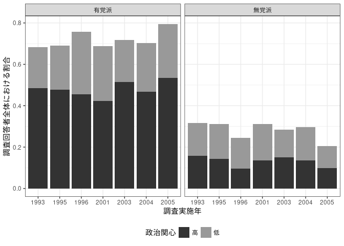<!-- -->

``` r
ggsave("mutohacat.png", p, width=6, height=4)
```

# Preparing for Prediction

``` r
## Prediction Data
preddt0 <- data.frame(
  mutoha = c(0,0,1,1),
  polint2 = c(0,1,0,1),
  fem = 0, age4050 = 1, age60plus = 0,
  edu_c1 = 1, edu_c2 = 0, edu_c3 = 0,
  employed = 1, income_low = 0, income_mid = 1, 
  income_high=0, income_dk=0,
  privatehome = 1, 
  citysize_big = 0, citysize_mid = 0, citysize_sml = 1, 
  netfem = 0, 
  netfa = 1, 
  netwk = 0, 
  netfac = factor("1", levels=c("1","2","3")),
  netpoldis2 = 1
)
preddt <- preddt0
preddt$netfac <- factor("1", levels=c("1","2","3","4"))
```

# Prediction (Network Size)

``` r
## Function for Predicted Probability ################################################

## DO NOT CHANGE THE CONTENT ##

predictologit <- function(model,
                       profile,
                       cilevel = 0.95,
                       ndraws = 1000,
                       sumonly = TRUE) {
  
  tt <- terms(model)
  Terms <- delete.response(tt)
  profile <- model.matrix(Terms,data=profile)
  profile <- profile[,-1]

  if (class(model)=="polr") {
    # Coefficients
    coeffs <- c(coef(model), summary(model)$zeta)
    # Variance Covariance Matrix
    covmat <- vcov(model)
    # N of Variable
    nvars <- length(coef(model)) 
  } else if (class(model)=="vglm") {
    # Coefficients
    intloc <- grep("Intercept",names(coef(model)))
    cfloc <- seq(1, length(coef(model)), by=1)[-intloc]
    coeffs <- c(coef(model)[cfloc],
                -coef(model)[intloc])
    # Variance Covariance Matrix
    covmat <- vcov(model)
    covmat[intloc, cfloc] <- -covmat[intloc, cfloc]
    covmat[cfloc, intloc] <- -covmat[cfloc, intloc]
    covmat <- covmat[c(cfloc,intloc),c(cfloc,intloc)]
    # N of Variable
    nvars <- length(coef(model)[cfloc]) 
  } 
  
  # Draw
  require(MASS)
  betadraw <- mvrnorm(ndraws, coeffs, covmat)
  
  # Profile * Coefficients
  dim(betadraw[,1:nvars]); dim(profile)
  xb <- profile %*% t(betadraw[,1:nvars])
  # Thresholds
  taos <- betadraw[,seq(nvars+1, length(coeffs), 1)]
  
  # Predicted Probabilities
  prlist <- list()
  for (i in 1:nrow(xb)) {
    tmp <- 
      cbind(rep(0,ndraws), 
            apply(taos, 2, function(taoi) 1/(1 + exp(xb[i,] - taoi))),
            rep(1, ndraws))
    pr <- matrix(NA, nrow=ndraws, ncol=ncol(taos)+1)
    for (j in seq(1,ncol(taos)+1,1)) pr[,j] <- tmp[,(j+1)] - tmp[,j]
    colnames(pr) <- paste0("Pr.",seq(1,ncol(pr),1))
    head(pr)
    prlist[[i]] <- pr
  }
  
  # Function to Summarize Result
  cirange <- c(0.5,(1 - cilevel)/2, 1 - (1 - cilevel)/2)
  sumres <- function(pr) {
    out <- cbind(colMeans(pr),
                 apply(pr, 2, function(k) sd(k)),
                 t(apply(pr, 2, function(k) quantile(k, probs=cirange))))
    colnames(out) <- c("mean","se","median","lowCI","upCI")
    out
  }
  
  # Export Summary of Prediction
  sumlist <- lapply(prlist, sumres)
  if (length(sumlist)==1) {
    sumlist <- sumlist[[1]]
  }
  
  if (sumonly==TRUE) {
    return(sumlist)
  } else {
    return(list(pr=prlist,sum=sumlist))
  }

}

##########################################################################################

pm1_2_93 <- predictologit(m1_2_93, preddt, sumonly=FALSE)
pm1_2_95 <- predictologit(m1_2_95, preddt, sumonly=FALSE)
pm1_2_96 <- predictologit(m1_2_96, preddt, sumonly=FALSE)
pm1_2_01 <- predictologit(m1_2_01, preddt, sumonly=FALSE)
pm1_2_03 <- predictologit(m1_2_03, preddt, sumonly=FALSE)
pm1_2_04 <- predictologit(m1_2_04, preddt, sumonly=FALSE)
pm1_2_05 <- predictologit(m1_2_05, preddt, sumonly=FALSE)

setci = c(0.05,0.95)

pm1dt_2x <- data.frame(mutoha = c("有","有","無","無"),
           polint2 = c("低関心","高関心"),
           year = rep(c("1993\n衆院選",
                        "1995\n参院選","1996\n衆院選"), each=4),
           yearn = rep(c(1,2,3), each=4),
           pr = c(sapply(pm1_2_93$pr, function(k) sum(colMeans(t(apply(k,1,function(k) k*c(0,1,2,3,4)))))),
                  sapply(pm1_2_95$pr, function(k) sum(colMeans(t(apply(k,1,function(k) k*c(0,1,2,3)))))),
                  sapply(pm1_2_96$pr, function(k) sum(colMeans(t(apply(k,1,function(k) k*c(0,1,2,3))))))),
           lci = c(sapply(pm1_2_93$pr, function(k) sum(apply(t(apply(k,1,function(k) k*c(0,1,2,3,4))), 2, function(j) quantile(j,probs=setci[1])))),
                   sapply(pm1_2_95$pr, function(k) sum(apply(t(apply(k,1,function(k) k*c(0,1,2,3))), 2, function(j) quantile(j,probs=setci[1])))),
                   sapply(pm1_2_96$pr, function(k) sum(apply(t(apply(k,1,function(k) k*c(0,1,2,3))), 2, function(j) quantile(j,probs=setci[1]))))),
           uci = c(sapply(pm1_2_93$pr, function(k) sum(apply(t(apply(k,1,function(k) k*c(0,1,2,3,4))), 2, function(j) quantile(j,probs=setci[2])))),
                   sapply(pm1_2_95$pr, function(k) sum(apply(t(apply(k,1,function(k) k*c(0,1,2,3))), 2, function(j) quantile(j,probs=setci[2])))),
                   sapply(pm1_2_96$pr, function(k) sum(apply(t(apply(k,1,function(k) k*c(0,1,2,3))), 2, function(j) quantile(j,probs=setci[2]))))
           ))
pm1dt_2y <- data.frame(mutoha = c("有","有","無","無"),
                       polint2 = c("低関心","高関心"),
                       year = rep(c("2001\n参院選","2003\n衆院選",
                                    "2004\n参院選","2005\n衆院選"), each=4),
                       yearn = rep(c(4,5,6,7), each=4),
                       pr = c(sapply(pm1_2_01$pr, function(k) sum(colMeans(t(apply(k,1,function(k) k*c(0,1,2,3,4)))))),
                              sapply(pm1_2_03$pr, function(k) sum(colMeans(t(apply(k,1,function(k) k*c(0,1,2,3,4)))))),
                              sapply(pm1_2_04$pr, function(k) sum(colMeans(t(apply(k,1,function(k) k*c(0,1,2,3,4)))))),
                              sapply(pm1_2_05$pr, function(k) sum(colMeans(t(apply(k,1,function(k) k*c(0,1,2,3,4))))))),
                       lci = c(sapply(pm1_2_01$pr, function(k) sum(apply(t(apply(k,1,function(k) k*c(0,1,2,3,4))), 2, function(j) quantile(j,probs=setci[1])))),
                               sapply(pm1_2_03$pr, function(k) sum(apply(t(apply(k,1,function(k) k*c(0,1,2,3,4))), 2, function(j) quantile(j,probs=setci[1])))),
                               sapply(pm1_2_04$pr, function(k) sum(apply(t(apply(k,1,function(k) k*c(0,1,2,3,4))), 2, function(j) quantile(j,probs=setci[1])))),
                               sapply(pm1_2_05$pr, function(k) sum(apply(t(apply(k,1,function(k) k*c(0,1,2,3,4))), 2, function(j) quantile(j,probs=setci[1]))))),
                       uci = c(sapply(pm1_2_01$pr, function(k) sum(apply(t(apply(k,1,function(k) k*c(0,1,2,3,4))), 2, function(j) quantile(j,probs=setci[2])))),
                               sapply(pm1_2_03$pr, function(k) sum(apply(t(apply(k,1,function(k) k*c(0,1,2,3,4))), 2, function(j) quantile(j,probs=setci[2])))),
                               sapply(pm1_2_04$pr, function(k) sum(apply(t(apply(k,1,function(k) k*c(0,1,2,3,4))), 2, function(j) quantile(j,probs=setci[2])))),
                               sapply(pm1_2_05$pr, function(k) sum(apply(t(apply(k,1,function(k) k*c(0,1,2,3,4))), 2, function(j) quantile(j,probs=setci[2]))))
                       ))

pm1dt_2 <- rbind(pm1dt_2x,pm1dt_2y)

p <- ggplot(pm1dt_2, aes(x=mutoha, y=pr, ymin=lci, ymax=uci)) + 
  geom_bar(aes(alpha=mutoha),stat="identity") + 
  geom_errorbar(stat="identity", width = 0.2) + 
  facet_grid(polint2 ~ year) + 
  #scale_y_continuous(limits = c(0,1), 
  #                   breaks=c(0,0.5,1),labels=c("0%","50%","100%")) + 
  scale_alpha_manual(values = c(0.4,0.8)) + 
  labs(x="普段支持している政党",
       y="回答者が挙げたネットワーク他者の数（予測値）",
       caption="※グラフ上の棒は予測値、縦線は90%信頼区間を示している。") +
  theme_bw() + theme(legend.position = "bottom",
                     axis.title.y = element_text(size=10),
                     plot.caption = element_text(size=7))
p
```

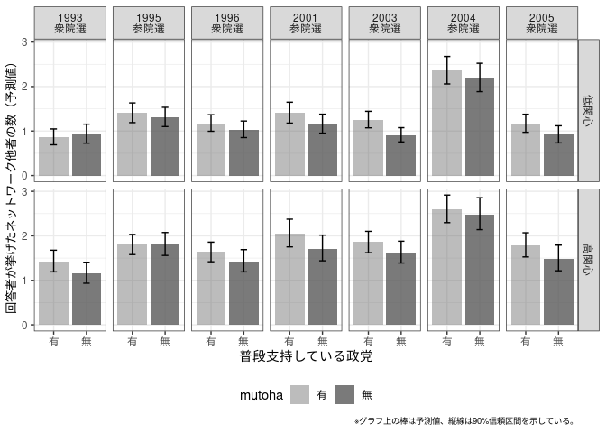<!-- -->

``` r
ggsave("sumnet_pred_v2.png", p, width=6, height=4)

p <- ggplot(pm1dt_2, aes(x=yearn, y=pr, ymin=lci, ymax=uci)) + 
  # geom_ribbon(aes(fill=mutoha),alpha=0.3) + 
  # geom_line(aes(linetype=mutoha,color=mutoha),size=0.75) + 
  # geom_point(aes(shape=mutoha,color=mutoha),size=2.5) + 
  geom_errorbar(aes(color=mutoha),width=0.3, position=position_dodge(width=0.4)) + 
  geom_point(aes(shape=mutoha,color=mutoha),size=2.5, position=position_dodge(width=0.4)) + 
  facet_grid(. ~ polint2) +  
  # scale_y_continuous(limits = c(0,1), 
  #                    breaks=c(0,0.5,1),labels=c("0%","50%","100%")) + 
  scale_x_continuous(breaks=seq(1,7),
                     labels=c("93\n衆","95\n参","96\n衆",#"00\n",
                              "01\n参","03\n衆","04\n参","05\n衆")) + 
  scale_shape_discrete(name="普段支持している政党") + 
  scale_fill_brewer(name="普段支持している政党", type="qual", palette=2) + 
  scale_color_brewer(name="普段支持している政党", type="qual", palette=2) + 
  scale_linetype_manual(name="普段支持している政党", values=c(2,1)) + 
  labs(x=NULL,
       y="回答者が挙げたネットワーク他者の数（予測値）",
       caption="※グラフ上の点は予測値、縦線は90%信頼区間を示している。") +
  theme_bw() + theme(legend.position = "bottom",
                     axis.title.y = element_text(size=10),
                     plot.caption = element_text(size=7))
p
```

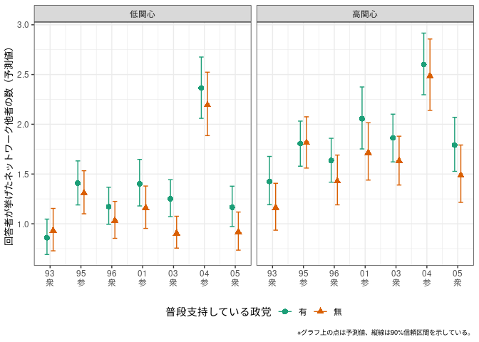<!-- -->

``` r
ggsave("sumnet_pred2_v2.png", p, width=6, height=4)
```

# Prediction (Network Data)

``` r
## Prediction Function
## Borrowed Mostly From https://stackoverflow.com/questions/3790116/using-clustered-covariance-matrix-in-predict-lm?noredirect=1&lq=1
predict_robust <- function(x,newdata,vcov.){
  if(missing(newdata)){ newdata <- x$model }
  tt <- terms(x)
  Terms <- delete.response(tt)
  m.mat <- model.matrix(Terms,data=newdata)
  m.coef <- x$coef
  fit <- as.vector(m.mat %*% x$coef)
  if (missing(vcov.)) vcov. <- vcov(x)
  se.fit <- sqrt(diag(m.mat%*%vcov.%*%t(m.mat)))
  return(list(fit=fit,se.fit=se.fit))
}

## Political Discussion

pm2_2_93 <- predict_robust(m2_2_93, preddt, m2_2_93_vcov)
pm2_2_95 <- predict_robust(m2_2_95, preddt0, m2_2_95_vcov)
pm2_2_96 <- predict_robust(m2_2_96, preddt0, m2_2_96_vcov)
# pm2_2_00 <- predict_robust(m2_2_00, preddt0, m2_2_00_vcov)
pm2_2_01 <- predict_robust(m2_2_01, preddt, m2_2_01_vcov)
pm2_2_03 <- predict_robust(m2_2_03, preddt, m2_2_03_vcov)
pm2_2_04 <- predict_robust(m2_2_04, preddt, m2_2_04_vcov)
pm2_2_05 <- predict_robust(m2_2_05, preddt, m2_2_05_vcov)

pm2dt_2x <- 
  data.frame(mutoha = c("有","有","無","無"),
             polint2 = c("低関心","高関心"),
             year = rep(c("1993\n衆院選",
                          "1995\n参院選","1996\n衆院選"), each=4),
             yearn = rep(c(1,2,3), each=4),
             pr = plogis(c(pm2_2_93$fit,pm2_2_95$fit,pm2_2_96$fit)),
             lci = plogis(c(pm2_2_93$fit - qnorm(0.95)*pm2_2_93$se.fit,
                            pm2_2_95$fit - qnorm(0.95)*pm2_2_95$se.fit,
                            pm2_2_96$fit - qnorm(0.95)*pm2_2_96$se.fit)),
             uci = plogis(c(pm2_2_93$fit + qnorm(0.95)*pm2_2_93$se.fit,
                            pm2_2_95$fit + qnorm(0.95)*pm2_2_95$se.fit,
                            pm2_2_96$fit + qnorm(0.95)*pm2_2_96$se.fit)))
pm2dt_2y <- 
  data.frame(mutoha = c("有","有","無","無"),
             polint2 = c("低関心","高関心"),
             year = rep(c(#"2000\n",
                          "2001\n参院選","2003\n衆院選",
                          "2004\n参院選","2005\n衆院選"), each=4),
             yearn = rep(c(4,5,6,7), each=4),
             pr = plogis(c(#pm2_2_00$fit,
                           pm2_2_01$fit,pm2_2_03$fit,
                           pm2_2_04$fit,pm2_2_05$fit)),
             lci = plogis(c(#pm2_2_00$fit - qnorm(0.95)*pm2_2_00$se.fit,
                            pm2_2_01$fit - qnorm(0.95)*pm2_2_01$se.fit,
                            pm2_2_03$fit - qnorm(0.95)*pm2_2_03$se.fit,
                            pm2_2_04$fit - qnorm(0.95)*pm2_2_04$se.fit,
                            pm2_2_05$fit - qnorm(0.95)*pm2_2_05$se.fit)),
             uci = plogis(c(#pm2_2_00$fit + qnorm(0.95)*pm2_2_00$se.fit,
                            pm2_2_01$fit + qnorm(0.95)*pm2_2_01$se.fit,
                            pm2_2_03$fit + qnorm(0.95)*pm2_2_03$se.fit,
                            pm2_2_04$fit + qnorm(0.95)*pm2_2_04$se.fit,
                            pm2_2_05$fit + qnorm(0.95)*pm2_2_05$se.fit)))
pm2dt_2 <- rbind(pm2dt_2x,pm2dt_2y)

p <- ggplot(pm2dt_2, aes(x=mutoha, y=pr, ymin=lci, ymax=uci)) + 
  geom_bar(aes(alpha=mutoha),stat="identity") + 
  geom_errorbar(stat="identity", width = 0.2) + 
  facet_grid(polint2 ~ year) + 
  scale_y_continuous(limits = c(0,1), 
                     breaks=c(0,0.5,1),labels=c("0%","50%","100%")) + 
  scale_alpha_manual(values = c(0.4,0.8)) + 
  labs(x="普段支持している政党",
       y="ネットワーク他者と政治について\nよく話題になる確率（予測値）",
       caption="※グラフ上の棒は予測値、縦線は90%信頼区間を示している。") +
  theme_bw() + theme(legend.position = "bottom",
                     axis.title.y = element_text(size=10),
                     plot.caption = element_text(size=7))
p
```

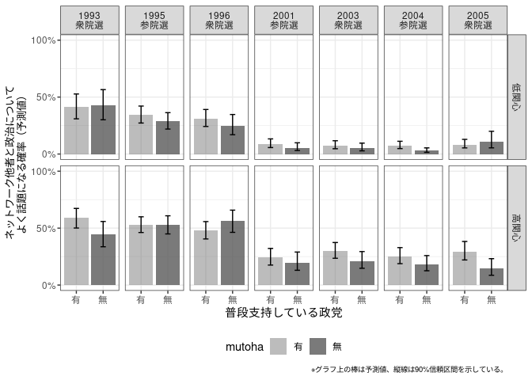<!-- -->

``` r
ggsave("netpoldis_pred_v2.png", p, width=6, height=4)

p <- ggplot(pm2dt_2, aes(x=yearn, y=pr, ymin=lci, ymax=uci)) + 
  # geom_ribbon(aes(fill=mutoha),alpha=0.3) + 
  # geom_line(aes(linetype=mutoha,color=mutoha),size=0.75) + 
  # geom_point(aes(shape=mutoha,color=mutoha),size=2.5) + 
  geom_errorbar(aes(color=mutoha),width=0.3, position=position_dodge(width=0.4)) + 
  geom_point(aes(shape=mutoha,color=mutoha),size=2.5, position=position_dodge(width=0.4)) + 
  facet_grid(. ~ polint2) +  
  scale_y_continuous(limits = c(0,1), 
                     breaks=c(0,0.5,1),labels=c("0%","50%","100%")) + 
  scale_x_continuous(breaks=seq(1,7),
                     labels=c("93\n衆","95\n参","96\n衆",#"00\n",
                              "01\n参","03\n衆","04\n参","05\n衆")) + 
  scale_shape_discrete(name="普段支持している政党") + 
  scale_fill_brewer(name="普段支持している政党", type="qual", palette=2) + 
  scale_color_brewer(name="普段支持している政党", type="qual", palette=2) + 
  scale_linetype_manual(name="普段支持している政党", values=c(2,1)) + 
  labs(x=NULL,
       y="ネットワーク他者と政治について\nよく話題になる確率（予測値）",
       caption="※グラフ上の点は予測値、縦線は90%信頼区間を示している。") +
  theme_bw() + theme(legend.position = "bottom",
                     axis.title.y = element_text(size=10),
                     plot.caption = element_text(size=7))
p
```

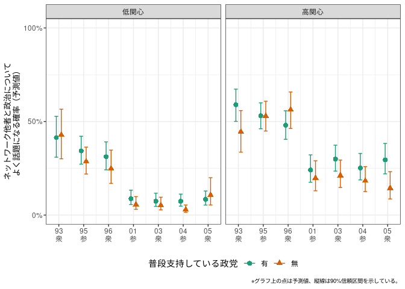<!-- -->

``` r
ggsave("netpoldis_pred2_v2.png", p, width=6, height=4)

## Perceived Political Knowledge

# pm3_2_00 <- predict_robust(m3_2_00, preddt0, m3_2_00_vcov)
pm3_2_01 <- predict_robust(m3_2_01, preddt, m3_2_01_vcov)
pm3_2_03 <- predict_robust(m3_2_03, preddt, m3_2_03_vcov)
pm3_2_04 <- predict_robust(m3_2_04, preddt, m3_2_04_vcov)
pm3_2_05 <- predict_robust(m3_2_05, preddt, m3_2_05_vcov)

pm3dt_2 <- 
  data.frame(mutoha = c("有","有","無","無"),
             polint2 = c("低関心","高関心"),
             year = rep(c(#"2000\n",
                          "2001\n参院選","2003\n衆院選",
                          "2004\n参院選","2005\n衆院選"), each=4),
             yearn = rep(c(1,2,3,4), each=4),
             pr = plogis(c(#pm3_2_00$fit,
                           pm3_2_01$fit,pm3_2_03$fit,
                           pm3_2_04$fit,pm3_2_05$fit)),
             lci = plogis(c(#pm3_2_00$fit - qnorm(0.95)*pm3_2_00$se.fit,
                            pm3_2_01$fit - qnorm(0.95)*pm3_2_01$se.fit,
                            pm3_2_03$fit - qnorm(0.95)*pm3_2_03$se.fit,
                            pm3_2_04$fit - qnorm(0.95)*pm3_2_04$se.fit,
                            pm3_2_05$fit - qnorm(0.95)*pm3_2_05$se.fit)),
             uci = plogis(c(#pm3_2_00$fit + qnorm(0.95)*pm3_2_00$se.fit,
                            pm3_2_01$fit + qnorm(0.95)*pm3_2_01$se.fit,
                            pm3_2_03$fit + qnorm(0.95)*pm3_2_03$se.fit,
                            pm3_2_04$fit + qnorm(0.95)*pm3_2_04$se.fit,
                            pm3_2_05$fit + qnorm(0.95)*pm3_2_05$se.fit)))

p <- ggplot(pm3dt_2, aes(x=mutoha, y=pr, ymin=lci, ymax=uci)) + 
  geom_bar(aes(alpha=mutoha),stat="identity") + 
  geom_errorbar(stat="identity", width = 0.2) + 
  facet_grid(polint2 ~ year) + 
  scale_y_continuous(limits = c(0,1), 
                     breaks=c(0,0.5,1),labels=c("0%","50%","100%")) + 
  scale_alpha_manual(values = c(0.4,0.8)) + 
  labs(x="普段支持している政党",
       caption="※1993ー96の調査には設問が存在しない。グラフ上の点は予測値、縦線は90%信頼区間を示している。") +
  theme_bw() + theme(legend.position = "none",
                     axis.title.y = element_text(size=10))
p
```

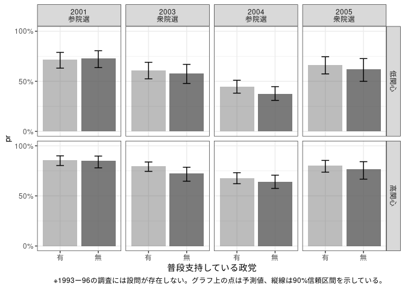<!-- -->

``` r
ggsave("netknow_pred_v2.png", p, width=6, height=4)

p <- ggplot(pm3dt_2, aes(x=yearn, y=pr, ymin=lci, ymax=uci)) + 
  # geom_ribbon(aes(fill=mutoha),alpha=0.3) + 
  # geom_line(aes(linetype=mutoha,color=mutoha),size=0.75) + 
  # geom_point(aes(shape=mutoha,color=mutoha),size=2.5) + 
  geom_errorbar(aes(color=mutoha),width=0.3, position=position_dodge(width=0.4)) + 
  geom_point(aes(shape=mutoha,color=mutoha),size=2.5, position=position_dodge(width=0.4)) + 
  facet_grid(. ~ polint2) +  
  scale_y_continuous(limits = c(0,1), 
                     breaks=c(0,0.5,1),labels=c("0%","50%","100%")) + 
  scale_x_continuous(breaks=seq(1,4),
                     labels=c(#"00\n",
                              "01\n参","03\n衆","04\n参","05\n衆")) + 
  scale_shape_discrete(name="普段支持している政党") + 
  scale_fill_brewer(name="普段支持している政党", type="qual", palette=2) + 
  scale_color_brewer(name="普段支持している政党", type="qual", palette=2) + 
  scale_linetype_manual(name="普段支持している政党", values=c(2,1)) + 
  labs(x=NULL,
       y="ネットワーク他者が政治について詳しいと\n認識している確率（予測値）",
       caption="※1993ー96の調査には設問が存在しない。グラフ上の点は予測値、縦線は90%信頼区間を示している。") +
  theme_bw() + theme(legend.position = "bottom",
                     axis.title.y = element_text(size=10),
                     plot.caption = element_text(size=7))
p
```

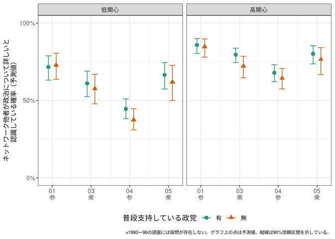<!-- -->

``` r
ggsave("netknow_pred2_v2.png", p, width=6, height=4)

## Knowing Partner's Vote Choice/Party Support

pm4_2_93 <- predict_robust(m4_2_93, preddt, m4_2_93_vcov)
pm4_2_95 <- predict_robust(m4_2_95, preddt0, m4_2_95_vcov)
pm4_2_96 <- predict_robust(m4_2_96, preddt0, m4_2_96_vcov)
#pm4_2_00 <- predict_robust(m4_2_00, preddt0, m4_2_00_vcov)
pm4_2_01 <- predict_robust(m4_2_01, preddt, m4_2_01_vcov)
pm4_2_03 <- predict_robust(m4_2_03, preddt, m4_2_03_vcov)
pm4_2_04 <- predict_robust(m4_2_04, preddt, m4_2_04_vcov)
pm4_2_05 <- predict_robust(m4_2_05, preddt, m4_2_05_vcov)

pm4dt_2x <- 
  data.frame(mutoha = c("有","有","無","無"),
             polint2 = c("低関心","高関心"),
             year = rep(c("1993\n衆院選",
                          "1995\n参院選","1996\n衆院選"), each=4),
             yearn = rep(c(1,2,3), each=4),
             pr = plogis(c(pm4_2_93$fit,pm4_2_95$fit,pm4_2_96$fit)),
             lci = plogis(c(pm4_2_93$fit - qnorm(0.95)*pm4_2_93$se.fit,
                            pm4_2_95$fit - qnorm(0.95)*pm4_2_95$se.fit,
                            pm4_2_96$fit - qnorm(0.95)*pm4_2_96$se.fit)),
             uci = plogis(c(pm4_2_93$fit + qnorm(0.95)*pm4_2_93$se.fit,
                            pm4_2_95$fit + qnorm(0.95)*pm4_2_95$se.fit,
                            pm4_2_96$fit + qnorm(0.95)*pm4_2_96$se.fit)))
pm4dt_2y <- 
  data.frame(mutoha = c("有","有","無","無"),
             polint2 = c("低関心","高関心"),
             year = rep(c(#"2000\n※",
                          "2001\n参院選","2003\n衆院選",
                          "2004\n参院選","2005\n衆院選"), each=4),
             yearn = rep(c(4,5,6,7), each=4),
             pr = plogis(c(#pm4_2_00$fit,
                           pm4_2_01$fit,pm4_2_03$fit,
                           pm4_2_04$fit,pm4_2_05$fit)),
             lci = plogis(c(#pm4_2_00$fit - qnorm(0.95)*pm4_2_00$se.fit,
                            pm4_2_01$fit - qnorm(0.95)*pm4_2_01$se.fit,
                            pm4_2_03$fit - qnorm(0.95)*pm4_2_03$se.fit,
                            pm4_2_04$fit - qnorm(0.95)*pm4_2_04$se.fit,
                            pm4_2_05$fit - qnorm(0.95)*pm4_2_05$se.fit)),
             uci = plogis(c(#pm4_2_00$fit + qnorm(0.95)*pm4_2_00$se.fit,
                            pm4_2_01$fit + qnorm(0.95)*pm4_2_01$se.fit,
                            pm4_2_03$fit + qnorm(0.95)*pm4_2_03$se.fit,
                            pm4_2_04$fit + qnorm(0.95)*pm4_2_04$se.fit,
                            pm4_2_05$fit + qnorm(0.95)*pm4_2_05$se.fit)))
pm4dt_2 <- rbind(pm4dt_2x,pm4dt_2y)

p <- ggplot(pm4dt_2, aes(x=mutoha, y=pr, ymin=lci, ymax=uci)) + 
  geom_bar(aes(alpha=mutoha),stat="identity") + 
  geom_errorbar(stat="identity", width = 0.2) + 
  facet_grid(polint2 ~ year) + 
  scale_y_continuous(limits = c(0,1), 
                     breaks=c(0,0.5,1),labels=c("0%","50%","100%")) + 
  scale_alpha_manual(values = c(0.4,0.8)) + 
  labs(x="普段支持している政党",
       y="政治がよく話題になるネットワーク他者の選挙区投票先（意向）を\n認識している確率（予測値）",
       caption="※グラフ上の棒は予測値、縦線は90%信頼区間を示している。") +
  theme_bw() + theme(legend.position = "bottom",
                     axis.title.y = element_text(size=10),
                     plot.caption = element_text(size=7))
p
```

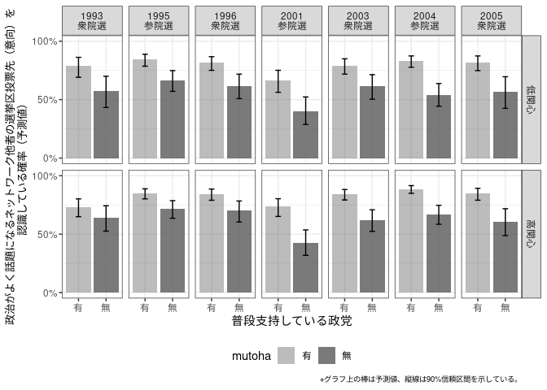<!-- -->

``` r
ggsave("knnetpvote_pred_v2.png", p, width=6, height=4)

p <- ggplot(pm4dt_2, aes(x=yearn, y=pr, ymin=lci, ymax=uci)) + 
  # geom_ribbon(aes(fill=mutoha),alpha=0.3) + 
  # geom_line(aes(linetype=mutoha,color=mutoha),size=0.75) + 
  # geom_point(aes(shape=mutoha,color=mutoha),size=2.5) + 
  geom_errorbar(aes(color=mutoha),width=0.3, position=position_dodge(width=0.4)) + 
  geom_point(aes(shape=mutoha,color=mutoha),size=2.5, position=position_dodge(width=0.4)) + 
  facet_grid(. ~ polint2) +  
  scale_y_continuous(limits = c(0,1), 
                     breaks=c(0,0.5,1),labels=c("0%","50%","100%")) + 
  scale_x_continuous(breaks=seq(1,7),
                     labels=c("93\n衆","95\n参","96\n衆",#"00\n※",
                              "01\n参","03\n衆","04\n参","05\n衆")) + 
  scale_shape_discrete(name="普段支持している政党") + 
  scale_fill_brewer(name="普段支持している政党", type="qual", palette=2) + 
  scale_color_brewer(name="普段支持している政党", type="qual", palette=2) + 
  scale_linetype_manual(name="普段支持している政党", values=c(2,1)) + 
  labs(x=NULL,y="政治がよく話題になるネットワーク他者の\n投票先意向を認識している確率（予測値）",
       caption="※グラフ上の点は予測値、縦線は90%信頼区間を示している。") +
  theme_bw() + theme(legend.position = "bottom",
                     axis.title.y = element_text(size=10),
                     plot.caption = element_text(size=7))
p
```

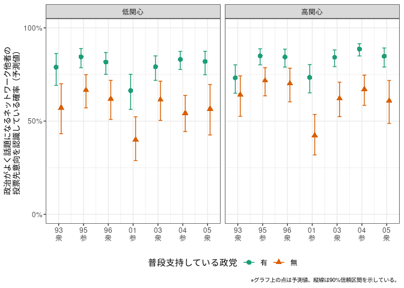<!-- -->

``` r
ggsave("knnetpvote_pred2_v2.png", p, width=6, height=4)

## Difference in the preferred vote choice

pm5_2_93 <- predict_robust(m5_2_93, preddt, m5_2_93_vcov)
pm5_2_95 <- predict_robust(m5_2_95, preddt0, m5_2_95_vcov)
pm5_2_96 <- predict_robust(m5_2_96, preddt0, m5_2_96_vcov)
pm5_2_01 <- predict_robust(m5_2_01, preddt, m5_2_01_vcov)
pm5_2_03 <- predict_robust(m5_2_03, preddt, m5_2_03_vcov)
pm5_2_04 <- predict_robust(m5_2_04, preddt, m5_2_04_vcov)
pm5_2_05 <- predict_robust(m5_2_05, preddt, m5_2_05_vcov)

pm5dt_2x <- 
  data.frame(mutoha = c("有","有","無","無"),
             polint2 = c("低関心","高関心"),
             year = rep(c("1993\n衆院選",
                          "1995\n参院選","1996\n衆院選"), each=4),
             yearn = rep(c(1,2,3), each=4),
             pr = plogis(c(pm5_2_93$fit,pm5_2_95$fit,pm5_2_96$fit)),
             lci = plogis(c(pm5_2_93$fit - qnorm(0.95)*pm5_2_93$se.fit,
                            pm5_2_95$fit - qnorm(0.95)*pm5_2_95$se.fit,
                            pm5_2_96$fit - qnorm(0.95)*pm5_2_96$se.fit)),
             uci = plogis(c(pm5_2_93$fit + qnorm(0.95)*pm5_2_93$se.fit,
                            pm5_2_95$fit + qnorm(0.95)*pm5_2_95$se.fit,
                            pm5_2_96$fit + qnorm(0.95)*pm5_2_96$se.fit)))
pm5dt_2y <- 
  data.frame(mutoha = c("有","有","無","無"),
             polint2 = c("低関心","高関心"),
             year = rep(c("2001\n参院選","2003\n衆院選",
                          "2004\n参院選","2005\n衆院選"), each=4),
             yearn = rep(c(4,5,6,7), each=4),
             pr = plogis(c(pm5_2_01$fit,pm5_2_03$fit,pm5_2_04$fit,pm5_2_05$fit)),
             lci = plogis(c(pm5_2_01$fit - qnorm(0.95)*pm5_2_01$se.fit,
                            pm5_2_03$fit - qnorm(0.95)*pm5_2_03$se.fit,
                            pm5_2_04$fit - qnorm(0.95)*pm5_2_04$se.fit,
                            pm5_2_05$fit - qnorm(0.95)*pm5_2_05$se.fit)),
             uci = plogis(c(pm5_2_01$fit + qnorm(0.95)*pm5_2_01$se.fit,
                            pm5_2_03$fit + qnorm(0.95)*pm5_2_03$se.fit,
                            pm5_2_04$fit + qnorm(0.95)*pm5_2_04$se.fit,
                            pm5_2_05$fit + qnorm(0.95)*pm5_2_05$se.fit)))
pm5dt_2 <- rbind(pm5dt_2x,pm5dt_2y)

p <- ggplot(pm5dt_2, aes(x=mutoha, y=pr, ymin=lci, ymax=uci)) + 
  geom_bar(aes(alpha=mutoha),stat="identity") + 
  geom_errorbar(stat="identity", width = 0.2) + 
  facet_grid(polint2 ~ year) + 
  scale_y_continuous(limits = c(0,1), 
                     breaks=c(0,0.5,1),labels=c("0%","50%","100%")) + 
  scale_alpha_manual(values = c(0.4,0.8)) + 
  labs(x="普段支持している政党",
       y="政治がよく話題になるネットワーク他者と選挙区\n投票先意向が一致しない確率（予測値）",
       caption="※グラフ上の棒は予測値、縦線は90%信頼区間を示している。") +
  theme_bw() + theme(legend.position = "bottom",
                     axis.title.y = element_text(size=10),
                     plot.caption = element_text(size=7))
p
```

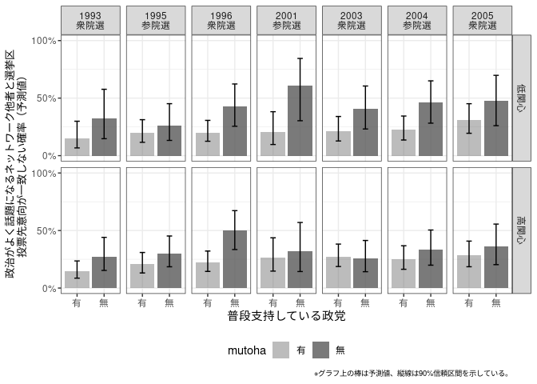<!-- -->

``` r
ggsave("netpvotedif_pred_v2.png", p, width=6, height=4)

p <- ggplot(pm5dt_2, aes(x=yearn, y=pr, ymin=lci, ymax=uci)) + 
  # geom_ribbon(aes(fill=mutoha),alpha=0.3) + 
  # geom_line(aes(linetype=mutoha,color=mutoha),size=0.75) + 
  # geom_point(aes(shape=mutoha,color=mutoha),size=2.5) + 
  geom_errorbar(aes(color=mutoha),width=0.3, position=position_dodge(width=0.4)) + 
  geom_point(aes(shape=mutoha,color=mutoha),size=2.5, position=position_dodge(width=0.4)) + 
  facet_grid(. ~ polint2) +  
  scale_y_continuous(limits = c(0,1), 
                     breaks=c(0,0.5,1),labels=c("0%","50%","100%")) + 
  scale_x_continuous(breaks=seq(1,7),
                     labels=c("93\n衆","95\n参","96\n衆",
                              "01\n参","03\n衆","04\n参","05\n衆")) + 
  scale_shape_discrete(name="普段支持している政党") + 
  scale_color_brewer(name="普段支持している政党", type="qual", palette=2) + 
  scale_fill_brewer(name="普段支持している政党", type="qual", palette=2) + 
  scale_linetype_manual(name="普段支持している政党", values=c(2,1)) + 
  labs(x=NULL,y="政治がよく話題になるネットワーク他者と選挙区\n投票先意向が一致しない確率（予測値）",
       caption="※グラフ上の点は予測値、縦線は90%信頼区間を示している。") +
  theme_bw() + theme(legend.position = "bottom",
                     axis.title.y = element_text(size=10),
                     plot.caption = element_text(size=7))
p
```

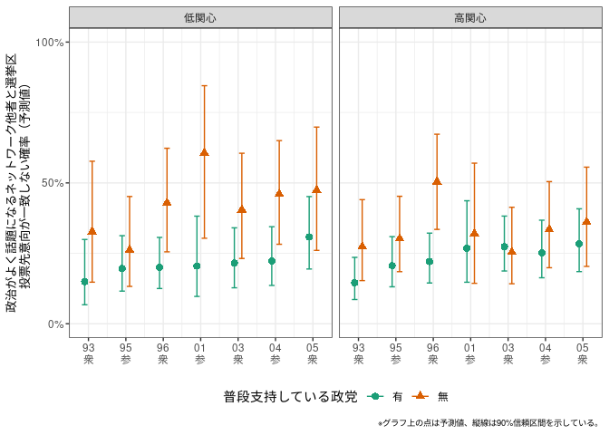<!-- -->

``` r
ggsave("netpvotedif_pred2_v2.png", p, width=6, height=4)
```
