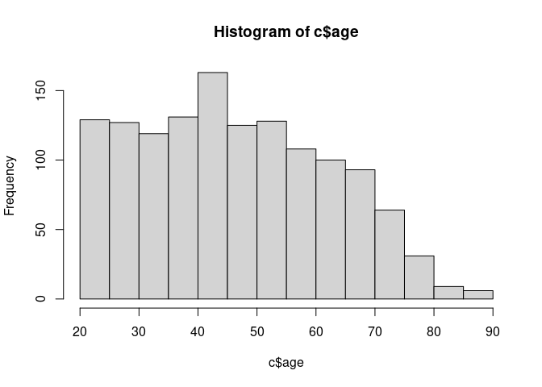

CNEP 93 Recode
================
Gento Kato
April 15, 2021

# Preparation

``` r
## Clean Up Space
rm(list=ls())

## Set Working Directory (Automatically) ##
require(rstudioapi)
setwd(dirname(rstudioapi::getActiveDocumentContext()$path)); 

## Find Data Directory
datadir <- "0145_zenkoku.sav"

## Import Original Data
require(haven)
dc <- read_sav(datadir, encoding="SHIFT_JIS")
colnames(dc) <- tolower(colnames(dc))

## All Parties
jimin="自民"; minshu="民主"; komei="公明"; shamin="社民"; kyosan="共産"
hoshushin="保守新"; jiyu="自由"; kokuminshin="国民新"; shakai="社会"; shinsei="新生"
minsha="民社"; sakigake="さきがけ"; shaminren="社民連"; nihonshin="日本新"; shinshin="新進"
sonota="その他"
allps <- c(jimin,shakai,komei,shinsei,kyosan,
           minsha,sakigake,shaminren,nihonshin,shinshin,
           minshu,shamin,hoshushin,jiyu,kokuminshin,
           sonota)
mutoha <- "無党派"
mikettei <- "未決定"
kiken="棄権"
shiranai <- "知らない"
mushozoku="無所属"
```

# Check Relevant Variables

``` r
# table(, useNA="always") # City Size (Missing)
table(dc$f1, useNA="always") # Gender 1=Male, 2=Female
```

    ## 
    ##    1    2 <NA> 
    ##  651  682    0

``` r
table(dc$f3, useNA="always") # Age
```

    ## 
    ##   20   21   22   23   24   25   26   27   28   29   30   31   32   33   34   35   36   37   38   39   40   41   42 
    ##   29   25   20   17   19   19   21   25   19   37   25   21   17   28   27   26   17   14   31   42   27   25   41 
    ##   43   44   45   46   47   48   49   50   51   52   53   54   55   56   57   58   59   60   61   62   63   64   65 
    ##   27   24   46   26   21   20   30   28   19   29   20   25   35   25   20   16   22   25   17   15   20   22   26 
    ##   66   67   68   69   70   71   72   73   74   75   76   77   78   79   80   81   82   83   84   86   87   89 <NA> 
    ##   11   12   19   21   30   11   17   19    9    8   10    8    8    3    2    2    5    1    1    2    2    2    0

``` r
table(dc$q16, useNA="always") # Party Support
```

    ## 
    ##    1    2    3    4    5    6    7    8    9   10   11   12   13 <NA> 
    ##  488  114   54   56   31   25   24   10   64    2  405   38   22    0

``` r
# 1=自民, 2=社会, 3=公明, 4=新生, 5=共産, 6=民社, 7=さきがけ, 
# 8=社民連, 9=日本新党, 10=その他, 11=そのような政党はない, 12=DK, 13=NA
table(dc$q16s1, useNA="always") # Party Leaners
```

    ## 
    ##    1    2    3    4    5    6    7    8    9   11   12   13 <NA> 
    ##   72   28    3   14   12    5    4    2   22  200   29   14  928

``` r
# 1=自民, 2=社会, 3=公明, 4=新生, 5=共産, 6=民社, 7=さきがけ, 
# 8=社民連, 9=日本新党, 10=その他, 11=そのような政党はない, 12=DK, 13=NA
table(dc$q14, useNA="always") # Vote Intention 1=Definitely going, 2=if possible, 3=no, 4=DK, 5=NA
```

    ## 
    ##    1    2    3    4    5 <NA> 
    ##  994  226   81   31    1    0

``` r
table(dc$q14s1, useNA="always") # Vote Decision Intention by Party 
```

    ## 
    ##    1    2    3    4    5    6    7    8    9   10   11   12   13 <NA> 
    ##  346  103   57   85   40   12   15    2   55   15  362   40   88  113

``` r
# 1=自民, 2=社会, 3=公明, 4=新生, 5=共産, 6=民社, 7=さきがけ, 
# 8=社民連, 9=日本新党, 10=その他, 11=まだ決まっていない, 12=DK, 13=NA
table(dc$q11, useNA="always") # Election Interest 1=A lot, 2=some, 3=Not much, 4=not at all, 5=DK, 6=NA
```

    ## 
    ##    1    2    3    4    5    6 <NA> 
    ##  327  515  421   63    6    1    0

``` r
table(dc$f7, useNA="always") # Year of Residence 1=1yr, 2=2-3, 3=4-5, 4=6-9, 5=10-19, 6=>=20, 99=NA
```

    ## 
    ##    1    2    3    4    5    6    7    8    9   10   11   12   13   14   15   16   17   18   19   20   21   22   23 
    ##   72   61   50   36   59   30   42   34   14   78   23   40   30   16   42   23   23   23    6   71   15   13   19 
    ##   24   25   26   27   28   29   30   31   32   33   34   35   36   37   38   39   40   41   42   43   44   45   46 
    ##   17   43   15   14   15    6   55    6    7    5    9   25   10    6   10    4   44    5   13    5   11   14    3 
    ##   47   48   49   50   51   52   53   54   55   56   57   58   59   60   62   63   64   65   67   68   69   70   71 
    ##    7    7    6   34    2    9    5    5    8    8    9    2    3   14    3    1    4    5    3    3    4    9    1 
    ##   72   73   75   76   78   80   82   85   89   99 <NA> 
    ##    4    3    2    1    1    1    1    1    1    4    0

``` r
table(dc$f5, useNA="always") # Education 
```

    ## 
    ##    2    3    4    5    6    7    8    9   10   11   12   13   15 <NA> 
    ##  147  554   78   79  177    2   58  122   92    8    3    4    9    0

``` r
# 1=小学校, 2=中学校, 3=高校, 4=専門学校・職業訓練校, 5=短大・高専, 6=大学, 7=大学院
# 8=小学校・尋常小学校, 9=高等小学校, 10=旧制中学・女学校, 11=旧制高専, 12=旧制高校, 13=旧制専門学校・予科, 14=旧制大学
table(dc$f4, useNA="always") # Occupation
```

    ## 
    ##    1    2    3    4    5    6    7    8    9   10   11   12   13 <NA> 
    ##  229   10   36   36  147   57  152   80  291   30  148  116    1    0

``` r
# 1=商工業・サービス業, 2=自由業, 3=管理職, 4=専門職・技術職, 5=事務職, 
# 6=販売・サービス職, 7=労務職, 8=パート・アルバイト, 9=主婦, 10=学生・生徒, 11=無職・家事手伝い, 12=上記以外, 13=NA
table(dc$f10, useNA="always") # Type of Home 1=一戸建, 2=店舗・事務所兼住宅, 3=集合住宅, 4=その他
```

    ## 
    ##    1    2    3    4 <NA> 
    ##  985   83  248   17    0

``` r
table(dc$f8, useNA="always") # Household Income
```

    ## 
    ##    1    2    3    4    5    6    7    8    9   10   11   12   13   14 <NA> 
    ##   10   58   87  114  104  113  117   76   56   50   93   36  270  149    0

``` r
# ### (No Post-Election Wave)
# table(, useNA="always") # Voted
# table(, useNA="always") # Vote Decision by Party

## Partner 1
table(dc$q29a, useNA="always") # Partner 1 (1=Yes)
```

    ## 
    ##    1    2 <NA> 
    ##  755  578    0

``` r
# table(, useNA="always") # Have Spouse (1=Yes)
table(dc$q29as1, useNA="always") # Relationship with P1
```

    ## 
    ##    1    2    3    4    5    6    7    8    9   10   11 <NA> 
    ##  374   68   12  105   10   17   13  141   10    2    3  578

``` r
# 1=spouse, 2=family, 3=relative, 4=coworker, 5=leisure/activity, 7=neighbor, 8=friend, 9=other
table(dc$q29as2, useNA="always") # Gender of P1
```

    ## 
    ##    1    2    4 <NA> 
    ##  507  244    4  578

``` r
# 1=Male, 2=Female
table(dc$q29as3, useNA="always") # Age of P1 98=DK, 99=NA
```

    ## 
    ##   20   21   22   24   25   26   27   28   29   30   31   32   33   34   35   36   37   38   39   40   41   42   43 
    ##    7    3    9    2    9    7   10   10    7   28    7   15    8   14   29   11   12   14    7   63    2   17    9 
    ##   44   45   46   47   48   49   50   51   52   53   54   55   56   57   58   59   60   61   62   63   64   65   66 
    ##    8   43   16   13   11    4   72   12   10    1    9   33    7    9   10    8   50    9    6    5    5   18    8 
    ##   67   68   69   70   71   72   73   74   75   76   78   79   80   81   84   87   98   99 <NA> 
    ##    9    3    2   24    1    9    3    1    3    3    5    1    6    1    1    1    6    9  578

``` r
table(dc$q29as4, useNA="always") # Frequency of Meeting/Phone with P1: 1=毎日, 2=週1, 3=月1, 4=もっと少ない, 5=DK, 6=NA
```

    ## 
    ##    1    2    3    4    5    6 <NA> 
    ##  439  174   96   31    3   12  578

``` r
table(dc$q29as5, useNA="always") # Pol. Discussion with P1: 1=いつでも, 2=ときどき, 3=たまに, 4=ほとんどない, 5=DK, 6=NA 
```

    ## 
    ##    1    2    3    4    5    6 <NA> 
    ##   91  284  252  114    3   11  578

``` r
# table(, useNA="always") # Watch/Read News Together with P1
# table(, useNA="always") # Perceived Pol. Knowledge of P1
table(dc$q29as6, useNA="always") # Expected Vote Choice of P1
```

    ## 
    ##    1    2    3    4    5    6    7    8    9   10   11   12   13 <NA> 
    ##  192   52   31   19   18    9    9    1   22    6   21  324   51  578

``` r
# 1=自民, 2=社会, 3=公明, 4=新生, 5=共産, 6=民社, 7=さきがけ, 
# 8=社民連, 9=日本新党, 10=その他, 11=投票しない, 12=DK, 13=NA
# table(, useNA="always") # Expected Koizumi Support of P1
# table(, useNA="always") # Similarity with P1
# table(, useNA="always") # Relative Social Status of P1
# table(, useNA="always") # Difference in Opinions with P1

## Partner 2
table(dc$q29b, useNA="always") # Partner 2 (1=Yes)
```

    ## 
    ##    1    2 <NA> 
    ##  368  387  578

``` r
# table(, useNA="always") # Have Spouse (1=Yes)
table(dc$q29bs1, useNA="always") # Relationship with P2
```

    ## 
    ##    1    2    3    4    5    6    7    8    9   10   11 <NA> 
    ##   42   83   25   70    7   14   11  108    6    1    1  965

``` r
# 1=spouse, 2=family, 3=relative, 4=coworker, 5=leisure/activity, 7=neighbor, 8=friend, 9=other
table(dc$q29bs2, useNA="always") # Gender of P2
```

    ## 
    ##    1    2    4 <NA> 
    ##  201  164    3  965

``` r
# 1=Male, 2=Female
table(dc$q29bs3, useNA="always") # Age of P2 98=DK, 99=NA
```

    ## 
    ##   20   21   22   23   24   25   26   27   28   29   30   31   32   33   34   35   36   37   38   39   40   41   42 
    ##    6    5    5    4    4    5    3    3    6    5   19    4    3    8    1   16    3    1    5    5   33    3    7 
    ##   43   44   45   46   47   48   49   50   51   52   53   55   56   57   58   60   61   62   63   64   65   66   67 
    ##    1    1   16    3    6    7    1   44    2    4    6    7    2   10    5   31    2    2    2    6    4    4    2 
    ##   68   69   70   71   72   74   76   80   82   98   99 <NA> 
    ##    5    2   12    2    1    2    2    1    1    8   10  965

``` r
table(dc$q29bs4, useNA="always") # Frequency of Meeting/Phone with P2: 1=毎日, 2=週1, 3=月1, 4=もっと少ない, 5=DK, 6=NA
```

    ## 
    ##    1    2    3    4    5    6 <NA> 
    ##  132  139   70   21    4    2  965

``` r
table(dc$q29bs5, useNA="always") # Pol. Discussion with P2: 1=いつでも, 2=ときどき, 3=たまに, 4=ほとんどない, 5=DK, 6=NA 
```

    ## 
    ##    1    2    3    4    5    6 <NA> 
    ##   27  132  132   69    5    3  965

``` r
# table(, useNA="always") # Watch/Read News Together with P2
# table(, useNA="always") # Perceived Pol. Knowledge of P2
table(dc$q29bs6, useNA="always") # Expected Vote Choice of P2
```

    ## 
    ##    1    2    3    4    5    6    7    9   10   11   12   13 <NA> 
    ##   82   27   15   15    5    1    5   12    2    6  182   16  965

``` r
# 1=自民, 2=社会, 3=公明, 4=新生, 5=共産, 6=民社, 7=さきがけ, 
# 8=社民連, 9=日本新党, 10=その他, 11=投票しない, 12=DK, 13=NA
# table(, useNA="always") # Expected Koizumi Support of P2
# table(, useNA="always") # Similarity with P2
# table(, useNA="always") # Relative Social Status of P2
# table(, useNA="always") # Difference in Opinions with P2

## Partner 3
table(dc$q29c, useNA="always") # Partner 3 (1=Yes)
```

    ## 
    ##    1    2 <NA> 
    ##  172  196  965

``` r
# table(, useNA="always") # Have Spouse (1=Yes)
table(dc$q29cs1, useNA="always") # Relationship with P3
```

    ## 
    ##    1    2    3    4    5    6    7    8    9   10   11 <NA> 
    ##   12   24   17   25    4    9   13   55    7    4    2 1161

``` r
# 1=spouse, 2=family, 3=relative, 4=coworker, 5=leisure/activity, 7=neighbor, 8=friend, 9=other
table(dc$q29cs2, useNA="always") # Gender of P3
```

    ## 
    ##    1    2    3    4 <NA> 
    ##   88   76    1    7 1161

``` r
# 1=Male, 2=Female
table(dc$q29cs3, useNA="always") # Age of P3 98=DK, 99=NA
```

    ## 
    ##   20   21   22   23   24   25   26   27   28   29   30   31   33   35   36   37   38   39   40   42   43   44   45 
    ##    3    1    1    4    3    3    1    2    1    2    9    1    3   11    1    1    1    2   19    3    2    2    7 
    ##   47   48   49   50   52   53   55   57   58   60   61   62   63   64   65   67   70   74   77   85   98   99 <NA> 
    ##    2    4    1   24    1    3    6    3    1   15    1    1    3    1    3    3    3    1    1    1    4    7 1161

``` r
table(dc$q29cs4, useNA="always") # Frequency of Meeting/Phone with P3: 1=毎日, 2=週1, 3=月1, 4=もっと少ない, 5=DK, 6=NA
```

    ## 
    ##    1    2    3    4    5    6 <NA> 
    ##   51   60   43   11    6    1 1161

``` r
table(dc$q29cs5, useNA="always") # Pol. Discussion with P3: 1=いつでも, 2=ときどき, 3=たまに, 4=ほとんどない, 5=DK, 6=NA 
```

    ## 
    ##    1    2    3    4    5    6 <NA> 
    ##   11   55   62   37    6    1 1161

``` r
# table(, useNA="always") # Watch/Read News Together with P3
# table(, useNA="always") # Perceived Pol. Knowledge of P3
table(dc$q29cs6, useNA="always") # Expected Vote Choice of P3
```

    ## 
    ##    1    2    3    4    5    6    7    9   11   12   13 <NA> 
    ##   33   12    8    6    3    3    3    4    4   90    6 1161

``` r
# 1=自民, 2=社会, 3=公明, 4=新生, 5=共産, 6=民社, 7=さきがけ, 
# 8=社民連, 9=日本新党, 10=その他, 11=投票しない, 12=DK, 13=NA
# table(, useNA="always") # Expected Koizumi Support of P3
# table(, useNA="always") # Similarity with P3
# table(, useNA="always") # Relative Social Status of P3
# table(, useNA="always") # Difference in Opinions with P3

## Partner 4
table(dc$q29d, useNA="always") # Partner 4 (1=Yes)
```

    ## 
    ##    1    2 <NA> 
    ##   72  100 1161

``` r
# table(, useNA="always") # Have Spouse (1=Yes)
table(dc$q29ds1, useNA="always") # Relationship with P4
```

    ## 
    ##    1    2    3    4    5    6    7    8    9   10   11 <NA> 
    ##    2    4    5   13    1    6    4   26    2    7    2 1261

``` r
# 1=spouse, 2=family, 3=relative, 4=coworker, 5=leisure/activity, 7=neighbor, 8=friend, 9=other
table(dc$q29ds2, useNA="always") # Gender of P4
```

    ## 
    ##    1    2    3    4 <NA> 
    ##   33   27    4    8 1261

``` r
# 1=Male, 2=Female
table(dc$q29ds3, useNA="always") # Age of P4 98=DK, 99=NA
```

    ## 
    ##   20   24   25   29   30   31   32   33   35   36   38   40   42   44   45   47   50   51   53   55   56   58   60 
    ##    1    1    2    2    4    1    1    1    3    1    1    6    1    2    3    1    5    1    1    5    1    2    4 
    ##   62   65   67   68   70   80   98   99 <NA> 
    ##    3    2    1    2    3    1    7    3 1261

``` r
table(dc$q29ds4, useNA="always") # Frequency of Meeting/Phone with P4: 1=毎日, 2=週1, 3=月1, 4=もっと少ない, 5=DK, 6=NA
```

    ## 
    ##    1    2    3    4    5    6 <NA> 
    ##   21   23   16    2    8    2 1261

``` r
table(dc$q29ds5, useNA="always") # Pol. Discussion with P4: 1=いつでも, 2=ときどき, 3=たまに, 4=ほとんどない, 5=DK, 6=NA 
```

    ## 
    ##    1    2    3    4    5    6 <NA> 
    ##    9   19   22   12    8    2 1261

``` r
# table(, useNA="always") # Watch/Read News Together with P4
# table(, useNA="always") # Perceived Pol. Knowledge of P4
table(dc$q29ds6, useNA="always") # Expected Vote Choice of P4
```

    ## 
    ##    1    2    3    4    5    6    7    9   12   13 <NA> 
    ##    8    3    5    8    1    1    3    3   36    4 1261

``` r
# 1=自民, 2=社会, 3=公明, 4=新生, 5=共産, 6=民社, 7=さきがけ, 
# 8=社民連, 9=日本新党, 10=その他, 11=投票しない, 12=DK, 13=NA
# table(, useNA="always") # Expected Koizumi Support of P4
# table(, useNA="always") # Similarity with P4
# table(, useNA="always") # Relative Social Status of P4
# table(, useNA="always") # Difference in Opinions with P4
```

# Create New Data

``` r
# Initiate New Keio Data Set
c <- data.frame(id = dc$id, year = 1993)

## House of Representative Dummy
c$horelec <- 1

## Sampled Year
c$smpyear <- NA

## Fresh/Panel Sample dummies (NAs for invalid cases)
c$panel <- 0
c$fresh <- 1

## Unit Response Dummies
c$answered <- 1

## City Size 
c$citysize_big3 <- NA
c$citysize_bigelse <- NA
c$citysize_big <- NA
c$citysize_mid <- NA
c$citysize_sml <- NA
c$citysize_not <- NA
c$citysize <- NA

## Gender (Female)
table(dc$f1, useNA="always") # Gender 1=Male, 2=Female
```

    ## 
    ##    1    2 <NA> 
    ##  651  682    0

``` r
c$fem <- dc$f1 - 1
table(c$fem)
```

    ## 
    ##   0   1 
    ## 651 682

``` r
## Age (To Become in the Given Year)
table(dc$f3, useNA="always") # Age
```

    ## 
    ##   20   21   22   23   24   25   26   27   28   29   30   31   32   33   34   35   36   37   38   39   40   41   42 
    ##   29   25   20   17   19   19   21   25   19   37   25   21   17   28   27   26   17   14   31   42   27   25   41 
    ##   43   44   45   46   47   48   49   50   51   52   53   54   55   56   57   58   59   60   61   62   63   64   65 
    ##   27   24   46   26   21   20   30   28   19   29   20   25   35   25   20   16   22   25   17   15   20   22   26 
    ##   66   67   68   69   70   71   72   73   74   75   76   77   78   79   80   81   82   83   84   86   87   89 <NA> 
    ##   11   12   19   21   30   11   17   19    9    8   10    8    8    3    2    2    5    1    1    2    2    2    0

``` r
c$age <- dc$f3
hist(c$age)
```

<!-- -->

``` r
## Party Support
table(dc$q16, useNA="always") # Party Support
```

    ## 
    ##    1    2    3    4    5    6    7    8    9   10   11   12   13 <NA> 
    ##  488  114   54   56   31   25   24   10   64    2  405   38   22    0

``` r
# 1=自民, 2=社会, 3=公明, 4=新生, 5=共産, 6=民社, 7=さきがけ, 
# 8=社民連, 9=日本新党, 10=その他, 11=そのような政党はない, 12=DK, 13=NA
table(dc$q16s1, useNA="always") # Party Leaners
```

    ## 
    ##    1    2    3    4    5    6    7    8    9   11   12   13 <NA> 
    ##   72   28    3   14   12    5    4    2   22  200   29   14  928

``` r
# 1=自民, 2=社会, 3=公明, 4=新生, 5=共産, 6=民社, 7=さきがけ, 
# 8=社民連, 9=日本新党, 10=その他, 11=そのような政党はない, 12=DK, 13=NA

c$pmsup <- NA

### Supporting Party
c$psup <- ifelse(dc$q16%in%1, jimin, #"自民", 
                 ifelse(dc$q16%in%2, shakai, #"社会", 
                        ifelse(dc$q16%in%3, komei, #"公明", 
                               ifelse(dc$q16%in%4, shinsei, #"新生", 
                                      ifelse(dc$q16%in%5, kyosan, #"共産", 
                                             ifelse(dc$q16%in%6, minsha, #"民社",
                                                    ifelse(dc$q16%in%7, sakigake, #"さきがけ",
                                                           ifelse(dc$q16%in%8, shaminren, #"社民連", 
                                                                  ifelse(dc$q16%in%9, nihonshin, #"日本新党",
                                                                         ifelse(dc$q16%in%10, sonota, #"その他", 
                                                                                ifelse(dc$q16%in%11, mutoha, 
                                                                                       NA)))))))))))
c$psup <- factor(c$psup, levels=c(allps,mutoha))
table(c$psup, c$year, useNA="always")
```

    ##           
    ##            1993 <NA>
    ##   自民      488    0
    ##   社会      114    0
    ##   公明       54    0
    ##   新生       56    0
    ##   共産       31    0
    ##   民社       25    0
    ##   さきがけ   24    0
    ##   社民連     10    0
    ##   日本新     64    0
    ##   新進        0    0
    ##   民主        0    0
    ##   社民        0    0
    ##   保守新      0    0
    ##   自由        0    0
    ##   国民新      0    0
    ##   その他      2    0
    ##   無党派    405    0
    ##   <NA>       60    0

``` r
### Party Leaning (Leaning Only)
c$plean <- ifelse(dc$q16s1%in%1, jimin, #"自民", 
                  ifelse(dc$q16s1%in%2, shakai, #"社会", 
                         ifelse(dc$q16s1%in%3, komei, #"公明", 
                                ifelse(dc$q16s1%in%4, shinsei, #"新生", 
                                       ifelse(dc$q16s1%in%5, kyosan, #"共産", 
                                              ifelse(dc$q16s1%in%6, minsha, #"民社",
                                                     ifelse(dc$q16s1%in%7, sakigake, #"さきがけ",
                                                            ifelse(dc$q16s1%in%8, shaminren, #"社民連", 
                                                                   ifelse(dc$q16s1%in%9, nihonshin, #"日本新党",
                                                                          ifelse(dc$q16s1%in%10, sonota, #"その他", 
                                                                                 ifelse(dc$q16s1%in%11, mutoha, 
                                                                                        NA)))))))))))
c$plean <- factor(c$plean, levels=c(allps,mutoha))
table(c$plean, c$year, useNA="always")
```

    ##           
    ##            1993 <NA>
    ##   自民       72    0
    ##   社会       28    0
    ##   公明        3    0
    ##   新生       14    0
    ##   共産       12    0
    ##   民社        5    0
    ##   さきがけ    4    0
    ##   社民連      2    0
    ##   日本新     22    0
    ##   新進        0    0
    ##   民主        0    0
    ##   社民        0    0
    ##   保守新      0    0
    ##   自由        0    0
    ##   国民新      0    0
    ##   その他      0    0
    ##   無党派    200    0
    ##   <NA>      971    0

``` r
### Party Support plus Leaning
table(c$psup, c$plean, useNA="always")
```

    ##           
    ##            自民 社会 公明 新生 共産 民社 さきがけ 社民連 日本新 新進 民主 社民 保守新 自由 国民新 その他 無党派 <NA>
    ##   自民        0    0    0    0    0    0        0      0      0    0    0    0      0    0      0      0      0  488
    ##   社会        0    0    0    0    0    0        0      0      0    0    0    0      0    0      0      0      0  114
    ##   公明        0    0    0    0    0    0        0      0      0    0    0    0      0    0      0      0      0   54
    ##   新生        0    0    0    0    0    0        0      0      0    0    0    0      0    0      0      0      0   56
    ##   共産        0    0    0    0    0    0        0      0      0    0    0    0      0    0      0      0      0   31
    ##   民社        0    0    0    0    0    0        0      0      0    0    0    0      0    0      0      0      0   25
    ##   さきがけ    0    0    0    0    0    0        0      0      0    0    0    0      0    0      0      0      0   24
    ##   社民連      0    0    0    0    0    0        0      0      0    0    0    0      0    0      0      0      0   10
    ##   日本新      0    0    0    0    0    0        0      0      0    0    0    0      0    0      0      0      0   64
    ##   新進        0    0    0    0    0    0        0      0      0    0    0    0      0    0      0      0      0    0
    ##   民主        0    0    0    0    0    0        0      0      0    0    0    0      0    0      0      0      0    0
    ##   社民        0    0    0    0    0    0        0      0      0    0    0    0      0    0      0      0      0    0
    ##   保守新      0    0    0    0    0    0        0      0      0    0    0    0      0    0      0      0      0    0
    ##   自由        0    0    0    0    0    0        0      0      0    0    0    0      0    0      0      0      0    0
    ##   国民新      0    0    0    0    0    0        0      0      0    0    0    0      0    0      0      0      0    0
    ##   その他      0    0    0    0    0    0        0      0      0    0    0    0      0    0      0      0      0    2
    ##   無党派     72   28    3   14   12    5        4      2     22    0    0    0      0    0      0      0    200   43
    ##   <NA>        0    0    0    0    0    0        0      0      0    0    0    0      0    0      0      0      0   60

``` r
c$psuplean <- c$psup
# Replace with plean if psup==mutoha
c$psuplean[!c$psup%in%c(allps)] <- 
  c$plean[!c$psup%in%c(allps)]
# Define as mutoha if psup==mutoha and plean is NA
c$psuplean[which(c$psup==mutoha & is.na(c$plean))] <- mutoha
table(c$psuplean, c$year, useNA="always")
```

    ##           
    ##            1993 <NA>
    ##   自民      560    0
    ##   社会      142    0
    ##   公明       57    0
    ##   新生       70    0
    ##   共産       43    0
    ##   民社       30    0
    ##   さきがけ   28    0
    ##   社民連     12    0
    ##   日本新     86    0
    ##   新進        0    0
    ##   民主        0    0
    ##   社民        0    0
    ##   保守新      0    0
    ##   自由        0    0
    ##   国民新      0    0
    ##   その他      2    0
    ##   無党派    243    0
    ##   <NA>       60    0

``` r
### Party Support Strength
c$pstr <- NA
c$pstr[c$psuplean%in%mutoha] <- 0
c$pstr[c$plean%in%allps] <- 1
c$pstr[c$psup%in%allps] <- 2.5
table(c$pstr, c$year, useNA="always")
```

    ##       
    ##        1993 <NA>
    ##   0     243    0
    ##   1     162    0
    ##   2.5   868    0
    ##   <NA>   60    0

``` r
## Participation intention 
table(dc$q14, useNA="always") 
```

    ## 
    ##    1    2    3    4    5 <NA> 
    ##  994  226   81   31    1    0

``` r
# Vote Intention 1=Definitely going, 2=if possible, 3=no, 4=DK, 5=NA
c$voteint <- ifelse(dc$q14%in%1,2,
                    ifelse(dc$q14%in%2,1,
                           ifelse(dc$q14%in%c(3,4),0,NA)))
table(c$voteint, c$year, useNA="always")
```

    ##       
    ##        1993 <NA>
    ##   0     112    0
    ##   1     226    0
    ##   2     994    0
    ##   <NA>    1    0

``` r
## Participation
# table(, useNA="always") # Voted
c$voted <- NA
# table(c$voted, useNA="always")

## Vote Decision Intention
table(dc$q14s1, useNA="always") # Vote Decision Intention by Party 
```

    ## 
    ##    1    2    3    4    5    6    7    8    9   10   11   12   13 <NA> 
    ##  346  103   57   85   40   12   15    2   55   15  362   40   88  113

``` r
# 1=自民, 2=社会, 3=公明, 4=新生, 5=共産, 6=民社, 7=さきがけ, 
# 8=社民連, 9=日本新党, 10=その他, 11=まだ決まっていない, 12=DK, 13=NA

### Single/Multiple Member District
c$pvoteintMD <- ifelse(dc$q14s1%in%1, jimin, #"自民", 
                       ifelse(dc$q14s1%in%2, shakai, #"社会", 
                              ifelse(dc$q14s1%in%3, komei, #"公明", 
                                     ifelse(dc$q14s1%in%4, shinsei, #"新生", 
                                            ifelse(dc$q14s1%in%5, kyosan, #"共産", 
                                                   ifelse(dc$q14s1%in%6, minsha, #"民社",
                                                          ifelse(dc$q14s1%in%7, sakigake, #"さきがけ",
                                                                 ifelse(dc$q14s1%in%8, shaminren, #"社民連", 
                                                                        ifelse(dc$q14s1%in%9, nihonshin, #"日本新党",
                                                                               ifelse(dc$q14s1%in%10, sonota, #"その他", 
                                                                                      ifelse(dc$q14s1%in%c(11,12), mikettei, 
                                                                                             NA)))))))))))
c$pvoteintMD[c$voteint%in%0] <- kiken
c$pvoteintMD <- factor(c$pvoteintMD, levels=c(allps,mushozoku,kiken,mikettei))
table(c$pvoteintMD, c$year, useNA="always")
```

    ##           
    ##            1993 <NA>
    ##   自民      346    0
    ##   社会      103    0
    ##   公明       57    0
    ##   新生       85    0
    ##   共産       40    0
    ##   民社       12    0
    ##   さきがけ   15    0
    ##   社民連      2    0
    ##   日本新     55    0
    ##   新進        0    0
    ##   民主        0    0
    ##   社民        0    0
    ##   保守新      0    0
    ##   自由        0    0
    ##   国民新      0    0
    ##   その他     15    0
    ##   無所属      0    0
    ##   棄権      112    0
    ##   未決定    402    0
    ##   <NA>       89    0

``` r
### Proportional Representation
c$pvoteintPR <- NA
c$pvoteintPR <- factor(c$pvoteintPR, levels=c(allps,kiken,mikettei))

## Vote Decision (Post Election)

### Single/Multiple Member District
c$pvotedMD <- NA
c$pvotedMD <- factor(c$pvotedMD, levels=c(allps,mushozoku,kiken))

### Proportional Representation
c$pvotedPR <- NA
c$pvotedPR <- factor(c$pvotedPR, levels=c(allps,kiken))

## Political Interest (Election Interest)
table(dc$q11, useNA="always") # Election Interest 1=A lot, 2=some, 3=Not much, 4=not at all, 5=DK, 6=NA
```

    ## 
    ##    1    2    3    4    5    6 <NA> 
    ##  327  515  421   63    6    1    0

``` r
c$polint <- ifelse(dc$q11>=5,NA, (4 - dc$q11)/3)
table(c$polint, c$year, useNA="always")
```

    ##                    
    ##                     1993 <NA>
    ##   0                   63    0
    ##   0.333333333333333  421    0
    ##   0.666666666666667  515    0
    ##   1                  327    0
    ##   <NA>                 7    0

``` r
## Knowledge (Will be assigned)
c$kn <- NA

## Years of Residence 1:<=3yrs;2:4-9yrs;3:10-14yrs;4:>=15yrs;5:Since born
table(dc$f7, useNA="always") # Year of Residence 1=1yr, 2=2-3, 3=4-5, 4=6-9, 5=10-19, 6=>=20, 99=NA
```

    ## 
    ##    1    2    3    4    5    6    7    8    9   10   11   12   13   14   15   16   17   18   19   20   21   22   23 
    ##   72   61   50   36   59   30   42   34   14   78   23   40   30   16   42   23   23   23    6   71   15   13   19 
    ##   24   25   26   27   28   29   30   31   32   33   34   35   36   37   38   39   40   41   42   43   44   45   46 
    ##   17   43   15   14   15    6   55    6    7    5    9   25   10    6   10    4   44    5   13    5   11   14    3 
    ##   47   48   49   50   51   52   53   54   55   56   57   58   59   60   62   63   64   65   67   68   69   70   71 
    ##    7    7    6   34    2    9    5    5    8    8    9    2    3   14    3    1    4    5    3    3    4    9    1 
    ##   72   73   75   76   78   80   82   85   89   99 <NA> 
    ##    4    3    2    1    1    1    1    1    1    4    0

``` r
c$residyr <- ifelse(dc$f7==99,NA,
                    ifelse(dc$f7<=3,0,
                           ifelse(dc$f7<=9,0.25,
                                  ifelse(dc$f7<=14, 0.5,
                                         ifelse(dc$f7<=24, 0.75, 1)))))
table(c$residyr, c$year, useNA="always")
```

    ##       
    ##        1993 <NA>
    ##   0     183    0
    ##   0.25  215    0
    ##   0.5   187    0
    ##   0.75  252    0
    ##   1     492    0
    ##   <NA>    4    0

``` r
## Education 1:<=JHS;2:HS;3:Junior College/Higher Techinical;4:Univ/Grad School
table(dc$f5, useNA="always") # Education 
```

    ## 
    ##    2    3    4    5    6    7    8    9   10   11   12   13   15 <NA> 
    ##  147  554   78   79  177    2   58  122   92    8    3    4    9    0

``` r
# 1=小学校, 2=中学校, 3=高校, 4=専門学校・職業訓練校, 5=短大・高専, 6=大学, 7=大学院
# 8=小学校・尋常小学校, 9=高等小学校, 10=旧制中学・女学校, 11=旧制高専, 12=旧制高校, 13=旧制専門学校・予科, 14=旧制大学
c$edu <- ifelse(dc$f5==15,NA,
                ifelse(dc$f5%in%c(1,2,8,9), 0, 
                       ifelse(dc$f5%in%c(3,10), 1/3, 
                              ifelse(dc$f5%in%c(4,5,11,12,13), 2/3, 
                                     ifelse(dc$f5%in%c(6,7,14), 1, NA)))))
table(c$edu, c$year, useNA="always")
```

    ##                    
    ##                     1993 <NA>
    ##   0                  327    0
    ##   0.333333333333333  646    0
    ##   0.666666666666667  172    0
    ##   1                  179    0
    ##   <NA>                 9    0

``` r
## Occupation 
## 1:Employed;2:Self-employed;3:Family-business;4:Student;5:Housewife;6:Unemployed;7:Other
table(dc$f4, useNA="always") # Occupation
```

    ## 
    ##    1    2    3    4    5    6    7    8    9   10   11   12   13 <NA> 
    ##  229   10   36   36  147   57  152   80  291   30  148  116    1    0

``` r
# 1=商工業・サービス業, 2=自由業, 3=管理職, 4=専門職・技術職, 5=事務職, 
# 6=販売・サービス職, 7=労務職, 8=パート・アルバイト, 9=主婦, 10=学生・生徒, 11=無職・家事手伝い, 12=上記以外, 13=NA
c$employed <- ifelse(dc$f4%in%c(1,2,3,4,5,6,7,8,12),1,
                     ifelse(dc$f4%in%c(9,10,11),0,NA))
table(c$employed, c$year, useNA="always")
```

    ##       
    ##        1993 <NA>
    ##   0     469    0
    ##   1     863    0
    ##   <NA>    1    0

``` r
## Type of Home 
table(dc$f10, useNA="always") # Type of Home 1=一戸建, 2=店舗・事務所兼住宅, 3=集合住宅, 4=その他
```

    ## 
    ##    1    2    3    4 <NA> 
    ##  985   83  248   17    0

``` r
c$ownhome <- NA
c$privatehome <- ifelse(dc$f10%in%c(1,2), 1, ifelse(dc$f10%in%c(3,4),0,NA))
table(c$privatehome, c$year, useNA="always")
```

    ##       
    ##        1993 <NA>
    ##   0     265    0
    ##   1    1068    0
    ##   <NA>    0    0

``` r
## Household Income
table(dc$f8, useNA="always") # Household Income 13=DK, 14=NA
```

    ## 
    ##    1    2    3    4    5    6    7    8    9   10   11   12   13   14 <NA> 
    ##   10   58   87  114  104  113  117   76   56   50   93   36  270  149    0

``` r
c$income <- ifelse(dc$f8>=13,NA, (dc$f8-1)/11)
table(c$income, c$year, useNA="always")
```

    ##                     
    ##                      1993 <NA>
    ##   0                    10    0
    ##   0.0909090909090909   58    0
    ##   0.181818181818182    87    0
    ##   0.272727272727273   114    0
    ##   0.363636363636364   104    0
    ##   0.454545454545455   113    0
    ##   0.545454545454545   117    0
    ##   0.636363636363636    76    0
    ##   0.727272727272727    56    0
    ##   0.818181818181818    50    0
    ##   0.909090909090909    93    0
    ##   1                    36    0
    ##   <NA>                419    0

``` r
## Network Variables ##

## Partner 1
table(dc$q29a, useNA="always") # Partner 1 (1=Yes)
```

    ## 
    ##    1    2 <NA> 
    ##  755  578    0

``` r
c$net.1 <- ifelse(as.numeric(dc$q29a)%in%1,1,0)
table(c$net.1, c$year, useNA="always")
```

    ##       
    ##        1993 <NA>
    ##   0     578    0
    ##   1     755    0
    ##   <NA>    0    0

``` r
# table(, useNA="always") # Have Spouse (1=Yes)

table(dc$q29as1, useNA="always") # Relationship with P1
```

    ## 
    ##    1    2    3    4    5    6    7    8    9   10   11 <NA> 
    ##  374   68   12  105   10   17   13  141   10    2    3  578

``` r
# 1=spouse, 2=family, 3=relative, 4=coworker, 5=leisure/activity, 6=other group, 7=neighbor, 8=friend, 9=other
c$netfa.1 <- ifelse(dc$q29as1%in%c(1,2,3),1,0)
c$netwk.1 <- ifelse(dc$q29as1%in%4,1,0)
c$netfr.1 <- ifelse(dc$q29as1%in%8,1,0)
table(c$netfa.1[c$net.1==1], c$year[c$net.1==1], useNA="always")
```

    ##       
    ##        1993 <NA>
    ##   0     301    0
    ##   1     454    0
    ##   <NA>    0    0

``` r
table(c$netwk.1[c$net.1==1], c$year[c$net.1==1], useNA="always")
```

    ##       
    ##        1993 <NA>
    ##   0     650    0
    ##   1     105    0
    ##   <NA>    0    0

``` r
table(c$netfr.1[c$net.1==1], c$year[c$net.1==1], useNA="always")
```

    ##       
    ##        1993 <NA>
    ##   0     614    0
    ##   1     141    0
    ##   <NA>    0    0

``` r
table(dc$q29as2, useNA="always") # Gender of P1
```

    ## 
    ##    1    2    4 <NA> 
    ##  507  244    4  578

``` r
# 1=Male, 2=Female
c$netfem.1 <- ifelse(dc$q29as2%in%2, 1, ifelse(dc$q29as2%in%1,0,NA))
table(c$netfem.1[c$net.1==1], c$year[c$net.1==1], useNA="always")
```

    ##       
    ##        1993 <NA>
    ##   0     507    0
    ##   1     244    0
    ##   <NA>    4    0

``` r
table(dc$q29as3, useNA="always") # Age of P1 98=DK, 99=NA
```

    ## 
    ##   20   21   22   24   25   26   27   28   29   30   31   32   33   34   35   36   37   38   39   40   41   42   43 
    ##    7    3    9    2    9    7   10   10    7   28    7   15    8   14   29   11   12   14    7   63    2   17    9 
    ##   44   45   46   47   48   49   50   51   52   53   54   55   56   57   58   59   60   61   62   63   64   65   66 
    ##    8   43   16   13   11    4   72   12   10    1    9   33    7    9   10    8   50    9    6    5    5   18    8 
    ##   67   68   69   70   71   72   73   74   75   76   78   79   80   81   84   87   98   99 <NA> 
    ##    9    3    2   24    1    9    3    1    3    3    5    1    6    1    1    1    6    9  578

``` r
c$netage.1 <- ifelse(dc$q29as3%in%c(98,99), NA, dc$q29as3)
table(c$netage.1[c$net.1==1], c$year[c$net.1==1], useNA="always")
```

    ##       
    ##        1993 <NA>
    ##   20      7    0
    ##   21      3    0
    ##   22      9    0
    ##   24      2    0
    ##   25      9    0
    ##   26      7    0
    ##   27     10    0
    ##   28     10    0
    ##   29      7    0
    ##   30     28    0
    ##   31      7    0
    ##   32     15    0
    ##   33      8    0
    ##   34     14    0
    ##   35     29    0
    ##   36     11    0
    ##   37     12    0
    ##   38     14    0
    ##   39      7    0
    ##   40     63    0
    ##   41      2    0
    ##   42     17    0
    ##   43      9    0
    ##   44      8    0
    ##   45     43    0
    ##   46     16    0
    ##   47     13    0
    ##   48     11    0
    ##   49      4    0
    ##   50     72    0
    ##   51     12    0
    ##   52     10    0
    ##   53      1    0
    ##   54      9    0
    ##   55     33    0
    ##   56      7    0
    ##   57      9    0
    ##   58     10    0
    ##   59      8    0
    ##   60     50    0
    ##   61      9    0
    ##   62      6    0
    ##   63      5    0
    ##   64      5    0
    ##   65     18    0
    ##   66      8    0
    ##   67      9    0
    ##   68      3    0
    ##   69      2    0
    ##   70     24    0
    ##   71      1    0
    ##   72      9    0
    ##   73      3    0
    ##   74      1    0
    ##   75      3    0
    ##   76      3    0
    ##   78      5    0
    ##   79      1    0
    ##   80      6    0
    ##   81      1    0
    ##   84      1    0
    ##   87      1    0
    ##   <NA>   15    0

``` r
#table(, useNA="always") # Closeness of P1
c$netclose.1 <- NA

table(dc$q29as4, useNA="always") # Frequency of Meeting/Phone with P1: 1=毎日, 2=週1, 3=月1, 4=もっと少ない, 5=DK, 6=NA
```

    ## 
    ##    1    2    3    4    5    6 <NA> 
    ##  439  174   96   31    3   12  578

``` r
c$netfreq.1 <- ifelse(dc$q29as4%in%c(5,6),NA,(4-dc$q29as4)/3)
table(c$netfreq.1[c$net.1==1], c$year[c$net.1==1], useNA="always")
```

    ##                    
    ##                     1993 <NA>
    ##   0                   31    0
    ##   0.333333333333333   96    0
    ##   0.666666666666667  174    0
    ##   1                  439    0
    ##   <NA>                15    0

``` r
table(dc$q29as5, useNA="always") # Pol. Discussion with P1: 1=いつでも, 2=ときどき, 3=たまに, 4=ほとんどない, 5=DK, 6=NA 
```

    ## 
    ##    1    2    3    4    5    6 <NA> 
    ##   91  284  252  114    3   11  578

``` r
c$netpoldis.1 <- ifelse(dc$q29as5%in%c(5,6),NA,(4 - dc$q29as5)/3)
table(c$netpoldis.1[c$net.1==1], c$year[c$net.1==1], useNA="always")
```

    ##                    
    ##                     1993 <NA>
    ##   0                  114    0
    ##   0.333333333333333  252    0
    ##   0.666666666666667  284    0
    ##   1                   91    0
    ##   <NA>                14    0

``` r
# table(, useNA="always") # Watch/Read News Together with P1
c$netwatchnews.1 <- NA

# table(, useNA="always") # Perceived Pol. Knowledge of P1
c$netknow.1 <- NA

table(dc$q29as6, useNA="always") # Expected Vote Choice of P1
```

    ## 
    ##    1    2    3    4    5    6    7    8    9   10   11   12   13 <NA> 
    ##  192   52   31   19   18    9    9    1   22    6   21  324   51  578

``` r
# 1=自民, 2=社会, 3=公明, 4=新生, 5=共産, 6=民社, 7=さきがけ, 
# 8=社民連, 9=日本新党, 10=その他, 11=投票しない, 12=DK, 13=NA
c$netpvote.1 <- ifelse(dc$q29as6%in%1, jimin, #"自民", 
                       ifelse(dc$q29as6%in%2, shakai, #"社会", 
                              ifelse(dc$q29as6%in%3, komei, #"公明", 
                                     ifelse(dc$q29as6%in%4, shinsei, #"新生", 
                                            ifelse(dc$q29as6%in%5, kyosan, #"共産", 
                                                   ifelse(dc$q29as6%in%6, minsha, #"民社",
                                                          ifelse(dc$q29as6%in%7, sakigake, #"さきがけ",
                                                                 ifelse(dc$q29as6%in%8, shaminren, #"社民連", 
                                                                        ifelse(dc$q29as6%in%9, nihonshin, #"日本新党",
                                                                               ifelse(dc$q29as6%in%10, sonota, #"その他", 
                                                                                      ifelse(dc$q29as6%in%11, kiken, 
                                                                                             ifelse(dc$q29as6%in%12, shiranai, 
                                                                                                    NA))))))))))))
c$netpvote.1 <- factor(c$netpvote.1, levels=c(allps,kiken,shiranai))
table(c$netpvote.1, c$year, useNA="always")
```

    ##           
    ##            1993 <NA>
    ##   自民      192    0
    ##   社会       52    0
    ##   公明       31    0
    ##   新生       19    0
    ##   共産       18    0
    ##   民社        9    0
    ##   さきがけ    9    0
    ##   社民連      1    0
    ##   日本新     22    0
    ##   新進        0    0
    ##   民主        0    0
    ##   社民        0    0
    ##   保守新      0    0
    ##   自由        0    0
    ##   国民新      0    0
    ##   その他      6    0
    ##   棄権       21    0
    ##   知らない  324    0
    ##   <NA>      629    0

``` r
# table(, useNA="always") # Expected Koizumi Support of P1
c$netpmsup.1 <- NA

# table(, useNA="always") # Similarity with P1
c$netsim.1 <- NA

# table(, useNA="always") # Relative Social Status of P1
c$netstat.1 <- NA

# table(, useNA="always") # Difference in Opinions with P1
c$netdif.1 <- NA

## Partner 2
table(dc$q29b, useNA="always") # Partner 2 (1=Yes)
```

    ## 
    ##    1    2 <NA> 
    ##  368  387  578

``` r
c$net.2 <- ifelse(as.numeric(dc$q29b)%in%1,1,0)
table(c$net.2, c$year, useNA="always")
```

    ##       
    ##        1993 <NA>
    ##   0     965    0
    ##   1     368    0
    ##   <NA>    0    0

``` r
table(c$net.2[c$answered==1], c$year[c$answered==1], useNA="always")
```

    ##       
    ##        1993 <NA>
    ##   0     965    0
    ##   1     368    0
    ##   <NA>    0    0

``` r
# table(, useNA="always") # Have Spouse (1=Yes)

table(dc$q29bs1, useNA="always") # Relationship with P2
```

    ## 
    ##    1    2    3    4    5    6    7    8    9   10   11 <NA> 
    ##   42   83   25   70    7   14   11  108    6    1    1  965

``` r
# 1=spouse, 2=family, 3=relative, 4=coworker, 5=leisure/activity, 6=other group, 7=neighbor, 8=friend, 9=other
c$netfa.2 <- ifelse(dc$q29bs1%in%c(1,2,3),1,0)
c$netwk.2 <- ifelse(dc$q29bs1%in%4,1,0)
c$netfr.2 <- ifelse(dc$q29bs1%in%8,1,0)
table(c$netfa.2[c$net.2==1], c$year[c$net.2==1], useNA="always")
```

    ##       
    ##        1993 <NA>
    ##   0     218    0
    ##   1     150    0
    ##   <NA>    0    0

``` r
table(c$netwk.2[c$net.2==1], c$year[c$net.2==1], useNA="always")
```

    ##       
    ##        1993 <NA>
    ##   0     298    0
    ##   1      70    0
    ##   <NA>    0    0

``` r
table(c$netfr.2[c$net.2==1], c$year[c$net.2==1], useNA="always")
```

    ##       
    ##        1993 <NA>
    ##   0     260    0
    ##   1     108    0
    ##   <NA>    0    0

``` r
table(dc$q29bs2, useNA="always") # Gender of P2
```

    ## 
    ##    1    2    4 <NA> 
    ##  201  164    3  965

``` r
# 1=Male, 2=Female
c$netfem.2 <- ifelse(dc$q29bs2%in%2, 1, ifelse(dc$q29bs2%in%1,0,NA))
table(c$netfem.2[c$net.2==1], c$year[c$net.2==1], useNA="always")
```

    ##       
    ##        1993 <NA>
    ##   0     201    0
    ##   1     164    0
    ##   <NA>    3    0

``` r
table(dc$q29bs3, useNA="always") # Age of P2 98=DK, 99=NA
```

    ## 
    ##   20   21   22   23   24   25   26   27   28   29   30   31   32   33   34   35   36   37   38   39   40   41   42 
    ##    6    5    5    4    4    5    3    3    6    5   19    4    3    8    1   16    3    1    5    5   33    3    7 
    ##   43   44   45   46   47   48   49   50   51   52   53   55   56   57   58   60   61   62   63   64   65   66   67 
    ##    1    1   16    3    6    7    1   44    2    4    6    7    2   10    5   31    2    2    2    6    4    4    2 
    ##   68   69   70   71   72   74   76   80   82   98   99 <NA> 
    ##    5    2   12    2    1    2    2    1    1    8   10  965

``` r
c$netage.2 <- ifelse(dc$q29bs3%in%c(98,99), NA, dc$q29bs3)
table(c$netage.2[c$net.2==1], c$year[c$net.2==1], useNA="always")
```

    ##       
    ##        1993 <NA>
    ##   20      6    0
    ##   21      5    0
    ##   22      5    0
    ##   23      4    0
    ##   24      4    0
    ##   25      5    0
    ##   26      3    0
    ##   27      3    0
    ##   28      6    0
    ##   29      5    0
    ##   30     19    0
    ##   31      4    0
    ##   32      3    0
    ##   33      8    0
    ##   34      1    0
    ##   35     16    0
    ##   36      3    0
    ##   37      1    0
    ##   38      5    0
    ##   39      5    0
    ##   40     33    0
    ##   41      3    0
    ##   42      7    0
    ##   43      1    0
    ##   44      1    0
    ##   45     16    0
    ##   46      3    0
    ##   47      6    0
    ##   48      7    0
    ##   49      1    0
    ##   50     44    0
    ##   51      2    0
    ##   52      4    0
    ##   53      6    0
    ##   55      7    0
    ##   56      2    0
    ##   57     10    0
    ##   58      5    0
    ##   60     31    0
    ##   61      2    0
    ##   62      2    0
    ##   63      2    0
    ##   64      6    0
    ##   65      4    0
    ##   66      4    0
    ##   67      2    0
    ##   68      5    0
    ##   69      2    0
    ##   70     12    0
    ##   71      2    0
    ##   72      1    0
    ##   74      2    0
    ##   76      2    0
    ##   80      1    0
    ##   82      1    0
    ##   <NA>   18    0

``` r
#table(, useNA="always") # Closeness of P2
c$netclose.2 <- NA

table(dc$q29bs4, useNA="always") # Frequency of Meeting/Phone with P2: 1=毎日, 2=週1, 3=月1, 4=もっと少ない, 5=DK, 6=NA
```

    ## 
    ##    1    2    3    4    5    6 <NA> 
    ##  132  139   70   21    4    2  965

``` r
c$netfreq.2 <- ifelse(dc$q29bs4%in%c(5,6),NA,(4-dc$q29bs4)/3)
table(c$netfreq.2[c$net.2==1], c$year[c$net.2==1], useNA="always")
```

    ##                    
    ##                     1993 <NA>
    ##   0                   21    0
    ##   0.333333333333333   70    0
    ##   0.666666666666667  139    0
    ##   1                  132    0
    ##   <NA>                 6    0

``` r
table(dc$q29bs5, useNA="always") # Pol. Discussion with P2: 1=いつでも, 2=ときどき, 3=たまに, 4=ほとんどない, 5=DK, 6=NA 
```

    ## 
    ##    1    2    3    4    5    6 <NA> 
    ##   27  132  132   69    5    3  965

``` r
c$netpoldis.2 <- ifelse(dc$q29bs5%in%c(5,6),NA,(4 - dc$q29bs5)/3)
table(c$netpoldis.2[c$net.2==1], c$year[c$net.2==1], useNA="always")
```

    ##                    
    ##                     1993 <NA>
    ##   0                   69    0
    ##   0.333333333333333  132    0
    ##   0.666666666666667  132    0
    ##   1                   27    0
    ##   <NA>                 8    0

``` r
# table(, useNA="always") # Watch/Read News Together with P2
c$netwatchnews.2 <- NA

# table(, useNA="always") # Perceived Pol. Knowledge of P2
c$netknow.2 <- NA

table(dc$q29bs6, useNA="always") # Expected Vote Choice of P2
```

    ## 
    ##    1    2    3    4    5    6    7    9   10   11   12   13 <NA> 
    ##   82   27   15   15    5    1    5   12    2    6  182   16  965

``` r
# 1=自民, 2=社会, 3=公明, 4=新生, 5=共産, 6=民社, 7=さきがけ, 
# 8=社民連, 9=日本新党, 10=その他, 11=投票しない, 12=DK, 13=NA
c$netpvote.2 <- ifelse(dc$q29bs6%in%1, jimin, #"自民", 
                       ifelse(dc$q29bs6%in%2, shakai, #"社会", 
                              ifelse(dc$q29bs6%in%3, komei, #"公明", 
                                     ifelse(dc$q29bs6%in%4, shinsei, #"新生", 
                                            ifelse(dc$q29bs6%in%5, kyosan, #"共産", 
                                                   ifelse(dc$q29bs6%in%6, minsha, #"民社",
                                                          ifelse(dc$q29bs6%in%7, sakigake, #"さきがけ",
                                                                 ifelse(dc$q29bs6%in%8, shaminren, #"社民連", 
                                                                        ifelse(dc$q29bs6%in%9, nihonshin, #"日本新党",
                                                                               ifelse(dc$q29bs6%in%10, sonota, #"その他", 
                                                                                      ifelse(dc$q29bs6%in%11, kiken, 
                                                                                             ifelse(dc$q29bs6%in%12, shiranai, 
                                                                                                    NA))))))))))))
c$netpvote.2 <- factor(c$netpvote.2, levels=c(allps,kiken,shiranai))
table(c$netpvote.2, c$year, useNA="always")
```

    ##           
    ##            1993 <NA>
    ##   自民       82    0
    ##   社会       27    0
    ##   公明       15    0
    ##   新生       15    0
    ##   共産        5    0
    ##   民社        1    0
    ##   さきがけ    5    0
    ##   社民連      0    0
    ##   日本新     12    0
    ##   新進        0    0
    ##   民主        0    0
    ##   社民        0    0
    ##   保守新      0    0
    ##   自由        0    0
    ##   国民新      0    0
    ##   その他      2    0
    ##   棄権        6    0
    ##   知らない  182    0
    ##   <NA>      981    0

``` r
# table(, useNA="always") # Expected Koizumi Support of P2
c$netpmsup.2 <- NA

# table(, useNA="always") # Similarity with P2
c$netsim.2 <- NA

# table(, useNA="always") # Relative Social Status of P2
c$netstat.2 <- NA

# table(, useNA="always") # Difference in Opinions with P2
c$netdif.2 <- NA

## Partner 3
table(dc$q29c, useNA="always") # Partner 3 (1=Yes)
```

    ## 
    ##    1    2 <NA> 
    ##  172  196  965

``` r
c$net.3 <- ifelse(as.numeric(dc$q29c)%in%1,1,0)
table(c$net.3, c$year, useNA="always")
```

    ##       
    ##        1993 <NA>
    ##   0    1161    0
    ##   1     172    0
    ##   <NA>    0    0

``` r
table(c$net.3[c$answered==1], c$year[c$answered==1], useNA="always")
```

    ##       
    ##        1993 <NA>
    ##   0    1161    0
    ##   1     172    0
    ##   <NA>    0    0

``` r
# table(, useNA="always") # Have Spouse (1=Yes)

table(dc$q29cs1, useNA="always") # Relationship with P3
```

    ## 
    ##    1    2    3    4    5    6    7    8    9   10   11 <NA> 
    ##   12   24   17   25    4    9   13   55    7    4    2 1161

``` r
# 1=spouse, 2=family, 3=relative, 4=coworker, 5=leisure/activity, 6=other group, 7=neighbor, 8=friend, 9=other
c$netfa.3 <- ifelse(dc$q29cs1%in%c(1,2,3),1,0)
c$netwk.3 <- ifelse(dc$q29cs1%in%4,1,0)
c$netfr.3 <- ifelse(dc$q29cs1%in%8,1,0)
table(c$netfa.3[c$net.3==1], c$year[c$net.3==1], useNA="always")
```

    ##       
    ##        1993 <NA>
    ##   0     119    0
    ##   1      53    0
    ##   <NA>    0    0

``` r
table(c$netwk.3[c$net.3==1], c$year[c$net.3==1], useNA="always")
```

    ##       
    ##        1993 <NA>
    ##   0     147    0
    ##   1      25    0
    ##   <NA>    0    0

``` r
table(c$netfr.3[c$net.3==1], c$year[c$net.3==1], useNA="always")
```

    ##       
    ##        1993 <NA>
    ##   0     117    0
    ##   1      55    0
    ##   <NA>    0    0

``` r
table(dc$q29cs2, useNA="always") # Gender of P3
```

    ## 
    ##    1    2    3    4 <NA> 
    ##   88   76    1    7 1161

``` r
# 1=Male, 2=Female
c$netfem.3 <- ifelse(dc$q29cs2%in%2, 1, ifelse(dc$q29cs2%in%1,0,NA))
table(c$netfem.3[c$net.3==1], c$year[c$net.3==1], useNA="always")
```

    ##       
    ##        1993 <NA>
    ##   0      88    0
    ##   1      76    0
    ##   <NA>    8    0

``` r
table(dc$q29cs3, useNA="always") # Age of P3 98=DK, 99=NA
```

    ## 
    ##   20   21   22   23   24   25   26   27   28   29   30   31   33   35   36   37   38   39   40   42   43   44   45 
    ##    3    1    1    4    3    3    1    2    1    2    9    1    3   11    1    1    1    2   19    3    2    2    7 
    ##   47   48   49   50   52   53   55   57   58   60   61   62   63   64   65   67   70   74   77   85   98   99 <NA> 
    ##    2    4    1   24    1    3    6    3    1   15    1    1    3    1    3    3    3    1    1    1    4    7 1161

``` r
c$netage.3 <- ifelse(dc$q29cs3%in%c(98,99), NA, dc$q29cs3)
table(c$netage.3[c$net.3==1], c$year[c$net.3==1], useNA="always")
```

    ##       
    ##        1993 <NA>
    ##   20      3    0
    ##   21      1    0
    ##   22      1    0
    ##   23      4    0
    ##   24      3    0
    ##   25      3    0
    ##   26      1    0
    ##   27      2    0
    ##   28      1    0
    ##   29      2    0
    ##   30      9    0
    ##   31      1    0
    ##   33      3    0
    ##   35     11    0
    ##   36      1    0
    ##   37      1    0
    ##   38      1    0
    ##   39      2    0
    ##   40     19    0
    ##   42      3    0
    ##   43      2    0
    ##   44      2    0
    ##   45      7    0
    ##   47      2    0
    ##   48      4    0
    ##   49      1    0
    ##   50     24    0
    ##   52      1    0
    ##   53      3    0
    ##   55      6    0
    ##   57      3    0
    ##   58      1    0
    ##   60     15    0
    ##   61      1    0
    ##   62      1    0
    ##   63      3    0
    ##   64      1    0
    ##   65      3    0
    ##   67      3    0
    ##   70      3    0
    ##   74      1    0
    ##   77      1    0
    ##   85      1    0
    ##   <NA>   11    0

``` r
#table(, useNA="always") # Closeness of P3
c$netclose.3 <- NA

table(dc$q29cs4, useNA="always") # Frequency of Meeting/Phone with P3: 1=毎日, 2=週1, 3=月1, 4=もっと少ない, 5=DK, 6=NA
```

    ## 
    ##    1    2    3    4    5    6 <NA> 
    ##   51   60   43   11    6    1 1161

``` r
c$netfreq.3 <- ifelse(dc$q29cs4%in%c(5,6),NA,(4-dc$q29cs4)/3)
table(c$netfreq.3[c$net.3==1], c$year[c$net.3==1], useNA="always")
```

    ##                    
    ##                     1993 <NA>
    ##   0                   11    0
    ##   0.333333333333333   43    0
    ##   0.666666666666667   60    0
    ##   1                   51    0
    ##   <NA>                 7    0

``` r
table(dc$q29cs5, useNA="always") # Pol. Discussion with P3: 1=いつでも, 2=ときどき, 3=たまに, 4=ほとんどない, 5=DK, 6=NA 
```

    ## 
    ##    1    2    3    4    5    6 <NA> 
    ##   11   55   62   37    6    1 1161

``` r
c$netpoldis.3 <- ifelse(dc$q29cs5%in%c(5,6),NA,(4 - dc$q29cs5)/3)
table(c$netpoldis.3[c$net.3==1], c$year[c$net.3==1], useNA="always")
```

    ##                    
    ##                     1993 <NA>
    ##   0                   37    0
    ##   0.333333333333333   62    0
    ##   0.666666666666667   55    0
    ##   1                   11    0
    ##   <NA>                 7    0

``` r
# table(, useNA="always") # Watch/Read News Together with P3
c$netwatchnews.3 <- NA

# table(, useNA="always") # Perceived Pol. Knowledge of P3
c$netknow.3 <- NA

table(dc$q29cs6, useNA="always") # Expected Vote Choice of P3
```

    ## 
    ##    1    2    3    4    5    6    7    9   11   12   13 <NA> 
    ##   33   12    8    6    3    3    3    4    4   90    6 1161

``` r
# 1=自民, 2=社会, 3=公明, 4=新生, 5=共産, 6=民社, 7=さきがけ, 
# 8=社民連, 9=日本新党, 10=その他, 11=投票しない, 12=DK, 13=NA
c$netpvote.3 <- ifelse(dc$q29cs6%in%1, jimin, #"自民", 
                       ifelse(dc$q29cs6%in%2, shakai, #"社会", 
                              ifelse(dc$q29cs6%in%3, komei, #"公明", 
                                     ifelse(dc$q29cs6%in%4, shinsei, #"新生", 
                                            ifelse(dc$q29cs6%in%5, kyosan, #"共産", 
                                                   ifelse(dc$q29cs6%in%6, minsha, #"民社",
                                                          ifelse(dc$q29cs6%in%7, sakigake, #"さきがけ",
                                                                 ifelse(dc$q29cs6%in%8, shaminren, #"社民連", 
                                                                        ifelse(dc$q29cs6%in%9, nihonshin, #"日本新党",
                                                                               ifelse(dc$q29cs6%in%10, sonota, #"その他", 
                                                                                      ifelse(dc$q29cs6%in%11, kiken, 
                                                                                             ifelse(dc$q29cs6%in%12, shiranai, 
                                                                                                    NA))))))))))))
c$netpvote.3 <- factor(c$netpvote.3, levels=c(allps,kiken,shiranai))
table(c$netpvote.3, c$year, useNA="always")
```

    ##           
    ##            1993 <NA>
    ##   自民       33    0
    ##   社会       12    0
    ##   公明        8    0
    ##   新生        6    0
    ##   共産        3    0
    ##   民社        3    0
    ##   さきがけ    3    0
    ##   社民連      0    0
    ##   日本新      4    0
    ##   新進        0    0
    ##   民主        0    0
    ##   社民        0    0
    ##   保守新      0    0
    ##   自由        0    0
    ##   国民新      0    0
    ##   その他      0    0
    ##   棄権        4    0
    ##   知らない   90    0
    ##   <NA>     1167    0

``` r
# table(, useNA="always") # Expected Koizumi Support of P3
c$netpmsup.3 <- NA

# table(, useNA="always") # Similarity with P3
c$netsim.3 <- NA

# table(, useNA="always") # Relative Social Status of P3
c$netstat.3 <- NA

# table(, useNA="always") # Difference in Opinions with P3
c$netdif.3 <- NA

## Partner 4
table(dc$q29d, useNA="always") # Partner 4 (1=Yes)
```

    ## 
    ##    1    2 <NA> 
    ##   72  100 1161

``` r
c$net.4 <- ifelse(as.numeric(dc$q29d)%in%1,1,0)
table(c$net.4, c$year, useNA="always")
```

    ##       
    ##        1993 <NA>
    ##   0    1261    0
    ##   1      72    0
    ##   <NA>    0    0

``` r
table(c$net.4[c$answered==1], c$year[c$answered==1], useNA="always")
```

    ##       
    ##        1993 <NA>
    ##   0    1261    0
    ##   1      72    0
    ##   <NA>    0    0

``` r
# table(, useNA="always") # Have Spouse (1=Yes)

table(dc$q29ds1, useNA="always") # Relationship with P4
```

    ## 
    ##    1    2    3    4    5    6    7    8    9   10   11 <NA> 
    ##    2    4    5   13    1    6    4   26    2    7    2 1261

``` r
# 1=spouse, 2=family, 3=relative, 4=coworker, 5=leisure/activity, 6=other group, 7=neighbor, 8=friend, 9=other
c$netfa.4 <- ifelse(dc$q29ds1%in%c(1,2,3),1,0)
c$netwk.4 <- ifelse(dc$q29ds1%in%4,1,0)
c$netfr.4 <- ifelse(dc$q29ds1%in%8,1,0)
table(c$netfa.4[c$net.4==1], c$year[c$net.4==1], useNA="always")
```

    ##       
    ##        1993 <NA>
    ##   0      61    0
    ##   1      11    0
    ##   <NA>    0    0

``` r
table(c$netwk.4[c$net.4==1], c$year[c$net.4==1], useNA="always")
```

    ##       
    ##        1993 <NA>
    ##   0      59    0
    ##   1      13    0
    ##   <NA>    0    0

``` r
table(c$netfr.4[c$net.4==1], c$year[c$net.4==1], useNA="always")
```

    ##       
    ##        1993 <NA>
    ##   0      46    0
    ##   1      26    0
    ##   <NA>    0    0

``` r
table(dc$q29ds2, useNA="always") # Gender of P4
```

    ## 
    ##    1    2    3    4 <NA> 
    ##   33   27    4    8 1261

``` r
# 1=Male, 2=Female
c$netfem.4 <- ifelse(dc$q29ds2%in%2, 1, ifelse(dc$q29ds2%in%1,0,NA))
table(c$netfem.4[c$net.4==1], c$year[c$net.4==1], useNA="always")
```

    ##       
    ##        1993 <NA>
    ##   0      33    0
    ##   1      27    0
    ##   <NA>   12    0

``` r
table(dc$q29ds3, useNA="always") # Age of P4 98=DK, 99=NA
```

    ## 
    ##   20   24   25   29   30   31   32   33   35   36   38   40   42   44   45   47   50   51   53   55   56   58   60 
    ##    1    1    2    2    4    1    1    1    3    1    1    6    1    2    3    1    5    1    1    5    1    2    4 
    ##   62   65   67   68   70   80   98   99 <NA> 
    ##    3    2    1    2    3    1    7    3 1261

``` r
c$netage.4 <- ifelse(dc$q29ds3%in%c(98,99), NA, dc$q29ds3)
table(c$netage.4[c$net.4==1], c$year[c$net.4==1], useNA="always")
```

    ##       
    ##        1993 <NA>
    ##   20      1    0
    ##   24      1    0
    ##   25      2    0
    ##   29      2    0
    ##   30      4    0
    ##   31      1    0
    ##   32      1    0
    ##   33      1    0
    ##   35      3    0
    ##   36      1    0
    ##   38      1    0
    ##   40      6    0
    ##   42      1    0
    ##   44      2    0
    ##   45      3    0
    ##   47      1    0
    ##   50      5    0
    ##   51      1    0
    ##   53      1    0
    ##   55      5    0
    ##   56      1    0
    ##   58      2    0
    ##   60      4    0
    ##   62      3    0
    ##   65      2    0
    ##   67      1    0
    ##   68      2    0
    ##   70      3    0
    ##   80      1    0
    ##   <NA>   10    0

``` r
#table(, useNA="always") # Closeness of P4
c$netclose.4 <- NA

table(dc$q29ds4, useNA="always") # Frequency of Meeting/Phone with P4: 1=毎日, 2=週1, 3=月1, 4=もっと少ない, 5=DK, 6=NA
```

    ## 
    ##    1    2    3    4    5    6 <NA> 
    ##   21   23   16    2    8    2 1261

``` r
c$netfreq.4 <- ifelse(dc$q29ds4%in%c(5,6),NA,(4-dc$q29ds4)/3)
table(c$netfreq.4[c$net.4==1], c$year[c$net.4==1], useNA="always")
```

    ##                    
    ##                     1993 <NA>
    ##   0                    2    0
    ##   0.333333333333333   16    0
    ##   0.666666666666667   23    0
    ##   1                   21    0
    ##   <NA>                10    0

``` r
table(dc$q29ds5, useNA="always") # Pol. Discussion with P4: 1=いつでも, 2=ときどき, 3=たまに, 4=ほとんどない, 5=DK, 6=NA 
```

    ## 
    ##    1    2    3    4    5    6 <NA> 
    ##    9   19   22   12    8    2 1261

``` r
c$netpoldis.4 <- ifelse(dc$q29ds5%in%c(5,6),NA,(4 - dc$q29ds5)/3)
table(c$netpoldis.4[c$net.4==1], c$year[c$net.4==1], useNA="always")
```

    ##                    
    ##                     1993 <NA>
    ##   0                   12    0
    ##   0.333333333333333   22    0
    ##   0.666666666666667   19    0
    ##   1                    9    0
    ##   <NA>                10    0

``` r
# table(, useNA="always") # Watch/Read News Together with P4
c$netwatchnews.4 <- NA

# table(, useNA="always") # Perceived Pol. Knowledge of P4
c$netknow.4 <- NA

table(dc$q29ds6, useNA="always") # Expected Vote Choice of P4
```

    ## 
    ##    1    2    3    4    5    6    7    9   12   13 <NA> 
    ##    8    3    5    8    1    1    3    3   36    4 1261

``` r
# 1=自民, 2=社会, 3=公明, 4=新生, 5=共産, 6=民社, 7=さきがけ, 
# 8=社民連, 9=日本新党, 10=その他, 11=投票しない, 12=DK, 13=NA
c$netpvote.4 <- ifelse(dc$q29ds6%in%1, jimin, #"自民", 
                       ifelse(dc$q29ds6%in%2, shakai, #"社会", 
                              ifelse(dc$q29ds6%in%3, komei, #"公明", 
                                     ifelse(dc$q29ds6%in%4, shinsei, #"新生", 
                                            ifelse(dc$q29ds6%in%5, kyosan, #"共産", 
                                                   ifelse(dc$q29ds6%in%6, minsha, #"民社",
                                                          ifelse(dc$q29ds6%in%7, sakigake, #"さきがけ",
                                                                 ifelse(dc$q29ds6%in%8, shaminren, #"社民連", 
                                                                        ifelse(dc$q29ds6%in%9, nihonshin, #"日本新党",
                                                                               ifelse(dc$q29ds6%in%10, sonota, #"その他", 
                                                                                      ifelse(dc$q29ds6%in%11, kiken, 
                                                                                             ifelse(dc$q29ds6%in%12, shiranai, 
                                                                                                    NA))))))))))))
c$netpvote.4 <- factor(c$netpvote.4, levels=c(allps,kiken,shiranai))
table(c$netpvote.4, c$year, useNA="always")
```

    ##           
    ##            1993 <NA>
    ##   自民        8    0
    ##   社会        3    0
    ##   公明        5    0
    ##   新生        8    0
    ##   共産        1    0
    ##   民社        1    0
    ##   さきがけ    3    0
    ##   社民連      0    0
    ##   日本新      3    0
    ##   新進        0    0
    ##   民主        0    0
    ##   社民        0    0
    ##   保守新      0    0
    ##   自由        0    0
    ##   国民新      0    0
    ##   その他      0    0
    ##   棄権        0    0
    ##   知らない   36    0
    ##   <NA>     1265    0

``` r
# table(, useNA="always") # Expected Koizumi Support of P4
c$netpmsup.4 <- NA

# table(, useNA="always") # Similarity with P4
c$netsim.4 <- NA

# table(, useNA="always") # Relative Social Status of P4
c$netstat.4 <- NA

# table(, useNA="always") # Difference in Opinions with P4
c$netdif.4 <- NA

## Network Summary Variables ##

## Number of People in Network
c$sumnet <- c$net.1 + c$net.2 + c$net.3 + c$net.4
table(c$sumnet, c$year, useNA="always")
```

    ##       
    ##        1993 <NA>
    ##   0     578    0
    ##   1     387    0
    ##   2     196    0
    ##   3     100    0
    ##   4      72    0
    ##   <NA>    0    0

``` r
## Melting Data ##

library(dplyr)
library(tidyr)

cnet <- gather(c, Var, Val, net.1:netdif.4) %>% 
  separate(Var, into = c("Var2", "key")) %>% 
  mutate(key = as.numeric(key)) %>%
  spread(Var2, Val)
```

    ## Warning: attributes are not identical across measure variables;
    ## they will be dropped

``` r
## Drop Non-Existing Cases
cnet <- subset(cnet, cnet$net==1)

## Net Variable
cnet$net <- cnet$key
table(cnet$net, cnet$year, useNA="always")
```

    ##       
    ##        1993 <NA>
    ##   1     755    0
    ##   2     368    0
    ##   3     172    0
    ##   4      72    0
    ##   <NA>    0    0

``` r
cnet$netpvote <- factor(cnet$netpvote, levels=c(allps,kiken,shiranai))
table(cnet$netpvote, cnet$year, useNA="always")
```

    ##           
    ##            1993 <NA>
    ##   自民      315    0
    ##   社会       94    0
    ##   公明       59    0
    ##   新生       48    0
    ##   共産       27    0
    ##   民社       14    0
    ##   さきがけ   20    0
    ##   社民連      1    0
    ##   日本新     41    0
    ##   新進        0    0
    ##   民主        0    0
    ##   社民        0    0
    ##   保守新      0    0
    ##   自由        0    0
    ##   国民新      0    0
    ##   その他      8    0
    ##   棄権       31    0
    ##   知らない  632    0
    ##   <NA>       77    0

## Saving Data

``` r
saveRDS(c, "cnep93.rds")
saveRDS(cnet, "cnep93_net.rds")
```
