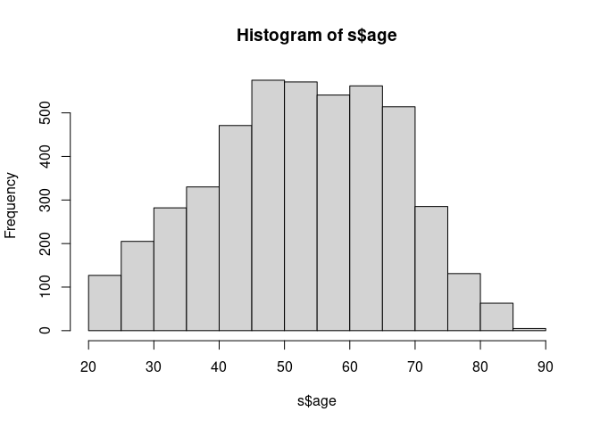

JESII Recode
================
Gento Kato
April 15, 2021

# Preparation

``` r
## Clean Up Space
rm(list=ls())

## Set Working Directory (Automatically) ##
require(rstudioapi); require(rprojroot)
if (rstudioapi::isAvailable()==TRUE) {
  setwd(dirname(rstudioapi::getActiveDocumentContext()$path)); 
} 
projdir <- find_root(has_file("thisishome.txt"))
cat(paste("Working Directory Set to:\n",projdir))
```

    ## Working Directory Set to:
    ##  /home/gentok/GoogleDrive/Projects/Indep_SocNet/IndepSocNet

``` r
setwd(projdir)

## Find Data Directory
### Leviathan (SPSS)
datadir_s <- "JES2.sav"

## Import Original Data
require(haven)

### SSJDA
ds <- read_sav(datadir_s, encoding="SHIFT_JIS")
colnames(ds) <- tolower(colnames(ds)) # lowercase

## All Parties
jimin="自民"; minshu="民主"; komei="公明"; shamin="社民"; kyosan="共産"
hoshushin="保守新"; jiyu="自由"; kokuminshin="国民新"; shakai="社会"; shinsei="新生"
minsha="民社"; sakigake="さきがけ"; shaminren="社民連"; nihonshin="日本新"; shinshin="新進"
sonota="その他"
allps <- c(jimin,shakai,komei,shinsei,kyosan,
           minsha,sakigake,shaminren,nihonshin,shinshin,
           minshu,shamin,hoshushin,jiyu,kokuminshin,
           sonota)
mutoha="無党派"
mikettei="未決定"
kiken="棄権"
shiranai="知らない"
mushozoku="無所属"
```

# Check Relevant Variables

## Leviathan (SPSS) Data

``` r
############
## Common ##
############

## Self
table(ds$citysize, useNA="always") # City Size
```

    ## 
    ##    1    2    3    4    5    6    7 <NA> 
    ##  359  267  263   27 1462  729  878    0

``` r
table(ds$sex, useNA="always") # Gender
```

    ## 
    ##    1    2 <NA> 
    ## 2064 1921    0

``` r
##########################
## Wave 5 HoC 1995 Post ##
##########################

## Response
table(ds$sangi95) 
```

    ## 
    ##    0    1 
    ## 1909 2076

``` r
## Self
table(ds$rawage2, useNA="always") # Age
```

    ## 
    ##   20   21   22   23   24   25   26   27   28   29   30   31   32   33   34   35   36   37   38   39   40   41   42 
    ##    1    3    8   21   16   13   20   20   21   22   20   30   21   21   35   26   20   38   22   31   32   47   38 
    ##   43   44   45   46   47   48   49   50   51   52   53   54   55   56   57   58   59   60   61   62   63   64   65 
    ##   46   50   54   59   51   56   38   47   47   56   43   55   46   45   58   37   50   51   60   50   40   53   53 
    ##   66   67   68   69   70   71   72   73   74   75   76   77   78   79   80   81   82   83   84   85 <NA> 
    ##   47   43   39   39   42   23   28   16   29   22   16    9   11    8    7   10    6    4    3    3 1909

``` r
table(ds$cabinet4, useNA="always") # PM Support
```

    ## 
    ##    1    2    3    4    5    6 <NA> 
    ##   49  898  837  181  106    5 1909

``` r
table(ds$ptysup5, useNA="always") # Party Support
```

    ## 
    ##    1    2    3    4    5    6    7    8    9 <NA> 
    ##  678  321  279   48   56   15  631   18   30 1909

``` r
table(ds$streng5, useNA="always") # Party Support Strength
```

    ## 
    ##    0    1    2    3    4 <NA> 
    ##  679  281 1088   24    4 1909

``` r
table(ds$strind, useNA="always") # Shijinashi Strength
```

    ## 
    ##    0    1    2    3    4    5 <NA> 
    ## 1445  197  137  257   34    6 1909

``` r
table(ds$rsnnopty, useNA="always") # Shijinashi Reason
```

    ## 
    ##    0    1    2    3    4    5 <NA> 
    ## 1445   63  385  108   57   18 1909

``` r
table(ds$ptylean5, useNA="always") # Party Leaners
```

    ## 
    ##    0    1    2    3    4    5    6    7    8    9 <NA> 
    ## 1397   61   66   26   26   17    4  359   68   52 1909

``` r
table(ds$votesan, useNA="always") # Voted
```

    ## 
    ##    1    2    4 <NA> 
    ## 1499  573    4 1909

``` r
table(ds$elvote95, useNA="always") # Vote Decision by Party (県選挙区)
```

    ## 
    ##    0    1    2    3    4    5    6    7    8    9   10 <NA> 
    ##  577  490  446  235   39  114   39   58    8   12   58 1909

``` r
table(ds$prvote95, useNA="always") # Vote Decision by Party (PR)
```

    ## 
    ##    0    1    2    3    4    5    6    7    8    9   10   11   12 <NA> 
    ##  577  475  244  432   99    6   66   41    6   44   13   19   54 1909

``` r
table(ds$polint2, useNA="always") # Political Interest
```

    ## 
    ##    1    2    3    4    5    6 <NA> 
    ##  504  763  604  174   27    4 1909

``` r
table(ds$resyr2, useNA="always") # Year of Residence
```

    ## 
    ##    1    2    3    4    5 <NA> 
    ##   47  301  198 1084  446 1909

``` r
table(ds$educ2, useNA="always") # Education
```

    ## 
    ##    1    2    3    4    5 <NA> 
    ##  506  964  270  299   37 1909

``` r
table(ds$empst2, useNA="always") # Occupation
```

    ## 
    ##    1    2    3    4    5    6    7    8 <NA> 
    ##  877  381   96    5  385  319    9    4 1909

``` r
table(ds$typres2, useNA="always") # Type of Home
```

    ## 
    ##    1    2    3    4    5    6    7    8    9 <NA> 
    ## 1580   94  116  111   86   75    5    3    6 1909

``` r
table(ds$incomf2, useNA="always") # Household Income
```

    ## 
    ##    1    2    3    4    5    6    7    8    9   10 <NA> 
    ##  101  286  358  270  246  140   61  100  343  171 1909

``` r
## Partner 1
table(ds$talk1, useNA="always") # Partner 1 (1=Yes)
```

    ## 
    ##    1    2 <NA> 
    ## 1490  586 1909

``` r
# table(, useNA="always") # Have Spouse (1=Yes)
table(ds$relatn1, useNA="always") # Relationship with P1
```

    ## 
    ##    0    1    2    3    4    5    6    7    8    9   10   11 <NA> 
    ##  586  849  130   18  241   19  197   15   14    4    2    1 1909

``` r
# table(, useNA="always") # Gender of P1
# table(, useNA="always") # Closeness of P1
table(ds$times1, useNA="always") # Pol. Discussion with P1
```

    ## 
    ##    0    1    2    3    4    5    6 <NA> 
    ##  586  159  621  553  139   12    6 1909

``` r
# table(, useNA="always") # Watch/Read News Together with P1
# table(, useNA="always") # Perceived Pol. Knowledge of P1
table(ds$votesan1, useNA="always") # Expected Vote Choice of P1
```

    ## 
    ##    0    1    2    3    4    5    6    7    8    9 <NA> 
    ##  586  332  248  119   19   52   19  155  507   39 1909

``` r
# table(, useNA="always") # Expected Koizumi Support of P1
# table(, useNA="always") # Similarity with P1
# table(, useNA="always") # Relative Social Status of P1

## Partner 2
table(ds$talk2, useNA="always") # Partner 2 (1=Yes)
```

    ## 
    ##    0    1    2    3 <NA> 
    ##  586  930  558    2 1909

``` r
# table(, useNA="always") # Have Spouse (1=Yes)
table(ds$relatn2, useNA="always") # Relationship with P2
```

    ## 
    ##    0    1    2    3    4    5    6    7    8    9   10   11 <NA> 
    ## 1146  111  204   50  299   56  168   21   13    4    2    2 1909

``` r
# table(, useNA="always") # Gender of P2
# table(, useNA="always") # Closeness of P2
table(ds$times2, useNA="always") # Pol. Discussion with P2
```

    ## 
    ##    0    1    2    3    4    5    6 <NA> 
    ## 1146   44  315  427  131   11    2 1909

``` r
# table(, useNA="always") # Watch/Read News Together with P2
# table(, useNA="always") # Perceived Pol. Knowledge of P2
table(ds$votesan2, useNA="always") # Expected Vote Choice of P2
```

    ## 
    ##    0    1    2    3    4    5    6    7    8    9 <NA> 
    ## 1146  181  122   51    8   22   10   39  483   14 1909

``` r
# table(, useNA="always") # Expected Koizumi Support of P2
# table(, useNA="always") # Similarity with P2
# table(, useNA="always") # Relative Social Status of P2

## Partner 3
table(ds$talk3, useNA="always") # Partner 3 (1=Yes)
```

    ## 
    ##    0    1    2 <NA> 
    ## 1146  514  416 1909

``` r
# table(, useNA="always") # Have Spouse (1=Yes)
table(ds$relatn3, useNA="always") # Relationship with P3
```

    ## 
    ##    0    1    2    3    4    5    6    7    8    9   10   11 <NA> 
    ## 1562   37   54   45  133   70  103   34   23    4    6    5 1909

``` r
# table(, useNA="always") # Gender of P3
# table(, useNA="always") # Closeness of P3
table(ds$times3, useNA="always") # Pol. Discussion with P3
```

    ## 
    ##    0    1    2    3    4    5    6 <NA> 
    ## 1562   22  153  245   77   12    5 1909

``` r
# table(, useNA="always") # Watch/Read News Together with P3
# table(, useNA="always") # Perceived Pol. Knowledge of P3
table(ds$votesan3, useNA="always") # Expected Vote Choice of P3
```

    ## 
    ##    0    1    2    3    4    5    6    7    8    9 <NA> 
    ## 1562   79   67   23    2   13    2   16  303    9 1909

``` r
# table(, useNA="always") # Expected Koizumi Support of P3
# table(, useNA="always") # Similarity with P3
# table(, useNA="always") # Relative Social Status of P3

## Acquaintance Between Partners
# table(, useNA="always") # (IF P1-P3 exist) All know each other 
# table(, useNA="always") # (IF P1-P3 exist) P1 and P2 Knows Each Other
# table(, useNA="always") # (IF P1-P3 exist) P1 and P3 Knows Each Other
# table(, useNA="always") # (IF P1-P3 exist) P2 and P3 Knows Each Other
# table(, useNA="always") # (IF P1-P3 exist) DK
# table(, useNA="always") # (IF P1-P3 exist) NA
# 
# table(, useNA="always") # (IF P1,P2 only) Relationship between P1 & P2

#########################
## Wave 6 & 7 HoR 1996 ##
#########################

## Response
table(ds$preele) # Pre
```

    ## 
    ##    0    1 
    ## 1836 2149

``` r
table(ds$pstele) # Post 
```

    ## 
    ##    0    1 
    ## 1686 2299

``` r
## Self
table(ds$rawage3, useNA="always") # Age
```

    ## 
    ##   21   22   23   24   25   26   27   28   29   30   31   32   33   34   35   36   37   38   39   40   41   42   43 
    ##    5   12   14   18   16   15   14   26   25   22   34   34   30   21   30   31   42   39   41   34   37   43   43 
    ##   44   45   46   47   48   49   50   51   52   53   54   55   56   57   58   59   60   61   62   63   64   65   66 
    ##   50   63   69   78   56   71   50   62   70   73   44   75   55   55   65   64   61   60   72   60   49   65   62 
    ##   67   68   69   70   71   72   73   74   75   76   77   78   79   80   81   82   83   84   85   86 <NA> 
    ##   74   61   48   59   42   35   33   27   30   27   21    9   15    8    9   13    6    7    2    5 1399

``` r
table(ds$cabinet5, useNA="always") # PM Support
```

    ## 
    ##    1    2    3    4    5    6    7 <NA> 
    ##   30  566  974  432   83   61    3 1836

``` r
table(ds$ptysup7, useNA="always") # Party Support
```

    ## 
    ##    1    2    3    4    5    6    7    8    9   10 <NA> 
    ##  923  276  168  182   92   17    4  571   26   40 1686

``` r
table(ds$streng7, useNA="always") # Party Support Strength
```

    ## 
    ##    0    1    2    3    4 <NA> 
    ##  637  276 1353   30    3 1686

``` r
table(ds$strind7, useNA="always") # Shijinashi Strength
```

    ## 
    ##    0    1    2    3    4    5 <NA> 
    ## 1728  183  119  228   39    2 1686

``` r
# table(ds$rsnnopt6, useNA="always") # Shijinashi Reason
table(ds$ptylean7, useNA="always") # Party Leaners
```

    ## 
    ##    0    1    2    3    4    5    6    8    9   10 <NA> 
    ## 1662   62   44   71   18   24    1  312   70   35 1686

``` r
table(ds$govote2, useNA="always") # Vote intention
```

    ## 
    ##    1    2    3    4    5    6 <NA> 
    ## 1487  471   83   39   68    1 1836

``` r
table(ds$ptycmit2, ds$pty6153, useNA="always") # Vote Decision by Party (県選挙区)
```

    ##       
    ##           0    1    2    3    4    5    6    7    8    9   11 <NA>
    ##   0     940  521  240   89   17   65   18    6    4    5   50    0
    ##   1      68    0    0    0    0    0    0    0    0    0    0    0
    ##   2      28    0    0    0    0    0    0    0    0    0    0    0
    ##   3      27    0    0    0    0    0    0    0    0    0    0    0
    ##   4      20    0    0    0    0    0    0    0    0    0    0    0
    ##   5      15    0    0    0    0    0    0    0    0    0    0    0
    ##   6       3    0    0    0    0    0    0    0    0    0    0    0
    ##   8       1    0    0    0    0    0    0    0    0    0    0    0
    ##   9      14    0    0    0    0    0    0    0    0    0    0    0
    ##   10     18    0    0    0    0    0    0    0    0    0    0    0
    ##   <NA>    0    0    0    0    0    0    0    0    0    0    0 1836

``` r
table(ds$ptywhich, useNA="always") # Vote Decision by Party (PR)
```

    ## 
    ##    0    1    2    3    4    5    6    7    8    9   10 <NA> 
    ##  191  592  272  203  108  101   19    4  519   90   50 1836

``` r
table(ds$polint3, useNA="always") # Political Interest (Post)
```

    ## 
    ##    1    2    3    4    5    6 <NA> 
    ##  397  857  828  195   20    2 1686

``` r
table(ds$resyr3, useNA="always") # Year of Residence
```

    ## 
    ##    1    2    3    4    5    6 <NA> 
    ##   43  339  284 1372  547    1 1399

``` r
table(ds$educ3, useNA="always") # Education
```

    ## 
    ##    1    2    3    4    5 <NA> 
    ##  632 1236  313  374   31 1399

``` r
table(ds$empst3, useNA="always") # Occupation
```

    ## 
    ##    1    2    3    4    5    6    7    8 <NA> 
    ## 1047  494   90    9  483  448    7    8 1399

``` r
table(ds$typres3, useNA="always") # Type of Home
```

    ## 
    ##    1    2    3    4    5    6    7    8    9 <NA> 
    ## 2040  120  104  124   91   84    4    7   12 1399

``` r
table(ds$incomf3, useNA="always") # Household Income
```

    ## 
    ##    1    2    3    4    5    6    7    8    9   10 <NA> 
    ##  122  340  415  380  256  169   71  139  439  255 1399

``` r
### Post-Election Voting Behavior
table(ds$elvote96, useNA="always") # Voted (Chose option 10)
```

    ## 
    ##    1    2    3    4    5    6    7    8    9   10   11   12 <NA> 
    ##  823  458  222   60  198   20   18   58   27  278    3  134 1686

``` r
table(ds$elvote96, useNA="always") # Vote Decision by Party (SMD)
```

    ## 
    ##    1    2    3    4    5    6    7    8    9   10   11   12 <NA> 
    ##  823  458  222   60  198   20   18   58   27  278    3  134 1686

``` r
table(ds$prvote96, useNA="always") # Vote Decision by Party (PR)
```

    ## 
    ##    0    1    2    3    4    5    6    7    8    9   10 <NA> 
    ##  415  753  448  283  109  210   16   18   24    7   16 1686

``` r
## Partner 1
table(ds$talk1_2, useNA="always") # Partner 1 (1=Yes)
```

    ## 
    ##    1    2 <NA> 
    ## 1536  763 1686

``` r
# table(, useNA="always") # Have Spouse (1=Yes)
table(ds$relat1_2, useNA="always") # Relationship with P1
```

    ## 
    ##    0    1    2    3    4    5    6    7    8    9   10   11 <NA> 
    ##  763  871  137   31  242   27    9   28  180    5    3    3 1686

``` r
# table(, useNA="always") # Gender of P1
# table(, useNA="always") # Closeness of P1
table(ds$times1_2, useNA="always") # Pol. Discussion with P1
```

    ## 
    ##    0    1    2    3    4    5    6 <NA> 
    ##  763  112  549  645  208   17    5 1686

``` r
# table(, useNA="always") # Watch/Read News Together with P1
table(ds$media1, useNA="always") # Discussion about Election News with P1
```

    ## 
    ##    0    1    2    3    4    5    6 <NA> 
    ##  763  285  788  315  121   22    5 1686

``` r
# table(, useNA="always") # Perceived Pol. Knowledge of P1
table(ds$vote96_1, useNA="always") # Expected Vote Choice of P1
```

    ## 
    ##    0    1    2    3    4    5    6    7    8    9   10 <NA> 
    ##  763  417  211   81   31   49    9   19   84  603   32 1686

``` r
# table(, useNA="always") # Expected Koizumi Support of P1
# table(, useNA="always") # Similarity with P1
# table(, useNA="always") # Relative Social Status of P1

## Partner 2
table(ds$talk2_2, useNA="always") # Partner 2 (1=Yes)
```

    ## 
    ##    0    1    2 <NA> 
    ##  763  944  592 1686

``` r
# table(, useNA="always") # Have Spouse (1=Yes)
table(ds$relat2_2, useNA="always") # Relationship with P2
```

    ## 
    ##    0    1    2    3    4    5    6    7    8    9   10   11 <NA> 
    ## 1355   82  216   72  223   46   31   73  193    6    1    1 1686

``` r
# table(, useNA="always") # Gender of P2
# table(, useNA="always") # Closeness of P2
table(ds$times2_2, useNA="always") # Pol. Discussion with P2
```

    ## 
    ##    0    1    2    3    4    5    6 <NA> 
    ## 1355   44  248  475  159   14    4 1686

``` r
# table(, useNA="always") # Watch/Read News Together with P2
table(ds$media2, useNA="always") # Discussion about Election News with P2
```

    ## 
    ##    0    1    2    3    4    5    6 <NA> 
    ## 1355  127  475  227   93   17    5 1686

``` r
# table(, useNA="always") # Perceived Pol. Knowledge of P2
table(ds$vote96_2, useNA="always") # Expected Vote Choice of P2
```

    ## 
    ##    0    1    2    3    4    5    6    7    8    9   10 <NA> 
    ## 1355  196  110   42   19   29    7    8   27  487   19 1686

``` r
# table(, useNA="always") # Expected Koizumi Support of P2
# table(, useNA="always") # Similarity with P2
# table(, useNA="always") # Relative Social Status of P2

## Partner 3
table(ds$talk3_2, useNA="always") # Partner 3 (1=Yes)
```

    ## 
    ##    0    1    2 <NA> 
    ## 1355  489  455 1686

``` r
# table(, useNA="always") # Have Spouse (1=Yes)
table(ds$relat3_2, useNA="always") # Relationship with P3
```

    ## 
    ##    0    1    2    3    4    5    6    7    8    9   10   11 <NA> 
    ## 1810   23   42   45   99   39   15   63  151    8    3    1 1686

``` r
# table(, useNA="always") # Gender of P3
# table(, useNA="always") # Closeness of P3
table(ds$times3_2, useNA="always") # Pol. Discussion with P3
```

    ## 
    ##    0    1    2    3    4    5    6 <NA> 
    ## 1810   20  118  244   99    5    3 1686

``` r
# table(, useNA="always") # Watch/Read News Together with P3
table(ds$media3, useNA="always") # Discussion about Election News with P1
```

    ## 
    ##    0    1    2    3    4    5    6 <NA> 
    ## 1810   55  246  136   44    5    3 1686

``` r
# table(, useNA="always") # Perceived Pol. Knowledge of P3
table(ds$vote96_3, useNA="always") # Expected Vote Choice of P3
```

    ## 
    ##    0    1    2    3    4    5    6    7    8    9   10 <NA> 
    ## 1810  102   57   21    7   12    1    3    7  268   11 1686

``` r
# table(, useNA="always") # Expected Koizumi Support of P3
# table(, useNA="always") # Similarity with P3
# table(, useNA="always") # Relative Social Status of P3

## Acquaintance Between Partners
table(ds$knowthre, useNA="always") # (IF P1-P3 exist) All know each other 
```

    ## 
    ##    0    1 <NA> 
    ## 2009  290 1686

``` r
table(ds$know1x2, useNA="always") # (IF P1-P3 exist) P1 and P2 Knows Each Other
```

    ## 
    ##    0    1 <NA> 
    ## 2212   87 1686

``` r
table(ds$know1x3, useNA="always") # (IF P1-P3 exist) P1 and P3 Knows Each Other
```

    ## 
    ##    0    1 <NA> 
    ## 2252   47 1686

``` r
table(ds$know2x3, useNA="always") # (IF P1-P3 exist) P2 and P3 Knows Each Other
```

    ## 
    ##    0    1 <NA> 
    ## 2267   32 1686

``` r
table(ds$knowdk, useNA="always") # (IF P1-P3 exist) DK
```

    ## 
    ##    0    1 <NA> 
    ## 2257   42 1686

``` r
table(ds$knowna, useNA="always") # (IF P1-P3 exist) NA
```

    ## 
    ##    0    1 <NA> 
    ## 2292    7 1686

``` r
table(ds$knowtwo, useNA="always") # (IF P1,P2 only) Relationship between P1 & P2
```

    ## 
    ##    0    1    2    3    4 <NA> 
    ## 1844  306  125   22    2 1686

# Create New Data

``` r
# Initiate New Leviathan (SPSS) Data Set
s <- data.frame(id = rep(seq(1,nrow(ds)),2), 
                year = rep(c(1995,1996), each=nrow(ds)))

## House of Representative Dummy
s$horelec <- ifelse(s$year%in%c(1996),1,0)

## Sampled Year
s$smpyear <- NA

## Fresh/Panel Sample dummies (NAs for invalid cases)
s$panel <- ifelse(ds$sangi95 == 1 & ds$preele == 1, 1, 0)
s$fresh <- 1 - s$panel
table(s$panel, s$year, useNA="always")
```

    ##       
    ##        1995 1996 <NA>
    ##   0    2534 2534    0
    ##   1    1451 1451    0
    ##   <NA>    0    0    0

``` r
table(s$fresh, s$year, useNA="always")
```

    ##       
    ##        1995 1996 <NA>
    ##   0    1451 1451    0
    ##   1    2534 2534    0
    ##   <NA>    0    0    0

``` r
## Unit Response Dummies
s$answered <- c(ds$sangi95, ds$preele)
table(s$answered, s$year, useNA="always")
```

    ##       
    ##        1995 1996 <NA>
    ##   0    1909 1836    0
    ##   1    2076 2149    0
    ##   <NA>    0    0    0

``` r
## City Size 
table(ds$citysize, useNA="always") # City Size
```

    ## 
    ##    1    2    3    4    5    6    7 <NA> 
    ##  359  267  263   27 1462  729  878    0

``` r
# 1 = Tokyo, Osaka
# 2 = Yokohama, Nagoya, Kyoto, Kita-Kyusyu
# 3 = Sapporo, Sendai, Kawasaki, Kobe, Hiroshima, Fukuoka
# 4 = Chiba
# 5 = Cities MT 200T
# 6 = MT 100T
# 7 = LT 100T
# 8 = Towns and Villages

### Big Cities in Three Major Urban Area (Tokyo, Osaka, Yokohama, Nagoya, Kyoto, Kawasaki, Kobe, Chiba)
s$citysize_big3 <- ifelse(
  ds$citysize%in%c(1,4)|(ds$citysize==2&ds$prefectr%in%c(14,23,26))|(ds$citysize==3&ds$prefectr%in%c(14,28)),
  1,0
)
table(s$citysize_big3[s$year==1995])
```

    ## 
    ##    0    1 
    ## 3267  718

``` r
### Big Cities in Other Area (Kita-Kyusyu, Sapporo, Sendai, Hiroshima, Fukuoka)
s$citysize_bigelse <- ifelse(
  (ds$citysize==2&!ds$prefectr%in%c(14,23,26))|(ds$citysize==3&!ds$prefectr%in%c(14,28)),
  1,0
)
table(s$citysize_bigelse[s$year==1995])
```

    ## 
    ##    0    1 
    ## 3787  198

``` r
### All Big Cities
s$citysize_big <- s$citysize_big3 + s$citysize_bigelse
table(s$citysize_big[s$year==1995])
```

    ## 
    ##    0    1 
    ## 3069  916

``` r
### Middle Size Cities (MT 200T)
s$citysize_mid <- ifelse(ds$citysize==5,1,0)
table(s$citysize_mid[s$year==1995])
```

    ## 
    ##    0    1 
    ## 2523 1462

``` r
### Small Cities (LT 200T)
s$citysize_sml <- ifelse(ds$citysize%in%c(6),1,0)
table(s$citysize_sml[s$year==1995])
```

    ## 
    ##    0    1 
    ## 3256  729

``` r
### Not Cities (Villages/Towns)
s$citysize_not <- ifelse(ds$citysize%in%c(7),1,0)
table(s$citysize_not[s$year==1995])
```

    ## 
    ##    0    1 
    ## 3107  878

``` r
## All City Sizes
s$citysize <- ifelse(s$citysize_big==1,1,
                     ifelse(s$citysize_mid==1,2/3,
                            ifelse(s$citysize_sml==1,1/3,0)))

## Gender (Female)
s$fem <- ds$sex - 1
table(s$fem[s$year==1995])
```

    ## 
    ##    0    1 
    ## 2064 1921

``` r
## Age (To Become in the Given Year)
table(ds$rawage2, useNA="always") # Born Year
```

    ## 
    ##   20   21   22   23   24   25   26   27   28   29   30   31   32   33   34   35   36   37   38   39   40   41   42 
    ##    1    3    8   21   16   13   20   20   21   22   20   30   21   21   35   26   20   38   22   31   32   47   38 
    ##   43   44   45   46   47   48   49   50   51   52   53   54   55   56   57   58   59   60   61   62   63   64   65 
    ##   46   50   54   59   51   56   38   47   47   56   43   55   46   45   58   37   50   51   60   50   40   53   53 
    ##   66   67   68   69   70   71   72   73   74   75   76   77   78   79   80   81   82   83   84   85 <NA> 
    ##   47   43   39   39   42   23   28   16   29   22   16    9   11    8    7   10    6    4    3    3 1909

``` r
table(ds$rawage3, useNA="always") # Born Year
```

    ## 
    ##   21   22   23   24   25   26   27   28   29   30   31   32   33   34   35   36   37   38   39   40   41   42   43 
    ##    5   12   14   18   16   15   14   26   25   22   34   34   30   21   30   31   42   39   41   34   37   43   43 
    ##   44   45   46   47   48   49   50   51   52   53   54   55   56   57   58   59   60   61   62   63   64   65   66 
    ##   50   63   69   78   56   71   50   62   70   73   44   75   55   55   65   64   61   60   72   60   49   65   62 
    ##   67   68   69   70   71   72   73   74   75   76   77   78   79   80   81   82   83   84   85   86 <NA> 
    ##   74   61   48   59   42   35   33   27   30   27   21    9   15    8    9   13    6    7    2    5 1399

``` r
s$age <- c(ds$rawage2, ds$rawage3)
hist(s$age)
```

<!-- -->

``` r
## PM Support
table(ds$cabinet4, useNA="always") # PM Support
```

    ## 
    ##    1    2    3    4    5    6 <NA> 
    ##   49  898  837  181  106    5 1909

``` r
table(ds$cabinet5, useNA="always") # PM Support
```

    ## 
    ##    1    2    3    4    5    6    7 <NA> 
    ##   30  566  974  432   83   61    3 1836

``` r
s$pmsup <- NA
s$pmsup[s$year==1995] <- ifelse(ds$cabinet4>=5,NA,(4-ds$cabinet4)/3)
s$pmsup[s$year==1996] <- ifelse(ds$cabinet5>=6,NA,(5-ds$cabinet5)/4)
table(s$pmsup, s$year, useNA="always")
```

    ##                    
    ##                     1995 1996 <NA>
    ##   0                  181   83    0
    ##   0.25                 0  432    0
    ##   0.333333333333333  837    0    0
    ##   0.5                  0  974    0
    ##   0.666666666666667  898    0    0
    ##   0.75                 0  566    0
    ##   1                   49   30    0
    ##   <NA>              2020 1900    0

``` r
## Party Support

### Supporting Party
s$psup <- NA
s$psup[c(ds$ptysup5, ds$ptysup7)%in%1] <- jimin 
s$psup[c(ds$ptysup5, ds$ptysup7)%in%2] <- shinshin 
s$psup[c(ds$ptysup5, ds$ptysup7)%in%5] <- kyosan 
s$psup[c(ds$ptysup5, rep(NA,nrow(ds)))%in%3] <- shakai 
s$psup[c(ds$ptysup5, rep(NA,nrow(ds)))%in%4] <- sakigake 
s$psup[c(ds$ptysup5, rep(NA,nrow(ds)))%in%6] <- sonota 
s$psup[c(ds$ptysup5, rep(NA,nrow(ds)))%in%7] <- mutoha 
s$psup[c(rep(NA,nrow(ds)),ds$ptysup7)%in%3] <- minshu 
s$psup[c(rep(NA,nrow(ds)),ds$ptysup7)%in%4] <- shamin 
s$psup[c(rep(NA,nrow(ds)),ds$ptysup7)%in%6] <- sakigake 
s$psup[c(rep(NA,nrow(ds)),ds$ptysup7)%in%7] <- sonota
s$psup[c(rep(NA,nrow(ds)),ds$ptysup7)%in%8] <- mutoha 
s$psup <- factor(s$psup, levels=c(allps,mutoha))
table(s$psup, s$year, useNA="always")
```

    ##           
    ##            1995 1996 <NA>
    ##   自民      678  923    0
    ##   社会      279    0    0
    ##   公明        0    0    0
    ##   新生        0    0    0
    ##   共産       56   92    0
    ##   民社        0    0    0
    ##   さきがけ   48   17    0
    ##   社民連      0    0    0
    ##   日本新      0    0    0
    ##   新進      321  276    0
    ##   民主        0  168    0
    ##   社民        0  182    0
    ##   保守新      0    0    0
    ##   自由        0    0    0
    ##   国民新      0    0    0
    ##   その他     15    4    0
    ##   無党派    631  571    0
    ##   <NA>     1957 1752    0

``` r
### Party Leaning (Leaning Only)
s$plean <- ifelse(c(ds$ptylean5, ds$ptylean7)%in%1, jimin, 
                  ifelse(c(ds$ptylean5, ds$ptylean7)%in%2, shinshin, 
                         ifelse(c(ds$ptylean5, rep(NA,nrow(ds)))%in%3, shakai, 
                                ifelse(c(ds$ptylean5, rep(NA,nrow(ds)))%in%4, sakigake, 
                                       ifelse(c(ds$ptylean5, ds$ptylean7)%in%5, kyosan, 
                                              ifelse(c(ds$ptylean5, rep(NA,nrow(ds)))%in%c(6), sonota, 
                                                     ifelse(c(ds$ptylean5, rep(NA,nrow(ds)))%in%7, mutoha, 
                                                            NA)))))))
s$plean[c(rep(NA,nrow(ds)),ds$ptylean7)%in%3] <- minshu 
s$plean[c(rep(NA,nrow(ds)),ds$ptylean7)%in%4] <- shamin 
s$plean[c(rep(NA,nrow(ds)),ds$ptylean7)%in%6] <- sakigake 
s$plean[c(rep(NA,nrow(ds)),ds$ptylean7)%in%7] <- sonota
s$plean[c(rep(NA,nrow(ds)),ds$ptylean7)%in%8] <- mutoha 
s$plean <- factor(s$plean, levels=c(allps,mutoha))
table(s$plean, s$year, useNA="always")
```

    ##           
    ##            1995 1996 <NA>
    ##   自民       61   62    0
    ##   社会       26    0    0
    ##   公明        0    0    0
    ##   新生        0    0    0
    ##   共産       17   24    0
    ##   民社        0    0    0
    ##   さきがけ   26    1    0
    ##   社民連      0    0    0
    ##   日本新      0    0    0
    ##   新進       66   44    0
    ##   民主        0   71    0
    ##   社民        0   18    0
    ##   保守新      0    0    0
    ##   自由        0    0    0
    ##   国民新      0    0    0
    ##   その他      4    0    0
    ##   無党派    359  312    0
    ##   <NA>     3426 3453    0

``` r
### Party Support plus Leaning
s$psuplean <- s$psup
# Replace with plean if psup==mutoha
s$psuplean[!s$psup%in%c(allps)] <- 
  s$plean[!s$psup%in%c(allps)]
# Define as mutoha if psup==mutoha and plean is NA
s$psuplean[which(s$psup==mutoha & is.na(s$plean))] <- mutoha
table(s$psuplean, s$year, useNA="always")
```

    ##           
    ##            1995 1996 <NA>
    ##   自民      739  985    0
    ##   社会      305    0    0
    ##   公明        0    0    0
    ##   新生        0    0    0
    ##   共産       73  116    0
    ##   民社        0    0    0
    ##   さきがけ   74   18    0
    ##   社民連      0    0    0
    ##   日本新      0    0    0
    ##   新進      387  320    0
    ##   民主        0  239    0
    ##   社民        0  200    0
    ##   保守新      0    0    0
    ##   自由        0    0    0
    ##   国民新      0    0    0
    ##   その他     19    4    0
    ##   無党派    450  385    0
    ##   <NA>     1938 1718    0

``` r
### Party Support Strength
s$pstr <- NA
s$pstr[s$psuplean%in%mutoha] <- 0
s$pstr[s$plean%in%c(allps)] <- 1
s$pstr[s$psup%in%c(allps)] <- 2
s$pstr[s$pstr%in%2 & c(ds$streng5,ds$streng7)%in%1] <- 3
table(s$pstr, s$year, useNA="always")
```

    ##       
    ##        1995 1996 <NA>
    ##   0     450  385    0
    ##   1     200  220    0
    ##   2    1116 1386    0
    ##   3     281  276    0
    ##   <NA> 1938 1718    0

``` r
## Participation intention # 1 & 2 intend to vote
table(ds$govote2, useNA="always") # Vote Intention (96)
```

    ## 
    ##    1    2    3    4    5    6 <NA> 
    ## 1487  471   83   39   68    1 1836

``` r
s$voteint <- ifelse(c(rep(NA,nrow(ds)),ds$govote2)%in%1,2,
                    ifelse(c(rep(NA,nrow(ds)),ds$govote2)%in%2,1,
                           ifelse(c(rep(NA,nrow(ds)),ds$govote2)%in%c(3,4,5),0,NA)))
table(s$voteint, s$year, useNA="always")
```

    ##       
    ##        1995 1996 <NA>
    ##   0       0  190    0
    ##   1       0  471    0
    ##   2       0 1487    0
    ##   <NA> 3985 1837    0

``` r
## Participation 
table(ds$votesan, useNA="always") # 1 = Voted, 2=Not
```

    ## 
    ##    1    2    4 <NA> 
    ## 1499  573    4 1909

``` r
table(ds$elvote96, useNA="always") # 1-9 Voted 10 Abstained, 11-12 DK/NA
```

    ## 
    ##    1    2    3    4    5    6    7    8    9   10   11   12 <NA> 
    ##  823  458  222   60  198   20   18   58   27  278    3  134 1686

``` r
s$voted <- NA
s$voted[c(ds$votesan,rep(NA,nrow(ds)))%in%1] <- 1
s$voted[c(ds$votesan,rep(NA,nrow(ds)))%in%2] <- 0
s$voted[c(rep(NA,nrow(ds)),ds$elvote96)%in%c(1:9)] <- 1
s$voted[c(rep(NA,nrow(ds)),ds$elvote96)%in%10] <- 0
table(s$voted, s$year, useNA="always") 
```

    ##       
    ##        1995 1996 <NA>
    ##   0     573  278    0
    ##   1    1499 1884    0
    ##   <NA> 1913 1823    0

``` r
## Vote Decision Intention

### Single/Multiple Member District
dspvoteintMD96 <- ifelse(ds$ptycmit2%in%c(1:6),ds$ptycmit2,
                         ifelse(ds$pty6153%in%c(1:6),ds$pty6153,NA))
dspvoteintMD96[ds$ptycmit2%in%8] <- 8
dspvoteintMD96[ds$pty6153%in%c(7,8,9)] <- 7
dspvoteintMD96[ds$pty6153%in%11] <- 8
dspvoteintMD96[s$voteint[s$year==1996]==0] <- 9
dspvoteintMD96[ds$govote2%in%5|ds$votcmit2%in%c(3,4)|ds$ptycmit2%in%9|ds$can6153%in%9] <- 10
table(dspvoteintMD96)
```

    ## dspvoteintMD96
    ##   1   2   3   4   5   6   7   8   9  10 
    ## 589 268 116  37  80  21  15  51 122 802

``` r
s$pvoteintMD <- NA
s$pvoteintMD[c(rep(NA, nrow(ds)), dspvoteintMD96)%in%1] <- jimin 
s$pvoteintMD[c(rep(NA, nrow(ds)), dspvoteintMD96)%in%2] <- shinshin 
s$pvoteintMD[c(rep(NA, nrow(ds)), dspvoteintMD96)%in%5] <- kyosan 
# s$pvoteintMD[c(rep(NA, nrow(ds)), rep(NA,nrow(ds)))%in%3] <- shakai 
# s$pvoteintMD[c(rep(NA, nrow(ds)), rep(NA,nrow(ds)))%in%4] <- sakigake 
# s$pvoteintMD[c(rep(NA, nrow(ds)), rep(NA,nrow(ds)))%in%6] <- sonota 
# s$pvoteintMD[c(rep(NA, nrow(ds)), rep(NA,nrow(ds)))%in%7] <- mushozoku 
s$pvoteintMD[c(rep(NA,nrow(ds)),dspvoteintMD96)%in%3] <- minshu 
s$pvoteintMD[c(rep(NA,nrow(ds)),dspvoteintMD96)%in%4] <- shamin 
s$pvoteintMD[c(rep(NA,nrow(ds)),dspvoteintMD96)%in%6] <- sakigake 
s$pvoteintMD[c(rep(NA,nrow(ds)),dspvoteintMD96)%in%7] <- sonota
s$pvoteintMD[c(rep(NA,nrow(ds)),dspvoteintMD96)%in%8] <- mushozoku 
s$pvoteintMD[c(rep(NA,nrow(ds)),dspvoteintMD96)%in%9] <- kiken 
s$pvoteintMD[c(rep(NA,nrow(ds)),dspvoteintMD96)%in%10] <- mikettei 
s$pvoteintMD <- factor(s$pvoteintMD, levels=c(allps,mushozoku,kiken,mikettei))
table(s$pvoteintMD, s$year, useNA="always")
```

    ##           
    ##            1995 1996 <NA>
    ##   自民        0  589    0
    ##   社会        0    0    0
    ##   公明        0    0    0
    ##   新生        0    0    0
    ##   共産        0   80    0
    ##   民社        0    0    0
    ##   さきがけ    0   21    0
    ##   社民連      0    0    0
    ##   日本新      0    0    0
    ##   新進        0  268    0
    ##   民主        0  116    0
    ##   社民        0   37    0
    ##   保守新      0    0    0
    ##   自由        0    0    0
    ##   国民新      0    0    0
    ##   その他      0   15    0
    ##   無所属      0   51    0
    ##   棄権        0  122    0
    ##   未決定      0  802    0
    ##   <NA>     3985 1884    0

``` r
### Proportional Representation
s$pvoteintPR <- NA
s$pvoteintPR[c(rep(NA, nrow(ds)), ds$ptywhich)%in%1] <- jimin 
s$pvoteintPR[c(rep(NA, nrow(ds)), ds$ptywhich)%in%2] <- shinshin 
s$pvoteintPR[c(rep(NA, nrow(ds)), ds$ptywhich)%in%5] <- kyosan 
# s$pvoteintPR[c(rep(NA, nrow(ds)), rep(NA,nrow(ds)))%in%3] <- shakai 
# s$pvoteintPR[c(rep(NA, nrow(ds)), rep(NA,nrow(ds)))%in%4] <- sakigake 
# s$pvoteintPR[c(rep(NA, nrow(ds)), rep(NA,nrow(ds)))%in%6] <- sonota 
s$pvoteintPR[c(rep(NA,nrow(ds)),ds$ptywhich)%in%3] <- minshu 
s$pvoteintPR[c(rep(NA,nrow(ds)),ds$ptywhich)%in%4] <- shamin 
s$pvoteintPR[c(rep(NA,nrow(ds)),ds$ptywhich)%in%6] <- sakigake 
s$pvoteintPR[c(rep(NA,nrow(ds)),ds$ptywhich)%in%7] <- sonota
s$pvoteintPR[c(rep(NA,nrow(ds)),ds$ptywhich)%in%c(8,9)] <- mikettei 
s$pvoteintPR[s$voteint%in%0] <- kiken 
s$pvoteintPR[c(rep(NA,nrow(ds)),ds$govote2)%in%5] <- mikettei 
s$pvoteintPR <- factor(s$pvoteintPR, levels=c(allps,kiken,mikettei))
table(s$pvoteintPR, s$year, useNA="always")
```

    ##           
    ##            1995 1996 <NA>
    ##   自民        0  592    0
    ##   社会        0    0    0
    ##   公明        0    0    0
    ##   新生        0    0    0
    ##   共産        0  101    0
    ##   民社        0    0    0
    ##   さきがけ    0   19    0
    ##   社民連      0    0    0
    ##   日本新      0    0    0
    ##   新進        0  272    0
    ##   民主        0  203    0
    ##   社民        0  108    0
    ##   保守新      0    0    0
    ##   自由        0    0    0
    ##   国民新      0    0    0
    ##   その他      0    4    0
    ##   棄権        0  122    0
    ##   未決定      0  677    0
    ##   <NA>     3985 1887    0

``` r
## Vote Decision (Post Election)

### Single/Multiple Member District
s$pvotedMD <- NA
s$pvotedMD[c(ds$elvote95, ds$elvote96)%in%1] <- jimin 
s$pvotedMD[c(ds$elvote95, ds$elvote96)%in%2] <- shinshin 
s$pvotedMD[c(ds$elvote95, ds$elvote96)%in%5] <- kyosan 
s$pvotedMD[c(ds$elvote95, rep(NA,nrow(ds)))%in%3] <- shakai
s$pvotedMD[c(ds$elvote95, rep(NA,nrow(ds)))%in%4] <- sakigake
s$pvotedMD[c(ds$elvote95, rep(NA,nrow(ds)))%in%6] <- sonota
s$pvotedMD[c(ds$elvote95, rep(NA,nrow(ds)))%in%7] <- mushozoku
s$pvotedMD[c(rep(NA,nrow(ds)),ds$elvote96)%in%3] <- minshu 
s$pvotedMD[c(rep(NA,nrow(ds)),ds$elvote96)%in%4] <- shamin 
s$pvotedMD[c(rep(NA,nrow(ds)),ds$elvote96)%in%6] <- sakigake 
s$pvotedMD[c(rep(NA,nrow(ds)),ds$elvote96)%in%7] <- sonota
s$pvotedMD[c(rep(NA,nrow(ds)),ds$elvote96)%in%8] <- mushozoku 
s$pvotedMD[s$voted%in%0] <- kiken
s$pvotedMD <- factor(s$pvotedMD, levels=c(allps,mushozoku,kiken))
table(s$pvotedMD, s$year, useNA="always")
```

    ##           
    ##            1995 1996 <NA>
    ##   自民      490  823    0
    ##   社会      235    0    0
    ##   公明        0    0    0
    ##   新生        0    0    0
    ##   共産      114  198    0
    ##   民社        0    0    0
    ##   さきがけ   39   20    0
    ##   社民連      0    0    0
    ##   日本新      0    0    0
    ##   新進      446  458    0
    ##   民主        0  222    0
    ##   社民        0   60    0
    ##   保守新      0    0    0
    ##   自由        0    0    0
    ##   国民新      0    0    0
    ##   その他     39   18    0
    ##   無所属     58   58    0
    ##   棄権      573  278    0
    ##   <NA>     1991 1850    0

``` r
### Proportional Representation
s$pvotedPR <- NA
s$pvotedPR[c(ds$prvote95, ds$prvote96)%in%1] <- jimin 
s$pvotedPR[c(ds$prvote95, ds$prvote96)%in%2] <- shinshin 
s$pvotedPR[c(ds$prvote95, ds$prvote96)%in%5] <- kyosan 
s$pvotedPR[c(ds$prvote95, rep(NA,nrow(ds)))%in%3] <- shakai
s$pvotedPR[c(ds$prvote95, rep(NA,nrow(ds)))%in%4] <- sakigake
s$pvotedPR[c(ds$prvote95, rep(NA,nrow(ds)))%in%c(6,7,8,9)] <- sonota
s$pvotedPR[c(rep(NA,nrow(ds)),ds$prvote96)%in%3] <- minshu 
s$pvotedPR[c(rep(NA,nrow(ds)),ds$prvote96)%in%4] <- shamin 
s$pvotedPR[c(rep(NA,nrow(ds)),ds$prvote96)%in%6] <- sakigake 
s$pvotedPR[c(rep(NA,nrow(ds)),ds$prvote96)%in%7] <- sonota
s$pvotedPR[s$voted%in%0] <- kiken
s$pvotedPR <- factor(s$pvotedPR, levels=c(allps,kiken))
table(s$pvotedPR, s$year, useNA="always")
```

    ##           
    ##            1995 1996 <NA>
    ##   自民      475  753    0
    ##   社会      432    0    0
    ##   公明        0    0    0
    ##   新生        0    0    0
    ##   共産        6  210    0
    ##   民社        0    0    0
    ##   さきがけ   99   16    0
    ##   社民連      0    0    0
    ##   日本新      0    0    0
    ##   新進      244  448    0
    ##   民主        0  283    0
    ##   社民        0  109    0
    ##   保守新      0    0    0
    ##   自由        0    0    0
    ##   国民新      0    0    0
    ##   その他    157   18    0
    ##   棄権      573  278    0
    ##   <NA>     1999 1870    0

``` r
## Political Interest
s$polint <- ifelse(c(ds$polint2,ds$polint3)>=5,NA,
                   (4 - c(ds$polint2,ds$polint3))/3)
table(s$polint, s$year, useNA="always")
```

    ##                    
    ##                     1995 1996 <NA>
    ##   0                  174  195    0
    ##   0.333333333333333  604  828    0
    ##   0.666666666666667  763  857    0
    ##   1                  504  397    0
    ##   <NA>              1940 1708    0

``` r
## Knowledge (Not assigned)
s$kn <- NA

## Years of Residence 1:<=3yrs;2:4-9yrs;3:10-14yrs;4:>=15yrs;5:Since born
table(ds$resyr2, useNA="always") # Year of Residence
```

    ## 
    ##    1    2    3    4    5 <NA> 
    ##   47  301  198 1084  446 1909

``` r
table(ds$resyr3, useNA="always") # Year of Residence
```

    ## 
    ##    1    2    3    4    5    6 <NA> 
    ##   43  339  284 1372  547    1 1399

``` r
s$residyr <- ifelse(c(ds$resyr2,ds$resyr3)>5,NA,
                    (c(ds$resyr2,ds$resyr3)-1)/4)
table(s$residyr, s$year, useNA="always")
```

    ##       
    ##        1995 1996 <NA>
    ##   0      47   43    0
    ##   0.25  301  339    0
    ##   0.5   198  284    0
    ##   0.75 1084 1372    0
    ##   1     446  547    0
    ##   <NA> 1909 1400    0

``` r
table(s$residyr[s$answered==1], s$year[s$answered==1], useNA="always")
```

    ##       
    ##        1995 1996 <NA>
    ##   0      47   27    0
    ##   0.25  301  268    0
    ##   0.5   198  237    0
    ##   0.75 1084 1141    0
    ##   1     446  476    0
    ##   <NA>    0    0    0

``` r
## Education 1:<=JHS;2:HS;3:Junior College/Higher Techinical;4:Univ/Grad School
table(ds$educ2, useNA="always") # Education
```

    ## 
    ##    1    2    3    4    5 <NA> 
    ##  506  964  270  299   37 1909

``` r
table(ds$educ3, useNA="always") # Education
```

    ## 
    ##    1    2    3    4    5 <NA> 
    ##  632 1236  313  374   31 1399

``` r
s$edu <- ifelse(c(ds$educ2,ds$educ3)==5,NA,
                (c(ds$educ2,ds$educ3)-1)/3)
table(s$edu, s$year, useNA="always")
```

    ##                    
    ##                     1995 1996 <NA>
    ##   0                  506  632    0
    ##   0.333333333333333  964 1236    0
    ##   0.666666666666667  270  313    0
    ##   1                  299  374    0
    ##   <NA>              1946 1430    0

``` r
table(s$edu[s$answered==1], s$year[s$answered==1], useNA="always")
```

    ##                    
    ##                     1995 1996 <NA>
    ##   0                  506  537    0
    ##   0.333333333333333  964 1021    0
    ##   0.666666666666667  270  267    0
    ##   1                  299  306    0
    ##   <NA>                37   18    0

``` r
## Occupation 
## 1:Employed;2:Self-employed;3:Family-business;4:Student;5:Housewife;6:Unemployed;7:Other
table(ds$empst2, useNA="always") # Occupation
```

    ## 
    ##    1    2    3    4    5    6    7    8 <NA> 
    ##  877  381   96    5  385  319    9    4 1909

``` r
table(ds$empst3, useNA="always") # Occupation
```

    ## 
    ##    1    2    3    4    5    6    7    8 <NA> 
    ## 1047  494   90    9  483  448    7    8 1399

``` r
s$employed <- ifelse(c(ds$empst2,ds$empst3)%in%c(1,2,3),1,
                     ifelse(c(ds$empst2,ds$empst3)%in%c(4,5,6),0,NA))
table(s$employed, s$year, useNA="always")
```

    ##       
    ##        1995 1996 <NA>
    ##   0     709  940    0
    ##   1    1354 1631    0
    ##   <NA> 1922 1414    0

``` r
table(s$employed[s$answered==1], s$year[s$answered==1], useNA="always")
```

    ##       
    ##        1995 1996 <NA>
    ##   0     709  815    0
    ##   1    1354 1326    0
    ##   <NA>   13    8    0

``` r
## Type of Home 
## 1:Private Home Owned; 2:COndominium owned; 3:Private Home Rent;
## 4:Private Apartment Rent; 5: Public Apartment Rent; 6:Company Apartment
## 7: Dormitory/Room Rent; 8: Others
table(ds$typres2, useNA="always") # Type of Home
```

    ## 
    ##    1    2    3    4    5    6    7    8    9 <NA> 
    ## 1580   94  116  111   86   75    5    3    6 1909

``` r
table(ds$typres3, useNA="always") # Type of Home
```

    ## 
    ##    1    2    3    4    5    6    7    8    9 <NA> 
    ## 2040  120  104  124   91   84    4    7   12 1399

``` r
s$ownhome <- ifelse(c(ds$typres2,ds$typres3)%in%c(1,2),1,
                    ifelse(c(ds$typres2,ds$typres3)%in%c(3,4,5,6,7),0,NA))
table(s$ownhome, s$year, useNA="always")
```

    ##       
    ##        1995 1996 <NA>
    ##   0     393  407    0
    ##   1    1674 2160    0
    ##   <NA> 1918 1418    0

``` r
table(s$ownhome[s$answered==1], s$year[s$answered==1], useNA="always")
```

    ##       
    ##        1995 1996 <NA>
    ##   0     393  332    0
    ##   1    1674 1801    0
    ##   <NA>    9   16    0

``` r
s$privatehome <- ifelse(c(ds$typres2,ds$typres3)%in%c(1,3),1,
                        ifelse(c(ds$typres2,ds$typres3)%in%c(2,4,5,6,7),0,NA))
table(s$privatehome, s$year, useNA="always")
```

    ##       
    ##        1995 1996 <NA>
    ##   0     371  423    0
    ##   1    1696 2144    0
    ##   <NA> 1918 1418    0

``` r
table(s$privatehome[s$answered==1], s$year[s$answered==1], useNA="always")
```

    ##       
    ##        1995 1996 <NA>
    ##   0     371  345    0
    ##   1    1696 1788    0
    ##   <NA>    9   16    0

``` r
## Household Income
## 1:<=200;2:200-400;3:400-600;4:600-800;5:800-1000;6:1000-1200;7:1200-1400;8:1400-2000;9>=2000
table(ds$incomf2, useNA="always") # Household Income (12 cat)
```

    ## 
    ##    1    2    3    4    5    6    7    8    9   10 <NA> 
    ##  101  286  358  270  246  140   61  100  343  171 1909

``` r
table(ds$incomf3, useNA="always") # Household Income (9 cat)
```

    ## 
    ##    1    2    3    4    5    6    7    8    9   10 <NA> 
    ##  122  340  415  380  256  169   71  139  439  255 1399

``` r
s$income <- ifelse(c(ds$incomf2,ds$incomf3)>=9,NA,
                   (c(ds$incomf2,ds$incomf3)-1)/7)
table(s$income, s$year, useNA="always")
```

    ##                    
    ##                     1995 1996 <NA>
    ##   0                  101  122    0
    ##   0.142857142857143  286  340    0
    ##   0.285714285714286  358  415    0
    ##   0.428571428571429  270  380    0
    ##   0.571428571428571  246  256    0
    ##   0.714285714285714  140  169    0
    ##   0.857142857142857   61   71    0
    ##   1                  100  139    0
    ##   <NA>              2423 2093    0

``` r
table(s$income[s$answered==1], s$year[s$answered==1], useNA="always")
```

    ##                    
    ##                     1995 1996 <NA>
    ##   0                  101   98    0
    ##   0.142857142857143  286  284    0
    ##   0.285714285714286  358  339    0
    ##   0.428571428571429  270  317    0
    ##   0.571428571428571  246  222    0
    ##   0.714285714285714  140  136    0
    ##   0.857142857142857   61   65    0
    ##   1                  100  119    0
    ##   <NA>               514  569    0

``` r
## Network Variables ##

## Partner 1
table(ds$talk1, useNA="always") # Partner 1 (1=Yes)
```

    ## 
    ##    1    2 <NA> 
    ## 1490  586 1909

``` r
table(ds$talk1_2, useNA="always") # Partner 1 (1=Yes)
```

    ## 
    ##    1    2 <NA> 
    ## 1536  763 1686

``` r
s$net.1 <- ifelse(c(ds$talk1,ds$talk1_2)%in%1,1,0)
table(s$net.1, s$year, useNA="always")
```

    ##       
    ##        1995 1996 <NA>
    ##   0    2495 2449    0
    ##   1    1490 1536    0
    ##   <NA>    0    0    0

``` r
table(s$net.1[s$answered==1], s$year[s$answered==1], useNA="always")
```

    ##       
    ##        1995 1996 <NA>
    ##   0     586  903    0
    ##   1    1490 1246    0
    ##   <NA>    0    0    0

``` r
table(ds$relatn1, useNA="always") # Relationship with P1
```

    ## 
    ##    0    1    2    3    4    5    6    7    8    9   10   11 <NA> 
    ##  586  849  130   18  241   19  197   15   14    4    2    1 1909

``` r
table(ds$relat1_2, useNA="always") # Relationship with P1
```

    ## 
    ##    0    1    2    3    4    5    6    7    8    9   10   11 <NA> 
    ##  763  871  137   31  242   27    9   28  180    5    3    3 1686

``` r
# 1=spouse, 2=family, 3=relative, 4=coworker, 5=leisure/activity, 7=neighbor, 8=friend, 9=other
s$netfa.1 <- ifelse(c(ds$relatn1,ds$relat1_2)%in%c(1,2,3),1,0)
s$netwk.1 <- ifelse(c(ds$relatn1,rep(NA,nrow(ds)))%in%6|c(rep(NA,nrow(ds)),ds$relat1_2)%in%4,1,0)
s$netfr.1 <- ifelse(c(ds$relatn1,rep(NA,nrow(ds)))%in%4|c(rep(NA,nrow(ds)),ds$relat1_2)%in%8,1,0)
table(s$netfa.1[s$net.1==1], s$year[s$net.1==1], useNA="always")
```

    ##       
    ##        1995 1996 <NA>
    ##   0     493  497    0
    ##   1     997 1039    0
    ##   <NA>    0    0    0

``` r
table(s$netwk.1[s$net.1==1], s$year[s$net.1==1], useNA="always")
```

    ##       
    ##        1995 1996 <NA>
    ##   0    1293 1294    0
    ##   1     197  242    0
    ##   <NA>    0    0    0

``` r
table(s$netfr.1[s$net.1==1], s$year[s$net.1==1], useNA="always")
```

    ##       
    ##        1995 1996 <NA>
    ##   0    1249 1356    0
    ##   1     241  180    0
    ##   <NA>    0    0    0

``` r
s$netfem.1 <- NA

s$netage.1 <- NA

s$netclose.1 <- NA

s$netfreq.1 <- NA

table(ds$times1, useNA="always") # Pol. Discussion with P1
```

    ## 
    ##    0    1    2    3    4    5    6 <NA> 
    ##  586  159  621  553  139   12    6 1909

``` r
table(ds$times1_2, useNA="always") # Pol. Discussion with P1
```

    ## 
    ##    0    1    2    3    4    5    6 <NA> 
    ##  763  112  549  645  208   17    5 1686

``` r
s$netpoldis.1 <- ifelse(c(ds$times1,ds$times1_2)%in%c(0,5,6),NA,
                        (4 - c(ds$times1,ds$times1_2))/3)
table(s$netpoldis.1[s$net.1==1], s$year[s$net.1==1], useNA="always")
```

    ##                    
    ##                     1995 1996 <NA>
    ##   0                  139  208    0
    ##   0.333333333333333  553  645    0
    ##   0.666666666666667  621  549    0
    ##   1                  159  112    0
    ##   <NA>                18   22    0

``` r
s$netwatchnews.1 <- NA

s$netknow.1 <- NA

table(ds$votesan1, useNA="always") # Expected Vote Choice of P1
```

    ## 
    ##    0    1    2    3    4    5    6    7    8    9 <NA> 
    ##  586  332  248  119   19   52   19  155  507   39 1909

``` r
table(ds$vote96_1, useNA="always") # Expected Vote Choice of P1
```

    ## 
    ##    0    1    2    3    4    5    6    7    8    9   10 <NA> 
    ##  763  417  211   81   31   49    9   19   84  603   32 1686

``` r
s$netpvote.1 <- NA
s$netpvote.1[c(ds$votesan1, ds$vote96_1)%in%1] <- jimin 
s$netpvote.1[c(ds$votesan1, ds$vote96_1)%in%2] <- shinshin 
s$netpvote.1[c(ds$votesan1, ds$vote96_1)%in%5] <- kyosan 
s$netpvote.1[c(ds$votesan1, rep(NA,nrow(ds)))%in%3] <- shakai
s$netpvote.1[c(ds$votesan1, rep(NA,nrow(ds)))%in%4] <- sakigake
s$netpvote.1[c(ds$votesan1, rep(NA,nrow(ds)))%in%6] <- sonota
s$netpvote.1[c(ds$votesan1, rep(NA,nrow(ds)))%in%7] <- kiken
s$netpvote.1[c(ds$votesan1, rep(NA,nrow(ds)))%in%8] <- shiranai
s$netpvote.1[c(rep(NA,nrow(ds)),ds$vote96_1)%in%3] <- minshu 
s$netpvote.1[c(rep(NA,nrow(ds)),ds$vote96_1)%in%4] <- shamin 
s$netpvote.1[c(rep(NA,nrow(ds)),ds$vote96_1)%in%6] <- sakigake 
s$netpvote.1[c(rep(NA,nrow(ds)),ds$vote96_1)%in%7] <- sonota
s$netpvote.1[c(rep(NA,nrow(ds)),ds$vote96_1)%in%8] <- kiken
s$netpvote.1[c(rep(NA,nrow(ds)),ds$vote96_1)%in%9] <- shiranai
s$netpvote.1 <- factor(s$netpvote.1, levels=c(allps,kiken,shiranai))
table(s$netpvote.1[s$net.1==1], s$year[s$net.1==1], useNA="always")
```

    ##           
    ##            1995 1996 <NA>
    ##   自民      332  417    0
    ##   社会      119    0    0
    ##   公明        0    0    0
    ##   新生        0    0    0
    ##   共産       52   49    0
    ##   民社        0    0    0
    ##   さきがけ   19    9    0
    ##   社民連      0    0    0
    ##   日本新      0    0    0
    ##   新進      248  211    0
    ##   民主        0   81    0
    ##   社民        0   31    0
    ##   保守新      0    0    0
    ##   自由        0    0    0
    ##   国民新      0    0    0
    ##   その他     19   19    0
    ##   棄権      155   84    0
    ##   知らない  507  603    0
    ##   <NA>       39   32    0

``` r
s$netpmsup.1 <- NA

s$netsim.1 <- NA

s$netstat.1 <- NA

s$netdif.1 <- NA

## Partner 2
table(ds$talk2, useNA="always") # Partner 2 (1=Yes)
```

    ## 
    ##    0    1    2    3 <NA> 
    ##  586  930  558    2 1909

``` r
table(ds$talk2_2, useNA="always") # Partner 2 (1=Yes)
```

    ## 
    ##    0    1    2 <NA> 
    ##  763  944  592 1686

``` r
s$net.2 <- ifelse(c(ds$talk2,ds$talk2_2)%in%1,1,0)
table(s$net.2, s$year, useNA="always")
```

    ##       
    ##        1995 1996 <NA>
    ##   0    3055 3041    0
    ##   1     930  944    0
    ##   <NA>    0    0    0

``` r
table(s$net.2[s$answered==1], s$year[s$answered==1], useNA="always")
```

    ##       
    ##        1995 1996 <NA>
    ##   0    1146 1377    0
    ##   1     930  772    0
    ##   <NA>    0    0    0

``` r
table(ds$relatn2, useNA="always") # Relationship with P2
```

    ## 
    ##    0    1    2    3    4    5    6    7    8    9   10   11 <NA> 
    ## 1146  111  204   50  299   56  168   21   13    4    2    2 1909

``` r
table(ds$relat2_2, useNA="always") # Relationship with P2
```

    ## 
    ##    0    1    2    3    4    5    6    7    8    9   10   11 <NA> 
    ## 1355   82  216   72  223   46   31   73  193    6    1    1 1686

``` r
# 1=spouse, 2=family, 3=relative, 4=coworker, 5=leisure/activity, 7=neighbor, 8=friend, 9=other
s$netfa.2 <- ifelse(c(ds$relatn2,ds$relat2_2)%in%c(1,2,3),1,0)
s$netwk.2 <- ifelse(c(ds$relatn2,rep(NA,nrow(ds)))%in%6|c(rep(NA,nrow(ds)),ds$relat2_2)%in%4,1,0)
s$netfr.2 <- ifelse(c(ds$relatn2,rep(NA,nrow(ds)))%in%4|c(rep(NA,nrow(ds)),ds$relat2_2)%in%8,1,0)
table(s$netfa.2[s$net.2==1], s$year[s$net.2==1], useNA="always")
```

    ##       
    ##        1995 1996 <NA>
    ##   0     565  574    0
    ##   1     365  370    0
    ##   <NA>    0    0    0

``` r
table(s$netwk.2[s$net.2==1], s$year[s$net.2==1], useNA="always")
```

    ##       
    ##        1995 1996 <NA>
    ##   0     762  721    0
    ##   1     168  223    0
    ##   <NA>    0    0    0

``` r
table(s$netfr.2[s$net.2==1], s$year[s$net.2==1], useNA="always")
```

    ##       
    ##        1995 1996 <NA>
    ##   0     631  751    0
    ##   1     299  193    0
    ##   <NA>    0    0    0

``` r
s$netfem.2 <- NA

s$netage.2 <- NA

s$netclose.2 <- NA

s$netfreq.2 <- NA

table(ds$times2, useNA="always") # Pol. Discussion with P2
```

    ## 
    ##    0    1    2    3    4    5    6 <NA> 
    ## 1146   44  315  427  131   11    2 1909

``` r
table(ds$times2_2, useNA="always") # Pol. Discussion with P2
```

    ## 
    ##    0    1    2    3    4    5    6 <NA> 
    ## 1355   44  248  475  159   14    4 1686

``` r
s$netpoldis.2 <- ifelse(c(ds$times2,ds$times2_2)%in%c(0,5,6),NA,
                        (4 - c(ds$times2,ds$times2_2))/3)
table(s$netpoldis.2[s$net.2==1], s$year[s$net.2==1], useNA="always")
```

    ##                    
    ##                     1995 1996 <NA>
    ##   0                  131  159    0
    ##   0.333333333333333  427  475    0
    ##   0.666666666666667  315  248    0
    ##   1                   44   44    0
    ##   <NA>                13   18    0

``` r
s$netwatchnews.2 <- NA

s$netknow.2 <- NA

table(ds$votesan2, useNA="always") # Expected Vote Choice of P2
```

    ## 
    ##    0    1    2    3    4    5    6    7    8    9 <NA> 
    ## 1146  181  122   51    8   22   10   39  483   14 1909

``` r
table(ds$vote96_2, useNA="always") # Expected Vote Choice of P2
```

    ## 
    ##    0    1    2    3    4    5    6    7    8    9   10 <NA> 
    ## 1355  196  110   42   19   29    7    8   27  487   19 1686

``` r
s$netpvote.2 <- NA
s$netpvote.2[c(ds$votesan2, ds$vote96_2)%in%1] <- jimin 
s$netpvote.2[c(ds$votesan2, ds$vote96_2)%in%2] <- shinshin 
s$netpvote.2[c(ds$votesan2, ds$vote96_2)%in%5] <- kyosan 
s$netpvote.2[c(ds$votesan2, rep(NA,nrow(ds)))%in%3] <- shakai
s$netpvote.2[c(ds$votesan2, rep(NA,nrow(ds)))%in%4] <- sakigake
s$netpvote.2[c(ds$votesan2, rep(NA,nrow(ds)))%in%6] <- sonota
s$netpvote.2[c(ds$votesan2, rep(NA,nrow(ds)))%in%7] <- kiken
s$netpvote.2[c(ds$votesan2, rep(NA,nrow(ds)))%in%8] <- shiranai
s$netpvote.2[c(rep(NA,nrow(ds)),ds$vote96_2)%in%3] <- minshu 
s$netpvote.2[c(rep(NA,nrow(ds)),ds$vote96_2)%in%4] <- shamin 
s$netpvote.2[c(rep(NA,nrow(ds)),ds$vote96_2)%in%6] <- sakigake 
s$netpvote.2[c(rep(NA,nrow(ds)),ds$vote96_2)%in%7] <- sonota
s$netpvote.2[c(rep(NA,nrow(ds)),ds$vote96_2)%in%8] <- kiken
s$netpvote.2[c(rep(NA,nrow(ds)),ds$vote96_2)%in%9] <- shiranai
s$netpvote.2 <- factor(s$netpvote.2, levels=c(allps,kiken,shiranai))
table(s$netpvote.2[s$net.2==1], s$year[s$net.2==1], useNA="always")
```

    ##           
    ##            1995 1996 <NA>
    ##   自民      181  196    0
    ##   社会       51    0    0
    ##   公明        0    0    0
    ##   新生        0    0    0
    ##   共産       22   29    0
    ##   民社        0    0    0
    ##   さきがけ    8    7    0
    ##   社民連      0    0    0
    ##   日本新      0    0    0
    ##   新進      122  110    0
    ##   民主        0   42    0
    ##   社民        0   19    0
    ##   保守新      0    0    0
    ##   自由        0    0    0
    ##   国民新      0    0    0
    ##   その他     10    8    0
    ##   棄権       39   27    0
    ##   知らない  483  487    0
    ##   <NA>       14   19    0

``` r
s$netpmsup.2 <- NA

s$netsim.2 <- NA

s$netstat.2 <- NA

s$netdif.2 <- NA

## Partner 3
table(ds$talk3, useNA="always") # Partner 3 (1=Yes)
```

    ## 
    ##    0    1    2 <NA> 
    ## 1146  514  416 1909

``` r
table(ds$talk3_2, useNA="always") # Partner 3 (1=Yes)
```

    ## 
    ##    0    1    2 <NA> 
    ## 1355  489  455 1686

``` r
s$net.3 <- ifelse(c(ds$talk3,ds$talk3_2)%in%1,1,0)
table(s$net.3, s$year, useNA="always")
```

    ##       
    ##        1995 1996 <NA>
    ##   0    3471 3496    0
    ##   1     514  489    0
    ##   <NA>    0    0    0

``` r
table(s$net.3[s$answered==1], s$year[s$answered==1], useNA="always")
```

    ##       
    ##        1995 1996 <NA>
    ##   0    1562 1750    0
    ##   1     514  399    0
    ##   <NA>    0    0    0

``` r
table(ds$relatn3, useNA="always") # Relationship with P3
```

    ## 
    ##    0    1    2    3    4    5    6    7    8    9   10   11 <NA> 
    ## 1562   37   54   45  133   70  103   34   23    4    6    5 1909

``` r
table(ds$relat3_2, useNA="always") # Relationship with P3
```

    ## 
    ##    0    1    2    3    4    5    6    7    8    9   10   11 <NA> 
    ## 1810   23   42   45   99   39   15   63  151    8    3    1 1686

``` r
# 1=spouse, 2=family, 3=relative, 4=coworker, 5=leisure/activity, 7=neighbor, 8=friend, 9=other
s$netfa.3 <- ifelse(c(ds$relatn3,ds$relat3_2)%in%c(1,2,3),1,0)
s$netwk.3 <- ifelse(c(ds$relatn3,rep(NA,nrow(ds)))%in%6|c(rep(NA,nrow(ds)),ds$relat3_2)%in%4,1,0)
s$netfr.3 <- ifelse(c(ds$relatn3,rep(NA,nrow(ds)))%in%4|c(rep(NA,nrow(ds)),ds$relat3_2)%in%8,1,0)
table(s$netfa.3[s$net.3==1], s$year[s$net.3==1], useNA="always")
```

    ##       
    ##        1995 1996 <NA>
    ##   0     378  379    0
    ##   1     136  110    0
    ##   <NA>    0    0    0

``` r
table(s$netwk.3[s$net.3==1], s$year[s$net.3==1], useNA="always")
```

    ##       
    ##        1995 1996 <NA>
    ##   0     411  390    0
    ##   1     103   99    0
    ##   <NA>    0    0    0

``` r
table(s$netfr.3[s$net.3==1], s$year[s$net.3==1], useNA="always")
```

    ##       
    ##        1995 1996 <NA>
    ##   0     381  338    0
    ##   1     133  151    0
    ##   <NA>    0    0    0

``` r
s$netfem.3 <- NA

s$netage.3 <- NA

s$netclose.3 <- NA

s$netfreq.3 <- NA

table(ds$times3, useNA="always") # Pol. Discussion with P3
```

    ## 
    ##    0    1    2    3    4    5    6 <NA> 
    ## 1562   22  153  245   77   12    5 1909

``` r
table(ds$times3_2, useNA="always") # Pol. Discussion with P3
```

    ## 
    ##    0    1    2    3    4    5    6 <NA> 
    ## 1810   20  118  244   99    5    3 1686

``` r
s$netpoldis.3 <- ifelse(c(ds$times3,ds$times3_2)%in%c(0,5,6),NA,
                        (4 - c(ds$times3,ds$times3_2))/3)
table(s$netpoldis.3[s$net.3==1], s$year[s$net.3==1], useNA="always")
```

    ##                    
    ##                     1995 1996 <NA>
    ##   0                   77   99    0
    ##   0.333333333333333  245  244    0
    ##   0.666666666666667  153  118    0
    ##   1                   22   20    0
    ##   <NA>                17    8    0

``` r
s$netwatchnews.3 <- NA

s$netknow.3 <- NA

table(ds$votesan3, useNA="always") # Expected Vote Choice of P3
```

    ## 
    ##    0    1    2    3    4    5    6    7    8    9 <NA> 
    ## 1562   79   67   23    2   13    2   16  303    9 1909

``` r
table(ds$vote96_3, useNA="always") # Expected Vote Choice of P3
```

    ## 
    ##    0    1    2    3    4    5    6    7    8    9   10 <NA> 
    ## 1810  102   57   21    7   12    1    3    7  268   11 1686

``` r
s$netpvote.3 <- NA
s$netpvote.3[c(ds$votesan3, ds$vote96_3)%in%1] <- jimin 
s$netpvote.3[c(ds$votesan3, ds$vote96_3)%in%2] <- shinshin 
s$netpvote.3[c(ds$votesan3, ds$vote96_3)%in%5] <- kyosan 
s$netpvote.3[c(ds$votesan3, rep(NA,nrow(ds)))%in%3] <- shakai
s$netpvote.3[c(ds$votesan3, rep(NA,nrow(ds)))%in%4] <- sakigake
s$netpvote.3[c(ds$votesan3, rep(NA,nrow(ds)))%in%6] <- sonota
s$netpvote.3[c(ds$votesan3, rep(NA,nrow(ds)))%in%7] <- kiken
s$netpvote.3[c(ds$votesan3, rep(NA,nrow(ds)))%in%8] <- shiranai
s$netpvote.3[c(rep(NA,nrow(ds)),ds$vote96_3)%in%3] <- minshu 
s$netpvote.3[c(rep(NA,nrow(ds)),ds$vote96_3)%in%4] <- shamin 
s$netpvote.3[c(rep(NA,nrow(ds)),ds$vote96_3)%in%6] <- sakigake 
s$netpvote.3[c(rep(NA,nrow(ds)),ds$vote96_3)%in%7] <- sonota
s$netpvote.3[c(rep(NA,nrow(ds)),ds$vote96_3)%in%8] <- kiken
s$netpvote.3[c(rep(NA,nrow(ds)),ds$vote96_3)%in%9] <- shiranai
s$netpvote.3 <- factor(s$netpvote.3, levels=c(allps,kiken,shiranai))
table(s$netpvote.3[s$net.3==1], s$year[s$net.3==1], useNA="always")
```

    ##           
    ##            1995 1996 <NA>
    ##   自民       79  102    0
    ##   社会       23    0    0
    ##   公明        0    0    0
    ##   新生        0    0    0
    ##   共産       13   12    0
    ##   民社        0    0    0
    ##   さきがけ    2    1    0
    ##   社民連      0    0    0
    ##   日本新      0    0    0
    ##   新進       67   57    0
    ##   民主        0   21    0
    ##   社民        0    7    0
    ##   保守新      0    0    0
    ##   自由        0    0    0
    ##   国民新      0    0    0
    ##   その他      2    3    0
    ##   棄権       16    7    0
    ##   知らない  303  268    0
    ##   <NA>        9   11    0

``` r
s$netpmsup.3 <- NA

s$netsim.3 <- NA

s$netstat.3 <- NA

s$netdif.3 <- NA

## Partner 4 (All NA)
s$net.4 <- NA

s$netfa.4 <- NA
s$netwk.4 <- NA
s$netfr.4 <- NA

s$netfem.4 <- NA

s$netage.4 <- NA

s$netclose.4 <- NA

s$netfreq.4 <- NA

s$netpoldis.4 <- NA

s$netwatchnews.4 <- NA

s$netknow.4 <- NA

s$netpvote.4 <- NA

s$netpmsup.4 <- NA

s$netsim.4 <- NA

s$netstat.4 <- NA

s$netdif.4 <- NA

## Acquaintance Between Partners
table(ds$knowthre, useNA="always") # (IF P1-P3 exist) All know each other 
```

    ## 
    ##    0    1 <NA> 
    ## 2009  290 1686

``` r
table(ds$know1x2, useNA="always") # (IF P1-P3 exist) P1 and P2 Knows Each Other
```

    ## 
    ##    0    1 <NA> 
    ## 2212   87 1686

``` r
table(ds$know1x3, useNA="always") # (IF P1-P3 exist) P1 and P3 Knows Each Other
```

    ## 
    ##    0    1 <NA> 
    ## 2252   47 1686

``` r
table(ds$know2x3, useNA="always") # (IF P1-P3 exist) P2 and P3 Knows Each Other
```

    ## 
    ##    0    1 <NA> 
    ## 2267   32 1686

``` r
table(ds$knowdk, useNA="always") # (IF P1-P3 exist) DK
```

    ## 
    ##    0    1 <NA> 
    ## 2257   42 1686

``` r
table(ds$knowna, useNA="always") # (IF P1-P3 exist) NA
```

    ## 
    ##    0    1 <NA> 
    ## 2292    7 1686

``` r
## Network Summary Variables ##

## Number of People in Network
s$sumnet <- s$net.1 + s$net.2 + s$net.3 #+ s$net.4
table(s$sumnet, s$year, useNA="always")
```

    ##       
    ##        1995 1996 <NA>
    ##   0    2495 2449    0
    ##   1     560  592    0
    ##   2     416  455    0
    ##   3     514  489    0
    ##   <NA>    0    0    0

``` r
## Melting Data ##

library(dplyr)
library(tidyr)

# Leviathan (SPSS)

snet <- gather(s, Var, Val, net.1:netdif.4) %>% 
  separate(Var, into = c("Var2", "key")) %>% 
  mutate(key = as.numeric(key)) %>%
  spread(Var2, Val)
```

    ## Warning: attributes are not identical across measure variables;
    ## they will be dropped

``` r
## Drop Non-Existing Cases
snet <- subset(snet, snet$net==1)

## Net Variable
snet$net <- snet$key
table(snet$net, snet$year, useNA="always")
```

    ##       
    ##        1995 1996 <NA>
    ##   1    1490 1536    0
    ##   2     930  944    0
    ##   3     514  489    0
    ##   <NA>    0    0    0

``` r
snet$netpvote <- factor(snet$netpvote, levels=c(allps,kiken,shiranai))
table(snet$netpvote, snet$year, useNA="always")
```

    ##           
    ##            1995 1996 <NA>
    ##   自民      592  715    0
    ##   社会      193    0    0
    ##   公明        0    0    0
    ##   新生        0    0    0
    ##   共産       87   90    0
    ##   民社        0    0    0
    ##   さきがけ   29   17    0
    ##   社民連      0    0    0
    ##   日本新      0    0    0
    ##   新進      437  378    0
    ##   民主        0  144    0
    ##   社民        0   57    0
    ##   保守新      0    0    0
    ##   自由        0    0    0
    ##   国民新      0    0    0
    ##   その他     31   30    0
    ##   棄権      210  118    0
    ##   知らない 1293 1358    0
    ##   <NA>       62   62    0

## Saving Data

``` r
saveRDS(s, "jes2_s.rds")
saveRDS(snet, "jes2_net_s.rds")
```
