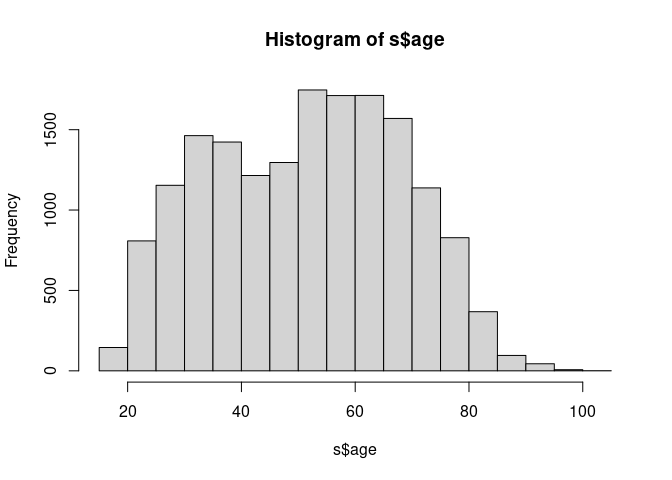

JESIII Recode
================
Gento Kato
April 15, 2021

# Preparation

``` r
## Clean Up Space
rm(list=ls())

## Set Working Directory (Automatically) ##
require(rstudioapi)
setwd(dirname(rstudioapi::getActiveDocumentContext()$path));

## Find Data Directory
### SSJDA
datadir_s <- "0530BE.sav"

## Import Original Data
require(haven)

### SSJDA
ds <- read_sav(datadir_s, encoding="SHIFT_JIS")
```

    ## Failed to find CASENO
    ## Failed to find SHIKYOKU
    ## Failed to find TAISHO
    ## Failed to find SHIKYO_A
    ## Failed to find A1X1S1P
    ## Failed to find A1X1S1C
    ## Failed to find A1X1S2
    ## Failed to find A1X1S3
    ## Failed to find A1X2S1P
    ## Failed to find A1X2S1C
    ## Failed to find A1X2S2
    ## Failed to find A1X2S3
    ## Failed to find A1X3S1P
    ## Failed to find A1X3S1C
    ## Failed to find A1X3S2
    ## Failed to find A1X3S3
    ## Failed to find A1X4S1P
    ## Failed to find A1X4S1C
    ## Failed to find A1X4S2
    ## Failed to find A1X4S3
    ## Failed to find A1X5S1P
    ## Failed to find A1X5S1C
    ## Failed to find A1X5S2
    ## Failed to find A1X5S3
    ## Failed to find A1X6S1P
    ## Failed to find A1X6S1C
    ## Failed to find A1X6S2
    ## Failed to find A1X6S3
    ## Failed to find A45A0A
    ## Failed to find A45A0B
    ## Failed to find A45A1
    ## Failed to find A45A2
    ## Failed to find A45A3
    ## Failed to find A45A4
    ## Failed to find A45A5
    ## Failed to find A45A6
    ## Failed to find A45A7
    ## Failed to find A45A8
    ## Failed to find A45A9
    ## Failed to find A45A10
    ## Failed to find A45B0A
    ## Failed to find A45B0A2
    ## Failed to find A45B0B
    ## Failed to find A45B1
    ## Failed to find A45B2
    ## Failed to find A45B3
    ## Failed to find A45B4
    ## Failed to find A45B5
    ## Failed to find A45B6
    ## Failed to find A45B7
    ## Failed to find A45B8
    ## Failed to find A45B9
    ## Failed to find A45B10
    ## Failed to find A45C0A
    ## Failed to find A45C0A2
    ## Failed to find A45C0B
    ## Failed to find A45C1
    ## Failed to find A45C2
    ## Failed to find A45C3
    ## Failed to find A45C4
    ## Failed to find A45C5
    ## Failed to find A45C6
    ## Failed to find A45C7
    ## Failed to find A45C8
    ## Failed to find A45C9
    ## Failed to find A45C10
    ## Failed to find A45D0A
    ## Failed to find A45D0A2
    ## Failed to find A45D0B
    ## Failed to find A45D1
    ## Failed to find A45D2
    ## Failed to find A45D3
    ## Failed to find A45D4
    ## Failed to find A45D5
    ## Failed to find A45D6
    ## Failed to find A45D7
    ## Failed to find A45D8
    ## Failed to find A45D9
    ## Failed to find A45D10
    ## Failed to find A46S1_1
    ## Failed to find A46S1_2
    ## Failed to find A46S1_3
    ## Failed to find A46S1_4
    ## Failed to find A46S1_5
    ## Failed to find A46S1_6
    ## Failed to find A46S1_7
    ## Failed to find A46S1_8
    ## Failed to find A46S1_9
    ## Failed to find A46S1_10
    ## Failed to find A46S1_11
    ## Failed to find A46S1_12
    ## Failed to find A46S1_13
    ## Failed to find A46S1_14
    ## Failed to find A46S1_15
    ## Failed to find A46S1_16
    ## Failed to find A46S2_1
    ## Failed to find A46S2_2
    ## Failed to find A46S2_3
    ## Failed to find A46S2_4
    ## Failed to find A46S2_5
    ## Failed to find A46S2_6
    ## Failed to find A46S2_7
    ## Failed to find A46S2_8
    ## Failed to find A46S2_9
    ## Failed to find A46S2_10
    ## Failed to find A46S2_11
    ## Failed to find A46S2_12
    ## Failed to find A46S2_13
    ## Failed to find A46S2_14
    ## Failed to find A46S2_15
    ## Failed to find A46S2_16
    ## Failed to find A46S2_17
    ## Failed to find A46S2_18
    ## Failed to find A46S2_19
    ## Failed to find A46S2_20
    ## Failed to find A46S2_21
    ## Failed to find A46S2_22
    ## Failed to find A46S3_1
    ## Failed to find A46S3_2
    ## Failed to find A46S3_3
    ## Failed to find A46S3_4
    ## Failed to find A46S3_5
    ## Failed to find A46S3_6
    ## Failed to find A46S3_7
    ## Failed to find A46S3_8
    ## Failed to find A46S3_9
    ## Failed to find A46S3_10
    ## Failed to find C8S2X1
    ## Failed to find C8S2X2
    ## Failed to find C8S2X3
    ## Failed to find C8S2X4
    ## Failed to find C8S2X5
    ## Failed to find C8S2X6
    ## Failed to find C8S2X7
    ## Failed to find C8S2X8
    ## Failed to find C8S2X9
    ## Failed to find C8S2X10
    ## Failed to find C10X1
    ## Failed to find C10X2
    ## Failed to find C10X3
    ## Failed to find C10X4
    ## Failed to find C10X5
    ## Failed to find C10X6
    ## Failed to find C10X7
    ## Failed to find C10X8
    ## Failed to find C11_1
    ## Failed to find C11_2
    ## Failed to find C11_3X1
    ## Failed to find C11_3X2
    ## Failed to find C11_3X3
    ## Failed to find C11_3X4
    ## Failed to find C11_3X5
    ## Failed to find C11_3X6
    ## Failed to find C11_3X7
    ## Failed to find C12_1
    ## Failed to find C12_2
    ## Failed to find C12_3X1
    ## Failed to find C12_3X2
    ## Failed to find C12_3X3
    ## Failed to find C12_3X4
    ## Failed to find C12_3X5
    ## Failed to find C12_3X6
    ## Failed to find C12_3X7
    ## Failed to find C13_1
    ## Failed to find C13_2
    ## Failed to find C13_3X1
    ## Failed to find C13_3X2
    ## Failed to find C13_3X3
    ## Failed to find C13_3X4
    ## Failed to find C13_3X5
    ## Failed to find C13_3X6
    ## Failed to find C13_3X7
    ## Failed to find C14_1
    ## Failed to find C14_2
    ## Failed to find C14_3X1
    ## Failed to find C14_3X2
    ## Failed to find C14_3X3
    ## Failed to find C14_3X4
    ## Failed to find C14_3X5
    ## Failed to find C14_3X6
    ## Failed to find C14_3X7
    ## Failed to find C15_1
    ## Failed to find C15_2
    ## Failed to find C15_3X1
    ## Failed to find C15_3X2
    ## Failed to find C15_3X3
    ## Failed to find C15_3X4
    ## Failed to find C15_3X5
    ## Failed to find C15_3X6
    ## Failed to find C15_3X7
    ## Failed to find C23_1X1
    ## Failed to find C23_1X2
    ## Failed to find C23_1X3
    ## Failed to find C23_2X1
    ## Failed to find C23_2X2
    ## Failed to find C23_2X3
    ## Failed to find C23_3X1
    ## Failed to find C23_3X2
    ## Failed to find C23_3X3
    ## Failed to find C23_4X1
    ## Failed to find C23_4X2
    ## Failed to find C23_4X3
    ## Failed to find C23_5X1
    ## Failed to find C23_5X2
    ## Failed to find C23_5X3
    ## Failed to find C23_6X1
    ## Failed to find C23_6X2
    ## Failed to find C23_6X3
    ## Failed to find C23_7X1
    ## Failed to find C23_7X2
    ## Failed to find C23_7X3
    ## Failed to find C23_8X1
    ## Failed to find C23_8X2
    ## Failed to find C23_8X3
    ## Failed to find C23_9X1
    ## Failed to find C23_9X2
    ## Failed to find C23_9X3
    ## Failed to find C23_10X1
    ## Failed to find C23_10X2
    ## Failed to find C23_10X3
    ## Failed to find C23_11X1
    ## Failed to find C23_11X2
    ## Failed to find C23_11X3
    ## Failed to find C23_12X1
    ## Failed to find C23_12X2
    ## Failed to find C23_12X3
    ## Failed to find C23_13X1
    ## Failed to find C23_13X2
    ## Failed to find C23_13X3
    ## Failed to find C23_14X1
    ## Failed to find C23_14X2
    ## Failed to find C23_14X3
    ## Failed to find C23_15X1
    ## Failed to find C23_15X2
    ## Failed to find C23_15X3
    ## Failed to find C23_16X1
    ## Failed to find C23_16X2
    ## Failed to find C23_16X3
    ## Failed to find C23_17X1
    ## Failed to find C23_17X2
    ## Failed to find C23_17X3
    ## Failed to find C23_18X1
    ## Failed to find C23_18X2
    ## Failed to find C23_18X3
    ## Failed to find C23_19X1
    ## Failed to find C23_19X2
    ## Failed to find C23_19X3
    ## Failed to find C23_20X1
    ## Failed to find C23_20X2
    ## Failed to find C23_20X3
    ## Failed to find C23_21X1
    ## Failed to find C23_21X2
    ## Failed to find C23_21X3
    ## Failed to find C23_22X1
    ## Failed to find C23_22X2
    ## Failed to find C23_22X3
    ## Failed to find C23_23X1
    ## Failed to find C23_23X2
    ## Failed to find C23_23X3
    ## Failed to find C32X1
    ## Failed to find C32X2
    ## Failed to find C32X3
    ## Failed to find C32X4
    ## Failed to find C32X5
    ## Failed to find C32X6
    ## Failed to find C32X7
    ## Failed to find C32X8
    ## Failed to find C32X9
    ## Failed to find C32X10
    ## Failed to find C32X11
    ## Failed to find D1X1S1P
    ## Failed to find D1X1S1C
    ## Failed to find D1X1S2
    ## Failed to find D1X1S3
    ## Failed to find D1X2S1P
    ## Failed to find D1X2S1C
    ## Failed to find D1X2S2
    ## Failed to find D1X2S3
    ## Failed to find D1X3S1P
    ## Failed to find D1X3S1C
    ## Failed to find D1X3S2
    ## Failed to find D1X3S3
    ## Failed to find D1X4S1P
    ## Failed to find D1X4S1C
    ## Failed to find D1X4S2
    ## Failed to find D1X4S3
    ## Failed to find D1X5S1P
    ## Failed to find D1X5S1C
    ## Failed to find D1X5S2
    ## Failed to find D1X5S3
    ## Failed to find D1X6S1P
    ## Failed to find D1X6S1C
    ## Failed to find D1X6S2
    ## Failed to find D1X6S3
    ## Failed to find D43A0A
    ## Failed to find D43A0B
    ## Failed to find D43A1
    ## Failed to find D43A2
    ## Failed to find D43A3
    ## Failed to find D43A4
    ## Failed to find D43A5
    ## Failed to find D43A6
    ## Failed to find D43A7
    ## Failed to find D43A8
    ## Failed to find D43B0A
    ## Failed to find D43B0BX
    ## Failed to find D43B0B
    ## Failed to find D43B1
    ## Failed to find D43B2
    ## Failed to find D43B3
    ## Failed to find D43B4
    ## Failed to find D43B5
    ## Failed to find D43B6
    ## Failed to find D43B7
    ## Failed to find D43B8
    ## Failed to find D43C0A
    ## Failed to find D43C0BX
    ## Failed to find D43C0B
    ## Failed to find D43C1
    ## Failed to find D43C2
    ## Failed to find D43C3
    ## Failed to find D43C4
    ## Failed to find D43C5
    ## Failed to find D43C6
    ## Failed to find D43C7
    ## Failed to find D43C8
    ## Failed to find D43D0A
    ## Failed to find D43D0BX
    ## Failed to find D43D0B
    ## Failed to find D43D1
    ## Failed to find D43D2
    ## Failed to find D43D3
    ## Failed to find D43D4
    ## Failed to find D43D5
    ## Failed to find D43D6
    ## Failed to find D43D7
    ## Failed to find D43D8
    ## Failed to find D44S1_1
    ## Failed to find D44S1_2
    ## Failed to find D44S1_3
    ## Failed to find D44S1_4
    ## Failed to find D44S1_5
    ## Failed to find D44S1_6
    ## Failed to find D44S1_7
    ## Failed to find D44S1_8
    ## Failed to find D44S1_9
    ## Failed to find D44S1_10
    ## Failed to find D44S1_11
    ## Failed to find D44S1_12
    ## Failed to find D44S1_13
    ## Failed to find D44S1_14
    ## Failed to find D44S1_15
    ## Failed to find D44S1_16
    ## Failed to find D44S2_1
    ## Failed to find D44S2_2
    ## Failed to find D44S2_3
    ## Failed to find D44S2_4
    ## Failed to find D44S2_5
    ## Failed to find D44S2_6
    ## Failed to find D44S2_7
    ## Failed to find D44S2_8
    ## Failed to find D44S2_9
    ## Failed to find D44S2_10
    ## Failed to find D44S2_11
    ## Failed to find D44S2_12
    ## Failed to find D44S2_13
    ## Failed to find D44S2_14
    ## Failed to find D44S2_15
    ## Failed to find D44S2_16
    ## Failed to find D44S2_17
    ## Failed to find D44S2_18
    ## Failed to find D44S2_19
    ## Failed to find D44S2_20
    ## Failed to find D44S2_21
    ## Failed to find D44S2_22
    ## Failed to find G1X1S1P
    ## Failed to find G1X1S1C
    ## Failed to find G1X1S2
    ## Failed to find G1X1S3
    ## Failed to find G1X2S1P
    ## Failed to find G1X2S1C
    ## Failed to find G1X2S2
    ## Failed to find G1X2S3
    ## Failed to find G1X3S1P
    ## Failed to find G1X3S1C
    ## Failed to find G1X3S2
    ## Failed to find G1X3S3
    ## Failed to find G1X4S1P
    ## Failed to find G1X4S1C
    ## Failed to find G1X4S2
    ## Failed to find G1X4S3
    ## Failed to find G1X5S1P
    ## Failed to find G1X5S1C
    ## Failed to find G1X5S2
    ## Failed to find G1X5S3
    ## Failed to find G1X6S1P
    ## Failed to find G1X6S1C
    ## Failed to find G1X6S2
    ## Failed to find G1X6S3
    ## Failed to find G45A0
    ## Failed to find G45A1
    ## Failed to find G45A2
    ## Failed to find G45A3
    ## Failed to find G45A4
    ## Failed to find G45A5
    ## Failed to find G45A6
    ## Failed to find G45A7
    ## Failed to find G45A8
    ## Failed to find G45A9
    ## Failed to find G45B0
    ## Failed to find G45B1
    ## Failed to find G45B2
    ## Failed to find G45B3
    ## Failed to find G45B4
    ## Failed to find G45B5
    ## Failed to find G45B6
    ## Failed to find G45B7
    ## Failed to find G45B8
    ## Failed to find G45B9
    ## Failed to find G45C0
    ## Failed to find G45C1
    ## Failed to find G45C2
    ## Failed to find G45C3
    ## Failed to find G45C4
    ## Failed to find G45C5
    ## Failed to find G45C6
    ## Failed to find G45C7
    ## Failed to find G45C8
    ## Failed to find G45C9
    ## Failed to find G45D0
    ## Failed to find G45D1
    ## Failed to find G45D2
    ## Failed to find G45D3
    ## Failed to find G45D4
    ## Failed to find G45D5
    ## Failed to find G45D6
    ## Failed to find G45D7
    ## Failed to find G45D8
    ## Failed to find G45D9
    ## Failed to find G46S1_1
    ## Failed to find G46S1_2
    ## Failed to find G46S1_3
    ## Failed to find G46S1_4
    ## Failed to find G46S1_5
    ## Failed to find G46S1_6
    ## Failed to find G46S1_7
    ## Failed to find G46S1_8
    ## Failed to find G46S1_9
    ## Failed to find G46S1_10
    ## Failed to find G46S1_11
    ## Failed to find G46S1_12
    ## Failed to find G46S1_13
    ## Failed to find G46S1_14
    ## Failed to find G46S1_15
    ## Failed to find G46S1_16
    ## Failed to find G46S2_1
    ## Failed to find G46S2_2
    ## Failed to find G46S2_3
    ## Failed to find G46S2_4
    ## Failed to find G46S2_5
    ## Failed to find G46S2_6
    ## Failed to find G46S2_7
    ## Failed to find G46S2_8
    ## Failed to find G46S2_9
    ## Failed to find G46S2_10
    ## Failed to find G46S2_11
    ## Failed to find G46S2_12
    ## Failed to find G46S2_13
    ## Failed to find G46S2_14
    ## Failed to find G46S2_15
    ## Failed to find G46S2_16
    ## Failed to find G46S2_17
    ## Failed to find G46S2_18
    ## Failed to find G46S2_19
    ## Failed to find G46S2_20
    ## Failed to find G46S2_21
    ## Failed to find G46S2_22
    ## Failed to find H11S1X1A
    ## Failed to find H11S1X1B
    ## Failed to find H11S1X1C
    ## Failed to find H11S1X1D
    ## Failed to find H11S1X1E
    ## Failed to find H11S1X1F
    ## Failed to find H11S1X1G
    ## Failed to find H11S1X1H
    ## Failed to find H11S1X1I
    ## Failed to find H11S1X1J
    ## Failed to find H11S1X1K
    ## Failed to find H11S2X1A
    ## Failed to find H11S2X1B
    ## Failed to find H11S2X1C
    ## Failed to find H11S2X1D
    ## Failed to find H11S2X1E
    ## Failed to find H11S2X1F
    ## Failed to find H11S2X1G
    ## Failed to find H11S2X1H
    ## Failed to find H11S2X1I
    ## Failed to find H11S2X1J
    ## Failed to find H11S2X1K
    ## Failed to find J1X1S1P
    ## Failed to find J1X1S1C
    ## Failed to find J1X1S2
    ## Failed to find J1X1S3
    ## Failed to find J1X2S1P
    ## Failed to find J1X2S1C
    ## Failed to find J1X2S2
    ## Failed to find J1X2S3
    ## Failed to find J1X3S1P
    ## Failed to find J1X3S1C
    ## Failed to find J1X3S2
    ## Failed to find J1X3S3
    ## Failed to find J1X4S1P
    ## Failed to find J1X4S1C
    ## Failed to find J1X4S2
    ## Failed to find J1X4S3
    ## Failed to find J1X5S1P
    ## Failed to find J1X5S1C
    ## Failed to find J1X5S2
    ## Failed to find J1X5S3
    ## Failed to find J1X6S1P
    ## Failed to find J1X6S1C
    ## Failed to find J1X6S2
    ## Failed to find J1X6S3
    ## Failed to find J53A0A
    ## Failed to find J53A0B
    ## Failed to find J53A1
    ## Failed to find J53A2
    ## Failed to find J53A3
    ## Failed to find J53A4
    ## Failed to find J53A5
    ## Failed to find J53A6
    ## Failed to find J53A7
    ## Failed to find J53A8
    ## Failed to find J53B0A
    ## Failed to find J53B0BX
    ## Failed to find J53B0B
    ## Failed to find J53B1
    ## Failed to find J53B2
    ## Failed to find J53B3
    ## Failed to find J53B4
    ## Failed to find J53B5
    ## Failed to find J53B6
    ## Failed to find J53B7
    ## Failed to find J53B8
    ## Failed to find J53C0A
    ## Failed to find J53C0BX
    ## Failed to find J53C0B
    ## Failed to find J53C1
    ## Failed to find J53C2
    ## Failed to find J53C3
    ## Failed to find J53C4
    ## Failed to find J53C5
    ## Failed to find J53C6
    ## Failed to find J53C7
    ## Failed to find J53C8
    ## Failed to find J53D0A
    ## Failed to find J53D0BX
    ## Failed to find J53D0B
    ## Failed to find J53D1
    ## Failed to find J53D2
    ## Failed to find J53D3
    ## Failed to find J53D4
    ## Failed to find J53D5
    ## Failed to find J53D6
    ## Failed to find J53D7
    ## Failed to find J53D8
    ## Failed to find J54S1_1
    ## Failed to find J54S1_2
    ## Failed to find J54S1_3
    ## Failed to find J54S1_4
    ## Failed to find J54S1_5
    ## Failed to find J54S1_6
    ## Failed to find J54S1_7
    ## Failed to find J54S1_8
    ## Failed to find J54S1_9
    ## Failed to find J54S1_10
    ## Failed to find J54S1_11
    ## Failed to find J54S1_12
    ## Failed to find J54S1_13
    ## Failed to find J54S1_14
    ## Failed to find J54S1_15
    ## Failed to find J54S1_16
    ## Failed to find J54S2_1
    ## Failed to find J54S2_2
    ## Failed to find J54S2_3
    ## Failed to find J54S2_4
    ## Failed to find J54S2_5
    ## Failed to find J54S2_6
    ## Failed to find J54S2_7
    ## Failed to find J54S2_8
    ## Failed to find J54S2_9
    ## Failed to find J54S2_10
    ## Failed to find J54S2_11
    ## Failed to find J54S2_12
    ## Failed to find J54S2_13
    ## Failed to find J54S2_14
    ## Failed to find J54S2_15
    ## Failed to find J54S2_16
    ## Failed to find J54S2_17
    ## Failed to find J54S2_18
    ## Failed to find J54S2_19
    ## Failed to find J54S2_20
    ## Failed to find J54S2_21
    ## Failed to find J54S2_22
    ## Failed to find J54S2_23
    ## Failed to find K15S2_1
    ## Failed to find K15S2_2
    ## Failed to find K15S2_3
    ## Failed to find K15S2_4
    ## Failed to find K15S2_5
    ## Failed to find K15S2_6
    ## Failed to find K15S2_7
    ## Failed to find K15S2_8
    ## Failed to find K15S2_9
    ## Failed to find K15S2_10
    ## Failed to find K15S2_11
    ## Failed to find K15S2_12
    ## Failed to find K15S2_13
    ## Failed to find K15S2_14
    ## Failed to find K15S2_15
    ## Failed to find K15S2_16
    ## Failed to find K15S2_17
    ## Failed to find K15S2_18
    ## Failed to find K15S2_19
    ## Failed to find K15S2_20
    ## Failed to find K15S2_21
    ## Failed to find K15S2_22
    ## Failed to find K15S2_23
    ## Failed to find K15S2_24
    ## Failed to find K15S2_25
    ## Failed to find K15S2_26
    ## Failed to find K15S2_27
    ## Failed to find K28_1X1
    ## Failed to find K28_1X2
    ## Failed to find K28_1X3
    ## Failed to find K28_1X4
    ## Failed to find K28_1X5
    ## Failed to find K28_2X1
    ## Failed to find K28_2X2
    ## Failed to find K28_2X3
    ## Failed to find K28_2X4
    ## Failed to find K28_2X5
    ## Failed to find K28_3X1
    ## Failed to find K28_3X2
    ## Failed to find K28_3X3
    ## Failed to find K28_3X4
    ## Failed to find K28_3X5
    ## Failed to find K28_4X1
    ## Failed to find K28_4X2
    ## Failed to find K28_4X3
    ## Failed to find K28_4X4
    ## Failed to find K28_4X5
    ## Failed to find K28_5X1
    ## Failed to find K28_5X2
    ## Failed to find K28_5X3
    ## Failed to find K28_5X4
    ## Failed to find K28_5X5
    ## Failed to find K28_6X1
    ## Failed to find K28_6X2
    ## Failed to find K28_6X3
    ## Failed to find K28_6X4
    ## Failed to find K28_6X5
    ## Failed to find K28_7X1
    ## Failed to find K28_7X2
    ## Failed to find K28_7X3
    ## Failed to find K28_7X4
    ## Failed to find K28_7X5
    ## Failed to find K28_8X1
    ## Failed to find K28_8X2
    ## Failed to find K28_8X3
    ## Failed to find K28_8X4
    ## Failed to find K28_8X5
    ## Failed to find K28_9X1
    ## Failed to find K28_9X2
    ## Failed to find K28_9X3
    ## Failed to find K28_9X4
    ## Failed to find K28_9X5
    ## Failed to find K28_10X1
    ## Failed to find K28_10X2
    ## Failed to find K28_10X3
    ## Failed to find K28_10X4
    ## Failed to find K28_10X5
    ## Failed to find K28_11X1
    ## Failed to find K28_11X2
    ## Failed to find K28_11X3
    ## Failed to find K28_11X4
    ## Failed to find K28_11X5
    ## Failed to find K28_12X1
    ## Failed to find K28_12X2
    ## Failed to find K28_12X3
    ## Failed to find K28_12X4
    ## Failed to find K28_12X5
    ## Failed to find K28_13X1
    ## Failed to find K28_13X2
    ## Failed to find K28_13X3
    ## Failed to find K28_13X4
    ## Failed to find K28_13X5
    ## Failed to find K28_14X1
    ## Failed to find K28_14X2
    ## Failed to find K28_14X3
    ## Failed to find K28_14X4
    ## Failed to find K28_14X5
    ## Failed to find K28_15X1
    ## Failed to find K28_15X2
    ## Failed to find K28_15X3
    ## Failed to find K28_15X4
    ## Failed to find K28_15X5
    ## Failed to find K28_16X1
    ## Failed to find K28_16X2
    ## Failed to find K28_16X3
    ## Failed to find K28_16X4
    ## Failed to find K28_16X5
    ## Failed to find K28_17X1
    ## Failed to find K28_17X2
    ## Failed to find K28_17X3
    ## Failed to find K28_17X4
    ## Failed to find K28_17X5
    ## Failed to find K28_18X1
    ## Failed to find K28_18X2
    ## Failed to find K28_18X3
    ## Failed to find K28_18X4
    ## Failed to find K28_18X5
    ## Failed to find K28_19X1
    ## Failed to find K28_19X2
    ## Failed to find K28_19X3
    ## Failed to find K28_19X4
    ## Failed to find K28_19X5
    ## Failed to find K28_20X1
    ## Failed to find K28_20X2
    ## Failed to find K28_20X3
    ## Failed to find K28_20X4
    ## Failed to find K28_20X5
    ## Failed to find K28_21X1
    ## Failed to find K28_21X2
    ## Failed to find K28_21X3
    ## Failed to find K28_21X4
    ## Failed to find K28_21X5
    ## Failed to find K28_22X1
    ## Failed to find K28_22X2
    ## Failed to find K28_22X3
    ## Failed to find K28_22X4
    ## Failed to find K28_22X5
    ## Failed to find K28_23X1
    ## Failed to find K28_23X2
    ## Failed to find K28_23X3
    ## Failed to find K28_23X4
    ## Failed to find K28_23X5
    ## Failed to find K30S1_1
    ## Failed to find K30S1_2
    ## Failed to find K30S1_3
    ## Failed to find K30S1_4
    ## Failed to find K30S1_5
    ## Failed to find K30S1_6
    ## Failed to find K30S1_8
    ## Failed to find K30S1_9

``` r
colnames(ds) <- tolower(colnames(ds))
droprows <- which(is.na(ds$wave_a)) # Seemingly Error Rows
droprows # No rows to drop
```

    ## integer(0)

``` r
## All Parties
jimin="自民"; minshu="民主"; komei="公明"; shamin="社民"; kyosan="共産"
hoshushin="保守新"; jiyu="自由"; kokuminshin="国民新"; shakai="社会"; shinsei="新生"
minsha="民社"; sakigake="さきがけ"; shaminren="社民連"; nihonshin="日本新"; shinshin="新進"
sonota="その他"
allps <- c(jimin,shakai,komei,shinsei,kyosan,
           minsha,sakigake,shaminren,nihonshin,shinshin,
           minshu,shamin,hoshushin,jiyu,kokuminshin,
           sonota)
mutoha="無党派"
mikettei="未決定"
kiken="棄権"
shiranai="知らない"
mushozoku="無所属"
```

# Check Relevant Variables

## SSJDA Data

``` r
############
## Common ##
############

## Self
table(ds$citysize, useNA="always") # City Size
```

    ## 
    ##    1    2    3    4    5    6    7    8 <NA> 
    ##  372  260  278   35 1068  567  760  842    0

``` r
table(ds$gender, useNA="always") # Gender
```

    ## 
    ##    1    2 <NA> 
    ## 2226 1956    0

``` r
table(ds$borny, useNA="always") # Born Year
```

    ## 
    ## 1904 1907 1909 1910 1912 1913 1914 1915 1916 1917 1918 1919 1920 1921 1922 1923 1924 1925 1926 1927 1928 1929 1930 
    ##    1    1    1    4    5    3    3    2    5    9    6   14   21   20   28   22   28   55   47   47   52   46   60 
    ## 1931 1932 1933 1934 1935 1936 1937 1938 1939 1940 1941 1942 1943 1944 1945 1946 1947 1948 1949 1950 1951 1952 1953 
    ##   59   60   66   73   87   86   84   81   80   90   93   80   88   86   57   85  108   95  108   91   82   72   74 
    ## 1954 1955 1956 1957 1958 1959 1960 1961 1962 1963 1964 1965 1966 1967 1968 1969 1970 1971 1972 1973 1974 1975 1976 
    ##   66   64   59   55   66   66   59   63   55   55   71   89   62   71   74   79   87   63   65   72   69   56   53 
    ## 1977 1978 1979 1980 1981 1982 1983 1984 <NA> 
    ##   47   52   47   47   41   28   32    4    0

``` r
###########################
## Wave A (& B) HoC 2001 ##
###########################

## Self
table(ds$a6x4, useNA="always") # PM Support
```

    ## 
    ##    1    2    3    4    5    8    9 <NA> 
    ##  111  756  894   88   27  176    9 2121

``` r
table(ds$a7, useNA="always") # Party Support
```

    ## 
    ##    1    2    3    4    5    6    7    8    9   88   99 <NA> 
    ##  866  195   96   87   69    1   35    5  625   44   38 2121

``` r
table(ds$a7s1, useNA="always") # Party Support Strength
```

    ## 
    ##    1    2    8    9 <NA> 
    ##  277 1034   37    6 2828

``` r
table(ds$a7s2, useNA="always") # Party Leaners
```

    ## 
    ##    1    2    3    4    5    6    7    9   88   99 <NA> 
    ##  147   69   21   18   24    2   22  279   73   52 3475

``` r
table(ds$a11, useNA="always") # Vote Intention
```

    ## 
    ##    1    2    3    4    8 <NA> 
    ## 1530  334   64   62   71 2121

``` r
table(ds$a11prtya, useNA="always") # Vote Decision by Party (県選挙区)
```

    ## 
    ##    1    2    3    4    5    6    7    8    9   10   88   99 <NA> 
    ##  614  150   65   30   54    1   29   12   61  627   28  193 2318

``` r
table(ds$a11prtyb, useNA="always") # Vote Decision by Party (PR)
```

    ## 
    ##    1    2    3    4    5    6    7    8    9   10   88   99 <NA> 
    ##  495  124  117   47   50    4   32    3   18  792   44  138 2318

``` r
table(ds$a24, useNA="always") # Political Interest
```

    ## 
    ##    1    2    3    4    8    9 <NA> 
    ##  379  745  700  190   27   20 2121

``` r
table(ds$a25, useNA="always") # Ministry Knowledge
```

    ## 
    ##    0    1    2    3    4    5    6    7    8    9   10   11   12   13   14   88   99 <NA> 
    ##   85  175  197  245  261  229  179   91   78   40   47   22   13   16   35  310   38 2121

``` r
table(ds$residyr01, useNA="always") # Year of Residence
```

    ## 
    ##    1    2    3    4    5    9 <NA> 
    ##  413  515  350 1898  932    8   66

``` r
table(ds$educat01, useNA="always") # Education
```

    ## 
    ##    1    2    3    4    9 <NA> 
    ##  804 1861  665  800   24   28

``` r
table(ds$occup5a1, useNA="always") # Occupation
```

    ## 
    ##    1    2    3    4    5    6    7 <NA> 
    ##  970  333  107   32  412  451   23 1854

``` r
table(ds$typeho01, useNA="always") # Type of Home
```

    ## 
    ##    1    2    3    4    5    6    7    8 <NA> 
    ## 1729  113   88  197  132   44    9   17 1853

``` r
table(ds$hincome, useNA="always") # Household Income
```

    ## 
    ##    1    2    3    4    5    6    7    8    9 <NA> 
    ##  137  399  344  324  194  104   59   55   39 2527

``` r
### Wave B
table(ds$b1, useNA="always") # Voted
```

    ## 
    ##    1    2    3 <NA> 
    ## 1042   73  138 2929

``` r
table(ds$b2prtya, useNA="always") # Vote Decision by Party (県選挙区)
```

    ## 
    ##    1    2    3    4    5    7    8    9 <NA> 
    ##  453  167   44   23   55   42   38   82 3278

``` r
table(ds$b7prtyb, useNA="always") # Vote Decision by Party (PR)
```

    ## 
    ##    1    2    3    4    5    6    7    8    9 <NA> 
    ##  452  155   92   54   47   19   51    3   30 3279

``` r
## Partner 1
table(ds$a45x1, useNA="always") # Partner 1 (1=Yes)
```

    ## 
    ##    1    2    9 <NA> 
    ## 1443  613    5 2121

``` r
table(ds$a45x1a, useNA="always") # Have Spouse (1=Yes)
```

    ## 
    ##    1    2 <NA> 
    ##  389  224 3569

``` r
table(ds$a45x1s1, useNA="always") # Relationship with P1
```

    ## 
    ##    1    2    3    4    5    6    7    8    9   99 <NA> 
    ##  709  160   39  251   41   47   28  153    5   10 2739

``` r
table(ds$a45x1s2, useNA="always") # Gender of P1
```

    ## 
    ##    1    2    8    9 <NA> 
    ##  916  494    2   31 2739

``` r
table(ds$a45x1s3, useNA="always") # Closeness of P1
```

    ## 
    ##    1    2    3    8    9 <NA> 
    ##  241  289   19    3   22 3608

``` r
table(ds$a45x1s4, useNA="always") # Pol. Discussion with P1
```

    ## 
    ##    1    2    3    8    9 <NA> 
    ##  314  930  537   16   35 2350

``` r
table(ds$a45x1s5, useNA="always") # Watch/Read News Together with P1
```

    ## 
    ##    1    2    3    8    9 <NA> 
    ##  333  761  685   14   39 2350

``` r
table(ds$a45x1s6, useNA="always") # Perceived Pol. Knowledge of P1
```

    ## 
    ##    1    2    3    8    9 <NA> 
    ##  299  811  617   69   36 2350

``` r
table(ds$a45x1s7, useNA="always") # Expected Vote Choice of P1
```

    ## 
    ##    1    2    3    4    5    6    7    8   88   99 <NA> 
    ##  576   85   97   29   27    2   16    7  899   94 2350

``` r
table(ds$a45x1s8, useNA="always") # Expected Koizumi Support of P1
```

    ## 
    ##    1    2    8    9 <NA> 
    ##  984  163  616   69 2350

``` r
table(ds$a45x1s9, useNA="always") # Similarity with P1
```

    ## 
    ##    1    2    8    9 <NA> 
    ##  896  539  341   56 2350

``` r
table(ds$a45x1s10, useNA="always") # Relative Social Status of P1
```

    ## 
    ##    1    2    3    4    8    9 <NA> 
    ##  639  331  697   87   22   56 2350

``` r
## Partner 2
table(ds$a45x2, useNA="always") # Partner 2 (1=Yes)
```

    ## 
    ##    1    2    9 <NA> 
    ##  860  496   87 2739

``` r
table(ds$a45x2a1, useNA="always") # Partner 2 Check if Spouse (1=Yes)
```

    ## 
    ##    1    2    9 <NA> 
    ##  250  237    9 3686

``` r
table(ds$a45x2a2, useNA="always") # Have Spouse (1=Yes)
```

    ## 
    ##    1    2    9 <NA> 
    ##  132   97    8 3945

``` r
table(ds$a45x2s1, useNA="always") # Relationship with P2
```

    ## 
    ##    1    2    3    4    5    6    7    8    9   99 <NA> 
    ##   75  180   62  197   63   48   49  176    8    2 3322

``` r
table(ds$a45x2s2, useNA="always") # Gender of P2
```

    ## 
    ##    1    2    8    9 <NA> 
    ##  476  371    2   11 3322

``` r
table(ds$a45x2s3, useNA="always") # Closeness of P2
```

    ## 
    ##    1    2    3    8    9 <NA> 
    ##  250  319   15    3   18 3577

``` r
table(ds$a45x2s4, useNA="always") # Pol. Discussion with P2
```

    ## 
    ##    1    2    3    8    9 <NA> 
    ##  171  576  222    2   21 3190

``` r
table(ds$a45x2s5, useNA="always") # Watch/Read News Together with P2
```

    ## 
    ##    1    2    3    8    9 <NA> 
    ##  110  375  471   12   24 3190

``` r
table(ds$a45x2s6, useNA="always") # Perceived Pol. Knowledge of P2
```

    ## 
    ##    1    2    3    8    9 <NA> 
    ##  156  481  300   37   18 3190

``` r
table(ds$a45x2s7, useNA="always") # Expected Vote Choice of P2
```

    ## 
    ##    1    2    3    4    5    7    8   88   99 <NA> 
    ##  283   36   65   18   20    3    6  516   45 3190

``` r
table(ds$a45x2s8, useNA="always") # Expected Koizumi Support of P2
```

    ## 
    ##    1    2    8    9 <NA> 
    ##  510   88  352   42 3190

``` r
table(ds$a45x2s9, useNA="always") # Similarity with P2
```

    ## 
    ##    1    2    8    9 <NA> 
    ##  494  287  184   27 3190

``` r
table(ds$a45x2s10, useNA="always") # Relative Social Status of P2
```

    ## 
    ##    1    2    3    4    8    9 <NA> 
    ##  289  190  435   44    7   27 3190

``` r
## Partner 3
table(ds$a45x3, useNA="always") # Partner 3 (1=Yes)
```

    ## 
    ##    1    2    9 <NA> 
    ##  441  368   51 3322

``` r
table(ds$a45x3a1, useNA="always") # Partner 3 Check if Spouse (1=Yes)
```

    ## 
    ##    1    2    9 <NA> 
    ##  203  162    3 3814

``` r
table(ds$a45x3a2, useNA="always") # Have Spouse (1=Yes)
```

    ## 
    ##    1    2    9 <NA> 
    ##   79   79    4 4020

``` r
table(ds$a45x3s1, useNA="always") # Relationship with P3
```

    ## 
    ##    1    2    3    4    5    6    7    8    9   99 <NA> 
    ##   21   48   33  104   33   39   35  124    2    2 3741

``` r
table(ds$a45x3s2, useNA="always") # Gender of P3
```

    ## 
    ##    1    2    8    9 <NA> 
    ##  245  188    2    6 3741

``` r
table(ds$a45x3s3, useNA="always") # Closeness of P3
```

    ## 
    ##    1    2    3    8    9 <NA> 
    ##  153  196    8    2   13 3810

``` r
table(ds$a45x3s4, useNA="always") # Pol. Discussion with P3
```

    ## 
    ##    1    2    3    8    9 <NA> 
    ##   88  297  120    4   11 3662

``` r
table(ds$a45x3s5, useNA="always") # Watch/Read News Together with P3
```

    ## 
    ##    1    2    3    8    9 <NA> 
    ##   54  182  263    8   13 3662

``` r
table(ds$a45x3s6, useNA="always") # Perceived Pol. Knowledge of P3
```

    ## 
    ##    1    2    3    8    9 <NA> 
    ##   74  249  167   19   11 3662

``` r
table(ds$a45x3s7, useNA="always") # Expected Vote Choice of P3
```

    ## 
    ##    1    2    3    4    5    6    8   88   99 <NA> 
    ##  156   22   24    8    7    1    4  280   18 3662

``` r
table(ds$a45x3s8, useNA="always") # Expected Koizumi Support of P3
```

    ## 
    ##    1    2    8    9 <NA> 
    ##  277   49  180   14 3662

``` r
table(ds$a45x3s9, useNA="always") # Similarity with P3
```

    ## 
    ##    1    2    8    9 <NA> 
    ##  254  147  107   12 3662

``` r
table(ds$a45x3s10, useNA="always") # Relative Social Status of P3
```

    ## 
    ##    1    2    3    4    8    9 <NA> 
    ##  117  102  271   15    4   11 3662

``` r
## Partner 4
table(ds$a45x4, useNA="always") # Partner 4 (1=Yes)
```

    ## 
    ##    1    2    9 <NA> 
    ##  218  185   38 3741

``` r
table(ds$a45x4a1, useNA="always") # Partner 4 Check if Spouse (1=Yes)
```

    ## 
    ##    1    2    9 <NA> 
    ##  122   54    9 3997

``` r
table(ds$a45x4a2, useNA="always") # Have Spouse (1=Yes)
```

    ## 
    ##    1    2    9 <NA> 
    ##   21   31    2 4128

``` r
table(ds$a45x4s1, useNA="always") # Relationship with P4
```

    ## 
    ##    1    2    3    4    5    6    7    8    9   99 <NA> 
    ##    8   15   11   44   26   15   20   76    1    2 3964

``` r
table(ds$a45x4s2, useNA="always") # Gender of P4
```

    ## 
    ##    1    2    8    9 <NA> 
    ##  115   96    2    5 3964

``` r
table(ds$a45x4s3, useNA="always") # Closeness of P4
```

    ## 
    ##    1    2    3    8    9 <NA> 
    ##   74  106    3    1   11 3987

``` r
table(ds$a45x4s4, useNA="always") # Pol. Discussion with P4
```

    ## 
    ##    1    2    3    9 <NA> 
    ##   52  133   48    6 3943

``` r
table(ds$a45x4s5, useNA="always") # Watch/Read News Together with P4
```

    ## 
    ##    1    2    3    8    9 <NA> 
    ##   28   76  126    2    7 3943

``` r
table(ds$a45x4s6, useNA="always") # Perceived Pol. Knowledge of P4
```

    ## 
    ##    1    2    3    8    9 <NA> 
    ##   42  112   66   13    6 3943

``` r
table(ds$a45x4s7, useNA="always") # Expected Vote Choice of P4
```

    ## 
    ##    1    2    3    4    5    7   88   99 <NA> 
    ##   77    5   18    1    3    1  122   12 3943

``` r
table(ds$a45x4s8, useNA="always") # Expected Koizumi Support of P4
```

    ## 
    ##    1    2    8    9 <NA> 
    ##  128   22   78   11 3943

``` r
table(ds$a45x4s9, useNA="always") # Similarity with P4
```

    ## 
    ##    1    2    8    9 <NA> 
    ##  112   71   47    9 3943

``` r
table(ds$a45x4s10, useNA="always") # Relative Social Status of P4
```

    ## 
    ##    1    2    3    4    8    9 <NA> 
    ##   51   39  136    3    3    7 3943

``` r
## Acquaintance Between Partners
table(ds$a45s11_1, useNA="always") # P1 and P2 Knows Each Other
```

    ## 
    ##    0    1 <NA> 
    ##  414  578 3190

``` r
table(ds$a45s11_2, useNA="always") # P1 and P3 Knows Each Other
```

    ## 
    ##    0    1 <NA> 
    ##  742  250 3190

``` r
table(ds$a45s11_3, useNA="always") # P1 and P4 Knows Each Other
```

    ## 
    ##    0    1 <NA> 
    ##  873  119 3190

``` r
table(ds$a45s11_4, useNA="always") # P1 Knows Noone
```

    ## 
    ##    0    1 <NA> 
    ##  732  260 3190

``` r
table(ds$a45s11_5, useNA="always") # P1 Acquaintance DK
```

    ## 
    ##    0    1 <NA> 
    ##  980   12 3190

``` r
table(ds$a45s11_6, useNA="always") # P1 Acquaintance NA
```

    ## 
    ##    0    1 <NA> 
    ##  902   90 3190

``` r
table(ds$a45s12_1, useNA="always") # P2 and P3 Knows Each Other 
```

    ## 
    ##    0    1 <NA> 
    ##  284  236 3662

``` r
table(ds$a45s12_2, useNA="always") # P2 and P4 Knows Each Other
```

    ## 
    ##    0    1 <NA> 
    ##  419  101 3662

``` r
table(ds$a45s12_3, useNA="always") # P3 and P4 Knows Each Other
```

    ## 
    ##    0    1 <NA> 
    ##  420  100 3662

``` r
table(ds$a45s12_4, useNA="always") # P2, P3, and P4 Don't Know Each Other
```

    ## 
    ##    0    1 <NA> 
    ##  341  179 3662

``` r
table(ds$a45s12_5, useNA="always") # P2, P3, and P4 Acquaintance DK
```

    ## 
    ##    0    1 <NA> 
    ##  503   17 3662

``` r
table(ds$a45s12_6, useNA="always") # P2, P3, and P4 Acquaintance NA
```

    ## 
    ##    0    1 <NA> 
    ##  471   49 3662

``` r
###########################
## Wave D (& E) HoR 2003 ##
###########################

## Self
table(ds$d7x4, useNA="always") # PM Support
```

    ## 
    ##    1    2    3    4    5    8    9 <NA> 
    ##   49  679  769  432  159   68    6 2020

``` r
table(ds$d8, useNA="always") # Party Support
```

    ## 
    ##    1    2    3    4    5    6    8    9   88   99 <NA> 
    ##  943  291  113   63   61    3    1  591   57   39 2020

``` r
table(ds$d8s1, useNA="always") # Party Support Strength
```

    ## 
    ##    1    2    8    9 <NA> 
    ##  331 1106   34    4 2707

``` r
table(ds$d8s2, useNA="always") # Party Leaners
```

    ## 
    ##    1    2    3    4    5    8    9   88   99 <NA> 
    ##  139  130    5    8   11    1  255   81   57 3495

``` r
table(ds$d12, useNA="always") # Vote Intention
```

    ## 
    ##    1    2    3    4    8    9 <NA> 
    ## 1689  324   47   42   58    2 2020

``` r
table(ds$d12prty, useNA="always") # Vote Decision by Party (SMD)
```

    ## 
    ##    1    2    3    4    5    6    8    9   10   88   99 <NA> 
    ##  723  365   43   36   56   16    9   38  494   58  175 2169

``` r
table(ds$d12s4, useNA="always") # Vote Decision by Party (PR)
```

    ## 
    ##    1    2    3    4    5    6    8    9   88   99 <NA> 
    ##  753  445  141   45   66    2    2    2  441  116 2169

``` r
table(ds$d25, useNA="always") # Political Interest
```

    ## 
    ##    1    2    3    4    8    9 <NA> 
    ##  367 1036  572  155   23    9 2020

``` r
# table(, useNA="always") # Ministry Knowledge
table(ds$residy03, useNA="always") # Year of Residence
```

    ## 
    ##    1    2    3    4    5 <NA> 
    ##  150  305  192 1406  598 1531

``` r
table(ds$educat03, useNA="always") # Education
```

    ## 
    ##    1    2    3    4 <NA> 
    ##  581 1200  359  477 1565

``` r
table(ds$occup5a3, useNA="always") # Occupation
```

    ## 
    ##    1    2    3    4    5    6 <NA> 
    ##  998  448  103   27  439  636 1531

``` r
table(ds$typeho03, useNA="always") # Type of Home
```

    ## 
    ##    1    2    3    4    5    6    7    8 <NA> 
    ## 2082  122   99  186  116   26    5    6 1540

``` r
table(ds$hincom03, useNA="always") # Household Income
```

    ## 
    ##    1    2    3    4    5    6    7    8    9 <NA> 
    ##  187  522  396  291  228   98   49   37   36 2338

``` r
### Wave E
table(ds$e1, useNA="always") # Voted
```

    ## 
    ##    1    2    3    9 <NA> 
    ## 1921  102  241    4 1914

``` r
table(ds$e1s2p, useNA="always") # Vote Decision by Party (SMD)
```

    ## 
    ##    1    2    3    4    5    6    8    9   77   88   99 <NA> 
    ##  918  605   43   56   89   22   15   65    9    7  177 2176

``` r
table(ds$e1s7, useNA="always") # Vote Decision by Party (PR)
```

    ## 
    ##    1    2    3    4    5    9   77   88   99 <NA> 
    ##  825  711  176   69   91    1    1    6  123 2179

``` r
## Partner 1
table(ds$d43x1, useNA="always") # Partner 1 (1=Yes)
```

    ## 
    ##    1    2    9 <NA> 
    ## 1601  556    5 2020

``` r
table(ds$d43x1a, useNA="always") # Have Spouse (1=Yes)
```

    ## 
    ##    1    2 <NA> 
    ##  362  194 3626

``` r
table(ds$d43x1s1, useNA="always") # Relationship with P1
```

    ## 
    ##    1    2    3    4    5    6    7    8    9   88   99 <NA> 
    ##  878  149   55  166   45   47   35  213    9    2    2 2581

``` r
table(ds$d43x1s2, useNA="always") # Gender of P1
```

    ## 
    ##    1    2    8    9 <NA> 
    ##  979  612    3    7 2581

``` r
# table(, useNA="always") # Closeness of P1
table(ds$d43x1s3, useNA="always") # Pol. Discussion with P1
```

    ## 
    ##    1    2    3    8    9 <NA> 
    ##  348  936  639   21   19 2219

``` r
# table(, useNA="always") # Watch/Read News Together with P1
table(ds$d43x1s4, useNA="always") # Perceived Pol. Knowledge of P1
```

    ## 
    ##    1    2    3    8    9 <NA> 
    ##  338  823  726   64   12 2219

``` r
table(ds$d43x1s5, useNA="always") # Expected Vote Choice of P1
```

    ## 
    ##    1    2    3    4    5    6    7    8    9 <NA> 
    ##  712  184   81   29   28    1    8  866   54 2219

``` r
table(ds$d43x1s6, useNA="always") # Expected Koizumi Support of P1
```

    ## 
    ##    1    2    8    9 <NA> 
    ##  745  498  670   50 2219

``` r
table(ds$d43x1s7, useNA="always") # Similarity with P1
```

    ## 
    ##    1    2    8    9 <NA> 
    ## 1024  577  332   30 2219

``` r
table(ds$d43x1s8, useNA="always") # Relative Social Status of P1
```

    ## 
    ##    1    2    3    4    8    9 <NA> 
    ##  678  431  745   65   22   22 2219

``` r
## Partner 2
table(ds$d43x2, useNA="always") # Partner 2 (1=Yes)
```

    ## 
    ##    1    2    9 <NA> 
    ##  939  581   81 2581

``` r
table(ds$d43x2a1, useNA="always") # Partner 2 Check if Spouse (1=Yes)
```

    ## 
    ##    1    2    9 <NA> 
    ##  331  235   15 3601

``` r
table(ds$d43x2a2, useNA="always") # Have Spouse (1=Yes)
```

    ## 
    ##    1    2    9 <NA> 
    ##  139   95    1 3947

``` r
table(ds$d43x2s1, useNA="always") # Relationship with P2
```

    ## 
    ##    1    2    3    4    5    6    7    8    9   99 <NA> 
    ##   98  238   59  164   59   54   45  214    7    1 3243

``` r
table(ds$d43x2s2, useNA="always") # Gender of P2
```

    ## 
    ##    1    2    8    9 <NA> 
    ##  544  389    1    5 3243

``` r
# table(, useNA="always") # Closeness of P2
table(ds$d43x2s3, useNA="always") # Pol. Discussion with P2
```

    ## 
    ##    1    2    3    8    9 <NA> 
    ##  164  580  318    6   10 3104

``` r
# table(, useNA="always") # Watch/Read News Together with P2
table(ds$d43x2s4, useNA="always") # Perceived Pol. Knowledge of P2
```

    ## 
    ##    1    2    3    8    9 <NA> 
    ##  182  482  378   23   13 3104

``` r
table(ds$d43x2s5, useNA="always") # Expected Vote Choice of P2
```

    ## 
    ##    1    2    3    4    5    6    7    8    9 <NA> 
    ##  324   94   66   10   14    2    4  538   26 3104

``` r
table(ds$d43x2s6, useNA="always") # Expected Koizumi Support of P2
```

    ## 
    ##    1    2    8    9 <NA> 
    ##  358  248  447   25 3104

``` r
table(ds$d43x2s7, useNA="always") # Similarity with P2
```

    ## 
    ##    1    2    8    9 <NA> 
    ##  544  310  201   23 3104

``` r
table(ds$d43x2s8, useNA="always") # Relative Social Status of P2
```

    ## 
    ##    1    2    3    4    8    9 <NA> 
    ##  298  273  453   27   11   16 3104

``` r
## Partner 3
table(ds$d43x3, useNA="always") # Partner 3 (1=Yes)
```

    ## 
    ##    1    2    9 <NA> 
    ##  495  410   34 3243

``` r
table(ds$d43x3a1, useNA="always") # Partner 3 Check if Spouse (1=Yes)
```

    ## 
    ##    1    2    9 <NA> 
    ##  253  150    7 3772

``` r
table(ds$d43x3a2, useNA="always") # Have Spouse (1=Yes)
```

    ## 
    ##    1    2    9 <NA> 
    ##   72   76    2 4032

``` r
table(ds$d43x3s1, useNA="always") # Relationship with P3
```

    ## 
    ##    1    2    3    4    5    6    7    8    9   99 <NA> 
    ##   44   55   42   82   40   37   44  142    6    3 3687

``` r
table(ds$d43x3s2, useNA="always") # Gender of P3
```

    ## 
    ##    1    2    8    9 <NA> 
    ##  276  215    3    1 3687

``` r
# table(, useNA="always") # Closeness of P3
table(ds$d43x3s3, useNA="always") # Pol. Discussion with P3
```

    ## 
    ##    1    2    3    8    9 <NA> 
    ##   94  298  171    2    2 3615

``` r
# table(, useNA="always") # Watch/Read News Together with P3
table(ds$d43x3s4, useNA="always") # Perceived Pol. Knowledge of P3
```

    ## 
    ##    1    2    3    8    9 <NA> 
    ##   90  254  206   13    4 3615

``` r
table(ds$d43x3s5, useNA="always") # Expected Vote Choice of P3
```

    ## 
    ##    1    2    3    4    5    6    7    8    9 <NA> 
    ##  166   43   41    9    9    1    4  285    9 3615

``` r
table(ds$d43x3s6, useNA="always") # Expected Koizumi Support of P3
```

    ## 
    ##    1    2    8    9 <NA> 
    ##  186  126  246    9 3615

``` r
table(ds$d43x3s7, useNA="always") # Similarity with P3
```

    ## 
    ##    1    2    8    9 <NA> 
    ##  275  158  126    8 3615

``` r
table(ds$d43x3s8, useNA="always") # Relative Social Status of P3
```

    ## 
    ##    1    2    3    4    8    9 <NA> 
    ##  136  129  277   19    4    2 3615

``` r
## Partner 4
table(ds$d43x4, useNA="always") # Partner 4 (1=Yes)
```

    ## 
    ##    1    2    9 <NA> 
    ##  250  213   32 3687

``` r
table(ds$d43x4a1, useNA="always") # Partner 4 Check if Spouse (1=Yes)
```

    ## 
    ##    1    2    9 <NA> 
    ##  159   49    5 3969

``` r
table(ds$d43x4a2, useNA="always") # Have Spouse (1=Yes)
```

    ## 
    ##    1    2 <NA> 
    ##   24   25 4133

``` r
table(ds$d43x4s1, useNA="always") # Relationship with P4
```

    ## 
    ##    1    2    3    4    5    6    7    8    9   99 <NA> 
    ##    6   25   16   47   20   20   23   83    6    4 3932

``` r
table(ds$d43x4s2, useNA="always") # Gender of P4
```

    ## 
    ##    1    2    8    9 <NA> 
    ##  145  101    2    2 3932

``` r
# table(, useNA="always") # Closeness of P4
table(ds$d43x4s3, useNA="always") # Pol. Discussion with P4
```

    ## 
    ##    1    2    3    8    9 <NA> 
    ##   46  152   69    2    5 3908

``` r
# table(, useNA="always") # Watch/Read News Together with P4
table(ds$d43x4s4, useNA="always") # Perceived Pol. Knowledge of P4
```

    ## 
    ##    1    2    3    8    9 <NA> 
    ##   46  128   87    9    4 3908

``` r
table(ds$d43x4s5, useNA="always") # Expected Vote Choice of P4
```

    ## 
    ##    1    2    3    4    5    7    8    9 <NA> 
    ##   77   22   27    5    5    1  127   10 3908

``` r
table(ds$d43x4s6, useNA="always") # Expected Koizumi Support of P4
```

    ## 
    ##    1    2    8    9 <NA> 
    ##   86   67  108   13 3908

``` r
table(ds$d43x4s7, useNA="always") # Similarity with P4
```

    ## 
    ##    1    2    8    9 <NA> 
    ##  132   63   71    8 3908

``` r
table(ds$d43x4s8, useNA="always") # Relative Social Status of P4
```

    ## 
    ##    1    2    3    4    8    9 <NA> 
    ##   48   46  155   18    2    5 3908

``` r
## Acquaintance Between Partners
table(ds$d43s9_1, useNA="always") # P1 and P2 Knows Each Other
```

    ## 
    ##    0    1 <NA> 
    ##  421  657 3104

``` r
table(ds$d43s9_2, useNA="always") # P1 and P3 Knows Each Other
```

    ## 
    ##    0    1 <NA> 
    ##  800  278 3104

``` r
table(ds$d43s9_3, useNA="always") # P1 and P4 Knows Each Other
```

    ## 
    ##    0    1 <NA> 
    ##  940  138 3104

``` r
table(ds$d43s9_4, useNA="always") # P1 Knows Noone
```

    ## 
    ##    0    1 <NA> 
    ##  798  280 3104

``` r
table(ds$d43s9_5, useNA="always") # P1 Acquaintance DK
```

    ## 
    ##    0    1 <NA> 
    ## 1066   12 3104

``` r
table(ds$d43s9_6, useNA="always") # P1 Acquaintance NA
```

    ## 
    ##    0    1 <NA> 
    ## 1008   70 3104

``` r
table(ds$d43s10_1, useNA="always") # P2 and P3 Knows Each Other 
```

    ## 
    ##    0    1 <NA> 
    ##  301  266 3615

``` r
table(ds$d43s10_2, useNA="always") # P2 and P4 Knows Each Other
```

    ## 
    ##    0    1 <NA> 
    ##  447  120 3615

``` r
table(ds$d43s10_3, useNA="always") # P3 and P4 Knows Each Other
```

    ## 
    ##    0    1 <NA> 
    ##  437  130 3615

``` r
table(ds$d43s10_4, useNA="always") # P2, P3, and P4 Don't Know Each Other
```

    ## 
    ##    0    1 <NA> 
    ##  374  193 3615

``` r
table(ds$d43s10_5, useNA="always") # P2, P3, and P4 Acquaintance DK
```

    ## 
    ##    0    1 <NA> 
    ##  553   14 3615

``` r
table(ds$d43s10_6, useNA="always") # P2, P3, and P4 Acquaintance NA
```

    ## 
    ##    0    1 <NA> 
    ##  511   56 3615

``` r
###########################
## Wave G (& H) HoC 2004 ##
###########################

## Self
table(ds$g7x4, useNA="always") # PM Support
```

    ## 
    ##    1    2    3    4    5 <NA> 
    ##   64  700  810  405  136 2067

``` r
table(ds$g8, useNA="always") # Party Support
```

    ## 
    ##    1    2    3    4    5    9   88   99 <NA> 
    ##  864  371  106   38   58  617   34   27 2067

``` r
table(ds$g8s1, useNA="always") # Party Support Strength
```

    ## 
    ##    1    2 <NA> 
    ##  295 1115 2772

``` r
table(ds$g8s2, useNA="always") # Party Leaners
```

    ## 
    ##    1    2    3    4    5    9   88   99 <NA> 
    ##  107  117   13   14   21  317   49   40 3504

``` r
table(ds$g12, useNA="always") # Vote Intention
```

    ## 
    ##    1    2    3    4 <NA> 
    ## 1526  380   72   59 2145

``` r
table(ds$g12prtya, useNA="always") # Vote Decision by Party (PREF)
```

    ## 
    ##    1    2    3    4    5    8    9   10   88   99 <NA> 
    ##  579  407   53   16   70    2   85  539   40  115 2276

``` r
table(ds$g12prtyb, useNA="always") # Vote Decision by Party (PR)
```

    ## 
    ##    1    2    3    4    5    8    9   10   12   88   99 <NA> 
    ##  493  392  145   41   49    3    3    1  638   41  100 2276

``` r
table(ds$g27, useNA="always") # Political Interest
```

    ## 
    ##    1    2    3    4 <NA> 
    ##  294  953  645  200 2090

``` r
# table(, useNA="always") # Ministry Knowledge
table(ds$residy04, useNA="always") # Year of Residence
```

    ## 
    ##    1    2    3    4    5    9 <NA> 
    ##  134  260  172  970  566   13 2067

``` r
table(ds$educat04, useNA="always") # Education
```

    ## 
    ##    1    2    3    4    9 <NA> 
    ##  396  984  332  368   35 2067

``` r
table(ds$occup5a4, useNA="always") # Occupation
```

    ## 
    ##    1    2    3    4    5    6    7    9 <NA> 
    ##  870  298   86   26  420  408    1    6 2067

``` r
table(ds$typeho04, useNA="always") # Type of Home
```

    ## 
    ##    1    2    3    4    5    6    7    8    9 <NA> 
    ## 1665   79   72  168   94   26    5    3    3 2067

``` r
table(ds$hincom04, useNA="always") # Household Income
```

    ## 
    ##    1    2    3    4    5    6    7    8    9   10   11   12 <NA> 
    ##  130  198  231  165  163  126  115  112   80   24   34   25 2779

``` r
### Wave H
table(ds$h1, useNA="always") # Voted
```

    ## 
    ##    1    2    3    8    9 <NA> 
    ## 1589  115  271    1    1 2205

``` r
table(ds$h1s2p, useNA="always") # Vote Decision by Party (PREF)
```

    ## 
    ##    1    2    3    4    5    8    9   77   88   99 <NA> 
    ##  624  603   48   27  103    1  150   10    8  119 2489

``` r
table(ds$h1s7p, useNA="always") # Vote Decision by Party (PR)
```

    ## 
    ##    1    2    3    4    5    8    9   77   88   99 <NA> 
    ##   97   61  111   12    6    6    1    2    3   15 3868

``` r
## Partner 1
table(ds$g45x1, useNA="always") # Partner 1 (1=Yes)
```

    ## 
    ##    1    2    9 <NA> 
    ## 2005  106    4 2067

``` r
#table(ds$g45x1b, useNA="always") # Have Spouse (1=Yes)
table(ds$g45x1s1, useNA="always") # Relationship with P1
```

    ## 
    ##    1    2    3    4    5    6    7    8    9 <NA> 
    ## 1075  227   54  221   65   40   61  256    6 2177

``` r
table(ds$g45x1s2, useNA="always") # Gender of P1
```

    ## 
    ##    1    2 <NA> 
    ## 1002 1001 2179

``` r
#table(, useNA="always") # Closeness of P1
table(ds$g45x1s3, useNA="always") # Pol. Discussion with P1
```

    ## 
    ##    1    2    3    9 <NA> 
    ##  255  698 1038   14 2177

``` r
# table(, useNA="always") # Watch/Read News Together with P1
table(ds$g45x1s4, useNA="always") # Perceived Pol. Knowledge of P1
```

    ## 
    ##    1    2    3    9 <NA> 
    ##  246  698  924  137 2177

``` r
table(ds$g45x1s5, useNA="always") # Expected Vote Choice of P1
```

    ## 
    ##    1    2    3    4    5    6    8    9 <NA> 
    ##  545  247   83   18   39    1    5 1067 2177

``` r
table(ds$g45x1s6, useNA="always") # Expected Koizumi Support of P1
```

    ## 
    ##    1    2    8    9 <NA> 
    ##  586  569    3  847 2177

``` r
table(ds$g45x1s7, useNA="always") # Difference in Opinions with P1
```

    ## 
    ##    1    2    3    8    9 <NA> 
    ##   83  455 1109    3  355 2177

``` r
table(ds$g45x1s8, useNA="always") # Similarity with P1
```

    ## 
    ##    1    2    9 <NA> 
    ## 1057  639  309 2177

``` r
table(ds$g45x1s9, useNA="always") # Relative Social Status of P1
```

    ## 
    ##    1    2    3    4    9 <NA> 
    ##  636  489  814   41   25 2177

``` r
## Partner 2
table(ds$g45x2, useNA="always") # Partner 2 (1=Yes)
```

    ## 
    ##    1    2    9 <NA> 
    ## 1638  288   79 2177

``` r
#table(ds$g45x2b, useNA="always") # Have Spouse (1=Yes)
table(ds$g45x2s1, useNA="always") # Relationship with P2
```

    ## 
    ##    1    2    3    4    5    6    7    8    9 <NA> 
    ##  152  418  104  323  106   72  110  344    9 2544

``` r
table(ds$g45x2s2, useNA="always") # Gender of P2
```

    ## 
    ##    1    2 <NA> 
    ##  791  834 2557

``` r
#table(, useNA="always") # Closeness of P2
table(ds$g45x2s3, useNA="always") # Pol. Discussion with P2
```

    ## 
    ##    1    2    3    9 <NA> 
    ##  141  500  967   30 2544

``` r
# table(, useNA="always") # Watch/Read News Together with P2
table(ds$g45x2s4, useNA="always") # Perceived Pol. Knowledge of P2
```

    ## 
    ##    1    2    3    8    9 <NA> 
    ##  170  533  732    1  202 2544

``` r
table(ds$g45x2s5, useNA="always") # Expected Vote Choice of P2
```

    ## 
    ##    1    2    3    4    5    6    8    9 <NA> 
    ##  350  121   68   16   21    1    6 1055 2544

``` r
table(ds$g45x2s6, useNA="always") # Expected Koizumi Support of P2
```

    ## 
    ##    1    2    8    9 <NA> 
    ##  371  366    4  897 2544

``` r
table(ds$g45x2s7, useNA="always") # Difference in Opinions with P2
```

    ## 
    ##    1    2    3    8    9 <NA> 
    ##   71  296  862    2  407 2544

``` r
table(ds$g45x2s8, useNA="always") # Similarity with P2
```

    ## 
    ##    1    2    9 <NA> 
    ##  764  517  357 2544

``` r
table(ds$g45x2s9, useNA="always") # Relative Social Status of P2
```

    ## 
    ##    1    2    3    4    9 <NA> 
    ##  434  420  729   33   22 2544

``` r
## Partner 3
table(ds$g45x3, useNA="always") # Partner 3 (1=Yes)
```

    ## 
    ##    1    2    9 <NA> 
    ## 1064  469  105 2544

``` r
#table(ds$g45x3b, useNA="always") # Have Spouse (1=Yes)
table(ds$g45x3s1, useNA="always") # Relationship with P3
```

    ## 
    ##    1    2    3    4    5    6    7    8    9 <NA> 
    ##   41  140   87  196   91   63  127  309   10 3118

``` r
table(ds$g45x3s2, useNA="always") # Gender of P3
```

    ## 
    ##    1    2 <NA> 
    ##  492  557 3133

``` r
#table(, useNA="always") # Closeness of P3
table(ds$g45x3s3, useNA="always") # Pol. Discussion with P3
```

    ## 
    ##    1    2    3    9 <NA> 
    ##   77  303  650   34 3118

``` r
# table(, useNA="always") # Watch/Read News Together with P3
table(ds$g45x3s4, useNA="always") # Perceived Pol. Knowledge of P3
```

    ## 
    ##    1    2    3    8    9 <NA> 
    ##  100  316  470    1  177 3118

``` r
table(ds$g45x3s5, useNA="always") # Expected Vote Choice of P3
```

    ## 
    ##    1    2    3    4    5    6    8    9 <NA> 
    ##  189   66   54    9    7    1    1  737 3118

``` r
table(ds$g45x3s6, useNA="always") # Expected Koizumi Support of P3
```

    ## 
    ##    1    2    8    9 <NA> 
    ##  203  197    1  663 3118

``` r
table(ds$g45x3s7, useNA="always") # Difference in Opinions with P3
```

    ## 
    ##    1    2    3    8    9 <NA> 
    ##   36  170  544    1  313 3118

``` r
table(ds$g45x3s8, useNA="always") # Similarity with P3
```

    ## 
    ##    1    2    8    9 <NA> 
    ##  481  314    1  268 3118

``` r
table(ds$g45x3s9, useNA="always") # Relative Social Status of P3
```

    ## 
    ##    1    2    3    4    9 <NA> 
    ##  254  213  559   26   12 3118

``` r
## Partner 4
table(ds$g45x4, useNA="always") # Partner 4 (1=Yes)
```

    ## 
    ##    1    2    9 <NA> 
    ##  626  321  117 3118

``` r
#table(ds$g45x4b, useNA="always") # Have Spouse (1=Yes)
table(ds$g45x4s1, useNA="always") # Relationship with P4
```

    ## 
    ##    1    2    3    4    5    6    7    8    9 <NA> 
    ##   22   59   52   91   57   44   91  198   12 3556

``` r
table(ds$g45x4s2, useNA="always") # Gender of P4
```

    ## 
    ##    1    2 <NA> 
    ##  287  328 3567

``` r
#table(, useNA="always") # Closeness of P4
table(ds$g45x4s3, useNA="always") # Pol. Discussion with P4
```

    ## 
    ##    1    2    3    9 <NA> 
    ##   50  180  370   26 3556

``` r
# table(, useNA="always") # Watch/Read News Together with P4
table(ds$g45x4s4, useNA="always") # Perceived Pol. Knowledge of P4
```

    ## 
    ##    1    2    3    9 <NA> 
    ##   58  195  252  121 3556

``` r
table(ds$g45x4s5, useNA="always") # Expected Vote Choice of P4
```

    ## 
    ##    1    2    3    4    5    9 <NA> 
    ##  113   30   33    5    5  440 3556

``` r
table(ds$g45x4s6, useNA="always") # Expected Koizumi Support of P4
```

    ## 
    ##    1    2    9 <NA> 
    ##  130  114  382 3556

``` r
table(ds$g45x4s7, useNA="always") # Difference in Opinions with P4
```

    ## 
    ##    1    2    3    9 <NA> 
    ##   23   80  331  192 3556

``` r
table(ds$g45x4s8, useNA="always") # Similarity with P4
```

    ## 
    ##    1    2    9 <NA> 
    ##  290  170  166 3556

``` r
table(ds$g45x4s9, useNA="always") # Relative Social Status of P4
```

    ## 
    ##    1    2    3    4    9 <NA> 
    ##  147  115  335   17   12 3556

``` r
## Acquaintance Between Partners
table(ds$g45s10_1, useNA="always") # P1 and P2 Knows Each Other
```

    ## 
    ##    0    1 <NA> 
    ##  628 1010 2544

``` r
table(ds$g45s10_2, useNA="always") # P1 and P3 Knows Each Other
```

    ## 
    ##    0    1 <NA> 
    ## 1107  531 2544

``` r
table(ds$g45s10_3, useNA="always") # P1 and P4 Knows Each Other
```

    ## 
    ##    0    1 <NA> 
    ## 1343  295 2544

``` r
table(ds$g45s10_4, useNA="always") # P1 Knows Noone
```

    ## 
    ##    0    1 <NA> 
    ## 1185  453 2544

``` r
table(ds$g45s10_5, useNA="always") # P1 Acquaintance DK
```

    ## 
    ##    0    1 <NA> 
    ## 1628   10 2544

``` r
table(ds$g45s10_6, useNA="always") # P1 Acquaintance NA
```

    ## 
    ##    0    1 <NA> 
    ## 1591   47 2544

``` r
table(ds$g45s11_1, useNA="always") # P2 and P3 Knows Each Other 
```

    ## 
    ##    0    1 <NA> 
    ##  579  485 3118

``` r
table(ds$g45s11_2, useNA="always") # P2 and P4 Knows Each Other
```

    ## 
    ##    0    1 <NA> 
    ##  803  261 3118

``` r
table(ds$g45s11_3, useNA="always") # P3 and P4 Knows Each Other
```

    ## 
    ##    0    1 <NA> 
    ##  804  260 3118

``` r
table(ds$g45s11_4, useNA="always") # P2, P3, and P4 Don't Know Each Other
```

    ## 
    ##    0    1 <NA> 
    ##  694  370 3118

``` r
table(ds$g45s11_5, useNA="always") # P2, P3, and P4 Acquaintance DK
```

    ## 
    ##    0    1 <NA> 
    ## 1045   19 3118

``` r
table(ds$g45s11_6, useNA="always") # P2, P3, and P4 Acquaintance NA
```

    ## 
    ##    0    1 <NA> 
    ## 1006   58 3118

``` r
###########################
## Wave J (& K) HoR 2005 ##
###########################

## Self
table(ds$j9x4, useNA="always") # PM Support
```

    ## 
    ##    1    2    3    4    5    8    9 <NA> 
    ##   64  567  429  287  125   31    1 2678

``` r
table(ds$j10, useNA="always") # Party Support
```

    ## 
    ##    1    2    3    4    5    6    7    9   88   99 <NA> 
    ##  701  307   84   30   49    4    2  307    8   12 2678

``` r
table(ds$j10s1, useNA="always") # Party Support Strength
```

    ## 
    ##    1    2    8    9 <NA> 
    ##  295  852   25    5 3005

``` r
table(ds$j10s2, useNA="always") # Party Leaners
```

    ## 
    ##    1    2    3    4    5    6    7    8    9   88   99 <NA> 
    ##   75   56    4    9   11    2    9    1  112   31   17 3855

``` r
table(ds$j15, useNA="always") # Vote Intention
```

    ## 
    ##    1    2    3    4    8 <NA> 
    ## 1271  175   18   19   21 2678

``` r
table(ds$j15prty, useNA="always") # Vote Decision by Party (SMD)
```

    ## 
    ##    1    2    3    4    5    6    9   10   88   99 <NA> 
    ##  614  331   28    3   43    5   42  277   35   68 2736

``` r
table(ds$j15s4, useNA="always") # Vote Decision by Party (PR)
```

    ## 
    ##    1    2    3    4    5    6    7    9   88   99 <NA> 
    ##  569  320  114   35   60    9    7    2  275   55 2736

``` r
table(ds$j32, useNA="always") # Political Interest
```

    ## 
    ##    1    2    3    4    8    9 <NA> 
    ##  255  690  429  116   13    1 2678

``` r
# table(, useNA="always") # Ministry Knowledge
table(ds$residy05, useNA="always") # Year of Residence
```

    ## 
    ##    1    2    3    4    5    9 <NA> 
    ##   40  169  127  783  367   12 2684

``` r
table(ds$educat05, useNA="always") # Education
```

    ## 
    ##    1    2    3    4    9 <NA> 
    ##  282  689  240  254   33 2684

``` r
table(ds$occup5a5, useNA="always") # Occupation
```

    ## 
    ##    1    2    3    4    5    6    7    9 <NA> 
    ##  573  216   85   10  281  325    2    6 2684

``` r
table(ds$typeho05, useNA="always") # Type of Home
```

    ## 
    ##    1    2    3    4    5    6    7    8    9 <NA> 
    ## 1218   54   52   74   67   15    3    5   10 2684

``` r
table(ds$hincom05, useNA="always") # Household Income
```

    ## 
    ##    1    2    3    4    5    6    7    8    9   88   99 <NA> 
    ##   98  286  241  183  103   60   21   20   16  281  189 2684

``` r
### Wave H
table(ds$k1, useNA="always") # Voted
```

    ## 
    ##    1    2    3    9 <NA> 
    ## 1279  117  101    1 2684

``` r
table(ds$k1s2p, useNA="always") # Vote Decision by Party (SMD)
```

    ## 
    ##    1    2    3    4    5    6    9   77   88   99 <NA> 
    ##  687  465   34    9   65    5   60   12    2   42 2801

``` r
table(ds$k1s7, useNA="always") # Vote Decision by Party (PR)
```

    ## 
    ##    1    2    3    4    5    6    7    9   77   88   99 <NA> 
    ##  606  423  150   56   65   18   16    4    2    5   45 2792

``` r
## Partner 1
table(ds$j53x1, useNA="always") # Partner 1 (1=Yes)
```

    ## 
    ##    1    2 <NA> 
    ## 1152  352 2678

``` r
table(ds$j53x1a, useNA="always") # Have Spouse (1=Yes)
```

    ## 
    ##    1    2    9 <NA> 
    ##  221  128    3 3830

``` r
table(ds$j53x1s1, useNA="always") # Relationship with P1
```

    ## 
    ##    1    2    3    4    5    6    7    8    9   99 <NA> 
    ##  867  143   21  141   30   29   21  112    3    6 2809

``` r
table(ds$j53x1s2, useNA="always") # Gender of P1
```

    ## 
    ##    1    2    8    9 <NA> 
    ##  796  571    1    5 2809

``` r
#table(, useNA="always") # Closeness of P1
table(ds$j53x1s3, useNA="always") # Pol. Discussion with P1
```

    ## 
    ##    1    2    3    8    9 <NA> 
    ##  259  693  398    5   18 2809

``` r
# table(, useNA="always") # Watch/Read News Together with P1
table(ds$j53x1s4, useNA="always") # Perceived Pol. Knowledge of P1
```

    ## 
    ##    1    2    3    8    9 <NA> 
    ##  232  597  484   40   20 2809

``` r
table(ds$j53x1s5, useNA="always") # Expected Vote Choice of P1
```

    ## 
    ##    1    2    3    4    5    7    8    9 <NA> 
    ##  519  197   65    5   29    3  504   51 2809

``` r
table(ds$j53x1s6, useNA="always") # Expected Koizumi Support of P1
```

    ## 
    ##    1    2    8    9 <NA> 
    ##  558  370  404   41 2809

``` r
# table(, useNA="always") # Difference in Opinions with P1
table(ds$j53x1s7, useNA="always") # Similarity with P1
```

    ## 
    ##    1    2    8    9 <NA> 
    ##  768  378  190   37 2809

``` r
table(ds$j53x1s8, useNA="always") # Relative Social Status of P1
```

    ## 
    ##    1    2    3    4    8    9 <NA> 
    ##  472  295  539   30   11   26 2809

``` r
## Partner 2
table(ds$j53x2, useNA="always") # Partner 2 (1=Yes)
```

    ## 
    ##    1    2    9 <NA> 
    ##  704  413   35 3030

``` r
table(ds$j53x2a1, useNA="always") # Partner 2 Check if Spouse (1=Yes)
```

    ## 
    ##    1    2    9 <NA> 
    ##  246  158    9 3769

``` r
table(ds$j53x2a2, useNA="always") # Have Spouse (1=Yes)
```

    ## 
    ##    1    2 <NA> 
    ##   95   63 4024

``` r
table(ds$j53x2s1, useNA="always") # Relationship with P2
```

    ## 
    ##    1    2    3    4    5    6    7    8    9   99 <NA> 
    ##  153  188   39  138   40   40   51  142    7    1 3383

``` r
table(ds$j53x2s2, useNA="always") # Gender of P2
```

    ## 
    ##    1    2    8    9 <NA> 
    ##  419  372    2    6 3383

``` r
#table(, useNA="always") # Closeness of P2
table(ds$j53x2s3, useNA="always") # Pol. Discussion with P2
```

    ## 
    ##    1    2    3    8    9 <NA> 
    ##  148  428  207    5   11 3383

``` r
# table(, useNA="always") # Watch/Read News Together with P2
table(ds$j53x2s4, useNA="always") # Perceived Pol. Knowledge of P2
```

    ## 
    ##    1    2    3    8    9 <NA> 
    ##  141  386  235   28    9 3383

``` r
table(ds$j53x2s5, useNA="always") # Expected Vote Choice of P2
```

    ## 
    ##    1    2    3    4    5    8    9 <NA> 
    ##  251  114   51    4   12  343   24 3383

``` r
table(ds$j53x2s6, useNA="always") # Expected Koizumi Support of P2
```

    ## 
    ##    1    2    8    9 <NA> 
    ##  309  214  249   27 3383

``` r
# table(, useNA="always") # Difference in Opinions with P2
table(ds$j53x2s7, useNA="always") # Similarity with P2
```

    ## 
    ##    1    2    8    9 <NA> 
    ##  407  239  135   18 3383

``` r
table(ds$j53x2s8, useNA="always") # Relative Social Status of P2
```

    ## 
    ##    1    2    3    4    8    9 <NA> 
    ##  226  193  343   17    8   12 3383

``` r
## Partner 3
table(ds$j53x3, useNA="always") # Partner 3 (1=Yes)
```

    ## 
    ##    1    2    9 <NA> 
    ##  344  302   58 3478

``` r
table(ds$j53x3a1, useNA="always") # Partner 3 Check if Spouse (1=Yes)
```

    ## 
    ##    1    2    9 <NA> 
    ##  186  112    4 3880

``` r
table(ds$j53x3a2, useNA="always") # Have Spouse (1=Yes)
```

    ## 
    ##    1    2 <NA> 
    ##   50   62 4070

``` r
table(ds$j53x3s1, useNA="always") # Relationship with P3
```

    ## 
    ##    1    2    3    4    5    6    7    8    9   99 <NA> 
    ##   73   54   30   50   38   24   29   90    5    1 3788

``` r
table(ds$j53x3s2, useNA="always") # Gender of P3
```

    ## 
    ##    1    2    8    9 <NA> 
    ##  188  198    2    6 3788

``` r
#table(, useNA="always") # Closeness of P3
table(ds$j53x3s3, useNA="always") # Pol. Discussion with P3
```

    ## 
    ##    1    2    3    8    9 <NA> 
    ##   79  190  111    1   13 3788

``` r
# table(, useNA="always") # Watch/Read News Together with P3
table(ds$j53x3s4, useNA="always") # Perceived Pol. Knowledge of P3
```

    ## 
    ##    1    2    3    8    9 <NA> 
    ##   72  180  116   14   12 3788

``` r
table(ds$j53x3s5, useNA="always") # Expected Vote Choice of P3
```

    ## 
    ##    1    2    3    4    5    8    9 <NA> 
    ##  139   41   26    3   10  157   18 3788

``` r
table(ds$j53x3s6, useNA="always") # Expected Koizumi Support of P3
```

    ## 
    ##    1    2    8    9 <NA> 
    ##  144   89  143   18 3788

``` r
# table(, useNA="always") # Difference in Opinions with P3
table(ds$j53x3s7, useNA="always") # Similarity with P3
```

    ## 
    ##    1    2    8    9 <NA> 
    ##  206   95   81   12 3788

``` r
table(ds$j53x3s8, useNA="always") # Relative Social Status of P3
```

    ## 
    ##    1    2    3    4    8    9 <NA> 
    ##  107   75  183   15    2   12 3788

``` r
## Partner 4
table(ds$j53x4, useNA="always") # Partner 4 (1=Yes)
```

    ## 
    ##    1    2    9 <NA> 
    ##  143  171   30 3838

``` r
table(ds$j53x4a1, useNA="always") # Partner 4 Check if Spouse (1=Yes)
```

    ## 
    ##    1    2    9 <NA> 
    ##  122   47    2 4011

``` r
table(ds$j53x4a2, useNA="always") # Have Spouse (1=Yes)
```

    ## 
    ##    1    2    9 <NA> 
    ##   21   24    2 4135

``` r
table(ds$j53x4s1, useNA="always") # Relationship with P4
```

    ## 
    ##    1    2    3    4    5    6    7    8 <NA> 
    ##   31   12    7   29    9   14   11   51 4018

``` r
table(ds$j53x4s2, useNA="always") # Gender of P4
```

    ## 
    ##    1    2    9 <NA> 
    ##   83   77    4 4018

``` r
#table(, useNA="always") # Closeness of P4
table(ds$j53x4s3, useNA="always") # Pol. Discussion with P4
```

    ## 
    ##    1    2    3    8    9 <NA> 
    ##   37   79   43    2    3 4018

``` r
# table(, useNA="always") # Watch/Read News Together with P4
table(ds$j53x4s4, useNA="always") # Perceived Pol. Knowledge of P4
```

    ## 
    ##    1    2    3    8    9 <NA> 
    ##   31   83   41    6    3 4018

``` r
table(ds$j53x4s5, useNA="always") # Expected Vote Choice of P4
```

    ## 
    ##    1    2    3    4    5    8    9 <NA> 
    ##   56   14   16    4    4   66    4 4018

``` r
table(ds$j53x4s6, useNA="always") # Expected Koizumi Support of P4
```

    ## 
    ##    1    2    8    9 <NA> 
    ##   70   31   59    4 4018

``` r
# table(, useNA="always") # Difference in Opinions with P4
table(ds$j53x4s7, useNA="always") # Similarity with P4
```

    ## 
    ##    1    2    8    9 <NA> 
    ##   92   36   32    4 4018

``` r
table(ds$j53x4s8, useNA="always") # Relative Social Status of P4
```

    ## 
    ##    1    2    3    4    8    9 <NA> 
    ##   33   32   84    8    3    4 4018

``` r
## Acquaintance Between Partners
table(ds$j53s9_1, useNA="always") # P1 and P2 Knows Each Other
```

    ## 
    ##    0    1 <NA> 
    ##  301  498 3383

``` r
table(ds$j53s9_2, useNA="always") # P1 and P3 Knows Each Other
```

    ## 
    ##    0    1 <NA> 
    ##  606  193 3383

``` r
table(ds$j53s9_3, useNA="always") # P1 and P4 Knows Each Other
```

    ## 
    ##    0    1 <NA> 
    ##  718   81 3383

``` r
table(ds$j53s9_4, useNA="always") # P1 Knows Noone
```

    ## 
    ##    0    1 <NA> 
    ##  595  204 3383

``` r
table(ds$j53s9_5, useNA="always") # P1 Acquaintance DK
```

    ## 
    ##    0    1 <NA> 
    ##  786   13 3383

``` r
table(ds$j53s9_6, useNA="always") # P1 Acquaintance NA
```

    ## 
    ##    0    1 <NA> 
    ##  754   45 3383

``` r
table(ds$j53s10_1, useNA="always") # P2 and P3 Knows Each Other 
```

    ## 
    ##    0    1 <NA> 
    ##  218  176 3788

``` r
table(ds$j53s10_2, useNA="always") # P2 and P4 Knows Each Other
```

    ## 
    ##    0    1 <NA> 
    ##  331   63 3788

``` r
table(ds$j53s10_3, useNA="always") # P3 and P4 Knows Each Other
```

    ## 
    ##    0    1 <NA> 
    ##  322   72 3788

``` r
table(ds$j53s10_4, useNA="always") # P2, P3, and P4 Don't Know Each Other
```

    ## 
    ##    0    1 <NA> 
    ##  264  130 3788

``` r
table(ds$j53s10_5, useNA="always") # P2, P3, and P4 Acquaintance DK
```

    ## 
    ##    0    1 <NA> 
    ##  379   15 3788

``` r
table(ds$j53s10_6, useNA="always") # P2, P3, and P4 Acquaintance NA
```

    ## 
    ##    0    1 <NA> 
    ##  348   46 3788

# Create New Data

## SSJDA Data

``` r
# Initiate New Keio Data Set
s <-  data.frame(id = rep(seq(1,nrow(ds)),4), 
                year = rep(c(2001, 2003, 2004, 2005), each=nrow(ds)))

## House of Representative Dummy
s$horelec <- ifelse(s$year%in%c(2001,2004),0,1)

## Sampled Year
s$smpyear <- ifelse(ds$wave_a%in%1|ds$wave_b%in%1,2001,
                    ifelse(ds$wave3pan1%in%2|ds$wave3pan2%in%2,2002.5, # Wave C (Conducted in 2003) 
                           ifelse(ds$wave4pan%in%2|ds$wave5pan%in%2,2003,
                                  ifelse(ds$wave6pan%in%2|ds$wave7pan%in%2,2004,NA))))
table(s$smpyear[s$year==2001], useNA="always")
```

    ## 
    ##   2001 2002.5   2003   2004   <NA> 
    ##   2061    273   1256    586      6

``` r
## Fresh/Panel Sample dummies (NAs for invalid cases)
s$panel <- ifelse(s$year - s$smpyear > 0.5, 1, 
                  ifelse(s$year - s$smpyear < 0, NA, 0))
s$fresh <- 1 - s$panel
table(s$panel, s$year, useNA="always")
```

    ##       
    ##        2001 2003 2004 2005 <NA>
    ##   0    2061 1529  586    0    0
    ##   1       0 2061 3590 4176    0
    ##   <NA> 2121  592    6    6    0

``` r
table(s$fresh, s$year, useNA="always")
```

    ##       
    ##        2001 2003 2004 2005 <NA>
    ##   0       0 2061 3590 4176    0
    ##   1    2061 1529  586    0    0
    ##   <NA> 2121  592    6    6    0

``` r
## Unit Response Dummies
s$answered <- 0
s$answered[s$year==2001] <- ifelse(ds$wave_a%in%1,1,0) # |ds$wave_b%in%1
s$answered[s$year==2003] <- ifelse(ds$wave_d%in%1,1,0) # |ds$wave_e%in%1
s$answered[s$year==2004] <- ifelse(ds$wave_g%in%1,1,0) # |ds$wave_h%in%1
s$answered[s$year==2005] <- ifelse(ds$wave_j%in%1,1,0) # |ds$wave_k%in%1
table(s$answered, s$year, useNA="always")
```

    ##       
    ##        2001 2003 2004 2005 <NA>
    ##   0    2121 2020 2067 2678    0
    ##   1    2061 2162 2115 1504    0
    ##   <NA>    0    0    0    0    0

``` r
## City Size 
table(ds$citysize, useNA="always") # City Size
```

    ## 
    ##    1    2    3    4    5    6    7    8 <NA> 
    ##  372  260  278   35 1068  567  760  842    0

``` r
# 1 = Tokyo, Osaka
# 2 = Yokohama, Nagoya, Kyoto, Kita-Kyusyu
# 3 = Sapporo, Sendai, Kawasaki, Kobe, Hiroshima, Fukuoka
# 4 = Chiba
# 5 = Cities MT 200T
# 6 = MT 100T
# 7 = LT 100T
# 8 = Towns and Villages

### Big Cities in Three Major Urban Area (Tokyo, Osaka, Yokohama, Nagoya, Kyoto, Kawasaki, Kobe)
s$citysize_big3 <- ifelse(
  ds$citysize%in%c(1,4)|(ds$citysize==2&ds$pref%in%c(14,23,26))|(ds$citysize==3&ds$pref%in%c(14,28)),
  1,0
)
table(s$citysize_big3[s$year==2001])
```

    ## 
    ##    0    1 
    ## 3454  728

``` r
### Big Cities in Other Area (Kita-Kyusyu, Sapporo, Sendai, Hiroshima, Fukuoka)
s$citysize_bigelse <- ifelse(
  (ds$citysize==2&!ds$pref%in%c(14,23,26))|(ds$citysize==3&!ds$pref%in%c(14,28)),
  1,0
)
table(s$citysize_bigelse[s$year==2001])
```

    ## 
    ##    0    1 
    ## 3965  217

``` r
### All Big Cities
s$citysize_big <- s$citysize_big3 + s$citysize_bigelse
table(s$citysize_big[s$year==2001])
```

    ## 
    ##    0    1 
    ## 3237  945

``` r
### Middle Size Cities (MT 200T)
s$citysize_mid <- ifelse(ds$citysize==5,1,0)
table(s$citysize_mid[s$year==2001])
```

    ## 
    ##    0    1 
    ## 3114 1068

``` r
### Small Cities (LT 200T)
s$citysize_sml <- ifelse(ds$citysize%in%c(6,7),1,0)
table(s$citysize_sml[s$year==2001])
```

    ## 
    ##    0    1 
    ## 2855 1327

``` r
### Not Cities (Villages/Towns)
s$citysize_not <- ifelse(ds$citysize%in%c(8),1,0)
table(s$citysize_not[s$year==2001])
```

    ## 
    ##    0    1 
    ## 3340  842

``` r
## All City Sizes
s$citysize <- ifelse(s$citysize_big==1,1,
                     ifelse(s$citysize_mid==1,2/3,
                            ifelse(s$citysize_sml==1,1/3,0)))

## Gender (Female)
table(ds$gender, useNA="always") # Gender (1=Male, 2=Female)
```

    ## 
    ##    1    2 <NA> 
    ## 2226 1956    0

``` r
s$fem <- ds$gender - 1
table(s$fem[s$year==2001])
```

    ## 
    ##    0    1 
    ## 2226 1956

``` r
## Age (To Become in the Given Year)
table(ds$borny, useNA="always") # Born Year
```

    ## 
    ## 1904 1907 1909 1910 1912 1913 1914 1915 1916 1917 1918 1919 1920 1921 1922 1923 1924 1925 1926 1927 1928 1929 1930 
    ##    1    1    1    4    5    3    3    2    5    9    6   14   21   20   28   22   28   55   47   47   52   46   60 
    ## 1931 1932 1933 1934 1935 1936 1937 1938 1939 1940 1941 1942 1943 1944 1945 1946 1947 1948 1949 1950 1951 1952 1953 
    ##   59   60   66   73   87   86   84   81   80   90   93   80   88   86   57   85  108   95  108   91   82   72   74 
    ## 1954 1955 1956 1957 1958 1959 1960 1961 1962 1963 1964 1965 1966 1967 1968 1969 1970 1971 1972 1973 1974 1975 1976 
    ##   66   64   59   55   66   66   59   63   55   55   71   89   62   71   74   79   87   63   65   72   69   56   53 
    ## 1977 1978 1979 1980 1981 1982 1983 1984 <NA> 
    ##   47   52   47   47   41   28   32    4    0

``` r
s$age <- s$year - rep(ds$borny, 4)
hist(s$age)
```

<!-- -->

``` r
## Party Support
table(ds$a7, useNA="always") # 1:LDP/2:DPJ/3:CGP/4:SDP/5:JCP/6:NCP/7:LBP/8:Other/9:No
```

    ## 
    ##    1    2    3    4    5    6    7    8    9   88   99 <NA> 
    ##  866  195   96   87   69    1   35    5  625   44   38 2121

``` r
table(ds$a7s1, useNA="always") # Strength: 1:Enthusiastically Support, 2:Not
```

    ## 
    ##    1    2    8    9 <NA> 
    ##  277 1034   37    6 2828

``` r
table(ds$a7s2, useNA="always") # Leaners (same as original)
```

    ## 
    ##    1    2    3    4    5    6    7    9   88   99 <NA> 
    ##  147   69   21   18   24    2   22  279   73   52 3475

``` r
table(ds$d8, useNA="always") # 1:LDP/2:DPJ/3:CGP/4:SDP/5:JCP/6:NCP/8:Other/9:No
```

    ## 
    ##    1    2    3    4    5    6    8    9   88   99 <NA> 
    ##  943  291  113   63   61    3    1  591   57   39 2020

``` r
table(ds$d8s1, useNA="always") # Party Support Strength
```

    ## 
    ##    1    2    8    9 <NA> 
    ##  331 1106   34    4 2707

``` r
table(ds$d8s2, useNA="always") # Party Leaners
```

    ## 
    ##    1    2    3    4    5    8    9   88   99 <NA> 
    ##  139  130    5    8   11    1  255   81   57 3495

``` r
table(ds$g8, useNA="always") # 1:LDP/2:DPJ/3:CGP/4:SDP/5:JCP/8:Other/9:No
```

    ## 
    ##    1    2    3    4    5    9   88   99 <NA> 
    ##  864  371  106   38   58  617   34   27 2067

``` r
table(ds$g8s1, useNA="always") # Party Support Strength
```

    ## 
    ##    1    2 <NA> 
    ##  295 1115 2772

``` r
table(ds$g8s2, useNA="always") # Party Leaners
```

    ## 
    ##    1    2    3    4    5    9   88   99 <NA> 
    ##  107  117   13   14   21  317   49   40 3504

``` r
table(ds$j10, useNA="always") # 1:LDP/2:DPJ/3:CGP/4:SDP/5:JCP/6:PNP/7:NPN/8:Other/9:No
```

    ## 
    ##    1    2    3    4    5    6    7    9   88   99 <NA> 
    ##  701  307   84   30   49    4    2  307    8   12 2678

``` r
table(ds$j10s1, useNA="always") # Party Support Strength
```

    ## 
    ##    1    2    8    9 <NA> 
    ##  295  852   25    5 3005

``` r
table(ds$j10s2, useNA="always") # Party Leaners
```

    ## 
    ##    1    2    3    4    5    6    7    8    9   88   99 <NA> 
    ##   75   56    4    9   11    2    9    1  112   31   17 3855

``` r
## PM Support
table(ds$a6x4, useNA="always") # PM Support
```

    ## 
    ##    1    2    3    4    5    8    9 <NA> 
    ##  111  756  894   88   27  176    9 2121

``` r
table(ds$d7x4, useNA="always") # PM Support
```

    ## 
    ##    1    2    3    4    5    8    9 <NA> 
    ##   49  679  769  432  159   68    6 2020

``` r
table(ds$g7x4, useNA="always") # PM Support
```

    ## 
    ##    1    2    3    4    5 <NA> 
    ##   64  700  810  405  136 2067

``` r
table(ds$j9x4, useNA="always") # PM Support
```

    ## 
    ##    1    2    3    4    5    8    9 <NA> 
    ##   64  567  429  287  125   31    1 2678

``` r
s$pmsup <- ifelse(c(ds$a6x4,ds$d7x4,ds$g7x4,ds$j9x4)>=8,NA,
                  (5-c(ds$a6x4,ds$d7x4,ds$g7x4,ds$j9x4))/4)
table(s$pmsup, s$year, useNA="always")
```

    ##       
    ##        2001 2003 2004 2005 <NA>
    ##   0      27  159  136  125    0
    ##   0.25   88  432  405  287    0
    ##   0.5   894  769  810  429    0
    ##   0.75  756  679  700  567    0
    ##   1     111   49   64   64    0
    ##   <NA> 2306 2094 2067 2710    0

``` r
### Supporting Party
s$psup <- ifelse(c(ds$a7,ds$d8,ds$g8,ds$j10)%in%1, jimin, 
                 ifelse(c(ds$a7,ds$d8,ds$g8,ds$j10)%in%2, minshu, 
                        ifelse(c(ds$a7,ds$d8,ds$g8,ds$j10)%in%3, komei, 
                               ifelse(c(ds$a7,ds$d8,ds$g8,ds$j10)%in%4, shamin, 
                                      ifelse(c(ds$a7,ds$d8,ds$g8,ds$j10)%in%5, kyosan, 
                                             ifelse(c(ds$a7,ds$d8,ds$g8,ds$j10)%in%c(6,7,8), sonota, 
                                                    ifelse(c(ds$a7,ds$d8,ds$g8,ds$j10)%in%9, mutoha, 
                                                           NA)))))))
s$psup[c(ds$a7,ds$d8,rep(NA,nrow(ds)),rep(NA,nrow(ds)))%in%6] <- hoshushin 
s$psup[c(ds$a7,rep(NA,nrow(ds)),rep(NA,nrow(ds)),rep(NA,nrow(ds)))%in%7] <- jiyu 
s$psup[c(rep(NA,nrow(ds)),rep(NA,nrow(ds)),rep(NA,nrow(ds)),ds$j10)%in%6] <- kokuminshin 
s$psup[c(rep(NA,nrow(ds)),rep(NA,nrow(ds)),rep(NA,nrow(ds)),ds$j10)%in%7] <- sonota 
s$psup <- factor(s$psup, levels=c(allps,mutoha))
table(s$psup, s$year, useNA="always")
```

    ##           
    ##            2001 2003 2004 2005 <NA>
    ##   自民      866  943  864  701    0
    ##   社会        0    0    0    0    0
    ##   公明       96  113  106   84    0
    ##   新生        0    0    0    0    0
    ##   共産       69   61   58   49    0
    ##   民社        0    0    0    0    0
    ##   さきがけ    0    0    0    0    0
    ##   社民連      0    0    0    0    0
    ##   日本新      0    0    0    0    0
    ##   新進        0    0    0    0    0
    ##   民主      195  291  371  307    0
    ##   社民       87   63   38   30    0
    ##   保守新      1    3    0    0    0
    ##   自由       35    0    0    0    0
    ##   国民新      0    0    0    4    0
    ##   その他      5    1    0    2    0
    ##   無党派    625  591  617  307    0
    ##   <NA>     2203 2116 2128 2698    0

``` r
### Party Leaning (Leaning Only)
s$plean <- ifelse(c(ds$a7s2,ds$d8s2,ds$g8s2,ds$j10s2)%in%1, jimin, 
                  ifelse(c(ds$a7s2,ds$d8s2,ds$g8s2,ds$j10s2)%in%2, minshu, 
                         ifelse(c(ds$a7s2,ds$d8s2,ds$g8s2,ds$j10s2)%in%3, komei, 
                                ifelse(c(ds$a7s2,ds$d8s2,ds$g8s2,ds$j10s2)%in%4, shamin, 
                                       ifelse(c(ds$a7s2,ds$d8s2,ds$g8s2,ds$j10s2)%in%5, kyosan, 
                                              ifelse(c(ds$a7s2,ds$d8s2,ds$g8s2,ds$j10s2)%in%c(6,7,8), sonota, 
                                                     ifelse(c(ds$a7s2,ds$d8s2,ds$g8s2,ds$j10s2)%in%9, mutoha, 
                                                            NA)))))))
s$plean[c(ds$a7s2,ds$d8s2,rep(NA,nrow(ds)),rep(NA,nrow(ds)))%in%6] <- hoshushin 
s$plean[c(ds$a7s2,rep(NA,nrow(ds)),rep(NA,nrow(ds)),rep(NA,nrow(ds)))%in%7] <- jiyu 
s$plean[c(rep(NA,nrow(ds)),rep(NA,nrow(ds)),rep(NA,nrow(ds)),ds$j10s2)%in%6] <- kokuminshin 
s$plean[c(rep(NA,nrow(ds)),rep(NA,nrow(ds)),rep(NA,nrow(ds)),ds$j10s2)%in%7] <- sonota 
s$plean <- factor(s$plean, levels=c(allps,mutoha))
table(s$plean, s$year, useNA="always")
```

    ##           
    ##            2001 2003 2004 2005 <NA>
    ##   自民      147  139  107   75    0
    ##   社会        0    0    0    0    0
    ##   公明       21    5   13    4    0
    ##   新生        0    0    0    0    0
    ##   共産       24   11   21   11    0
    ##   民社        0    0    0    0    0
    ##   さきがけ    0    0    0    0    0
    ##   社民連      0    0    0    0    0
    ##   日本新      0    0    0    0    0
    ##   新進        0    0    0    0    0
    ##   民主       69  130  117   56    0
    ##   社民       18    8   14    9    0
    ##   保守新      2    0    0    0    0
    ##   自由       22    0    0    0    0
    ##   国民新      0    0    0    2    0
    ##   その他      0    1    0   10    0
    ##   無党派    279  255  317  112    0
    ##   <NA>     3600 3633 3593 3903    0

``` r
### Party Support plus Leaning
table(s$psup, s$plean, useNA="always")
```

    ##           
    ##            自民 社会 公明 新生 共産 民社 さきがけ 社民連 日本新 新進 民主 社民 保守新 自由 国民新 その他 無党派 <NA>
    ##   自民        0    0    0    0    0    0        0      0      0    0    0    0      0    0      0      0      0 3374
    ##   社会        0    0    0    0    0    0        0      0      0    0    0    0      0    0      0      0      0    0
    ##   公明        0    0    0    0    0    0        0      0      0    0    0    0      0    0      0      0      0  399
    ##   新生        0    0    0    0    0    0        0      0      0    0    0    0      0    0      0      0      0    0
    ##   共産        0    0    0    0    0    0        0      0      0    0    0    0      0    0      0      0      0  237
    ##   民社        0    0    0    0    0    0        0      0      0    0    0    0      0    0      0      0      0    0
    ##   さきがけ    0    0    0    0    0    0        0      0      0    0    0    0      0    0      0      0      0    0
    ##   社民連      0    0    0    0    0    0        0      0      0    0    0    0      0    0      0      0      0    0
    ##   日本新      0    0    0    0    0    0        0      0      0    0    0    0      0    0      0      0      0    0
    ##   新進        0    0    0    0    0    0        0      0      0    0    0    0      0    0      0      0      0    0
    ##   民主        0    0    0    0    0    0        0      0      0    0    0    0      0    0      0      0      0 1164
    ##   社民        0    0    0    0    0    0        0      0      0    0    0    0      0    0      0      0      0  218
    ##   保守新      0    0    0    0    0    0        0      0      0    0    0    0      0    0      0      0      0    4
    ##   自由        0    0    0    0    0    0        0      0      0    0    0    0      0    0      0      0      0   35
    ##   国民新      0    0    0    0    0    0        0      0      0    0    0    0      0    0      0      0      0    4
    ##   その他      0    0    0    0    0    0        0      0      0    0    0    0      0    0      0      0      0    8
    ##   無党派    436    0   41    0   66    0        0      0      0    0  352   44      2   20      2     11    933  233
    ##   <NA>       32    0    2    0    1    0        0      0      0    0   20    5      0    2      0      0     30 9053

``` r
s$psuplean <- s$psup
# Replace with plean if psup==mutoha
s$psuplean[!s$psup%in%c(allps)] <- 
  s$plean[!s$psup%in%c(allps)]
# Define as mutoha if psup==mutoha and plean is NA
s$psuplean[which(s$psup==mutoha & is.na(s$plean))] <- mutoha
table(s$psuplean, s$year, useNA="always")
```

    ##           
    ##            2001 2003 2004 2005 <NA>
    ##   自民     1013 1082  971  776    0
    ##   社会        0    0    0    0    0
    ##   公明      117  118  119   88    0
    ##   新生        0    0    0    0    0
    ##   共産       93   72   79   60    0
    ##   民社        0    0    0    0    0
    ##   さきがけ    0    0    0    0    0
    ##   社民連      0    0    0    0    0
    ##   日本新      0    0    0    0    0
    ##   新進        0    0    0    0    0
    ##   民主      264  421  488  363    0
    ##   社民      105   71   52   39    0
    ##   保守新      3    3    0    0    0
    ##   自由       57    0    0    0    0
    ##   国民新      0    0    0    6    0
    ##   その他      5    2    0   12    0
    ##   無党派    350  328  371  147    0
    ##   <NA>     2175 2085 2102 2691    0

``` r
### Party Support Strength
s$pstr <- NA
s$pstr[s$psuplean%in%mutoha] <- 0
s$pstr[s$plean%in%c(allps)] <- 1
s$pstr[s$psup%in%c(allps)] <- 2
s$pstr[s$pstr%in%2 & c(ds$a7s1,ds$d8s1,ds$g8s1,ds$j10s1)%in%1] <- 3
table(s$pstr, s$year, useNA="always")
```

    ##       
    ##        2001 2003 2004 2005 <NA>
    ##   0     350  328  371  147    0
    ##   1     303  294  272  167    0
    ##   2    1077 1144 1142  882    0
    ##   3     277  331  295  295    0
    ##   <NA> 2175 2085 2102 2691    0

``` r
## Participation intention 
table(ds$a11, useNA="always") # Vote Intention
```

    ## 
    ##    1    2    3    4    8 <NA> 
    ## 1530  334   64   62   71 2121

``` r
table(ds$d12, useNA="always") # Vote Intention
```

    ## 
    ##    1    2    3    4    8    9 <NA> 
    ## 1689  324   47   42   58    2 2020

``` r
table(ds$g12, useNA="always") # Vote Intention
```

    ## 
    ##    1    2    3    4 <NA> 
    ## 1526  380   72   59 2145

``` r
table(ds$j15, useNA="always") # Vote Intention
```

    ## 
    ##    1    2    3    4    8 <NA> 
    ## 1271  175   18   19   21 2678

``` r
s$voteint <- ifelse(c(ds$a11,ds$d12,ds$g12,ds$j15)%in%1,2,
                    ifelse(c(ds$a11,ds$d12,ds$g12,ds$j15)%in%2,1,
                           ifelse(c(ds$a11,ds$d12,ds$g12,ds$j15)%in%c(3,4,5,8),0,NA)))
table(s$voteint, s$year, useNA="always")
```

    ##       
    ##        2001 2003 2004 2005 <NA>
    ##   0     197  147  131   58    0
    ##   1     334  324  380  175    0
    ##   2    1530 1689 1526 1271    0
    ##   <NA> 2121 2022 2145 2678    0

``` r
## Participation
table(ds$b1, useNA="always") # Voted
```

    ## 
    ##    1    2    3 <NA> 
    ## 1042   73  138 2929

``` r
table(ds$e1, useNA="always") # Voted
```

    ## 
    ##    1    2    3    9 <NA> 
    ## 1921  102  241    4 1914

``` r
table(ds$h1, useNA="always") # Voted
```

    ## 
    ##    1    2    3    8    9 <NA> 
    ## 1589  115  271    1    1 2205

``` r
table(ds$k1, useNA="always") # Voted
```

    ## 
    ##    1    2    3    9 <NA> 
    ## 1279  117  101    1 2684

``` r
s$voted <- ifelse(c(ds$b1,ds$e1,ds$h1,ds$k1)%in%c(1,2),1,
                  ifelse(c(ds$b1,ds$e1,ds$h1,ds$k1)%in%c(3),0,NA))
s$voted <- ifelse(c(ds$b1,ds$e1,ds$h1,ds$k1)%in%c(1,2),1,
                  ifelse(c(ds$b1,ds$e1,ds$h1,ds$k1)%in%c(3),0,NA))
table(s$voted, useNA="always")
```

    ## 
    ##    0    1 <NA> 
    ##  751 6238 9739

``` r
## Vote Decision Intention
table(ds$a11prtya, useNA="always") # Vote Decision by Party (県選挙区)
```

    ## 
    ##    1    2    3    4    5    6    7    8    9   10   88   99 <NA> 
    ##  614  150   65   30   54    1   29   12   61  627   28  193 2318

``` r
# 1=LDP,2=DPJ,3=CGP,4=SDP,5=JCP,6=NCP,7=LBP,8=Other,9=Independent,10=Undecided,88=DK,99=NA  
table(ds$a11prtyb, useNA="always") # Vote Decision by Party (PR)
```

    ## 
    ##    1    2    3    4    5    6    7    8    9   10   88   99 <NA> 
    ##  495  124  117   47   50    4   32    3   18  792   44  138 2318

``` r
# 1=LDP,2=DPJ,3=CGP,4=SDP,5=JCP,6=NCP,7=LBP,8=Jiyu-rengo,9=Other,10=Undecided,88=DK,99=NA  
table(ds$d12prty, useNA="always") # Vote Decision by Party (SMD)
```

    ## 
    ##    1    2    3    4    5    6    8    9   10   88   99 <NA> 
    ##  723  365   43   36   56   16    9   38  494   58  175 2169

``` r
# 1=LDP,2=DPJ,3=CGP,4=SDP,5=JCP,6=NCP,7=blank,8=Other,9=Independent,10=Undecided,88=DK,99=NA  
table(ds$d12s4, useNA="always") # Vote Decision by Party (PR)
```

    ## 
    ##    1    2    3    4    5    6    8    9   88   99 <NA> 
    ##  753  445  141   45   66    2    2    2  441  116 2169

``` r
# 1=LDP,2=DPJ,3=CGP,4=SDP,5=JCP,6=NCP,8=Jiyu-rengo,9=Other,88=DK,99=NA  
table(ds$g12prtya, useNA="always") # Vote Decision by Party (PREF)
```

    ## 
    ##    1    2    3    4    5    8    9   10   88   99 <NA> 
    ##  579  407   53   16   70    2   85  539   40  115 2276

``` r
# 1=LDP,2=DPJ,3=CGP,4=SDP,5=JCP,8=Other,9=Independent,10=Undecided,88=DK,99=NA  
table(ds$g12prtyb, useNA="always") # Vote Decision by Party (PR)
```

    ## 
    ##    1    2    3    4    5    8    9   10   12   88   99 <NA> 
    ##  493  392  145   41   49    3    3    1  638   41  100 2276

``` r
# 1=LDP,2=DPJ,3=CGP,4=SDP,5=JCP,8=Midorinokaigi,9=Josei-tou,10=Ishin-Seitou-Shinpu',.12=Undecided,88=DK,99=NA  
table(ds$j15prty, useNA="always") # Vote Decision by Party (SMD)
```

    ## 
    ##    1    2    3    4    5    6    9   10   88   99 <NA> 
    ##  614  331   28    3   43    5   42  277   35   68 2736

``` r
# 1=LDP,2=DPJ,3=CGP,4=SDP,5=JCP,6=CNP,7=NPJ,8=Other,9=Independent,10=Undecided,88=DK,99=NA  
table(ds$j15s4, useNA="always") # Vote Decision by Party (PR)
```

    ## 
    ##    1    2    3    4    5    6    7    9   88   99 <NA> 
    ##  569  320  114   35   60    9    7    2  275   55 2736

``` r
# 1=LDP,2=DPJ,3=CGP,4=SDP,5=JCP,6=PNP,7=NPN,8=Other,9=No such party,88=DK,99=NA  

### Single/Multiple Member District
s$pvoteintMD <- NA
s$pvoteintMD[c(ds$a11prtya,ds$d12prty,ds$g12prtya,ds$j15prty)%in%1] <- jimin
s$pvoteintMD[c(ds$a11prtya,ds$d12prty,ds$g12prtya,ds$j15prty)%in%2] <- minshu
s$pvoteintMD[c(ds$a11prtya,ds$d12prty,ds$g12prtya,ds$j15prty)%in%3] <- komei
s$pvoteintMD[c(ds$a11prtya,ds$d12prty,ds$g12prtya,ds$j15prty)%in%4] <- shamin
s$pvoteintMD[c(ds$a11prtya,ds$d12prty,ds$g12prtya,ds$j15prty)%in%5] <- kyosan
s$pvoteintMD[c(ds$a11prtya,ds$d12prty,rep(NA,nrow(ds)),rep(NA,nrow(ds)))%in%6] <- hoshushin
s$pvoteintMD[c(ds$a11prtya,rep(NA,nrow(ds)),rep(NA,nrow(ds)),rep(NA,nrow(ds)))%in%7] <- jiyu
s$pvoteintMD[c(rep(NA,nrow(ds)),rep(NA,nrow(ds)),rep(NA,nrow(ds)),ds$j15prty)%in%6] <- kokuminshin
s$pvoteintMD[c(rep(NA,nrow(ds)),rep(NA,nrow(ds)),rep(NA,nrow(ds)),ds$j15prty)%in%7] <- sonota
s$pvoteintMD[c(ds$a11prtya,ds$d12prty,ds$g12prtya,ds$j15prty)%in%8] <- sonota
s$pvoteintMD[c(ds$a11prtya,ds$d12prty,ds$g12prtya,ds$j15prty)%in%9] <- mushozoku
s$pvoteintMD[c(ds$a11prtya,ds$d12prty,ds$g12prtya,ds$j15prty)%in%c(10,88)] <- mikettei
s$pvoteintMD <- factor(s$pvoteintMD, levels=c(allps,mushozoku,mikettei))
table(s$pvoteintMD, s$year, useNA="always")
```

    ##           
    ##            2001 2003 2004 2005 <NA>
    ##   自民      614  723  579  614    0
    ##   社会        0    0    0    0    0
    ##   公明       65   43   53   28    0
    ##   新生        0    0    0    0    0
    ##   共産       54   56   70   43    0
    ##   民社        0    0    0    0    0
    ##   さきがけ    0    0    0    0    0
    ##   社民連      0    0    0    0    0
    ##   日本新      0    0    0    0    0
    ##   新進        0    0    0    0    0
    ##   民主      150  365  407  331    0
    ##   社民       30   36   16    3    0
    ##   保守新      1   16    0    0    0
    ##   自由       29    0    0    0    0
    ##   国民新      0    0    0    5    0
    ##   その他     12    9    2    0    0
    ##   無所属     61   38   85   42    0
    ##   未決定    655  552  579  312    0
    ##   <NA>     2511 2344 2391 2804    0

``` r
### Proportional Representation
s$pvoteintPR <- NA
s$pvoteintPR[c(ds$a11prtyb,ds$d12s4,ds$g12prtyb,ds$j15s4)%in%1] <- jimin
s$pvoteintPR[c(ds$a11prtyb,ds$d12s4,ds$g12prtyb,ds$j15s4)%in%2] <- minshu
s$pvoteintPR[c(ds$a11prtyb,ds$d12s4,ds$g12prtyb,ds$j15s4)%in%3] <- komei
s$pvoteintPR[c(ds$a11prtyb,ds$d12s4,ds$g12prtyb,ds$j15s4)%in%4] <- shamin
s$pvoteintPR[c(ds$a11prtyb,ds$d12s4,ds$g12prtyb,ds$j15s4)%in%5] <- kyosan
s$pvoteintPR[c(ds$a11prtyb,ds$d12s4,rep(NA,nrow(ds)),rep(NA,nrow(ds)))%in%6] <- hoshushin
s$pvoteintPR[c(ds$a11prtyb,rep(NA,nrow(ds)),rep(NA,nrow(ds)),rep(NA,nrow(ds)))%in%7] <- jiyu
s$pvoteintPR[c(ds$a11prtyb,ds$d12s4,rep(NA,nrow(ds)),rep(NA,nrow(ds)))%in%8] <- sonota
s$pvoteintPR[c(rep(NA,nrow(ds)),rep(NA,nrow(ds)),rep(NA,nrow(ds)),ds$j15s4)%in%6] <- kokuminshin
s$pvoteintPR[c(rep(NA,nrow(ds)),rep(NA,nrow(ds)),rep(NA,nrow(ds)),ds$j15s4)%in%7] <- sonota
s$pvoteintPR[c(ds$a11prtyb,ds$d12s4,rep(NA,nrow(ds)),rep(NA,nrow(ds)))%in%9] <- sonota
s$pvoteintPR[c(rep(NA,nrow(ds)),rep(NA,nrow(ds)),ds$g12prtyb,rep(NA,nrow(ds)))%in%c(8,9,10)] <- sonota
s$pvoteintPR[c(rep(NA,nrow(ds)),rep(NA,nrow(ds)),rep(NA,nrow(ds)),ds$j15s4)%in%8] <- sonota
s$pvoteintPR[c(ds$a11prtyb,ds$d12s4,rep(NA,nrow(ds)),rep(NA,nrow(ds)))%in%c(10,88)] <- mikettei
s$pvoteintPR[c(rep(NA,nrow(ds)),rep(NA,nrow(ds)),ds$g12prtyb,rep(NA,nrow(ds)))%in%c(12,88)] <- mikettei
s$pvoteintPR[c(rep(NA,nrow(ds)),rep(NA,nrow(ds)),rep(NA,nrow(ds)),ds$j15s4)%in%c(9,88)] <- mikettei
s$pvoteintPR <- factor(s$pvoteintPR, levels=c(allps,mikettei))
table(s$pvoteintPR, s$year, useNA="always")
```

    ##           
    ##            2001 2003 2004 2005 <NA>
    ##   自民      495  753  493  569    0
    ##   社会        0    0    0    0    0
    ##   公明      117  141  145  114    0
    ##   新生        0    0    0    0    0
    ##   共産       50   66   49   60    0
    ##   民社        0    0    0    0    0
    ##   さきがけ    0    0    0    0    0
    ##   社民連      0    0    0    0    0
    ##   日本新      0    0    0    0    0
    ##   新進        0    0    0    0    0
    ##   民主      124  445  392  320    0
    ##   社民       47   45   41   35    0
    ##   保守新      4    2    0    0    0
    ##   自由       32    0    0    0    0
    ##   国民新      0    0    0    9    0
    ##   その他     21    4    7    7    0
    ##   未決定    836  441  679  277    0
    ##   <NA>     2456 2285 2376 2791    0

``` r
## Vote Decision (Post Election)
table(ds$b2prtya, useNA="always") # Vote Decision by Party (県選挙区)
```

    ## 
    ##    1    2    3    4    5    7    8    9 <NA> 
    ##  453  167   44   23   55   42   38   82 3278

``` r
table(ds$b7prtyb, useNA="always") # Vote Decision by Party (PR)
```

    ## 
    ##    1    2    3    4    5    6    7    8    9 <NA> 
    ##  452  155   92   54   47   19   51    3   30 3279

``` r
table(ds$e1s2p, useNA="always") # Vote Decision by Party (SMD)
```

    ## 
    ##    1    2    3    4    5    6    8    9   77   88   99 <NA> 
    ##  918  605   43   56   89   22   15   65    9    7  177 2176

``` r
table(ds$e1s7, useNA="always") # Vote Decision by Party (PR)
```

    ## 
    ##    1    2    3    4    5    9   77   88   99 <NA> 
    ##  825  711  176   69   91    1    1    6  123 2179

``` r
table(ds$h1s2p, useNA="always") # Vote Decision by Party (PREF)
```

    ## 
    ##    1    2    3    4    5    8    9   77   88   99 <NA> 
    ##  624  603   48   27  103    1  150   10    8  119 2489

``` r
table(ds$h1s7p, useNA="always") # Vote Decision by Party (PR)
```

    ## 
    ##    1    2    3    4    5    8    9   77   88   99 <NA> 
    ##   97   61  111   12    6    6    1    2    3   15 3868

``` r
table(ds$k1s2p, useNA="always") # Vote Decision by Party (SMD)
```

    ## 
    ##    1    2    3    4    5    6    9   77   88   99 <NA> 
    ##  687  465   34    9   65    5   60   12    2   42 2801

``` r
table(ds$k1s7, useNA="always") # Vote Decision by Party (PR)
```

    ## 
    ##    1    2    3    4    5    6    7    9   77   88   99 <NA> 
    ##  606  423  150   56   65   18   16    4    2    5   45 2792

``` r
### Single/Multiple Member District
s$pvotedMD <- NA
s$pvotedMD[c(ds$b2prtya,ds$e1s2p,ds$h1s2p,ds$k1s2p)%in%1] <- jimin
s$pvotedMD[c(ds$b2prtya,ds$e1s2p,ds$h1s2p,ds$k1s2p)%in%2] <- minshu
s$pvotedMD[c(ds$b2prtya,ds$e1s2p,ds$h1s2p,ds$k1s2p)%in%3] <- komei
s$pvotedMD[c(ds$b2prtya,ds$e1s2p,ds$h1s2p,ds$k1s2p)%in%4] <- shamin
s$pvotedMD[c(ds$b2prtya,ds$e1s2p,ds$h1s2p,ds$k1s2p)%in%5] <- kyosan
s$pvotedMD[c(ds$b2prtya,ds$e1s2p,rep(NA,nrow(ds)),rep(NA,nrow(ds)))%in%6] <- hoshushin
s$pvotedMD[c(ds$b2prtya,rep(NA,nrow(ds)),rep(NA,nrow(ds)),rep(NA,nrow(ds)))%in%7] <- jiyu
s$pvotedMD[c(rep(NA,nrow(ds)),rep(NA,nrow(ds)),rep(NA,nrow(ds)),ds$k1s2p)%in%6] <- kokuminshin
s$pvotedMD[c(rep(NA,nrow(ds)),rep(NA,nrow(ds)),rep(NA,nrow(ds)),ds$k1s2p)%in%7] <- sonota
s$pvotedMD[c(ds$b2prtya,ds$e1s2p,ds$h1s2p,ds$k1s2p)%in%8] <- sonota
s$pvotedMD[c(ds$b2prtya,ds$e1s2p,ds$h1s2p,ds$k1s2p)%in%9] <- mushozoku
s$pvotedMD <- factor(s$pvotedMD, levels=c(allps,mushozoku))
table(s$pvotedMD, s$year, useNA="always")
```

    ##           
    ##            2001 2003 2004 2005 <NA>
    ##   自民      453  918  624  687    0
    ##   社会        0    0    0    0    0
    ##   公明       44   43   48   34    0
    ##   新生        0    0    0    0    0
    ##   共産       55   89  103   65    0
    ##   民社        0    0    0    0    0
    ##   さきがけ    0    0    0    0    0
    ##   社民連      0    0    0    0    0
    ##   日本新      0    0    0    0    0
    ##   新進        0    0    0    0    0
    ##   民主      167  605  603  465    0
    ##   社民       23   56   27    9    0
    ##   保守新      0   22    0    0    0
    ##   自由       42    0    0    0    0
    ##   国民新      0    0    0    5    0
    ##   その他     38   15    1    0    0
    ##   無所属     82   65  150   60    0
    ##   <NA>     3278 2369 2626 2857    0

``` r
### Proportional Representation
s$pvotedPR <- NA
s$pvotedPR[c(ds$b7prtyb,ds$e1s7,ds$h1s7p,ds$k1s7)%in%1] <- jimin
s$pvotedPR[c(ds$b7prtyb,ds$e1s7,ds$h1s7p,ds$k1s7)%in%2] <- minshu
s$pvotedPR[c(ds$b7prtyb,ds$e1s7,ds$h1s7p,ds$k1s7)%in%3] <- komei
s$pvotedPR[c(ds$b7prtyb,ds$e1s7,ds$h1s7p,ds$k1s7)%in%4] <- shamin
s$pvotedPR[c(ds$b7prtyb,ds$e1s7,ds$h1s7p,ds$k1s7)%in%5] <- kyosan
s$pvotedPR[c(ds$b7prtyb,ds$e1s7,rep(NA,nrow(ds)),rep(NA,nrow(ds)))%in%6] <- hoshushin
s$pvotedPR[c(ds$b7prtyb,rep(NA,nrow(ds)),rep(NA,nrow(ds)),rep(NA,nrow(ds)))%in%7] <- jiyu
s$pvotedPR[c(ds$b7prtyb,ds$e1s7,rep(NA,nrow(ds)),rep(NA,nrow(ds)))%in%8] <- sonota
s$pvotedPR[c(rep(NA,nrow(ds)),rep(NA,nrow(ds)),rep(NA,nrow(ds)),ds$k1s7)%in%6] <- kokuminshin
s$pvotedPR[c(rep(NA,nrow(ds)),rep(NA,nrow(ds)),rep(NA,nrow(ds)),ds$k1s7)%in%7] <- sonota
s$pvotedPR[c(ds$b7prtyb,ds$e1s7,rep(NA,nrow(ds)),rep(NA,nrow(ds)))%in%9] <- sonota
s$pvotedPR[c(rep(NA,nrow(ds)),rep(NA,nrow(ds)),ds$h1s7p,rep(NA,nrow(ds)))%in%c(8,9,10)] <- sonota
s$pvotedPR[c(rep(NA,nrow(ds)),rep(NA,nrow(ds)),rep(NA,nrow(ds)),ds$k1s7)%in%8] <- sonota
s$pvotedPR <- factor(s$pvotedPR, levels=c(allps))
table(s$pvotedPR, s$year, useNA="always")
```

    ##           
    ##            2001 2003 2004 2005 <NA>
    ##   自民      452  825   97  606    0
    ##   社会        0    0    0    0    0
    ##   公明       92  176  111  150    0
    ##   新生        0    0    0    0    0
    ##   共産       47   91    6   65    0
    ##   民社        0    0    0    0    0
    ##   さきがけ    0    0    0    0    0
    ##   社民連      0    0    0    0    0
    ##   日本新      0    0    0    0    0
    ##   新進        0    0    0    0    0
    ##   民主      155  711   61  423    0
    ##   社民       54   69   12   56    0
    ##   保守新     19    0    0    0    0
    ##   自由       51    0    0    0    0
    ##   国民新      0    0    0   18    0
    ##   その他     33    1    7   16    0
    ##   <NA>     3279 2309 3888 2848    0

``` r
## Political Interest
table(ds$a24, useNA="always") # Political Interest
```

    ## 
    ##    1    2    3    4    8    9 <NA> 
    ##  379  745  700  190   27   20 2121

``` r
table(ds$d25, useNA="always") # Political Interest
```

    ## 
    ##    1    2    3    4    8    9 <NA> 
    ##  367 1036  572  155   23    9 2020

``` r
table(ds$g27, useNA="always") # Political Interest
```

    ## 
    ##    1    2    3    4 <NA> 
    ##  294  953  645  200 2090

``` r
table(ds$j32, useNA="always") # Political Interest
```

    ## 
    ##    1    2    3    4    8    9 <NA> 
    ##  255  690  429  116   13    1 2678

``` r
s$polint <- ifelse(c(ds$a24,ds$d25,ds$g27,ds$j32)>=8,NA,
                   (4 - c(ds$a24,ds$d25,ds$g27,ds$j32))/3)
table(s$polint, s$year, useNA="always")
```

    ##                    
    ##                     2001 2003 2004 2005 <NA>
    ##   0                  190  155  200  116    0
    ##   0.333333333333333  700  572  645  429    0
    ##   0.666666666666667  745 1036  953  690    0
    ##   1                  379  367  294  255    0
    ##   <NA>              2168 2052 2090 2692    0

``` r
## Knowledge (Will be assigned)
s$kn <- NA

## Years of Residence 1:<=3yrs;2:4-9yrs;3:10-14yrs;4:>=15yrs;5:Since born
table(ds$residyr01, useNA="always") # Year of Residence
```

    ## 
    ##    1    2    3    4    5    9 <NA> 
    ##  413  515  350 1898  932    8   66

``` r
table(ds$residy03, useNA="always") # Year of Residence
```

    ## 
    ##    1    2    3    4    5 <NA> 
    ##  150  305  192 1406  598 1531

``` r
table(ds$residy04, useNA="always") # Year of Residence
```

    ## 
    ##    1    2    3    4    5    9 <NA> 
    ##  134  260  172  970  566   13 2067

``` r
table(ds$residy05, useNA="always") # Year of Residence
```

    ## 
    ##    1    2    3    4    5    9 <NA> 
    ##   40  169  127  783  367   12 2684

``` r
s$residyr <- ifelse(c(ds$residyr01,ds$residy03,ds$residy04,ds$residy05)==9,NA,
                    (c(ds$residyr01,ds$residy03,ds$residy04,ds$residy05)-1)/4)
table(s$residyr, s$year, useNA="always")
```

    ##       
    ##        2001 2003 2004 2005 <NA>
    ##   0     413  150  134   40    0
    ##   0.25  515  305  260  169    0
    ##   0.5   350  192  172  127    0
    ##   0.75 1898 1406  970  783    0
    ##   1     932  598  566  367    0
    ##   <NA>   74 1531 2080 2696    0

``` r
table(s$residyr[s$answered==1], s$year[s$answered==1], useNA="always")
```

    ##       
    ##        2001 2003 2004 2005 <NA>
    ##   0     189   98  134   39    0
    ##   0.25  232  251  260  159    0
    ##   0.5   180  155  172  122    0
    ##   0.75 1012 1168  970  743    0
    ##   1     445  486  566  343    0
    ##   <NA>    3    4   13   98    0

``` r
## Education 1:<=JHS;2:HS;3:Junior College/Higher Techinical;4:Univ/Grad School
table(ds$educat01, useNA="always") # Education
```

    ## 
    ##    1    2    3    4    9 <NA> 
    ##  804 1861  665  800   24   28

``` r
table(ds$educat03, useNA="always") # Education
```

    ## 
    ##    1    2    3    4 <NA> 
    ##  581 1200  359  477 1565

``` r
table(ds$educat04, useNA="always") # Education
```

    ## 
    ##    1    2    3    4    9 <NA> 
    ##  396  984  332  368   35 2067

``` r
table(ds$educat05, useNA="always") # Education
```

    ## 
    ##    1    2    3    4    9 <NA> 
    ##  282  689  240  254   33 2684

``` r
s$edu <- ifelse(c(ds$educat01,ds$educat03,ds$educat04,ds$educat05)==9,NA,
                (c(ds$educat01,ds$educat03,ds$educat04,ds$educat05)-1)/3)
table(s$edu, s$year, useNA="always")
```

    ##                    
    ##                     2001 2003 2004 2005 <NA>
    ##   0                  804  581  396  282    0
    ##   0.333333333333333 1861 1200  984  689    0
    ##   0.666666666666667  665  359  332  240    0
    ##   1                  800  477  368  254    0
    ##   <NA>                52 1565 2102 2717    0

``` r
table(s$edu[s$answered==1], s$year[s$answered==1], useNA="always")
```

    ##                    
    ##                     2001 2003 2004 2005 <NA>
    ##   0                  482  493  396  275    0
    ##   0.333333333333333  938  982  984  646    0
    ##   0.666666666666667  306  297  332  228    0
    ##   1                  322  360  368  241    0
    ##   <NA>                13   30   35  114    0

``` r
## Occupation 
## 1:Employed;2:Self-employed;3:Family-business;4:Student;5:Housewife;6:Unemployed;7:Other
table(ds$occup5a1, useNA="always") # Occupation
```

    ## 
    ##    1    2    3    4    5    6    7 <NA> 
    ##  970  333  107   32  412  451   23 1854

``` r
table(ds$occup5a3, useNA="always") # Occupation
```

    ## 
    ##    1    2    3    4    5    6 <NA> 
    ##  998  448  103   27  439  636 1531

``` r
table(ds$occup5a4, useNA="always") # Occupation
```

    ## 
    ##    1    2    3    4    5    6    7    9 <NA> 
    ##  870  298   86   26  420  408    1    6 2067

``` r
table(ds$occup5a5, useNA="always") # Occupation
```

    ## 
    ##    1    2    3    4    5    6    7    9 <NA> 
    ##  573  216   85   10  281  325    2    6 2684

``` r
s$employed <- ifelse(c(ds$occup5a1,ds$occup5a3,ds$occup5a4,ds$occup5a5)%in%c(1,2,3),1,
                     ifelse(c(ds$occup5a1,ds$occup5a3,ds$occup5a4,ds$occup5a5)%in%c(4,5,6),0,NA))
table(s$employed, s$year, useNA="always")
```

    ##       
    ##        2001 2003 2004 2005 <NA>
    ##   0     895 1102  854  616    0
    ##   1    1410 1549 1254  874    0
    ##   <NA> 1877 1531 2074 2692    0

``` r
table(s$employed[s$answered==1], s$year[s$answered==1], useNA="always")
```

    ##       
    ##        2001 2003 2004 2005 <NA>
    ##   0     798  941  854  597    0
    ##   1    1241 1218 1254  812    0
    ##   <NA>   22    3    7   95    0

``` r
## Type of Home 
## 1:Private Home Owned; 2:COndominium owned; 3:Private Home Rent;
## 4:Private Apartment Rent; 5: Public Apartment Rent; 6:Company Apartment
## 7: Dormitory/Room Rent; 8: Others
table(ds$typeho01, useNA="always") # Type of Home
```

    ## 
    ##    1    2    3    4    5    6    7    8 <NA> 
    ## 1729  113   88  197  132   44    9   17 1853

``` r
table(ds$typeho03, useNA="always") # Type of Home
```

    ## 
    ##    1    2    3    4    5    6    7    8 <NA> 
    ## 2082  122   99  186  116   26    5    6 1540

``` r
table(ds$typeho04, useNA="always") # Type of Home
```

    ## 
    ##    1    2    3    4    5    6    7    8    9 <NA> 
    ## 1665   79   72  168   94   26    5    3    3 2067

``` r
table(ds$typeho05, useNA="always") # Type of Home
```

    ## 
    ##    1    2    3    4    5    6    7    8    9 <NA> 
    ## 1218   54   52   74   67   15    3    5   10 2684

``` r
s$ownhome <- ifelse(c(ds$typeho01,ds$typeho03,ds$typeho04,ds$typeho05)%in%c(1,2),1,
                    ifelse(c(ds$typeho01,ds$typeho03,ds$typeho04,ds$typeho05)%in%c(3,4,5,6,7),0,NA))
table(s$ownhome, s$year, useNA="always")
```

    ##       
    ##        2001 2003 2004 2005 <NA>
    ##   0     470  432  365  211    0
    ##   1    1842 2204 1744 1272    0
    ##   <NA> 1870 1546 2073 2699    0

``` r
table(s$ownhome[s$answered==1], s$year[s$answered==1], useNA="always")
```

    ##       
    ##        2001 2003 2004 2005 <NA>
    ##   0     421  339  365  201    0
    ##   1    1623 1813 1744 1200    0
    ##   <NA>   17   10    6  103    0

``` r
s$privatehome <- ifelse(c(ds$typeho01,ds$typeho03,ds$typeho04,ds$typeho05)%in%c(1,3),1,
                    ifelse(c(ds$typeho01,ds$typeho03,ds$typeho04,ds$typeho05)%in%c(2,4,5,6,7),0,NA))
table(s$privatehome, s$year, useNA="always")
```

    ##       
    ##        2001 2003 2004 2005 <NA>
    ##   0     495  455  372  213    0
    ##   1    1817 2181 1737 1270    0
    ##   <NA> 1870 1546 2073 2699    0

``` r
table(s$privatehome[s$answered==1], s$year[s$answered==1], useNA="always")
```

    ##       
    ##        2001 2003 2004 2005 <NA>
    ##   0     436  361  372  205    0
    ##   1    1608 1791 1737 1196    0
    ##   <NA>   17   10    6  103    0

``` r
## Household Income
## 1:<=200;2:200-400;3:400-600;4:600-800;5:800-1000;6:1000-1200;7:1200-1400;8:1400-2000;9>=2000
table(ds$hincome, useNA="always") # Household Income (9 cat)
```

    ## 
    ##    1    2    3    4    5    6    7    8    9 <NA> 
    ##  137  399  344  324  194  104   59   55   39 2527

``` r
table(ds$hincom03, useNA="always") # Household Income (9 cat)
```

    ## 
    ##    1    2    3    4    5    6    7    8    9 <NA> 
    ##  187  522  396  291  228   98   49   37   36 2338

``` r
table(ds$hincom04, useNA="always") # Household Income (12 cat)
```

    ## 
    ##    1    2    3    4    5    6    7    8    9   10   11   12 <NA> 
    ##  130  198  231  165  163  126  115  112   80   24   34   25 2779

``` r
table(ds$hincom05, useNA="always") # Household Income (9 cat)
```

    ## 
    ##    1    2    3    4    5    6    7    8    9   88   99 <NA> 
    ##   98  286  241  183  103   60   21   20   16  281  189 2684

``` r
s$income <- NA
s$income[s$year%in%c(2001,2003,2005)] <- 
  ifelse(c(ds$hincome,ds$hincom03,ds$hincom05)>9,NA,
         (c(ds$hincome,ds$hincom03,ds$hincom05)-1)/8)
s$income[s$year%in%c(2004)] <- (ds$hincom04-1)/11
table(s$income, s$year, useNA="always")
```

    ##                     
    ##                      2001 2003 2004 2005 <NA>
    ##   0                   137  187  130   98    0
    ##   0.0909090909090909    0    0  198    0    0
    ##   0.125               399  522    0  286    0
    ##   0.181818181818182     0    0  231    0    0
    ##   0.25                344  396    0  241    0
    ##   0.272727272727273     0    0  165    0    0
    ##   0.363636363636364     0    0  163    0    0
    ##   0.375               324  291    0  183    0
    ##   0.454545454545455     0    0  126    0    0
    ##   0.5                 194  228    0  103    0
    ##   0.545454545454545     0    0  115    0    0
    ##   0.625               104   98    0   60    0
    ##   0.636363636363636     0    0  112    0    0
    ##   0.727272727272727     0    0   80    0    0
    ##   0.75                 59   49    0   21    0
    ##   0.818181818181818     0    0   24    0    0
    ##   0.875                55   37    0   20    0
    ##   0.909090909090909     0    0   34    0    0
    ##   1                    39   36   25   16    0
    ##   <NA>               2527 2338 2779 3154    0

``` r
table(s$income[s$answered==1], s$year[s$answered==1], useNA="always")
```

    ##                     
    ##                      2001 2003 2004 2005 <NA>
    ##   0                   119  155  130   95    0
    ##   0.0909090909090909    0    0  198    0    0
    ##   0.125               338  425    0  274    0
    ##   0.181818181818182     0    0  231    0    0
    ##   0.25                288  338    0  235    0
    ##   0.272727272727273     0    0  165    0    0
    ##   0.363636363636364     0    0  163    0    0
    ##   0.375               276  245    0  177    0
    ##   0.454545454545455     0    0  126    0    0
    ##   0.5                 161  194    0   97    0
    ##   0.545454545454545     0    0  115    0    0
    ##   0.625                88   81    0   54    0
    ##   0.636363636363636     0    0  112    0    0
    ##   0.727272727272727     0    0   80    0    0
    ##   0.75                 44   36    0   20    0
    ##   0.818181818181818     0    0   24    0    0
    ##   0.875                44   31    0   20    0
    ##   0.909090909090909     0    0   34    0    0
    ##   1                    32   23   25   14    0
    ##   <NA>                671  634  712  518    0

``` r
## Network Variables ##

## Partner 1
table(ds$a45x1, useNA="always") # Partner 1 (1=Yes)
```

    ## 
    ##    1    2    9 <NA> 
    ## 1443  613    5 2121

``` r
table(ds$d43x1, useNA="always") # Partner 1 (1=Yes)
```

    ## 
    ##    1    2    9 <NA> 
    ## 1601  556    5 2020

``` r
table(ds$g45x1, useNA="always") # Partner 1 (1=Yes)
```

    ## 
    ##    1    2    9 <NA> 
    ## 2005  106    4 2067

``` r
table(ds$j53x1, useNA="always") # Partner 1 (1=Yes)
```

    ## 
    ##    1    2 <NA> 
    ## 1152  352 2678

``` r
s$net.1 <- ifelse(c(ds$a45x1,ds$d43x1,ds$g45x1,ds$j53x1)%in%1,1,0)
table(s$net.1, s$year, useNA="always")
```

    ##       
    ##        2001 2003 2004 2005 <NA>
    ##   0    2739 2581 2177 3030    0
    ##   1    1443 1601 2005 1152    0
    ##   <NA>    0    0    0    0    0

``` r
table(s$net.1[s$answered==1], s$year[s$answered==1], useNA="always")
```

    ##       
    ##        2001 2003 2004 2005 <NA>
    ##   0     618  561  110  352    0
    ##   1    1443 1601 2005 1152    0
    ##   <NA>    0    0    0    0    0

``` r
table(ds$a45x1a, useNA="always") # Have Spouse (1=Yes)
```

    ## 
    ##    1    2 <NA> 
    ##  389  224 3569

``` r
table(ds$d43x1a, useNA="always") # Have Spouse (1=Yes)
```

    ## 
    ##    1    2 <NA> 
    ##  362  194 3626

``` r
#table(, useNA="always") # Have Spouse (1=Yes)
table(ds$j53x1a, useNA="always") # Have Spouse (1=Yes)
```

    ## 
    ##    1    2    9 <NA> 
    ##  221  128    3 3830

``` r
table(ds$a45x1s1, useNA="always") # Relationship with P1
```

    ## 
    ##    1    2    3    4    5    6    7    8    9   99 <NA> 
    ##  709  160   39  251   41   47   28  153    5   10 2739

``` r
table(ds$d43x1s1, useNA="always") # Relationship with P1
```

    ## 
    ##    1    2    3    4    5    6    7    8    9   88   99 <NA> 
    ##  878  149   55  166   45   47   35  213    9    2    2 2581

``` r
table(ds$g45x1s1, useNA="always") # Relationship with P1
```

    ## 
    ##    1    2    3    4    5    6    7    8    9 <NA> 
    ## 1075  227   54  221   65   40   61  256    6 2177

``` r
table(ds$j53x1s1, useNA="always") # Relationship with P1
```

    ## 
    ##    1    2    3    4    5    6    7    8    9   99 <NA> 
    ##  867  143   21  141   30   29   21  112    3    6 2809

``` r
# 1=spouse, 2=family, 3=relative, 4=coworker, 5=leisure/activity, 7=neighbor, 8=friend, 9=other
s$netfa.1 <- ifelse(c(ds$a45x1s1,ds$d43x1s1,ds$g45x1s1,ds$j53x1s1)%in%c(1,2,3),1,0)
s$netwk.1 <- ifelse(c(ds$a45x1s1,ds$d43x1s1,ds$g45x1s1,ds$j53x1s1)%in%4,1,0)
s$netfr.1 <- ifelse(c(ds$a45x1s1,ds$d43x1s1,ds$g45x1s1,ds$j53x1s1)%in%8,1,0)
table(s$netfa.1[s$net.1==1], s$year[s$net.1==1], useNA="always")
```

    ##       
    ##        2001 2003 2004 2005 <NA>
    ##   0     535  519  649  342    0
    ##   1     908 1082 1356  810    0
    ##   <NA>    0    0    0    0    0

``` r
table(s$netwk.1[s$net.1==1], s$year[s$net.1==1], useNA="always")
```

    ##       
    ##        2001 2003 2004 2005 <NA>
    ##   0    1192 1435 1784 1011    0
    ##   1     251  166  221  141    0
    ##   <NA>    0    0    0    0    0

``` r
table(s$netfr.1[s$net.1==1], s$year[s$net.1==1], useNA="always")
```

    ##       
    ##        2001 2003 2004 2005 <NA>
    ##   0    1290 1388 1749 1040    0
    ##   1     153  213  256  112    0
    ##   <NA>    0    0    0    0    0

``` r
table(ds$a45x1s2, useNA="always") # Gender of P1
```

    ## 
    ##    1    2    8    9 <NA> 
    ##  916  494    2   31 2739

``` r
table(ds$d43x1s2, useNA="always") # Gender of P1
```

    ## 
    ##    1    2    8    9 <NA> 
    ##  979  612    3    7 2581

``` r
table(ds$g45x1s2, useNA="always") # Gender of P1
```

    ## 
    ##    1    2 <NA> 
    ## 1002 1001 2179

``` r
table(ds$j53x1s2, useNA="always") # Gender of P1
```

    ## 
    ##    1    2    8    9 <NA> 
    ##  796  571    1    5 2809

``` r
s$netfem.1 <- ifelse(c(ds$a45x1s2,ds$d43x1s2,ds$g45x1s2,ds$j53x1s2)%in%2,1,
                     ifelse(c(ds$a45x1s2,ds$d43x1s2,ds$g45x1s2,ds$j53x1s2)%in%1,0,NA))
table(s$netfem.1[s$net.1==1], s$year[s$net.1==1], useNA="always")
```

    ##       
    ##        2001 2003 2004 2005 <NA>
    ##   0     916  979 1002  692    0
    ##   1     494  612 1001  454    0
    ##   <NA>   33   10    2    6    0

``` r
s$netage.1 <- NA

table(ds$a45x1s3, useNA="always") # Closeness of P1 (Not asked for family)
```

    ## 
    ##    1    2    3    8    9 <NA> 
    ##  241  289   19    3   22 3608

``` r
#table(, useNA="always") # Closeness of P1
#table(, useNA="always") # Closeness of P1
#table(, useNA="always") # Closeness of P1
# 1=very close, 2=somewhat close, 3=not very close
s$netclose.1 <- ifelse(c(ds$a45x1s3,rep(NA,nrow(ds)*3))%in%c(8,9),NA,
                       (3 - c(ds$a45x1s3,rep(NA,nrow(ds)*3)))/2)
table(s$netclose.1[s$net.1==1], s$year[s$net.1==1], useNA="always")
```

    ##       
    ##        2001 2003 2004 2005 <NA>
    ##   0      19    0    0    0    0
    ##   0.5   289    0    0    0    0
    ##   1     241    0    0    0    0
    ##   <NA>  894 1601 2005 1152    0

``` r
s$netfreq.1 <- NA

table(ds$a45x1s4, useNA="always") # Pol. Discussion with P1
```

    ## 
    ##    1    2    3    8    9 <NA> 
    ##  314  930  537   16   35 2350

``` r
table(ds$d43x1s3, useNA="always") # Pol. Discussion with P1
```

    ## 
    ##    1    2    3    8    9 <NA> 
    ##  348  936  639   21   19 2219

``` r
table(ds$g45x1s3, useNA="always") # Pol. Discussion with P1
```

    ## 
    ##    1    2    3    9 <NA> 
    ##  255  698 1038   14 2177

``` r
table(ds$j53x1s3, useNA="always") # Pol. Discussion with P1
```

    ## 
    ##    1    2    3    8    9 <NA> 
    ##  259  693  398    5   18 2809

``` r
# 1=a lot, 2=some, 3=not much
s$netpoldis.1 <- ifelse(c(ds$a45x1s4,ds$d43x1s3,ds$g45x1s3,ds$j53x1s3)%in%c(8,9),NA,
                        (3 - c(ds$a45x1s4,ds$d43x1s3,ds$g45x1s3,ds$j53x1s3))/2)
table(s$netpoldis.1[s$net.1==1], s$year[s$net.1==1], useNA="always")
```

    ##       
    ##        2001 2003 2004 2005 <NA>
    ##   0     248  361 1038  228    0
    ##   0.5   858  886  698  664    0
    ##   1     308  334  255  253    0
    ##   <NA>   29   20   14    7    0

``` r
table(ds$a45x1s5, useNA="always") # Watch/Read News Together with P1
```

    ## 
    ##    1    2    3    8    9 <NA> 
    ##  333  761  685   14   39 2350

``` r
# table(, useNA="always") # Watch/Read News Together with P1
# table(, useNA="always") # Watch/Read News Together with P1
# table(, useNA="always") # Watch/Read News Together with P1
# 1=often, 2=sometimes, 3=not often
s$netwatchnews.1 <- ifelse(c(ds$a45x1s5,rep(NA,nrow(ds)*3))%in%c(8,9),NA,
                           (3 - c(ds$a45x1s5,rep(NA,nrow(ds)*3)))/2)
table(s$netwatchnews.1[s$net.1==1], s$year[s$net.1==1], useNA="always")
```

    ##       
    ##        2001 2003 2004 2005 <NA>
    ##   0     476    0    0    0    0
    ##   0.5   626    0    0    0    0
    ##   1     309    0    0    0    0
    ##   <NA>   32 1601 2005 1152    0

``` r
table(ds$a45x1s6, useNA="always") # Perceived Pol. Knowledge of P1
```

    ## 
    ##    1    2    3    8    9 <NA> 
    ##  299  811  617   69   36 2350

``` r
table(ds$d43x1s4, useNA="always") # Perceived Pol. Knowledge of P1
```

    ## 
    ##    1    2    3    8    9 <NA> 
    ##  338  823  726   64   12 2219

``` r
table(ds$g45x1s4, useNA="always") # Perceived Pol. Knowledge of P1
```

    ## 
    ##    1    2    3    9 <NA> 
    ##  246  698  924  137 2177

``` r
table(ds$j53x1s4, useNA="always") # Perceived Pol. Knowledge of P1
```

    ## 
    ##    1    2    3    8    9 <NA> 
    ##  232  597  484   40   20 2809

``` r
# 1=a lot, 2=some, 3=not much
s$netknow.1 <- ifelse(c(ds$a45x1s6,ds$d43x1s4,ds$g45x1s4,ds$j53x1s4)%in%c(8,9),NA,
                      (3 - c(ds$a45x1s6,ds$d43x1s4,ds$g45x1s4,ds$j53x1s4))/2)
table(s$netknow.1[s$net.1==1], s$year[s$net.1==1], useNA="always")
```

    ##       
    ##        2001 2003 2004 2005 <NA>
    ##   0     386  491  924  349    0
    ##   0.5   718  753  698  557    0
    ##   1     287  325  246  223    0
    ##   <NA>   52   32  137   23    0

``` r
table(ds$a45x1s7, useNA="always") # Expected Vote Choice of P1
```

    ## 
    ##    1    2    3    4    5    6    7    8   88   99 <NA> 
    ##  576   85   97   29   27    2   16    7  899   94 2350

``` r
table(ds$d43x1s5, useNA="always") # Expected Vote Choice of P1
```

    ## 
    ##    1    2    3    4    5    6    7    8    9 <NA> 
    ##  712  184   81   29   28    1    8  866   54 2219

``` r
table(ds$g45x1s5, useNA="always") # Expected Vote Choice of P1
```

    ## 
    ##    1    2    3    4    5    6    8    9 <NA> 
    ##  545  247   83   18   39    1    5 1067 2177

``` r
table(ds$j53x1s5, useNA="always") # Expected Vote Choice of P1
```

    ## 
    ##    1    2    3    4    5    7    8    9 <NA> 
    ##  519  197   65    5   29    3  504   51 2809

``` r
s$netpvote.1 <- NA
s$netpvote.1[c(ds$a45x1s7,ds$d43x1s5,ds$g45x1s5,ds$j53x1s5)%in%1] <- jimin
s$netpvote.1[c(ds$a45x1s7,ds$d43x1s5,ds$g45x1s5,ds$j53x1s5)%in%2] <- minshu
s$netpvote.1[c(ds$a45x1s7,ds$d43x1s5,ds$g45x1s5,ds$j53x1s5)%in%3] <- komei
s$netpvote.1[c(ds$a45x1s7,ds$d43x1s5,ds$g45x1s5,ds$j53x1s5)%in%4] <- shamin
s$netpvote.1[c(ds$a45x1s7,ds$d43x1s5,ds$g45x1s5,ds$j53x1s5)%in%5] <- kyosan
s$netpvote.1[c(ds$a45x1s7,ds$d43x1s5,rep(NA,nrow(ds)),rep(NA,nrow(ds)))%in%6] <- hoshushin
s$netpvote.1[c(ds$a45x1s7,rep(NA,nrow(ds)),rep(NA,nrow(ds)),rep(NA,nrow(ds)))%in%7] <- jiyu
s$netpvote.1[c(rep(NA,nrow(ds)),rep(NA,nrow(ds)),rep(NA,nrow(ds)),ds$j53x1s5)%in%6] <- kokuminshin
s$netpvote.1[c(ds$a45x1s7,rep(NA,nrow(ds)*3))%in%8] <- sonota
s$netpvote.1[c(rep(NA,nrow(ds)),ds$d43x1s5,rep(NA,nrow(ds)),ds$j53x1s5)%in%7] <- sonota
s$netpvote.1[c(rep(NA,nrow(ds)*2),ds$g45x1s5,rep(NA,nrow(ds)))%in%6] <- sonota
s$netpvote.1[c(ds$a45x1s7,rep(NA,nrow(ds)*3))%in%c(88,99)] <- shiranai
s$netpvote.1[c(rep(NA,nrow(ds)),ds$d43x1s5,ds$g45x1s5,ds$j53x1s5)%in%c(8,9)] <- shiranai
s$netpvote.1 <- factor(s$netpvote.1, levels=c(allps,kiken,shiranai))
table(s$netpvote.1[s$net.1==1], s$year[s$net.1==1], useNA="always")
```

    ##           
    ##            2001 2003 2004 2005 <NA>
    ##   自民      469  605  545  454    0
    ##   社会        0    0    0    0    0
    ##   公明       87   76   83   59    0
    ##   新生        0    0    0    0    0
    ##   共産       24   26   39   29    0
    ##   民社        0    0    0    0    0
    ##   さきがけ    0    0    0    0    0
    ##   社民連      0    0    0    0    0
    ##   日本新      0    0    0    0    0
    ##   新進        0    0    0    0    0
    ##   民主       81  174  247  177    0
    ##   社民       23   25   18    4    0
    ##   保守新      1    1    0    0    0
    ##   自由       14    0    0    0    0
    ##   国民新      0    0    0    0    0
    ##   その他      7    8    1    3    0
    ##   棄権        0    0    0    0    0
    ##   知らない  737  686 1072  426    0
    ##   <NA>        0    0    0    0    0

``` r
table(ds$a45x1s8, useNA="always") # Expected Koizumi Support of P1
```

    ## 
    ##    1    2    8    9 <NA> 
    ##  984  163  616   69 2350

``` r
table(ds$d43x1s6, useNA="always") # Expected Koizumi Support of P1
```

    ## 
    ##    1    2    8    9 <NA> 
    ##  745  498  670   50 2219

``` r
table(ds$g45x1s6, useNA="always") # Expected Koizumi Support of P1
```

    ## 
    ##    1    2    8    9 <NA> 
    ##  586  569    3  847 2177

``` r
table(ds$j53x1s6, useNA="always") # Expected Koizumi Support of P1
```

    ## 
    ##    1    2    8    9 <NA> 
    ##  558  370  404   41 2809

``` r
# 1=yes, 2=no
s$netpmsup.1 <- ifelse(c(ds$a45x1s8,ds$d43x1s6,ds$g45x1s6,ds$j53x1s6)%in%c(8,9),NA,
                       (2 - c(ds$a45x1s8,ds$d43x1s6,ds$g45x1s6,ds$j53x1s6)))
table(s$netpmsup.1[s$net.1==1], s$year[s$net.1==1], useNA="always")
```

    ##       
    ##        2001 2003 2004 2005 <NA>
    ##   0     150  442  569  339    0
    ##   1     824  644  586  498    0
    ##   <NA>  469  515  850  315    0

``` r
table(ds$a45x1s9, useNA="always") # Similarity with P1
```

    ## 
    ##    1    2    8    9 <NA> 
    ##  896  539  341   56 2350

``` r
table(ds$d43x1s7, useNA="always") # Similarity with P1
```

    ## 
    ##    1    2    8    9 <NA> 
    ## 1024  577  332   30 2219

``` r
table(ds$g45x1s8, useNA="always") # Similarity with P1
```

    ## 
    ##    1    2    9 <NA> 
    ## 1057  639  309 2177

``` r
table(ds$j53x1s7, useNA="always") # Similarity with P1
```

    ## 
    ##    1    2    8    9 <NA> 
    ##  768  378  190   37 2809

``` r
# 1=yes, 2=no
s$netsim.1 <- ifelse(c(ds$a45x1s9,ds$d43x1s7,ds$g45x1s8,ds$j53x1s7)%in%c(8,9),NA,
                     (2 - c(ds$a45x1s9,ds$d43x1s7,ds$g45x1s8,ds$j53x1s7)))
table(s$netsim.1[s$net.1==1], s$year[s$net.1==1], useNA="always")
```

    ##       
    ##        2001 2003 2004 2005 <NA>
    ##   0     409  456  639  302    0
    ##   1     769  893 1057  700    0
    ##   <NA>  265  252  309  150    0

``` r
table(ds$a45x1s10, useNA="always") # Relative Social Status of P1
```

    ## 
    ##    1    2    3    4    8    9 <NA> 
    ##  639  331  697   87   22   56 2350

``` r
table(ds$d43x1s8, useNA="always") # Relative Social Status of P1
```

    ## 
    ##    1    2    3    4    8    9 <NA> 
    ##  678  431  745   65   22   22 2219

``` r
table(ds$g45x1s9, useNA="always") # Relative Social Status of P1
```

    ## 
    ##    1    2    3    4    9 <NA> 
    ##  636  489  814   41   25 2177

``` r
table(ds$j53x1s8, useNA="always") # Relative Social Status of P1
```

    ## 
    ##    1    2    3    4    8    9 <NA> 
    ##  472  295  539   30   11   26 2809

``` r
# 1=yes, 2=no
s$netstat.1 <- ifelse(c(ds$a45x1s10,ds$d43x1s8,ds$g45x1s9,ds$j53x1s8)%in%c(3,4,8,9),0.5,
                      (2 - c(ds$a45x1s10,ds$d43x1s8,ds$g45x1s9,ds$j53x1s8)))
table(s$netstat.1[s$net.1==1], s$year[s$net.1==1], useNA="always")
```

    ##       
    ##        2001 2003 2004 2005 <NA>
    ##   0     258  346  489  247    0
    ##   0.5   641  669  880  490    0
    ##   1     544  586  636  415    0
    ##   <NA>    0    0    0    0    0

``` r
# table(, useNA="always") # Difference in Opinions with P1
# table(, useNA="always") # Difference in Opinions with P1
table(ds$g45x1s7, useNA="always") # Difference in Opinions with P1
```

    ## 
    ##    1    2    3    8    9 <NA> 
    ##   83  455 1109    3  355 2177

``` r
# table(, useNA="always") # Difference in Opinions with P1
# 1=frequently, 2=sometimes, 3=no
s$netdif.1 <- ifelse(c(rep(NA,nrow(ds)*2),ds$g45x1s7,rep(NA,nrow(ds)))%in%c(8,9),NA,
                     ifelse(c(rep(NA,nrow(ds)*2),ds$g45x1s7,rep(NA,nrow(ds)))<=2,1,0))
table(s$netdif.1[s$net.1==1], s$year[s$net.1==1], useNA="always")
```

    ##       
    ##        2001 2003 2004 2005 <NA>
    ##   0       0    0 1109    0    0
    ##   1       0    0  538    0    0
    ##   <NA> 1443 1601  358 1152    0

``` r
## Partner 2
table(ds$a45x2, useNA="always") # Partner 2 (1=Yes)
```

    ## 
    ##    1    2    9 <NA> 
    ##  860  496   87 2739

``` r
table(ds$d43x2, useNA="always") # Partner 2 (1=Yes)
```

    ## 
    ##    1    2    9 <NA> 
    ##  939  581   81 2581

``` r
table(ds$g45x2, useNA="always") # Partner 2 (1=Yes)
```

    ## 
    ##    1    2    9 <NA> 
    ## 1638  288   79 2177

``` r
table(ds$j53x2, useNA="always") # Partner 2 (1=Yes)
```

    ## 
    ##    1    2    9 <NA> 
    ##  704  413   35 3030

``` r
s$net.2 <- ifelse(c(ds$a45x2,ds$d43x2,ds$g45x2,ds$j53x2)%in%1,1,0)
table(s$net.2, s$year, useNA="always")
```

    ##       
    ##        2001 2003 2004 2005 <NA>
    ##   0    3322 3243 2544 3478    0
    ##   1     860  939 1638  704    0
    ##   <NA>    0    0    0    0    0

``` r
table(s$net.2[s$answered==1], s$year[s$answered==1], useNA="always")
```

    ##       
    ##        2001 2003 2004 2005 <NA>
    ##   0    1201 1223  477  800    0
    ##   1     860  939 1638  704    0
    ##   <NA>    0    0    0    0    0

``` r
table(ds$a45x2a1, useNA="always") # Partner 2 Check if Spouse (1=Yes)
```

    ## 
    ##    1    2    9 <NA> 
    ##  250  237    9 3686

``` r
table(ds$d43x2a1, useNA="always") # Partner 2 Check if Spouse (1=Yes)
```

    ## 
    ##    1    2    9 <NA> 
    ##  331  235   15 3601

``` r
# table(, useNA="always") # Partner 2 Check if Spouse (1=Yes)
table(ds$j53x2a1, useNA="always") # Partner 2 Check if Spouse (1=Yes)
```

    ## 
    ##    1    2    9 <NA> 
    ##  246  158    9 3769

``` r
table(ds$a45x2a2, useNA="always") # Have Spouse (1=Yes)
```

    ## 
    ##    1    2    9 <NA> 
    ##  132   97    8 3945

``` r
table(ds$d43x2a2, useNA="always") # Have Spouse (1=Yes)
```

    ## 
    ##    1    2    9 <NA> 
    ##  139   95    1 3947

``` r
#table(, useNA="always") # Have Spouse (1=Yes)
table(ds$j53x2a2, useNA="always") # Have Spouse (1=Yes)
```

    ## 
    ##    1    2 <NA> 
    ##   95   63 4024

``` r
table(ds$a45x2s1, useNA="always") # Relationship with P2
```

    ## 
    ##    1    2    3    4    5    6    7    8    9   99 <NA> 
    ##   75  180   62  197   63   48   49  176    8    2 3322

``` r
table(ds$d43x2s1, useNA="always") # Relationship with P2
```

    ## 
    ##    1    2    3    4    5    6    7    8    9   99 <NA> 
    ##   98  238   59  164   59   54   45  214    7    1 3243

``` r
table(ds$g45x2s1, useNA="always") # Relationship with P2
```

    ## 
    ##    1    2    3    4    5    6    7    8    9 <NA> 
    ##  152  418  104  323  106   72  110  344    9 2544

``` r
table(ds$j53x2s1, useNA="always") # Relationship with P2
```

    ## 
    ##    1    2    3    4    5    6    7    8    9   99 <NA> 
    ##  153  188   39  138   40   40   51  142    7    1 3383

``` r
# 1=spouse, 2=family, 3=relative, 4=coworker, 5=leisure/activity, 7=neighbor, 8=friend, 9=other
s$netfa.2 <- ifelse(c(ds$a45x2s1,ds$d43x2s1,ds$g45x2s1,ds$j53x2s1)%in%c(1,2,3),1,0)
s$netwk.2 <- ifelse(c(ds$a45x2s1,ds$d43x2s1,ds$g45x2s1,ds$j53x2s1)%in%4,1,0)
s$netfr.2 <- ifelse(c(ds$a45x2s1,ds$d43x2s1,ds$g45x2s1,ds$j53x2s1)%in%8,1,0)
table(s$netfa.2[s$net.2==1], s$year[s$net.2==1], useNA="always")
```

    ##       
    ##        2001 2003 2004 2005 <NA>
    ##   0     543  544  964  419    0
    ##   1     317  395  674  285    0
    ##   <NA>    0    0    0    0    0

``` r
table(s$netwk.2[s$net.2==1], s$year[s$net.2==1], useNA="always")
```

    ##       
    ##        2001 2003 2004 2005 <NA>
    ##   0     663  775 1315  566    0
    ##   1     197  164  323  138    0
    ##   <NA>    0    0    0    0    0

``` r
table(s$netfr.2[s$net.2==1], s$year[s$net.2==1], useNA="always")
```

    ##       
    ##        2001 2003 2004 2005 <NA>
    ##   0     684  725 1294  562    0
    ##   1     176  214  344  142    0
    ##   <NA>    0    0    0    0    0

``` r
table(ds$a45x2s2, useNA="always") # Gender of P2
```

    ## 
    ##    1    2    8    9 <NA> 
    ##  476  371    2   11 3322

``` r
table(ds$d43x2s2, useNA="always") # Gender of P2
```

    ## 
    ##    1    2    8    9 <NA> 
    ##  544  389    1    5 3243

``` r
table(ds$g45x2s2, useNA="always") # Gender of P2
```

    ## 
    ##    1    2 <NA> 
    ##  791  834 2557

``` r
table(ds$j53x2s2, useNA="always") # Gender of P2
```

    ## 
    ##    1    2    8    9 <NA> 
    ##  419  372    2    6 3383

``` r
s$netfem.2 <- ifelse(c(ds$a45x2s2,ds$d43x2s2,ds$g45x2s2,ds$j53x2s2)%in%2,1,
                     ifelse(c(ds$a45x2s2,ds$d43x2s2,ds$g45x2s2,ds$j53x2s2)%in%1,0,NA))
table(s$netfem.2[s$net.2==1], s$year[s$net.2==1], useNA="always")
```

    ##       
    ##        2001 2003 2004 2005 <NA>
    ##   0     476  544  791  379    0
    ##   1     371  389  834  317    0
    ##   <NA>   13    6   13    8    0

``` r
s$netage.2 <- NA

table(ds$a45x2s3, useNA="always") # Closeness of P2
```

    ## 
    ##    1    2    3    8    9 <NA> 
    ##  250  319   15    3   18 3577

``` r
#table(, useNA="always") # Closeness of P2
#table(, useNA="always") # Closeness of P2
#table(, useNA="always") # Closeness of P2
s$netclose.2 <- ifelse(c(ds$a45x2s3,rep(NA,nrow(ds)*3))%in%c(8,9),NA,
                       (3 - c(ds$a45x2s3,rep(NA,nrow(ds)*3)))/2)
table(s$netclose.2[s$net.2==1], s$year[s$net.2==1], useNA="always")
```

    ##       
    ##        2001 2003 2004 2005 <NA>
    ##   0      15    0    0    0    0
    ##   0.5   319    0    0    0    0
    ##   1     250    0    0    0    0
    ##   <NA>  276  939 1638  704    0

``` r
s$netfreq.2 <- NA

table(ds$a45x2s4, useNA="always") # Pol. Discussion with P2
```

    ## 
    ##    1    2    3    8    9 <NA> 
    ##  171  576  222    2   21 3190

``` r
table(ds$d43x2s3, useNA="always") # Pol. Discussion with P2
```

    ## 
    ##    1    2    3    8    9 <NA> 
    ##  164  580  318    6   10 3104

``` r
table(ds$g45x2s3, useNA="always") # Pol. Discussion with P2
```

    ## 
    ##    1    2    3    9 <NA> 
    ##  141  500  967   30 2544

``` r
table(ds$j53x2s3, useNA="always") # Pol. Discussion with P2
```

    ## 
    ##    1    2    3    8    9 <NA> 
    ##  148  428  207    5   11 3383

``` r
# 1=a lot, 2=some, 3=not much
s$netpoldis.2 <- ifelse(c(ds$a45x2s4,ds$d43x2s3,ds$g45x2s3,ds$j53x2s3)%in%c(8,9),NA,
                        (3 - c(ds$a45x2s4,ds$d43x2s3,ds$g45x2s3,ds$j53x2s3))/2)
table(s$netpoldis.2[s$net.2==1], s$year[s$net.2==1], useNA="always")
```

    ##       
    ##        2001 2003 2004 2005 <NA>
    ##   0     149  214  967  144    0
    ##   0.5   533  560  500  411    0
    ##   1     166  162  141  144    0
    ##   <NA>   12    3   30    5    0

``` r
table(ds$a45x2s5, useNA="always") # Watch/Read News Together with P2
```

    ## 
    ##    1    2    3    8    9 <NA> 
    ##  110  375  471   12   24 3190

``` r
# table(, useNA="always") # Watch/Read News Together with P2
# table(, useNA="always") # Watch/Read News Together with P2
# table(, useNA="always") # Watch/Read News Together with P2
s$netwatchnews.2 <- ifelse(c(ds$a45x2s5,rep(NA,nrow(ds)*3))%in%c(8,9),NA,
                           (3 - c(ds$a45x2s5,rep(NA,nrow(ds)*3)))/2)
table(s$netwatchnews.2[s$net.2==1], s$year[s$net.2==1], useNA="always")
```

    ##       
    ##        2001 2003 2004 2005 <NA>
    ##   0     419    0    0    0    0
    ##   0.5   322    0    0    0    0
    ##   1      97    0    0    0    0
    ##   <NA>   22  939 1638  704    0

``` r
table(ds$a45x2s6, useNA="always") # Perceived Pol. Knowledge of P2
```

    ## 
    ##    1    2    3    8    9 <NA> 
    ##  156  481  300   37   18 3190

``` r
table(ds$d43x2s4, useNA="always") # Perceived Pol. Knowledge of P2
```

    ## 
    ##    1    2    3    8    9 <NA> 
    ##  182  482  378   23   13 3104

``` r
table(ds$g45x2s4, useNA="always") # Perceived Pol. Knowledge of P2
```

    ## 
    ##    1    2    3    8    9 <NA> 
    ##  170  533  732    1  202 2544

``` r
table(ds$j53x2s4, useNA="always") # Perceived Pol. Knowledge of P2
```

    ## 
    ##    1    2    3    8    9 <NA> 
    ##  141  386  235   28    9 3383

``` r
# 1=a lot, 2=some, 3=not much
s$netknow.2 <- ifelse(c(ds$a45x2s6,ds$d43x2s4,ds$g45x2s4,ds$j53x2s4)%in%c(8,9),NA,
                      (3 - c(ds$a45x2s6,ds$d43x2s4,ds$g45x2s4,ds$j53x2s4))/2)
table(s$netknow.2[s$net.2==1], s$year[s$net.2==1], useNA="always")
```

    ##       
    ##        2001 2003 2004 2005 <NA>
    ##   0     226  294  732  188    0
    ##   0.5   450  458  533  358    0
    ##   1     147  171  170  137    0
    ##   <NA>   37   16  203   21    0

``` r
table(ds$a45x2s7, useNA="always") # Expected Vote Choice of P2
```

    ## 
    ##    1    2    3    4    5    7    8   88   99 <NA> 
    ##  283   36   65   18   20    3    6  516   45 3190

``` r
table(ds$d43x2s5, useNA="always") # Expected Vote Choice of P2
```

    ## 
    ##    1    2    3    4    5    6    7    8    9 <NA> 
    ##  324   94   66   10   14    2    4  538   26 3104

``` r
table(ds$g45x2s5, useNA="always") # Expected Vote Choice of P2
```

    ## 
    ##    1    2    3    4    5    6    8    9 <NA> 
    ##  350  121   68   16   21    1    6 1055 2544

``` r
table(ds$j53x2s5, useNA="always") # Expected Vote Choice of P2
```

    ## 
    ##    1    2    3    4    5    8    9 <NA> 
    ##  251  114   51    4   12  343   24 3383

``` r
s$netpvote.2 <- NA
s$netpvote.2[c(ds$a45x2s7,ds$d43x2s5,as.numeric(ds$g45x2s5),as.numeric(ds$j53x2s5))%in%1] <- jimin
s$netpvote.2[c(ds$a45x2s7,ds$d43x2s5,as.numeric(ds$g45x2s5),as.numeric(ds$j53x2s5))%in%2] <- minshu
s$netpvote.2[c(ds$a45x2s7,ds$d43x2s5,as.numeric(ds$g45x2s5),as.numeric(ds$j53x2s5))%in%3] <- komei
s$netpvote.2[c(ds$a45x2s7,ds$d43x2s5,as.numeric(ds$g45x2s5),as.numeric(ds$j53x2s5))%in%4] <- shamin
s$netpvote.2[c(ds$a45x2s7,ds$d43x2s5,as.numeric(ds$g45x2s5),as.numeric(ds$j53x2s5))%in%5] <- kyosan
s$netpvote.2[c(ds$a45x2s7,ds$d43x2s5,rep(NA,nrow(ds)),rep(NA,nrow(ds)))%in%6] <- hoshushin
s$netpvote.2[c(ds$a45x2s7,rep(NA,nrow(ds)),rep(NA,nrow(ds)),rep(NA,nrow(ds)))%in%7] <- jiyu
s$netpvote.2[c(rep(NA,nrow(ds)),rep(NA,nrow(ds)),rep(NA,nrow(ds)),as.numeric(ds$j53x2s5))%in%6] <- kokuminshin
s$netpvote.2[c(ds$a45x2s7,rep(NA,nrow(ds)*3))%in%8] <- sonota
s$netpvote.2[c(rep(NA,nrow(ds)),ds$d43x2s5,rep(NA,nrow(ds)),as.numeric(ds$j53x2s5))%in%7] <- sonota
s$netpvote.2[c(rep(NA,nrow(ds)*2),as.numeric(ds$g45x2s5),rep(NA,nrow(ds)))%in%6] <- sonota
s$netpvote.2[c(ds$a45x2s7,rep(NA,nrow(ds)*3))%in%c(88,99)] <- shiranai
s$netpvote.2[c(rep(NA,nrow(ds)),ds$d43x2s5,as.numeric(ds$g45x2s5),as.numeric(ds$j53x2s5))%in%c(8,9)] <- shiranai
s$netpvote.2 <- factor(s$netpvote.2, levels=c(allps,kiken,shiranai))
table(s$netpvote.2[s$net.2==1], s$year[s$net.2==1], useNA="always")
```

    ##           
    ##            2001 2003 2004 2005 <NA>
    ##   自民      252  282  350  225    0
    ##   社会        0    0    0    0    0
    ##   公明       59   65   68   49    0
    ##   新生        0    0    0    0    0
    ##   共産       17   12   21   11    0
    ##   民社        0    0    0    0    0
    ##   さきがけ    0    0    0    0    0
    ##   社民連      0    0    0    0    0
    ##   日本新      0    0    0    0    0
    ##   新進        0    0    0    0    0
    ##   民主       34   89  121  106    0
    ##   社民       17    8   16    4    0
    ##   保守新      0    2    0    0    0
    ##   自由        3    0    0    0    0
    ##   国民新      0    0    0    0    0
    ##   その他      5    3    1    0    0
    ##   棄権        0    0    0    0    0
    ##   知らない  473  478 1061  309    0
    ##   <NA>        0    0    0    0    0

``` r
table(ds$a45x2s8, useNA="always") # Expected Koizumi Support of P2
```

    ## 
    ##    1    2    8    9 <NA> 
    ##  510   88  352   42 3190

``` r
table(ds$d43x2s6, useNA="always") # Expected Koizumi Support of P2
```

    ## 
    ##    1    2    8    9 <NA> 
    ##  358  248  447   25 3104

``` r
table(ds$g45x2s6, useNA="always") # Expected Koizumi Support of P2
```

    ## 
    ##    1    2    8    9 <NA> 
    ##  371  366    4  897 2544

``` r
table(ds$j53x2s6, useNA="always") # Expected Koizumi Support of P2
```

    ## 
    ##    1    2    8    9 <NA> 
    ##  309  214  249   27 3383

``` r
# 1=yes, 2=no
s$netpmsup.2 <- ifelse(c(ds$a45x2s8,ds$d43x2s6,ds$g45x2s6,ds$j53x2s6)%in%c(8,9),NA,
                       (2 - c(ds$a45x2s8,ds$d43x2s6,ds$g45x2s6,ds$j53x2s6)))
table(s$netpmsup.2[s$net.2==1], s$year[s$net.2==1], useNA="always")
```

    ##       
    ##        2001 2003 2004 2005 <NA>
    ##   0      83  228  366  193    0
    ##   1     446  316  371  284    0
    ##   <NA>  331  395  901  227    0

``` r
table(ds$a45x2s9, useNA="always") # Similarity with P2
```

    ## 
    ##    1    2    8    9 <NA> 
    ##  494  287  184   27 3190

``` r
table(ds$d43x2s7, useNA="always") # Similarity with P2
```

    ## 
    ##    1    2    8    9 <NA> 
    ##  544  310  201   23 3104

``` r
table(ds$g45x2s8, useNA="always") # Similarity with P2
```

    ## 
    ##    1    2    9 <NA> 
    ##  764  517  357 2544

``` r
table(ds$j53x2s7, useNA="always") # Similarity with P2
```

    ## 
    ##    1    2    8    9 <NA> 
    ##  407  239  135   18 3383

``` r
# 1=yes, 2=no
s$netsim.2 <- ifelse(c(ds$a45x2s9,ds$d43x2s7,ds$g45x2s8,ds$j53x2s7)%in%c(8,9),NA,
                     (2 - c(ds$a45x2s9,ds$d43x2s7,ds$g45x2s8,ds$j53x2s7)))
table(s$netsim.2[s$net.2==1], s$year[s$net.2==1], useNA="always")
```

    ##       
    ##        2001 2003 2004 2005 <NA>
    ##   0     233  268  517  201    0
    ##   1     447  484  764  375    0
    ##   <NA>  180  187  357  128    0

``` r
table(ds$a45x2s10, useNA="always") # Relative Social Status of P2
```

    ## 
    ##    1    2    3    4    8    9 <NA> 
    ##  289  190  435   44    7   27 3190

``` r
table(ds$d43x2s8, useNA="always") # Relative Social Status of P2
```

    ## 
    ##    1    2    3    4    8    9 <NA> 
    ##  298  273  453   27   11   16 3104

``` r
table(ds$g45x2s9, useNA="always") # Relative Social Status of P2
```

    ## 
    ##    1    2    3    4    9 <NA> 
    ##  434  420  729   33   22 2544

``` r
table(ds$j53x2s8, useNA="always") # Relative Social Status of P2
```

    ## 
    ##    1    2    3    4    8    9 <NA> 
    ##  226  193  343   17    8   12 3383

``` r
# 1=yes, 2=no
s$netstat.2 <- ifelse(c(ds$a45x2s10,ds$d43x2s8,ds$g45x2s9,ds$j53x2s8)%in%c(3,4,8,9),0.5,
                      (2 - c(ds$a45x2s10,ds$d43x2s8,ds$g45x2s9,ds$j53x2s8)))
table(s$netstat.2[s$net.2==1], s$year[s$net.2==1], useNA="always")
```

    ##       
    ##        2001 2003 2004 2005 <NA>
    ##   0     166  247  420  169    0
    ##   0.5   424  427  784  330    0
    ##   1     270  265  434  205    0
    ##   <NA>    0    0    0    0    0

``` r
# table(, useNA="always") # Difference in Opinions with P2
# table(, useNA="always") # Difference in Opinions with P2
table(ds$g45x2s7, useNA="always") # Difference in Opinions with P2
```

    ## 
    ##    1    2    3    8    9 <NA> 
    ##   71  296  862    2  407 2544

``` r
# table(, useNA="always") # Difference in Opinions with P2
# 1=frequently, 2=sometimes, 3=no
s$netdif.2 <- ifelse(c(rep(NA,nrow(ds)*2),ds$g45x2s7,rep(NA,nrow(ds)))%in%c(8,9),NA,
                     ifelse(c(rep(NA,nrow(ds)*2),ds$g45x2s7,rep(NA,nrow(ds)))<=2,1,0))
table(s$netdif.2[s$net.2==1], s$year[s$net.2==1], useNA="always")
```

    ##       
    ##        2001 2003 2004 2005 <NA>
    ##   0       0    0  862    0    0
    ##   1       0    0  367    0    0
    ##   <NA>  860  939  409  704    0

``` r
## Partner 3
table(ds$a45x3, useNA="always") # Partner 3 (1=Yes)
```

    ## 
    ##    1    2    9 <NA> 
    ##  441  368   51 3322

``` r
table(ds$d43x3, useNA="always") # Partner 3 (1=Yes)
```

    ## 
    ##    1    2    9 <NA> 
    ##  495  410   34 3243

``` r
table(ds$g45x3, useNA="always") # Partner 3 (1=Yes)
```

    ## 
    ##    1    2    9 <NA> 
    ## 1064  469  105 2544

``` r
table(ds$j53x3, useNA="always") # Partner 3 (1=Yes)
```

    ## 
    ##    1    2    9 <NA> 
    ##  344  302   58 3478

``` r
s$net.3 <- ifelse(c(ds$a45x3,ds$d43x3,ds$g45x3,ds$j53x3)%in%1,1,0)
table(s$net.3, s$year, useNA="always")
```

    ##       
    ##        2001 2003 2004 2005 <NA>
    ##   0    3741 3687 3118 3838    0
    ##   1     441  495 1064  344    0
    ##   <NA>    0    0    0    0    0

``` r
table(s$net.3[s$answered==1], s$year[s$answered==1], useNA="always")
```

    ##       
    ##        2001 2003 2004 2005 <NA>
    ##   0    1620 1667 1051 1160    0
    ##   1     441  495 1064  344    0
    ##   <NA>    0    0    0    0    0

``` r
table(ds$a45x3a1, useNA="always") # Partner 3 Check if Spouse (1=Yes)
```

    ## 
    ##    1    2    9 <NA> 
    ##  203  162    3 3814

``` r
table(ds$d43x3a1, useNA="always") # Partner 3 Check if Spouse (1=Yes)
```

    ## 
    ##    1    2    9 <NA> 
    ##  253  150    7 3772

``` r
# table(, useNA="always") # Partner 3 Check if Spouse (1=Yes)
table(ds$j53x3a1, useNA="always") # Partner 3 Check if Spouse (1=Yes)
```

    ## 
    ##    1    2    9 <NA> 
    ##  186  112    4 3880

``` r
table(ds$a45x3a2, useNA="always") # Have Spouse (1=Yes)
```

    ## 
    ##    1    2    9 <NA> 
    ##   79   79    4 4020

``` r
table(ds$d43x3a2, useNA="always") # Have Spouse (1=Yes)
```

    ## 
    ##    1    2    9 <NA> 
    ##   72   76    2 4032

``` r
#table(, useNA="always") # Have Spouse (1=Yes)
table(ds$j53x3a2, useNA="always") # Have Spouse (1=Yes)
```

    ## 
    ##    1    2 <NA> 
    ##   50   62 4070

``` r
table(ds$a45x3s1, useNA="always") # Relationship with P3
```

    ## 
    ##    1    2    3    4    5    6    7    8    9   99 <NA> 
    ##   21   48   33  104   33   39   35  124    2    2 3741

``` r
table(ds$d43x3s1, useNA="always") # Relationship with P3
```

    ## 
    ##    1    2    3    4    5    6    7    8    9   99 <NA> 
    ##   44   55   42   82   40   37   44  142    6    3 3687

``` r
table(ds$g45x3s1, useNA="always") # Relationship with P3
```

    ## 
    ##    1    2    3    4    5    6    7    8    9 <NA> 
    ##   41  140   87  196   91   63  127  309   10 3118

``` r
table(ds$j53x3s1, useNA="always") # Relationship with P3
```

    ## 
    ##    1    2    3    4    5    6    7    8    9   99 <NA> 
    ##   73   54   30   50   38   24   29   90    5    1 3788

``` r
# 1=spouse, 2=family, 3=relative, 4=coworker, 5=leisure/activity, 7=neighbor, 8=friend, 9=other
s$netfa.3 <- ifelse(c(ds$a45x3s1,ds$d43x3s1,ds$g45x3s1,ds$j53x3s1)%in%c(1,2,3),1,0)
s$netwk.3 <- ifelse(c(ds$a45x3s1,ds$d43x3s1,ds$g45x3s1,ds$j53x3s1)%in%4,1,0)
s$netfr.3 <- ifelse(c(ds$a45x3s1,ds$d43x3s1,ds$g45x3s1,ds$j53x3s1)%in%8,1,0)
table(s$netfa.3[s$net.3==1], s$year[s$net.3==1], useNA="always")
```

    ##       
    ##        2001 2003 2004 2005 <NA>
    ##   0     339  354  796  237    0
    ##   1     102  141  268  107    0
    ##   <NA>    0    0    0    0    0

``` r
table(s$netwk.3[s$net.3==1], s$year[s$net.3==1], useNA="always")
```

    ##       
    ##        2001 2003 2004 2005 <NA>
    ##   0     337  413  868  294    0
    ##   1     104   82  196   50    0
    ##   <NA>    0    0    0    0    0

``` r
table(s$netfr.3[s$net.3==1], s$year[s$net.3==1], useNA="always")
```

    ##       
    ##        2001 2003 2004 2005 <NA>
    ##   0     317  353  755  254    0
    ##   1     124  142  309   90    0
    ##   <NA>    0    0    0    0    0

``` r
table(ds$a45x3s2, useNA="always") # Gender of P3
```

    ## 
    ##    1    2    8    9 <NA> 
    ##  245  188    2    6 3741

``` r
table(ds$d43x3s2, useNA="always") # Gender of P3
```

    ## 
    ##    1    2    8    9 <NA> 
    ##  276  215    3    1 3687

``` r
table(ds$g45x3s2, useNA="always") # Gender of P3
```

    ## 
    ##    1    2 <NA> 
    ##  492  557 3133

``` r
table(ds$j53x3s2, useNA="always") # Gender of P3
```

    ## 
    ##    1    2    8    9 <NA> 
    ##  188  198    2    6 3788

``` r
s$netfem.3 <- ifelse(c(ds$a45x3s2,ds$d43x3s2,ds$g45x3s2,ds$j53x3s2)%in%2,1,
                     ifelse(c(ds$a45x3s2,ds$d43x3s2,ds$g45x3s2,ds$j53x3s2)%in%1,0,NA))
table(s$netfem.3[s$net.3==1], s$year[s$net.3==1], useNA="always")
```

    ##       
    ##        2001 2003 2004 2005 <NA>
    ##   0     245  276  492  173    0
    ##   1     188  215  557  163    0
    ##   <NA>    8    4   15    8    0

``` r
s$netage.3 <- NA

table(ds$a45x3s3, useNA="always") # Closeness of P3
```

    ## 
    ##    1    2    3    8    9 <NA> 
    ##  153  196    8    2   13 3810

``` r
#table(, useNA="always") # Closeness of P3
#table(, useNA="always") # Closeness of P3
#table(, useNA="always") # Closeness of P3
s$netclose.3 <- ifelse(c(ds$a45x3s3,rep(NA,nrow(ds)*3))%in%c(8,9),NA,
                       (3 - c(ds$a45x3s3,rep(NA,nrow(ds)*3)))/2)
table(s$netclose.3[s$net.3==1], s$year[s$net.3==1], useNA="always")
```

    ##       
    ##        2001 2003 2004 2005 <NA>
    ##   0       8    0    0    0    0
    ##   0.5   196    0    0    0    0
    ##   1     153    0    0    0    0
    ##   <NA>   84  495 1064  344    0

``` r
s$netfreq.3 <- NA

table(ds$a45x3s4, useNA="always") # Pol. Discussion with P3
```

    ## 
    ##    1    2    3    8    9 <NA> 
    ##   88  297  120    4   11 3662

``` r
table(ds$d43x3s3, useNA="always") # Pol. Discussion with P3
```

    ## 
    ##    1    2    3    8    9 <NA> 
    ##   94  298  171    2    2 3615

``` r
table(ds$g45x3s3, useNA="always") # Pol. Discussion with P3
```

    ## 
    ##    1    2    3    9 <NA> 
    ##   77  303  650   34 3118

``` r
table(ds$j53x3s3, useNA="always") # Pol. Discussion with P3
```

    ## 
    ##    1    2    3    8    9 <NA> 
    ##   79  190  111    1   13 3788

``` r
# 1=a lot, 2=some, 3=not much
s$netpoldis.3 <- ifelse(c(ds$a45x3s4,ds$d43x3s3,ds$g45x3s3,ds$j53x3s3)%in%c(8,9),NA,
                        (3 - c(ds$a45x3s4,ds$d43x3s3,ds$g45x3s3,ds$j53x3s3))/2)
table(s$netpoldis.3[s$net.3==1], s$year[s$net.3==1], useNA="always")
```

    ##       
    ##        2001 2003 2004 2005 <NA>
    ##   0      79  115  650   83    0
    ##   0.5   271  286  303  182    0
    ##   1      85   93   77   76    0
    ##   <NA>    6    1   34    3    0

``` r
table(ds$a45x3s5, useNA="always") # Watch/Read News Together with P3
```

    ## 
    ##    1    2    3    8    9 <NA> 
    ##   54  182  263    8   13 3662

``` r
# table(, useNA="always") # Watch/Read News Together with P3
# table(, useNA="always") # Watch/Read News Together with P3
# table(, useNA="always") # Watch/Read News Together with P3
s$netwatchnews.3 <- ifelse(c(ds$a45x3s5,rep(NA,nrow(ds)*3))%in%c(8,9),NA,
                           (3 - c(ds$a45x3s5,rep(NA,nrow(ds)*3)))/2)
table(s$netwatchnews.3[s$net.3==1], s$year[s$net.3==1], useNA="always")
```

    ##       
    ##        2001 2003 2004 2005 <NA>
    ##   0     233    0    0    0    0
    ##   0.5   153    0    0    0    0
    ##   1      43    0    0    0    0
    ##   <NA>   12  495 1064  344    0

``` r
table(ds$a45x3s6, useNA="always") # Perceived Pol. Knowledge of P3
```

    ## 
    ##    1    2    3    8    9 <NA> 
    ##   74  249  167   19   11 3662

``` r
table(ds$d43x3s4, useNA="always") # Perceived Pol. Knowledge of P3
```

    ## 
    ##    1    2    3    8    9 <NA> 
    ##   90  254  206   13    4 3615

``` r
table(ds$g45x3s4, useNA="always") # Perceived Pol. Knowledge of P3
```

    ## 
    ##    1    2    3    8    9 <NA> 
    ##  100  316  470    1  177 3118

``` r
table(ds$j53x3s4, useNA="always") # Perceived Pol. Knowledge of P3
```

    ## 
    ##    1    2    3    8    9 <NA> 
    ##   72  180  116   14   12 3788

``` r
# 1=a lot, 2=some, 3=not much
s$netknow.3 <- ifelse(c(ds$a45x3s6,ds$d43x3s4,ds$g45x3s4,ds$j53x3s4)%in%c(8,9),NA,
                      (3 - c(ds$a45x3s6,ds$d43x3s4,ds$g45x3s4,ds$j53x3s4))/2)
table(s$netknow.3[s$net.3==1], s$year[s$net.3==1], useNA="always")
```

    ##       
    ##        2001 2003 2004 2005 <NA>
    ##   0     119  153  470   88    0
    ##   0.5   233  244  316  176    0
    ##   1      70   87  100   67    0
    ##   <NA>   19   11  178   13    0

``` r
table(ds$a45x3s7, useNA="always") # Expected Vote Choice of P3
```

    ## 
    ##    1    2    3    4    5    6    8   88   99 <NA> 
    ##  156   22   24    8    7    1    4  280   18 3662

``` r
table(ds$d43x3s5, useNA="always") # Expected Vote Choice of P3
```

    ## 
    ##    1    2    3    4    5    6    7    8    9 <NA> 
    ##  166   43   41    9    9    1    4  285    9 3615

``` r
table(ds$g45x3s5, useNA="always") # Expected Vote Choice of P3
```

    ## 
    ##    1    2    3    4    5    6    8    9 <NA> 
    ##  189   66   54    9    7    1    1  737 3118

``` r
table(ds$j53x3s5, useNA="always") # Expected Vote Choice of P3
```

    ## 
    ##    1    2    3    4    5    8    9 <NA> 
    ##  139   41   26    3   10  157   18 3788

``` r
s$netpvote.3 <- NA
s$netpvote.3[c(ds$a45x3s7,ds$d43x3s5,as.numeric(ds$g45x3s5),as.numeric(ds$j53x3s5))%in%1] <- jimin
s$netpvote.3[c(ds$a45x3s7,ds$d43x3s5,as.numeric(ds$g45x3s5),as.numeric(ds$j53x3s5))%in%2] <- minshu
s$netpvote.3[c(ds$a45x3s7,ds$d43x3s5,as.numeric(ds$g45x3s5),as.numeric(ds$j53x3s5))%in%3] <- komei
s$netpvote.3[c(ds$a45x3s7,ds$d43x3s5,as.numeric(ds$g45x3s5),as.numeric(ds$j53x3s5))%in%4] <- shamin
s$netpvote.3[c(ds$a45x3s7,ds$d43x3s5,as.numeric(ds$g45x3s5),as.numeric(ds$j53x3s5))%in%5] <- kyosan
s$netpvote.3[c(ds$a45x3s7,ds$d43x3s5,rep(NA,nrow(ds)),rep(NA,nrow(ds)))%in%6] <- hoshushin
s$netpvote.3[c(ds$a45x3s7,rep(NA,nrow(ds)),rep(NA,nrow(ds)),rep(NA,nrow(ds)))%in%7] <- jiyu
s$netpvote.3[c(rep(NA,nrow(ds)),rep(NA,nrow(ds)),rep(NA,nrow(ds)),as.numeric(ds$j53x3s5))%in%6] <- kokuminshin
s$netpvote.3[c(ds$a45x3s7,rep(NA,nrow(ds)*3))%in%8] <- sonota
s$netpvote.3[c(rep(NA,nrow(ds)),ds$d43x3s5,rep(NA,nrow(ds)),as.numeric(ds$j53x3s5))%in%7] <- sonota
s$netpvote.3[c(rep(NA,nrow(ds)*2),as.numeric(ds$g45x3s5),rep(NA,nrow(ds)))%in%6] <- sonota
s$netpvote.3[c(ds$a45x3s7,rep(NA,nrow(ds)*3))%in%c(88,99)] <- shiranai
s$netpvote.3[c(rep(NA,nrow(ds)),ds$d43x3s5,as.numeric(ds$g45x3s5),as.numeric(ds$j53x3s5))%in%c(8,9)] <- shiranai
s$netpvote.3 <- factor(s$netpvote.3, levels=c(allps,kiken,shiranai))
table(s$netpvote.3[s$net.3==1], s$year[s$net.3==1], useNA="always")
```

    ##           
    ##            2001 2003 2004 2005 <NA>
    ##   自民      127  138  189  125    0
    ##   社会        0    0    0    0    0
    ##   公明       23   38   54   25    0
    ##   新生        0    0    0    0    0
    ##   共産        7    9    7   10    0
    ##   民社        0    0    0    0    0
    ##   さきがけ    0    0    0    0    0
    ##   社民連      0    0    0    0    0
    ##   日本新      0    0    0    0    0
    ##   新進        0    0    0    0    0
    ##   民主       19   40   66   34    0
    ##   社民        8    9    9    3    0
    ##   保守新      1    0    0    0    0
    ##   自由        0    0    0    0    0
    ##   国民新      0    0    0    0    0
    ##   その他      4    4    1    0    0
    ##   棄権        0    0    0    0    0
    ##   知らない  252  257  738  147    0
    ##   <NA>        0    0    0    0    0

``` r
table(ds$a45x3s8, useNA="always") # Expected Koizumi Support of P3
```

    ## 
    ##    1    2    8    9 <NA> 
    ##  277   49  180   14 3662

``` r
table(ds$d43x3s6, useNA="always") # Expected Koizumi Support of P3
```

    ## 
    ##    1    2    8    9 <NA> 
    ##  186  126  246    9 3615

``` r
table(ds$g45x3s6, useNA="always") # Expected Koizumi Support of P3
```

    ## 
    ##    1    2    8    9 <NA> 
    ##  203  197    1  663 3118

``` r
table(ds$j53x3s6, useNA="always") # Expected Koizumi Support of P3
```

    ## 
    ##    1    2    8    9 <NA> 
    ##  144   89  143   18 3788

``` r
# 1=yes, 2=no
s$netpmsup.3 <- ifelse(c(ds$a45x3s8,ds$d43x3s6,ds$g45x3s6,ds$j53x3s6)%in%c(8,9),NA,
                       (2 - c(ds$a45x3s8,ds$d43x3s6,ds$g45x3s6,ds$j53x3s6)))
table(s$netpmsup.3[s$net.3==1], s$year[s$net.3==1], useNA="always")
```

    ##       
    ##        2001 2003 2004 2005 <NA>
    ##   0      45  114  197   82    0
    ##   1     237  158  203  130    0
    ##   <NA>  159  223  664  132    0

``` r
table(ds$a45x3s9, useNA="always") # Similarity with P3
```

    ## 
    ##    1    2    8    9 <NA> 
    ##  254  147  107   12 3662

``` r
table(ds$d43x3s7, useNA="always") # Similarity with P3
```

    ## 
    ##    1    2    8    9 <NA> 
    ##  275  158  126    8 3615

``` r
table(ds$g45x3s8, useNA="always") # Similarity with P3
```

    ## 
    ##    1    2    8    9 <NA> 
    ##  481  314    1  268 3118

``` r
table(ds$j53x3s7, useNA="always") # Similarity with P3
```

    ## 
    ##    1    2    8    9 <NA> 
    ##  206   95   81   12 3788

``` r
# 1=yes, 2=no
s$netsim.3 <- ifelse(c(ds$a45x3s9,ds$d43x3s7,ds$g45x3s8,ds$j53x3s7)%in%c(8,9),NA,
                     (2 - c(ds$a45x3s9,ds$d43x3s7,ds$g45x3s8,ds$j53x3s7)))
table(s$netsim.3[s$net.3==1], s$year[s$net.3==1], useNA="always")
```

    ##       
    ##        2001 2003 2004 2005 <NA>
    ##   0     117  132  314   81    0
    ##   1     226  245  481  186    0
    ##   <NA>   98  118  269   77    0

``` r
table(ds$a45x3s10, useNA="always") # Relative Social Status of P3
```

    ## 
    ##    1    2    3    4    8    9 <NA> 
    ##  117  102  271   15    4   11 3662

``` r
table(ds$d43x3s8, useNA="always") # Relative Social Status of P3
```

    ## 
    ##    1    2    3    4    8    9 <NA> 
    ##  136  129  277   19    4    2 3615

``` r
table(ds$g45x3s9, useNA="always") # Relative Social Status of P3
```

    ## 
    ##    1    2    3    4    9 <NA> 
    ##  254  213  559   26   12 3118

``` r
table(ds$j53x3s8, useNA="always") # Relative Social Status of P3
```

    ## 
    ##    1    2    3    4    8    9 <NA> 
    ##  107   75  183   15    2   12 3788

``` r
# 1=yes, 2=no
s$netstat.3 <- ifelse(c(ds$a45x3s10,ds$d43x3s8,ds$g45x3s9,ds$j53x3s8)%in%c(3,4,8,9),0.5,
                      (2 - c(ds$a45x3s10,ds$d43x3s8,ds$g45x3s9,ds$j53x3s8)))
table(s$netstat.3[s$net.3==1], s$year[s$net.3==1], useNA="always")
```

    ##       
    ##        2001 2003 2004 2005 <NA>
    ##   0      85  105  213   65    0
    ##   0.5   252  267  597  178    0
    ##   1     104  123  254  101    0
    ##   <NA>    0    0    0    0    0

``` r
# table(, useNA="always") # Difference in Opinions with P3
# table(, useNA="always") # Difference in Opinions with P3
table(ds$g45x3s7, useNA="always") # Difference in Opinions with P3
```

    ## 
    ##    1    2    3    8    9 <NA> 
    ##   36  170  544    1  313 3118

``` r
# table(, useNA="always") # Difference in Opinions with P3
# 1=frequently, 2=sometimes, 3=no
s$netdif.3 <- ifelse(c(rep(NA,nrow(ds)*2),ds$g45x3s7,rep(NA,nrow(ds)))%in%c(8,9),NA,
                     ifelse(c(rep(NA,nrow(ds)*2),ds$g45x3s7,rep(NA,nrow(ds)))<=2,1,0))
table(s$netdif.3[s$net.3==1], s$year[s$net.3==1], useNA="always")
```

    ##       
    ##        2001 2003 2004 2005 <NA>
    ##   0       0    0  544    0    0
    ##   1       0    0  206    0    0
    ##   <NA>  441  495  314  344    0

``` r
## Partner 4
table(ds$a45x4, useNA="always") # Partner 4 (1=Yes)
```

    ## 
    ##    1    2    9 <NA> 
    ##  218  185   38 3741

``` r
table(ds$d43x4, useNA="always") # Partner 4 (1=Yes)
```

    ## 
    ##    1    2    9 <NA> 
    ##  250  213   32 3687

``` r
table(ds$g45x4, useNA="always") # Partner 4 (1=Yes)
```

    ## 
    ##    1    2    9 <NA> 
    ##  626  321  117 3118

``` r
table(ds$j53x4, useNA="always") # Partner 4 (1=Yes)
```

    ## 
    ##    1    2    9 <NA> 
    ##  143  171   30 3838

``` r
s$net.4 <- ifelse(c(ds$a45x4,ds$d43x4,ds$g45x4,ds$j53x4)%in%1,1,0)
table(s$net.4, s$year, useNA="always")
```

    ##       
    ##        2001 2003 2004 2005 <NA>
    ##   0    3964 3932 3556 4039    0
    ##   1     218  250  626  143    0
    ##   <NA>    0    0    0    0    0

``` r
table(s$net.4[s$answered==1], s$year[s$answered==1], useNA="always")
```

    ##       
    ##        2001 2003 2004 2005 <NA>
    ##   0    1843 1912 1489 1361    0
    ##   1     218  250  626  143    0
    ##   <NA>    0    0    0    0    0

``` r
table(ds$a45x4a1, useNA="always") # Partner 4 Check if Spouse (1=Yes)
```

    ## 
    ##    1    2    9 <NA> 
    ##  122   54    9 3997

``` r
table(ds$d43x4a1, useNA="always") # Partner 4 Check if Spouse (1=Yes)
```

    ## 
    ##    1    2    9 <NA> 
    ##  159   49    5 3969

``` r
# table(, useNA="always") # Partner 4 Check if Spouse (1=Yes)
table(ds$j53x4a1, useNA="always") # Partner 4 Check if Spouse (1=Yes)
```

    ## 
    ##    1    2    9 <NA> 
    ##  122   47    2 4011

``` r
table(ds$a45x4a2, useNA="always") # Have Spouse (1=Yes)
```

    ## 
    ##    1    2    9 <NA> 
    ##   21   31    2 4128

``` r
table(ds$d43x4a2, useNA="always") # Have Spouse (1=Yes)
```

    ## 
    ##    1    2 <NA> 
    ##   24   25 4133

``` r
#table(, useNA="always") # Have Spouse (1=Yes)
table(ds$j53x4a2, useNA="always") # Have Spouse (1=Yes)
```

    ## 
    ##    1    2    9 <NA> 
    ##   21   24    2 4135

``` r
table(ds$a45x4s1, useNA="always") # Relationship with P4
```

    ## 
    ##    1    2    3    4    5    6    7    8    9   99 <NA> 
    ##    8   15   11   44   26   15   20   76    1    2 3964

``` r
table(ds$d43x4s1, useNA="always") # Relationship with P4
```

    ## 
    ##    1    2    3    4    5    6    7    8    9   99 <NA> 
    ##    6   25   16   47   20   20   23   83    6    4 3932

``` r
table(ds$g45x4s1, useNA="always") # Relationship with P4
```

    ## 
    ##    1    2    3    4    5    6    7    8    9 <NA> 
    ##   22   59   52   91   57   44   91  198   12 3556

``` r
table(ds$j53x4s1, useNA="always") # Relationship with P4
```

    ## 
    ##    1    2    3    4    5    6    7    8 <NA> 
    ##   31   12    7   29    9   14   11   51 4018

``` r
# 1=spouse, 2=family, 3=relative, 4=coworker, 5=leisure/activity, 7=neighbor, 8=friend, 9=other
s$netfa.4 <- ifelse(c(ds$a45x4s1,ds$d43x4s1,ds$g45x4s1,ds$j53x4s1)%in%c(1,2,3),1,0)
s$netwk.4 <- ifelse(c(ds$a45x4s1,ds$d43x4s1,ds$g45x4s1,ds$j53x4s1)%in%4,1,0)
s$netfr.4 <- ifelse(c(ds$a45x4s1,ds$d43x4s1,ds$g45x4s1,ds$j53x4s1)%in%8,1,0)
table(s$netfa.4[s$net.4==1], s$year[s$net.4==1], useNA="always")
```

    ##       
    ##        2001 2003 2004 2005 <NA>
    ##   0     184  203  493  114    0
    ##   1      34   47  133   29    0
    ##   <NA>    0    0    0    0    0

``` r
table(s$netwk.4[s$net.4==1], s$year[s$net.4==1], useNA="always")
```

    ##       
    ##        2001 2003 2004 2005 <NA>
    ##   0     174  203  535  114    0
    ##   1      44   47   91   29    0
    ##   <NA>    0    0    0    0    0

``` r
table(s$netfr.4[s$net.4==1], s$year[s$net.4==1], useNA="always")
```

    ##       
    ##        2001 2003 2004 2005 <NA>
    ##   0     142  167  428   92    0
    ##   1      76   83  198   51    0
    ##   <NA>    0    0    0    0    0

``` r
table(ds$a45x4s2, useNA="always") # Gender of P4
```

    ## 
    ##    1    2    8    9 <NA> 
    ##  115   96    2    5 3964

``` r
table(ds$d43x4s2, useNA="always") # Gender of P4
```

    ## 
    ##    1    2    8    9 <NA> 
    ##  145  101    2    2 3932

``` r
table(ds$g45x4s2, useNA="always") # Gender of P4
```

    ## 
    ##    1    2 <NA> 
    ##  287  328 3567

``` r
table(ds$j53x4s2, useNA="always") # Gender of P4
```

    ## 
    ##    1    2    9 <NA> 
    ##   83   77    4 4018

``` r
s$netfem.4 <- ifelse(c(ds$a45x4s2,ds$d43x4s2,ds$g45x4s2,ds$j53x4s2)%in%2,1,
                     ifelse(c(ds$a45x4s2,ds$d43x4s2,ds$g45x4s2,ds$j53x4s2)%in%1,0,NA))
table(s$netfem.4[s$net.4==1], s$year[s$net.4==1], useNA="always")
```

    ##       
    ##        2001 2003 2004 2005 <NA>
    ##   0     115  145  287   74    0
    ##   1      96  101  328   65    0
    ##   <NA>    7    4   11    4    0

``` r
s$netage.4 <- NA

table(ds$a45x4s3, useNA="always") # Closeness of P4
```

    ## 
    ##    1    2    3    8    9 <NA> 
    ##   74  106    3    1   11 3987

``` r
# table(, useNA="always") # Closeness of P4
#table(, useNA="always") # Closeness of P4
#table(, useNA="always") # Closeness of P4
s$netclose.4 <- ifelse(c(ds$a45x4s3,rep(NA,nrow(ds)*3))%in%c(8,9),NA,
                       (3 - c(ds$a45x4s3,rep(NA,nrow(ds)*3)))/2)
table(s$netclose.4[s$net.4==1], s$year[s$net.4==1], useNA="always")
```

    ##       
    ##        2001 2003 2004 2005 <NA>
    ##   0       3    0    0    0    0
    ##   0.5   106    0    0    0    0
    ##   1      74    0    0    0    0
    ##   <NA>   35  250  626  143    0

``` r
s$netfreq.4 <- NA

table(ds$a45x4s4, useNA="always") # Pol. Discussion with P4
```

    ## 
    ##    1    2    3    9 <NA> 
    ##   52  133   48    6 3943

``` r
table(ds$d43x4s3, useNA="always") # Pol. Discussion with P4
```

    ## 
    ##    1    2    3    8    9 <NA> 
    ##   46  152   69    2    5 3908

``` r
table(ds$g45x4s3, useNA="always") # Pol. Discussion with P4
```

    ## 
    ##    1    2    3    9 <NA> 
    ##   50  180  370   26 3556

``` r
table(ds$j53x4s3, useNA="always") # Pol. Discussion with P4
```

    ## 
    ##    1    2    3    8    9 <NA> 
    ##   37   79   43    2    3 4018

``` r
# 1=a lot, 2=some, 3=not much
s$netpoldis.4 <- ifelse(c(ds$a45x4s4,ds$d43x4s3,ds$g45x4s3,ds$j53x4s3)%in%c(8,9),NA,
                        (3 - c(ds$a45x4s4,ds$d43x4s3,ds$g45x4s3,ds$j53x4s3))/2)
table(s$netpoldis.4[s$net.4==1], s$year[s$net.4==1], useNA="always")
```

    ##       
    ##        2001 2003 2004 2005 <NA>
    ##   0      40   57  370   29    0
    ##   0.5   125  144  180   77    0
    ##   1      50   46   50   36    0
    ##   <NA>    3    3   26    1    0

``` r
table(ds$a45x4s5, useNA="always") # Watch/Read News Together with P4
```

    ## 
    ##    1    2    3    8    9 <NA> 
    ##   28   76  126    2    7 3943

``` r
# table(, useNA="always") # Watch/Read News Together with P4
# table(, useNA="always") # Watch/Read News Together with P4
# table(, useNA="always") # Watch/Read News Together with P4
s$netwatchnews.4 <- ifelse(c(ds$a45x4s5,rep(NA,nrow(ds)*3))%in%c(8,9),NA,
                           (3 - c(ds$a45x4s5,rep(NA,nrow(ds)*3)))/2)
table(s$netwatchnews.4[s$net.4==1], s$year[s$net.4==1], useNA="always")
```

    ##       
    ##        2001 2003 2004 2005 <NA>
    ##   0     121    0    0    0    0
    ##   0.5    66    0    0    0    0
    ##   1      25    0    0    0    0
    ##   <NA>    6  250  626  143    0

``` r
table(ds$a45x4s6, useNA="always") # Perceived Pol. Knowledge of P4
```

    ## 
    ##    1    2    3    8    9 <NA> 
    ##   42  112   66   13    6 3943

``` r
table(ds$d43x4s4, useNA="always") # Perceived Pol. Knowledge of P4
```

    ## 
    ##    1    2    3    8    9 <NA> 
    ##   46  128   87    9    4 3908

``` r
table(ds$g45x4s4, useNA="always") # Perceived Pol. Knowledge of P4
```

    ## 
    ##    1    2    3    9 <NA> 
    ##   58  195  252  121 3556

``` r
table(ds$j53x4s4, useNA="always") # Perceived Pol. Knowledge of P4
```

    ## 
    ##    1    2    3    8    9 <NA> 
    ##   31   83   41    6    3 4018

``` r
# 1=a lot, 2=some, 3=not much
s$netknow.4 <- ifelse(c(ds$a45x4s6,ds$d43x4s4,ds$g45x4s4,ds$j53x4s4)%in%c(8,9),NA,
                      (3 - c(ds$a45x4s6,ds$d43x4s4,ds$g45x4s4,ds$j53x4s4))/2)
table(s$netknow.4[s$net.4==1], s$year[s$net.4==1], useNA="always")
```

    ##       
    ##        2001 2003 2004 2005 <NA>
    ##   0      54   75  252   30    0
    ##   0.5   109  119  195   80    0
    ##   1      39   46   58   29    0
    ##   <NA>   16   10  121    4    0

``` r
table(ds$a45x4s7, useNA="always") # Expected Vote Choice of P4
```

    ## 
    ##    1    2    3    4    5    7   88   99 <NA> 
    ##   77    5   18    1    3    1  122   12 3943

``` r
table(ds$d43x4s5, useNA="always") # Expected Vote Choice of P4
```

    ## 
    ##    1    2    3    4    5    7    8    9 <NA> 
    ##   77   22   27    5    5    1  127   10 3908

``` r
table(ds$g45x4s5, useNA="always") # Expected Vote Choice of P4
```

    ## 
    ##    1    2    3    4    5    9 <NA> 
    ##  113   30   33    5    5  440 3556

``` r
table(ds$j53x4s5, useNA="always") # Expected Vote Choice of P4
```

    ## 
    ##    1    2    3    4    5    8    9 <NA> 
    ##   56   14   16    4    4   66    4 4018

``` r
s$netpvote.4 <- NA
s$netpvote.4[c(ds$a45x4s7,ds$d43x4s5,as.numeric(ds$g45x4s5),as.numeric(ds$j53x4s5))%in%1] <- jimin
s$netpvote.4[c(ds$a45x4s7,ds$d43x4s5,as.numeric(ds$g45x4s5),as.numeric(ds$j53x4s5))%in%2] <- minshu
s$netpvote.4[c(ds$a45x4s7,ds$d43x4s5,as.numeric(ds$g45x4s5),as.numeric(ds$j53x4s5))%in%3] <- komei
s$netpvote.4[c(ds$a45x4s7,ds$d43x4s5,as.numeric(ds$g45x4s5),as.numeric(ds$j53x4s5))%in%4] <- shamin
s$netpvote.4[c(ds$a45x4s7,ds$d43x4s5,as.numeric(ds$g45x4s5),as.numeric(ds$j53x4s5))%in%5] <- kyosan
s$netpvote.4[c(ds$a45x4s7,ds$d43x4s5,rep(NA,nrow(ds)),rep(NA,nrow(ds)))%in%6] <- hoshushin
s$netpvote.4[c(ds$a45x4s7,rep(NA,nrow(ds)),rep(NA,nrow(ds)),rep(NA,nrow(ds)))%in%7] <- jiyu
s$netpvote.4[c(rep(NA,nrow(ds)),rep(NA,nrow(ds)),rep(NA,nrow(ds)),as.numeric(ds$j53x4s5))%in%6] <- kokuminshin
s$netpvote.4[c(ds$a45x4s7,rep(NA,nrow(ds)*3))%in%8] <- sonota
s$netpvote.4[c(rep(NA,nrow(ds)),ds$d43x4s5,rep(NA,nrow(ds)),as.numeric(ds$j53x4s5))%in%7] <- sonota
s$netpvote.4[c(rep(NA,nrow(ds)*2),as.numeric(ds$g45x4s5),rep(NA,nrow(ds)))%in%6] <- sonota
s$netpvote.4[c(ds$a45x4s7,rep(NA,nrow(ds)*3))%in%c(88,99)] <- shiranai
s$netpvote.4[c(rep(NA,nrow(ds)),ds$d43x4s5,as.numeric(ds$g45x4s5),as.numeric(ds$j53x4s5))%in%c(8,9)] <- shiranai
s$netpvote.4 <- factor(s$netpvote.4, levels=c(allps,kiken,shiranai))
table(s$netpvote.4[s$net.4==1], s$year[s$net.4==1], useNA="always")
```

    ##           
    ##            2001 2003 2004 2005 <NA>
    ##   自民       70   70  113   50    0
    ##   社会        0    0    0    0    0
    ##   公明       15   25   33   16    0
    ##   新生        0    0    0    0    0
    ##   共産        3    5    5    3    0
    ##   民社        0    0    0    0    0
    ##   さきがけ    0    0    0    0    0
    ##   社民連      0    0    0    0    0
    ##   日本新      0    0    0    0    0
    ##   新進        0    0    0    0    0
    ##   民主        4   19   30   13    0
    ##   社民        1    5    5    3    0
    ##   保守新      0    0    0    0    0
    ##   自由        1    0    0    0    0
    ##   国民新      0    0    0    0    0
    ##   その他      0    1    0    0    0
    ##   棄権        0    0    0    0    0
    ##   知らない  124  125  440   58    0
    ##   <NA>        0    0    0    0    0

``` r
table(ds$a45x4s8, useNA="always") # Expected Koizumi Support of P4
```

    ## 
    ##    1    2    8    9 <NA> 
    ##  128   22   78   11 3943

``` r
table(ds$d43x4s6, useNA="always") # Expected Koizumi Support of P4
```

    ## 
    ##    1    2    8    9 <NA> 
    ##   86   67  108   13 3908

``` r
table(ds$g45x4s6, useNA="always") # Expected Koizumi Support of P4
```

    ## 
    ##    1    2    9 <NA> 
    ##  130  114  382 3556

``` r
table(ds$j53x4s6, useNA="always") # Expected Koizumi Support of P4
```

    ## 
    ##    1    2    8    9 <NA> 
    ##   70   31   59    4 4018

``` r
# 1=yes, 2=no
s$netpmsup.4 <- ifelse(c(ds$a45x4s8,ds$d43x4s6,ds$g45x4s6,ds$j53x4s6)%in%c(8,9),NA,
                       (2 - c(ds$a45x4s8,ds$d43x4s6,ds$g45x4s6,ds$j53x4s6)))
table(s$netpmsup.4[s$net.4==1], s$year[s$net.4==1], useNA="always")
```

    ##       
    ##        2001 2003 2004 2005 <NA>
    ##   0      22   60  114   30    0
    ##   1     114   81  130   61    0
    ##   <NA>   82  109  382   52    0

``` r
table(ds$a45x4s9, useNA="always") # Similarity with P4
```

    ## 
    ##    1    2    8    9 <NA> 
    ##  112   71   47    9 3943

``` r
table(ds$d43x4s7, useNA="always") # Similarity with P4
```

    ## 
    ##    1    2    8    9 <NA> 
    ##  132   63   71    8 3908

``` r
table(ds$g45x4s8, useNA="always") # Similarity with P4
```

    ## 
    ##    1    2    9 <NA> 
    ##  290  170  166 3556

``` r
table(ds$j53x4s7, useNA="always") # Similarity with P4
```

    ## 
    ##    1    2    8    9 <NA> 
    ##   92   36   32    4 4018

``` r
# 1=yes, 2=no
s$netsim.4 <- ifelse(c(ds$a45x4s9,ds$d43x4s7,ds$g45x4s8,ds$j53x4s7)%in%c(8,9),NA,
                     (2 - c(ds$a45x4s9,ds$d43x4s7,ds$g45x4s8,ds$j53x4s7)))
table(s$netsim.4[s$net.4==1], s$year[s$net.4==1], useNA="always")
```

    ##       
    ##        2001 2003 2004 2005 <NA>
    ##   0      67   59  170   33    0
    ##   1     101  117  290   82    0
    ##   <NA>   50   74  166   28    0

``` r
table(ds$a45x4s10, useNA="always") # Relative Social Status of P4
```

    ## 
    ##    1    2    3    4    8    9 <NA> 
    ##   51   39  136    3    3    7 3943

``` r
table(ds$d43x4s8, useNA="always") # Relative Social Status of P4
```

    ## 
    ##    1    2    3    4    8    9 <NA> 
    ##   48   46  155   18    2    5 3908

``` r
table(ds$g45x4s9, useNA="always") # Relative Social Status of P4
```

    ## 
    ##    1    2    3    4    9 <NA> 
    ##  147  115  335   17   12 3556

``` r
table(ds$j53x4s8, useNA="always") # Relative Social Status of P4
```

    ## 
    ##    1    2    3    4    8    9 <NA> 
    ##   33   32   84    8    3    4 4018

``` r
# 1=yes, 2=no
s$netstat.4 <- ifelse(c(ds$a45x4s10,ds$d43x4s8,ds$g45x4s9,ds$j53x4s8)%in%c(3,4,8,9),0.5,
                      (2 - c(ds$a45x4s10,ds$d43x4s8,ds$g45x4s9,ds$j53x4s8)))
table(s$netstat.4[s$net.4==1], s$year[s$net.4==1], useNA="always")
```

    ##       
    ##        2001 2003 2004 2005 <NA>
    ##   0      33   40  115   31    0
    ##   0.5   139  163  364   84    0
    ##   1      46   47  147   28    0
    ##   <NA>    0    0    0    0    0

``` r
# table(, useNA="always") # Difference in Opinions with P4
# table(, useNA="always") # Difference in Opinions with P4
table(ds$g45x4s7, useNA="always") # Difference in Opinions with P4
```

    ## 
    ##    1    2    3    9 <NA> 
    ##   23   80  331  192 3556

``` r
# table(, useNA="always") # Difference in Opinions with P4
# 1=frequently, 2=sometimes, 3=no
s$netdif.4 <- ifelse(c(rep(NA,nrow(ds)*2),ds$g45x4s7,rep(NA,nrow(ds)))%in%c(8,9),NA,
                     ifelse(c(rep(NA,nrow(ds)*2),ds$g45x4s7,rep(NA,nrow(ds)))<=2,1,0))
table(s$netdif.4[s$net.4==1], s$year[s$net.4==1], useNA="always")
```

    ##       
    ##        2001 2003 2004 2005 <NA>
    ##   0       0    0  331    0    0
    ##   1       0    0  103    0    0
    ##   <NA>  218  250  192  143    0

``` r
## Acquaintance Between Partners
table(ds$a45s11_1, useNA="always") # P1 and P2 Knows Each Other
```

    ## 
    ##    0    1 <NA> 
    ##  414  578 3190

``` r
table(ds$d43s9_1, useNA="always") # P1 and P2 Knows Each Other
```

    ## 
    ##    0    1 <NA> 
    ##  421  657 3104

``` r
table(ds$g45s10_1, useNA="always") # P1 and P2 Knows Each Other
```

    ## 
    ##    0    1 <NA> 
    ##  628 1010 2544

``` r
table(ds$j53s9_1, useNA="always") # P1 and P2 Knows Each Other
```

    ## 
    ##    0    1 <NA> 
    ##  301  498 3383

``` r
table(ds$a45s11_2, useNA="always") # P1 and P3 Knows Each Other
```

    ## 
    ##    0    1 <NA> 
    ##  742  250 3190

``` r
table(ds$d43s9_2, useNA="always") # P1 and P3 Knows Each Other
```

    ## 
    ##    0    1 <NA> 
    ##  800  278 3104

``` r
table(ds$g45s10_2, useNA="always") # P1 and P3 Knows Each Other
```

    ## 
    ##    0    1 <NA> 
    ## 1107  531 2544

``` r
table(ds$j53s9_2, useNA="always") # P1 and P3 Knows Each Other
```

    ## 
    ##    0    1 <NA> 
    ##  606  193 3383

``` r
table(ds$a45s11_3, useNA="always") # P1 and P4 Knows Each Other
```

    ## 
    ##    0    1 <NA> 
    ##  873  119 3190

``` r
table(ds$d43s9_3, useNA="always") # P1 and P4 Knows Each Other
```

    ## 
    ##    0    1 <NA> 
    ##  940  138 3104

``` r
table(ds$g45s10_3, useNA="always") # P1 and P4 Knows Each Other
```

    ## 
    ##    0    1 <NA> 
    ## 1343  295 2544

``` r
table(ds$j53s9_3, useNA="always") # P1 and P4 Knows Each Other
```

    ## 
    ##    0    1 <NA> 
    ##  718   81 3383

``` r
table(ds$a45s11_4, useNA="always") # P1 Knows Noone
```

    ## 
    ##    0    1 <NA> 
    ##  732  260 3190

``` r
table(ds$d43s9_4, useNA="always") # P1 Knows Noone
```

    ## 
    ##    0    1 <NA> 
    ##  798  280 3104

``` r
table(ds$g45s10_4, useNA="always") # P1 Knows Noone
```

    ## 
    ##    0    1 <NA> 
    ## 1185  453 2544

``` r
table(ds$j53s9_4, useNA="always") # P1 Knows Noone
```

    ## 
    ##    0    1 <NA> 
    ##  595  204 3383

``` r
table(ds$a45s11_5, useNA="always") # P1 Acquaintance DK
```

    ## 
    ##    0    1 <NA> 
    ##  980   12 3190

``` r
table(ds$d43s9_5, useNA="always") # P1 Acquaintance DK
```

    ## 
    ##    0    1 <NA> 
    ## 1066   12 3104

``` r
table(ds$g45s10_5, useNA="always") # P1 Acquaintance DK
```

    ## 
    ##    0    1 <NA> 
    ## 1628   10 2544

``` r
table(ds$j53s9_5, useNA="always") # P1 Acquaintance DK
```

    ## 
    ##    0    1 <NA> 
    ##  786   13 3383

``` r
table(ds$a45s11_6, useNA="always") # P1 Acquaintance NA
```

    ## 
    ##    0    1 <NA> 
    ##  902   90 3190

``` r
table(ds$d43s9_6, useNA="always") # P1 Acquaintance NA
```

    ## 
    ##    0    1 <NA> 
    ## 1008   70 3104

``` r
table(ds$g45s10_6, useNA="always") # P1 Acquaintance NA
```

    ## 
    ##    0    1 <NA> 
    ## 1591   47 2544

``` r
table(ds$j53s9_6, useNA="always") # P1 Acquaintance NA
```

    ## 
    ##    0    1 <NA> 
    ##  754   45 3383

``` r
table(ds$a45s12_1, useNA="always") # P2 and P3 Knows Each Other 
```

    ## 
    ##    0    1 <NA> 
    ##  284  236 3662

``` r
table(ds$d43s10_1, useNA="always") # P2 and P3 Knows Each Other 
```

    ## 
    ##    0    1 <NA> 
    ##  301  266 3615

``` r
table(ds$g45s11_1, useNA="always") # P2 and P3 Knows Each Other 
```

    ## 
    ##    0    1 <NA> 
    ##  579  485 3118

``` r
table(ds$j53s10_1, useNA="always") # P2 and P3 Knows Each Other 
```

    ## 
    ##    0    1 <NA> 
    ##  218  176 3788

``` r
table(ds$a45s12_2, useNA="always") # P2 and P4 Knows Each Other
```

    ## 
    ##    0    1 <NA> 
    ##  419  101 3662

``` r
table(ds$d43s10_2, useNA="always") # P2 and P4 Knows Each Other
```

    ## 
    ##    0    1 <NA> 
    ##  447  120 3615

``` r
table(ds$g45s11_2, useNA="always") # P2 and P4 Knows Each Other
```

    ## 
    ##    0    1 <NA> 
    ##  803  261 3118

``` r
table(ds$j53s10_2, useNA="always") # P2 and P4 Knows Each Other
```

    ## 
    ##    0    1 <NA> 
    ##  331   63 3788

``` r
table(ds$a45s12_3, useNA="always") # P3 and P4 Knows Each Other
```

    ## 
    ##    0    1 <NA> 
    ##  420  100 3662

``` r
table(ds$d43s10_3, useNA="always") # P3 and P4 Knows Each Other
```

    ## 
    ##    0    1 <NA> 
    ##  437  130 3615

``` r
table(ds$g45s11_3, useNA="always") # P3 and P4 Knows Each Other
```

    ## 
    ##    0    1 <NA> 
    ##  804  260 3118

``` r
table(ds$j53s10_3, useNA="always") # P3 and P4 Knows Each Other
```

    ## 
    ##    0    1 <NA> 
    ##  322   72 3788

``` r
table(ds$a45s12_4, useNA="always") # P2, P3, and P4 Don't Know Each Other
```

    ## 
    ##    0    1 <NA> 
    ##  341  179 3662

``` r
table(ds$d43s10_4, useNA="always") # P2, P3, and P4 Don't Know Each Other
```

    ## 
    ##    0    1 <NA> 
    ##  374  193 3615

``` r
table(ds$g45s11_4, useNA="always") # P2, P3, and P4 Don't Know Each Other
```

    ## 
    ##    0    1 <NA> 
    ##  694  370 3118

``` r
table(ds$j53s10_4, useNA="always") # P2, P3, and P4 Don't Know Each Other
```

    ## 
    ##    0    1 <NA> 
    ##  264  130 3788

``` r
table(ds$a45s12_5, useNA="always") # P2, P3, and P4 Acquaintance DK
```

    ## 
    ##    0    1 <NA> 
    ##  503   17 3662

``` r
table(ds$d43s10_5, useNA="always") # P2, P3, and P4 Acquaintance DK
```

    ## 
    ##    0    1 <NA> 
    ##  553   14 3615

``` r
table(ds$g45s11_5, useNA="always") # P2, P3, and P4 Acquaintance DK
```

    ## 
    ##    0    1 <NA> 
    ## 1045   19 3118

``` r
table(ds$j53s10_5, useNA="always") # P2, P3, and P4 Acquaintance DK
```

    ## 
    ##    0    1 <NA> 
    ##  379   15 3788

``` r
table(ds$a45s12_6, useNA="always") # P2, P3, and P4 Acquaintance NA
```

    ## 
    ##    0    1 <NA> 
    ##  471   49 3662

``` r
table(ds$d43s10_6, useNA="always") # P2, P3, and P4 Acquaintance NA
```

    ## 
    ##    0    1 <NA> 
    ##  511   56 3615

``` r
table(ds$g45s11_6, useNA="always") # P2, P3, and P4 Acquaintance NA
```

    ## 
    ##    0    1 <NA> 
    ## 1006   58 3118

``` r
table(ds$j53s10_6, useNA="always") # P2, P3, and P4 Acquaintance NA
```

    ## 
    ##    0    1 <NA> 
    ##  348   46 3788

``` r
## Network Summary Variables ##

## Number of People in Network
s$sumnet <- s$net.1 + s$net.2 + s$net.3 + s$net.4
table(s$sumnet, s$year, useNA="always")
```

    ##       
    ##        2001 2003 2004 2005 <NA>
    ##   0    2739 2581 2177 3030    0
    ##   1     583  662  367  448    0
    ##   2     419  444  574  360    0
    ##   3     223  245  438  201    0
    ##   4     218  250  626  143    0
    ##   <NA>    0    0    0    0    0

``` r
## Melting Data ##

library(dplyr)
library(tidyr)

snet <- gather(s, Var, Val, net.1:netdif.4) %>% 
  separate(Var, into = c("Var2", "key")) %>% 
  mutate(key = as.numeric(key)) %>%
  spread(Var2, Val)
```

    ## Warning: attributes are not identical across measure variables;
    ## they will be dropped

``` r
## Drop Non-Existing Cases
snet <- subset(snet, snet$net==1)

## Net Variable
snet$net <- snet$key
table(snet$net, snet$year, useNA="always")
```

    ##       
    ##        2001 2003 2004 2005 <NA>
    ##   1    1443 1601 2005 1152    0
    ##   2     860  939 1638  704    0
    ##   3     441  495 1064  344    0
    ##   4     218  250  626  143    0
    ##   <NA>    0    0    0    0    0

``` r
snet$netpvote <- factor(snet$netpvote, levels=c(allps,kiken,shiranai))
table(snet$netpvote, snet$year, useNA="always")
```

    ##           
    ##            2001 2003 2004 2005 <NA>
    ##   自民      918 1095 1197  854    0
    ##   社会        0    0    0    0    0
    ##   公明      184  204  238  149    0
    ##   新生        0    0    0    0    0
    ##   共産       51   52   72   53    0
    ##   民社        0    0    0    0    0
    ##   さきがけ    0    0    0    0    0
    ##   社民連      0    0    0    0    0
    ##   日本新      0    0    0    0    0
    ##   新進        0    0    0    0    0
    ##   民主      138  322  464  330    0
    ##   社民       49   47   48   14    0
    ##   保守新      2    3    0    0    0
    ##   自由       18    0    0    0    0
    ##   国民新      0    0    0    0    0
    ##   その他     16   16    3    3    0
    ##   棄権        0    0    0    0    0
    ##   知らない 1586 1546 3311  940    0
    ##   <NA>        0    0    0    0    0

## Saving Data

``` r
saveRDS(s, "jes3_s.rds")
saveRDS(snet, "jes3_net_s.rds")
```
